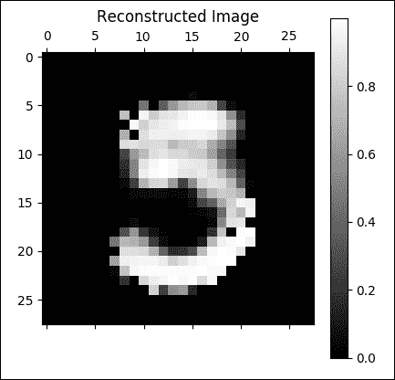
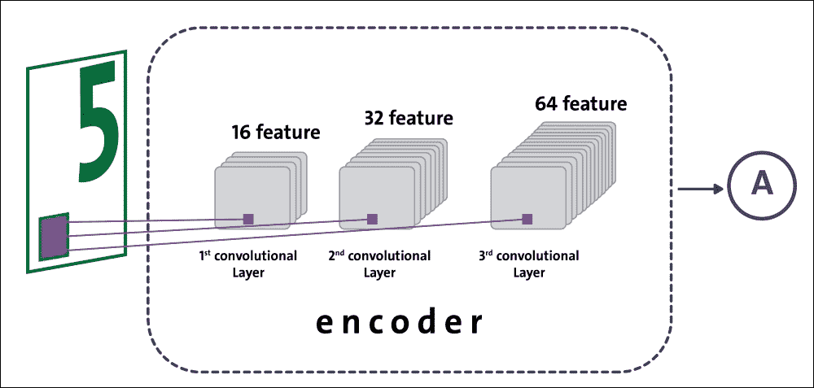
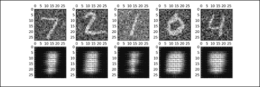
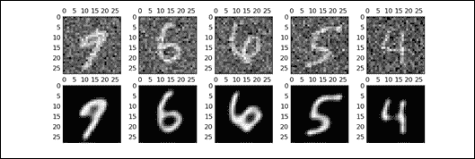

# 提高自编码器的鲁棒性

我们可以用来改善模型稳健性的成功策略，是在编码阶段引入噪声。我们将去噪自编码器称为自编码器的随机版本;在去噪自编码器中，输入被随机破坏，但相同输入的未破坏版本被用作解码阶段的目标。

直觉上，  去噪自编码器做了两件事：首先，它试图对输入进行编码，保留相关信息;然后，它试图消除应用于同一输入的腐败过程的影响。在下一节中，我们将展示一个去噪自编码器的实现。

## 实现去噪自编码器

网络架构非常简单。 784 像素的输入图像被随机破坏，然后通过编码网络层进行尺寸缩减。图像尺寸从 784 减少到 256 像素。

在解码阶段，我们准备网络输出，将图像大小返回到 784 像素。像往常一样，我们开始将所有必要的库加载到我们的实现中：

```py
import numpy as np
import tensorflow as tf
import matplotlib.pyplot as plt
from tensorflow.examples.tutorials.mnist import input_data
```

然后我们设置基本的网络参数：

```py
n_input    = 784
n_hidden_1 = 1024
n_hidden_2 = 2048
n_output   = 784
```

我们设置会话的参数：

```py
epochs     = 100
batch_size = 100
disp_step  = 10
```

我们构建训练和测试集。我们再次使用从`tensorflow.examples.tutorials.mnist`导入的`input_data`函数：

```py
print ("PACKAGES LOADED")
mnist = input_data.read_data_sets('data/', one_hot=True)
trainimg   = mnist.train.images
trainlabel = mnist.train.labels
testimg    = mnist.test.images
testlabel  = mnist.test.labels
print ("MNIST LOADED")
```

让我们为输入图像定义一个占位符变量。数据类型设置为`float`，形状设置为`[None, n_input]`。 `None`参数表示张量可以保持任意数量的图像，每个图像的大小为`n_input`：

```py
x = tf.placeholder("float", [None, n_input])
```

接下来，我们有一个占位符变量，用于与在占位符变量`x`中输入的图像相关联的真实标签。这个占位符变量的形状是`[None, n_output]`，这意味着它可以包含任意数量的标签，并且每个标签都是长度为`n_output`的向量，在这种情况下为`10`：

```py
y = tf.placeholder("float", [None, n_output])
```

为了减少过拟合，我们在编码和解码过程之前应用一个 dropout，因此我们必须定义一个占位符，以便在 dropout 期间保持神经元输出的概率：

```py
dropout_keep_prob = tf.placeholder("float")
```

在这些定义中，我们修正了权重和网络偏差：

```py
weights = {
    'h1': tf.Variable(tf.random_normal([n_input, n_hidden_1])),
    'h2': tf.Variable(tf.random_normal([n_hidden_1, n_hidden_2])),
    'out': tf.Variable(tf.random_normal([n_hidden_2, n_output]))
}
biases = {
    'b1': tf.Variable(tf.random_normal([n_hidden_1])),
    'b2': tf.Variable(tf.random_normal([n_hidden_2])),
    'out': tf.Variable(tf.random_normal([n_output]))
}
```

使用`tf.random_normal`选择`weights`和`biases`值，它返回具有正态分布的随机值。编码阶段将来自 MNIST 数据集的图像作为输入，然后通过应用矩阵乘法运算来执行数据压缩：

```py
encode_in = tf.nn.sigmoid\
          (tf.add(tf.matmul\
                  (x, weights['h1']),\
                  biases['b1']))
encode_out = tf.nn.dropout\
             (encode_in, dropout_keep_prob)
```

在解码阶段，我们应用相同的过程：

```py
decode_in = tf.nn.sigmoid\
          (tf.add(tf.matmul\
                  (encode_out, weights['h2']),\
                  biases['b2']))
```

过拟合的减少是通过 dropout 程序来完成的：

```py
decode_out = tf.nn.dropout(decode_in,\
                           dropout_keep_prob)
```

最后，我们准备构建预测张量，`y_pred`：

```py
y_pred = tf.nn.sigmoid\
         (tf.matmul(decode_out,\
                    weights['out']) +\
          biases['out'])
```

然后我们定义一个成本度量，  用于指导变量优化过程：

```py
cost = tf.reduce_mean(tf.pow(y_pred - y, 2))
```

我们将使用`RMSPropOptimizer`类最小化`cost`函数：

```py
optimizer = tf.train.RMSPropOptimizer(0.01).minimize(cost)
```

最后，我们可以按如下方式初始化已定义的变量：

```py
init = tf.global_variables_initializer()
```

然后我们设置 TensorFlow 的运行会话：

```py
with tf.Session() as sess:
    sess.run(init)
    print ("Start Training")
    for epoch in range(epochs):
        num_batch  = int(mnist.train.num_examples/batch_size)
        total_cost = 0.
        for i in range(num_batch):
```

对于每个训练周期，我们从训练数据集中选择一个较小的批次集：

```py
            batch_xs, batch_ys = \
                      mnist.train.next_batch(batch_size)
```

这是焦点。我们使用之前导入的 NumPy 包中的`randn`函数随机破坏`batch_xs`集：

```py
            batch_xs_noisy = batch_xs + \
                             0.3*np.random.randn(batch_size, 784)
```

我们使用这些集来提供执行图，然后运行会话（`sess.run`）：

```py
            feeds = {x: batch_xs_noisy,\
                     y: batch_xs, \
                     dropout_keep_prob: 0.8}
            sess.run(optimizer, feed_dict=feeds)
            total_cost += sess.run(cost, feed_dict=feeds)
```

每十个周期，将显示平均成本值：

```py
        if epoch % disp_step == 0:
            print("Epoch %02d/%02d average cost: %.6f"
                   % (epoch, epochs, total_cost/num_batch))
```

最后，我们开始测试训练有素的模型：

```py
            print("Start Test")
```

为此，我们从测试集中随机选择一个图像：

```py
            randidx   = np.random.randint\
                               (testimg.shape[0], size=1)
            orgvec    = testimg[randidx, :]
            testvec   = testimg[randidx, :]
            label     = np.argmax(testlabel[randidx, :], 1)
            print("Test label is %d" % (label))
            noisyvec = testvec + 0.3*np.random.randn(1, 784)
```

然后我们在选定的图像上运行训练模型：

```py
            outvec = sess.run(y_pred,\
                              feed_dict={x: noisyvec,\
                                         dropout_keep_prob: 1})
```

正如我们将看到的，以下`plotresult`函数将显示原始图像，噪声图像和预测图像：

```py
            plotresult(orgvec,noisyvec,outvec)
            print("restart Training")
```

当我们运行会话时，我们应该看到如下结果：

```py
PACKAGES LOADED
Extracting data/train-images-idx3-ubyte.gz
Extracting data/train-labels-idx1-ubyte.gz
Extracting data/t10k-images-idx3-ubyte.gz
Extracting data/t10k-labels-idx1-ubyte.gz
MNIST LOADED
Start Training
```

为简洁起见，我们仅报告了 100 个周期后的结果：

```py
Epoch 100/100 average cost: 0.212313
Start Test
Test label is 6
```

这些是原始图像和噪声图像（如您所见，数字 6）：


图 5：原始图像和噪声图像

这是一个严格重建的图像：


图 6：严重重建的图像

在 100 个周期之后，我们有了更好的结果：

```py
Epoch 100/100 average cost: 0.018221
Start Test
Test label is 5
```

这是原版和噪声图像：


图 7：原始图像和噪声图像

这是一个很好的重建图像：



图 8：良好的重建图像

## 实现卷积自编码器

到目前为止，我们已经看到自编码器输入是图像。因此，有必要问一下卷积架构是否可以在我们之前展示的自编码器架构上更好地工作。我们将分析编码器和解码器在卷积自编码器中的工作原理。

### 编码器

编码器由三个卷积层组成。特征数量从输入数据 1 变为第一卷积层的 16;然后，第二层从 16 到 32;最后，从最后一个卷积层的 32 到 64。从卷积层移动到另一个层时，形状经历图像压缩：



图 9：编码阶段的数据流

### 解码器

解码器由三个依次排列的反卷积层组成。对于每个反卷积操作，我们减少特征的数量以获得必须与原始图像大小相同的图像。除了减少特征数量外，反卷积还可以转换图像的形状：


图 10：解码阶段的数据流

我们已经准备好了解如何实现卷积自编码器;第一个实现步骤是加载基本库：

```py
import matplotlib.pyplot as plt
import numpy as np
import math
import tensorflow as tf
import tensorflow.examples.tutorials.mnist.input_data as input_data
```

然后我们构建训练和测试集：

```py
mnist = input_data.read_data_sets("data/", one_hot=True)
trainings   = mnist.train.images
trainlabels = mnist.train.labels
testings    = mnist.test.images
testlabels  = mnist.test.labels
ntrain      = trainings.shape[0]
ntest       = testings.shape[0]
dim         = trainings.shape[1]
nout        = trainlabels.shape[1]
```

我们需要为输入图像定义占位符变量：

```py
x = tf.placeholder(tf.float32, [None, dim])
```

数据类型设置为`float32`，形状设置为`[None, dim]`，其中`None`表示张量可以保持任意数量的图像，每个图像是长度为`dim`的向量。接下来，我们为输出图像提供占位符变量。此变量的形状设置为`[None, dim]`与输入形状相同：

```py
y = tf.placeholder(tf.float32, [None, dim])
```

然后我们定义`keepprob`变量，[用于配置在网络训练期间使用的 dropout 率](https://www.tensorflow.org/tutorials/layers#dropout)：

```py
keepprob = tf.placeholder(tf.float32)
```

此外，我们必须定义每个网络层中的节点数：

```py
n1 = 16
n2 = 32
n3 = 64
ksize = 5
```

网络总共包含六层。前三层是卷积的，属于编码阶段，而后三层是解卷积的，是解码阶段的一部分：

```py
weights = {
    'ce1': tf.Variable(tf.random_normal\
                       ([ksize, ksize, 1, n1],stddev=0.1)),
    'ce2': tf.Variable(tf.random_normal\
                       ([ksize, ksize, n1, n2],stddev=0.1)),
    'ce3': tf.Variable(tf.random_normal\
                       ([ksize, ksize, n2, n3],stddev=0.1)),
    'cd3': tf.Variable(tf.random_normal\
                       ([ksize, ksize, n2, n3],stddev=0.1)),
    'cd2': tf.Variable(tf.random_normal\
                       ([ksize, ksize, n1, n2],stddev=0.1)),
    'cd1': tf.Variable(tf.random_normal\
                       ([ksize, ksize, 1, n1],stddev=0.1))
}

biases = {
    'be1': tf.Variable\
    (tf.random_normal([n1], stddev=0.1)),
    'be2': tf.Variable\
    (tf.random_normal([n2], stddev=0.1)),
    'be3': tf.Variable\
    (tf.random_normal([n3], stddev=0.1)),
    'bd3': tf.Variable\
    (tf.random_normal([n2], stddev=0.1)),
    'bd2': tf.Variable\
    (tf.random_normal([n1], stddev=0.1)),
    'bd1': tf.Variable\
    (tf.random_normal([1],  stddev=0.1))
}
```

以下函数`cae`构建卷积自编码器：传递的输入是图像，`_X`;数据结构权重和偏差，`_W`和`_b`;和`_keepprob`参数：

```py
def cae(_X, _W, _b, _keepprob):
```

最初的 784 像素图像必须重新整形为 28×28 矩阵，随后由下一个卷积层处理：

```py
    _input_r = tf.reshape(_X, shape=[-1, 28, 28, 1])
```

第一个卷积层是`_ce1`。相对于输入图像，它有`_input_r`张量作为输入：

```py
    _ce1 = tf.nn.sigmoid\
           (tf.add(tf.nn.conv2d\
                   (_input_r, _W['ce1'],\
                    strides=[1, 2, 2, 1],\
                    padding='SAME'),\
                   _b['be1']))
```

在移动到第二个卷积层之前，我们应用了 dropout 操作：

```py
    _ce1 = tf.nn.dropout(_ce1, _keepprob)
```

在下面的两个编码层中，我们应用相同的卷积和 dropout 操作：

```py
    _ce2 = tf.nn.sigmoid\
           (tf.add(tf.nn.conv2d\
                   (_ce1, _W['ce2'],\
                    strides=[1, 2, 2, 1],\
                    padding='SAME'),\
                   _b['be2']))
    _ce2 = tf.nn.dropout(_ce2, _keepprob)
    _ce3 = tf.nn.sigmoid\
           (tf.add(tf.nn.conv2d\
                   (_ce2, _W['ce3'],\
                    strides=[1, 2, 2, 1],\
                    padding='SAME'),\
                   _b['be3']))
    _ce3 = tf.nn.dropout(_ce3, _keepprob)
```

特征数量从 1（输入图像）增加到 64，而原始形状图像已减少到 28×28 到 7×7。在解码阶段，压缩（或编码）和重新成形的图像必须为尽可能与原始图像相似。为实现这一目标，我们在接下来的三个层中使用了`conv2d_transpose` TensorFlow 函数：

```py
tf.nn.conv2d_transpose(value, filter, output_shape, strides, padding='SAME')
```

这种操作有时是  ，称为反卷积;它只是`conv2d`的梯度。该函数的参数如下：

*   `value`：`float`型和形状`[batch, height, width, in_channels]`的 4D 张量。
*   `filter`：与`value`和形状`[height, width, output_channels, in_channels]`具有相同类型的 4D 张量。 `in_channels`维度必须与值匹配。
*   `output_shape`：表示去卷积操作的输出形状的 1D 张量。
*   `strides`：整数列表。输入张量的每个维度的滑动窗口的步幅。
*   `padding`：一个有效的字符串或`SAME`。

`conv2d_transpose`函数将返回与`value`参数类型相同的张量。第一个去卷积层`_cd3`具有卷积层`_ce3`作为输入。它返回`_cd3`张量，其形状为（1,7,7,32）：

```py
    _cd3 = tf.nn.sigmoid\
           (tf.add(tf.nn.conv2d_transpose\
                   (_ce3, _W['cd3'],\
                    tf.stack([tf.shape(_X)[0], 7, 7, n2]),\
                    strides=[1, 2, 2, 1],\
                    padding='SAME'),\
                   _b['bd3']))
    _cd3 = tf.nn.dropout(_cd3, _keepprob)
```

对于第二个去卷积层`_cd2`，我们将反卷积层`_cd3`作为输入传递。它返回`_cd2`张量，其形状为（1,14,14,16）：

```py
    _cd2 = tf.nn.sigmoid\
           (tf.add(tf.nn.conv2d_transpose\
                   (_cd3, _W['cd2'],\
                    tf.stack([tf.shape(_X)[0], 14, 14, n1]),\
                    strides=[1, 2, 2, 1],\
                    padding='SAME'),\
                   _b['bd2']))
    _cd2 = tf.nn.dropout(_cd2, _keepprob)
```

第三个也是最后一个反卷积层`_cd1`将`_cd2`层作为输入传递。它返回结果`_out`张量，其形状为（1,28,28,1），与输入图像相同：

```py
    _cd1 = tf.nn.sigmoid\
           (tf.add(tf.nn.conv2d_transpose\
                   (_cd2, _W['cd1'],\
                    tf.stack([tf.shape(_X)[0], 28, 28, 1]),\
                    strides=[1, 2, 2, 1],\
                    padding='SAME'),\
                   _b['bd1']))
    _cd1 = tf.nn.dropout(_cd1, _keepprob)
    _out = _cd1
    return _out
```

然后我们将成本函数定义为`y`和`pred`之间的均方误差：

```py
pred = cae(x, weights, biases, keepprob)
cost = tf.reduce_sum\
       (tf.square(cae(x, weights, biases, keepprob)\
                  - tf.reshape(y, shape=[-1, 28, 28, 1])))
learning_rate = 0.001
```

为了优化成本，我们将使用`AdamOptimizer`：

```py
optm = tf.train.AdamOptimizer(learning_rate).minimize(cost)
```

在下一步中，我们配置我们的网络来运行会话：

```py
init = tf.global_variables_initializer()
print ("Functions ready")
sess = tf.Session()
sess.run(init)
mean_img = np.zeros((784))
```

批次的大小设置为`128`：

```py
batch_size = 128
```

周期数是`50`：

```py
n_epochs   = 50
```

然后我们开始循环会话：

```py
for epoch_i in range(n_epochs):
```

对于每个周期，我们得到一个批量集`trainbatch`：

```py
    for batch_i in range(mnist.train.num_examples // batch_size):
        batch_xs, _ = mnist.train.next_batch(batch_size)
        trainbatch = np.array([img - mean_img for img in batch_xs])
```

我们应用随机噪声，就像去噪自编码器一样，来改善学习：

```py
        trainbatch_noisy = trainbatch + 0.3*np.random.randn(\
            trainbatch.shape[0], 784)
        sess.run(optm, feed_dict={x: trainbatch_noisy \
                                  , y: trainbatch, keepprob: 0.7})
        print ("[%02d/%02d] cost: %.4f" % (epoch_i, n_epochs \
        , sess.run(cost, feed_dict={x: trainbatch_noisy \
                                   , y: trainbatch, keepprob: 1.})))
```

对于每个训练周期，我们随机抽取五个训练样例：

```py
    if (epoch_i % 10) == 0:
        n_examples = 5
        test_xs, _ = mnist.test.next_batch(n_examples)
        test_xs_noisy = test_xs + 0.3*np.random.randn(
            test_xs.shape[0], 784)
```

然后我们在一个小子集上测试训练模型：

```py
        recon = sess.run(pred, feed_dict={x: test_xs_noisy,\
                                                   keepprob: 1.})
        fig, axs = plt.subplots(2, n_examples, figsize=(15, 4))
        for example_i in range(n_examples):
            axs[0][example_i].matshow(np.reshape(
                test_xs_noisy[example_i, :], (28, 28))
                , cmap=plt.get_cmap('gray'))
```

最后，我们可以使用 Matplotlib 显示输入和学习集：

```py
            axs[1][example_i].matshow(np.reshape(
                np.reshape(recon[example_i, ...], (784,))
                + mean_img, (28, 28)), cmap=plt.get_cmap('gray'))
            plt.show()
```

执行将产生以下输出：

```py
>>>
Extracting data/train-images-idx3-ubyte.gz
Extracting data/train-labels-idx1-ubyte.gz
Extracting data/t10k-images-idx3-ubyte.gz
Extracting data/t10k-labels-idx1-ubyte.gz
Packages loaded
Network ready
Functions ready
Start training..
[00/05] cost: 8049.0332
[01/05] cost: 3706.8667
[02/05] cost: 2839.9155
[03/05] cost: 2462.7021
[04/05] cost: 2391.9460
>>>
```

请注意，对于每个周期，我们将可视化输入集和先前显示的相应学习集。正如您在第一个周期所看到的，我们不知道哪些图像已被学习：



图 11：第一个周期图像

在第二个周期，  的想法变得更加清晰  ：


图 12：第二周期图像

这是第三个周期：


图 13：第三周期图像

在第四个周期再好一点：


图 14：第四周期图像

我们可能已经停止在上一个周期，但这是第五个也是最后一个周期：



图 15：第五周期图像

到目前为止，我们已经看到了自编码器的不同实现以及改进版本。但是，将此技术应用于 MNIST 数据集并不能说明其真正的力量。因此，现在是时候看到一个更现实的问题，我们可以应用自编码器技术。