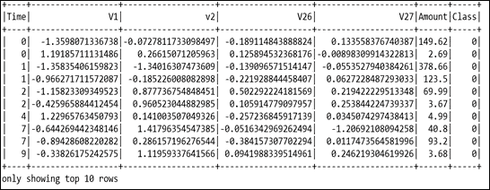
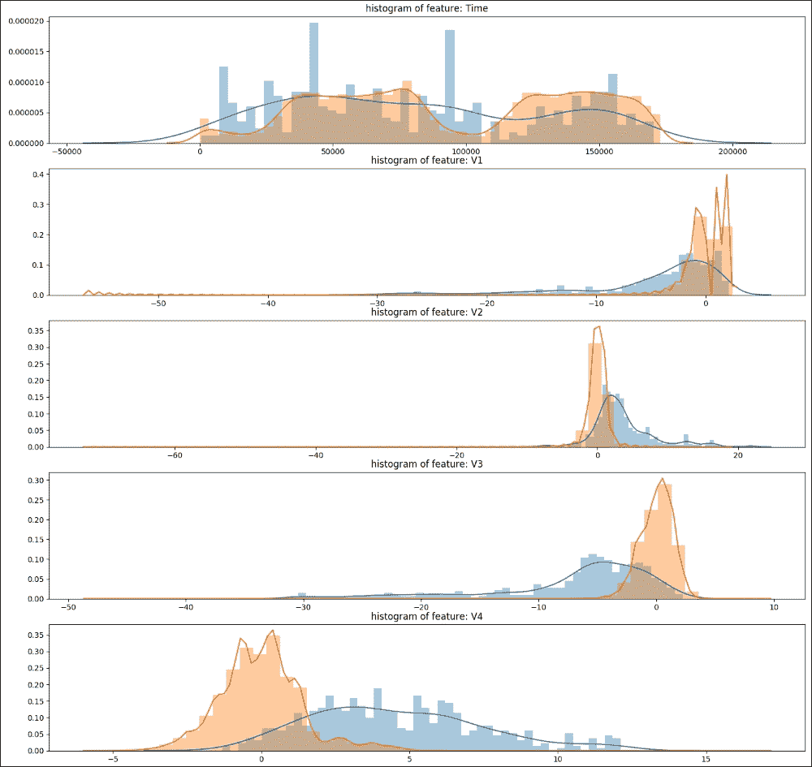
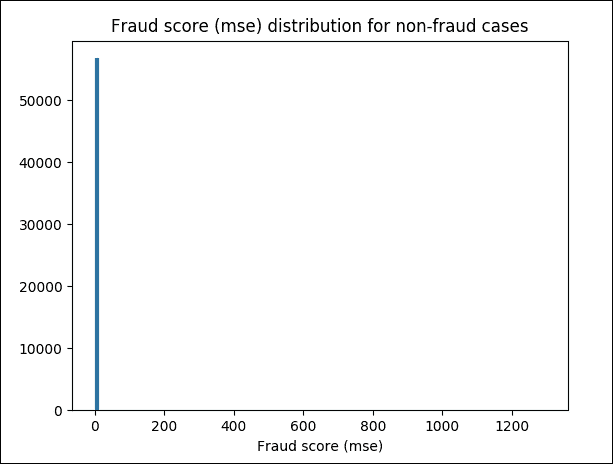
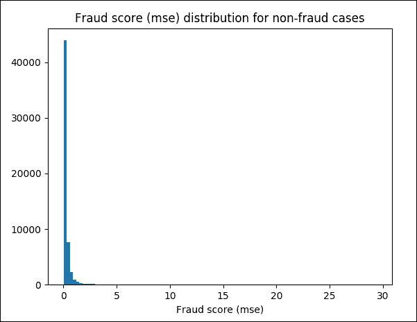
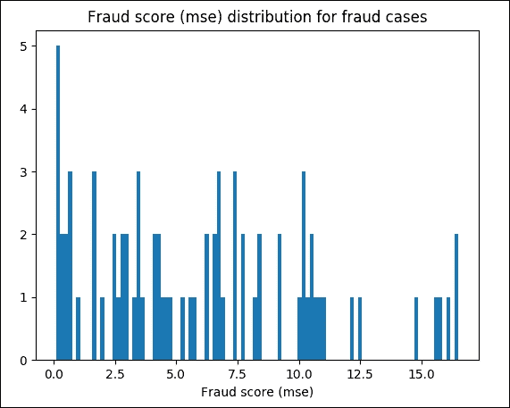

# 使用自编码器进行欺诈分析

银行，保险公司和信用合作社等金融公司的欺诈检测和预防是一项重要任务。到目前为止，我们已经看到如何以及在何处使用深度神经网络（DNN）  和卷积神经网络（CNN）。

现在是时候使用其他无监督学习算法，如自编码器。在本节中，我们将探索信用卡交易的数据集，并尝试构建一个无监督的机器学习模型，该模型能够判断特定交易是欺诈性的还是真实的。

更具体地说，我们将使用自编码器预先训练分类模型并应用异常检测技术来预测可能的欺诈。在开始之前，我们需要知道数据集。

## 数据集的描述

对于这个例子，我们将使用来自 Kaggle 的信用卡欺诈检测数据集。数据集可以从[此链接](https://www.kaggle.com/hunk3749/credit-card/data)下载。由于我使用的是数据集，因此引用以下出版物时，最好是透明的：

Andrea Dal Pozzolo，Olivier Caelen，Reid A. Johnson 和 Gianluca Bontempi。用不平衡分类的欠采样校准概率。在计算智能和数据挖掘研讨会（CIDM），IEEE，2015 年。

该数据集包含 2013 年 9 月欧洲信用卡持有人在两天内进行的交易。共有 285,299 笔交易，只有 492 笔欺诈，这意味着数据集非常不平衡。正类（欺诈）占所有交易的 0.172％。

数据集包含数字输入变量，这些变量是 PCA 转换的结果。遗憾的是，由于机密性问题，我们无法提供有关数据的原始特征和更多背景信息。有[28]特征，即`V1`，`V2`，... `V27`，它们是使用 PCA 获得的主要成分，除了`Time`和`Amount`特征。 `Class`特征是响应变量，在欺诈情况下取值`1`，否则取`0`。

还有两个附加特征，`Time`和`Amount`。 `Time`列表示每笔交易与第一笔交易之间的时间（以秒为单位），而`Amount`列表示此交易中转账的金额。那么，让我们看一下输入数据（仅显示`V1`，`V2`，`V26`和`V27`），如图 16 所示：



图 16：信用卡欺诈检测数据集的快照

## 问题描述

对于这个例子，我们将使用自编码器作为无监督的特征学习算法，该算法学习和概括训练数据共享的公共模式。在重建阶段，对于具有异常模式的数据点，RMSE 将更高。因此，这些数据点是异常值或异常值。我们的假设是，异常也等于我们所追求的欺诈性交易。

现在，在评估步骤中，我们可以根据验证数据选择 RMSE 的阈值，并将 RMSE 高于阈值的所有数据标记为欺诈。或者，如果我们认为 0.1％的交易都是欺诈性的，我们也可以根据每个数据点（即 RMSE）的重建错误对数据进行排名，然后选择前 0.1％为欺诈性交易。

给定类不平衡比，建议使用精确回忆曲线下面积（AUPRC）测量精度  ，因为混淆矩阵精度在不平衡分类中没有意义。在这种情况下，使用线性机器学习模型，例如随机森林，逻辑回归或支持向量机，通过应用上下采样技术，将是一个更好的主意。或者，我们可以尝试查找数据中的异常，因为我们假设数据集中只有少数欺诈案例，即异常。

在处理如此严重的响应标签不平衡时，我们在测量模型表现时也需要小心。只有少数欺诈性实例，因此将一切预测为非欺诈的模型将达到 99％以上的准确率。然而，尽管它们具有高精度，但线性 ML 模型（甚至是树组合）并不一定能帮助我们找到欺诈性案例。

对于这个例子，我们将构建一个无监督的模型：该模型将接受正面和负面数据（欺诈和非欺诈）的训练，但不提供标签。由于我们有比欺诈更多的正常交易，我们应该期望该模型在训练后学习和记忆正常交易的模式，并且该模型应该能够为任何异常交易给出分数。

这种无监督的训练对于此目的非常有用，因为我们没有足够的标记数据。那么，让我们开始吧。

## 探索性数据分析

在我们实现模型之前，探索数据集将提供一些见解。我们首先导入所需的包和模块（包括此示例所需的其他包）和模块：

```py
import pandas as pd
import numpy as np
import tensorflow as tf
import os
from datetime import datetime
from sklearn.metrics import roc_auc_score as auc
import seaborn as sns # for statistical data visualization
import matplotlib.pyplot as plt
import matplotlib.gridspec as gridspec
```

### 提示

安装 seaborn

您可以通过多种方式安装`seaborn`，这是一个用于统计数据可视化的 Python 模块：

```py
$ sudo pip install seaborn # for Python 2.7
$ sudo pip3 install seaborn # for Python 3.x
$ sudo conda install seaborn # using conda
# Directly from GitHub (use pip for Python 2.7)
$ pip3 install git+https://github.com/mwaskom/seaborn.git

```

现在，[我假设您已经从上述 URL 下载了数据集](https://www.kaggle.com/hunk3749/credit-card/data)。下载附带一个名为`creditcard.csv`的 CSV 文件。

接下来，让我们阅读数据集并创建一个 pandas DataFrame：

```py
df = pd.read_csv('creditcard.csv')
print(df.shape)
>>>
(284807, 31)
```

因此，数据集具有关于  300,000 个事务，30 个特征和两个二元标签（即 0/1）。现在让我们看一下列名及其数据类型：

```py
print(df.columns)
>>>
Index(['Time', 'V1', 'V2', 'V3', 'V4', 'V5', 'V6', 'V7', 'V8', 'V9', 'V10', 'V11', 'V12', 'V13', 'V14', 'V15', 'V16', 'V17', 'V18', 'V19', 'V20', 'V21', 'V22', 'V23', 'V24', 'V25', 'V26', 'V27', 'V28', 'Amount', 'Class'],
  dtype='object')

print(df.dtypes)
>>>
Time      float64
V1        float64
V2        float64
V3        float64
…
V25       float64
V26       float64
V27       float64
V28       float64
Amount    float64
  Class     int64
```

现在让我们来看看数据集：

```py
print(df.head())
>>>
```


图 17：数据集的快照

现在让我们看看所有交易的时间跨度：

```py
print("Total time spanning: {:.1f} days".format(df['Time'].max() / (3600 * 24.0)))
>>>
Total time spanning: 2.0 days
```

现在让我们看看这些类的统计信息：

```py
print("{:.3f} % of all transactions are fraud. ".format(np.sum(df['Class']) / df.shape[0] * 100))
>>>
0.173 % of all transactions are fraud.
```

因此，我们只有少数欺诈交易。这在文献中也被称为罕见事件检测，并且意味着数据集高度不平衡。现在，让我们绘制前五个特征的直方图：

```py
plt.figure(figsize=(12,5*4))
gs = gridspec.GridSpec(5, 1)
for i, cn in enumerate(df.columns[:5]):
    ax = plt.subplot(gs[i])
    sns.distplot(df[cn][df.Class == 1], bins=50)
    sns.distplot(df[cn][df.Class == 0], bins=50)
    ax.set_xlabel('')
    ax.set_title('histogram of feature: ' + str(cn))
plt.show()
>>>
```



图 18：显示前五个特征的直方图

在前面的屏幕截图中，可以看出所有特征都是正偏差或负偏斜。此外，数据集没有很多特征，因此修剪尾部会丢失重要的信息。所以，暂时，让我们尽量不这样做，并使用所有特征。

## 训练，验证和测试集准备

让我们通过将数据分成训练，开发（也称为验证）和测试集来开始训练。我们首先使用 80％的数据作为训练和验证集。剩余的 20％将用作测试集：

```py
TEST_RATIO = 0.20
df.sort_values('Time', inplace = True)
TRA_INDEX = int((1-TEST_RATIO) * df.shape[0])
train_x = df.iloc[:TRA_INDEX, 1:-2].values
train_y = df.iloc[:TRA_INDEX, -1].values
test_x = df.iloc[TRA_INDEX:, 1:-2].values
test_y = df.iloc[TRA_INDEX:, -1].values
```

现在，让我们对前面的分裂进行统计：

```py
print("Total train examples: {}, total fraud cases: {}, equal to {:.5f} % of total cases. ".format(train_x.shape[0], np.sum(train_y), (np.sum(train_y)/train_x.shape[0])*100))

print("Total test examples: {}, total fraud cases: {}, equal to {:.5f} % of total cases. ".format(test_x.shape[0], np.sum(test_y), (np.sum(test_y)/test_y.shape[0])*100))

>>>
Total train examples: 227845, total fraud cases: 417, equal to 0.18302 % of total cases.
Total test examples: 56962, total fraud cases: 75, equal to 0.13167 % of total cases.
```

## 归一化

为了获得更好的预测准确率，我们可以考虑两种类型的标准化：z-score 和 min-max scaling：

*   Z 得分：这将每列归一化为零均值并将其标准化。这特别适用于激活函数，例如 tanh，其输出零两侧的值。其次，这将留下极端的价值，因此在正常化之后会有一些极端。在这种情况下，这可能对检测异常值很有用。
*   最小 - 最大缩放：这确保所有值都在 0 和 1 之间，即正数。如果我们使用 sigmoid 作为输出激活，这是默认方法。

我们使用验证集来决定数据标准化方法和激活函数。根据实验，我们发现当与 z-score 标准化一起使用时，tanh 的表现略好于 sigmoid。因此，我们选择了 tanh，然后是 z-score：

```py
cols_mean = []
cols_std = []

for c in range(train_x.shape[1]):
    cols_mean.append(train_x[:,c].mean())
    cols_std.append(train_x[:,c].std())
    train_x[:, c] = (train_x[:, c] - cols_mean[-1]) / cols_std[-1]
    test_x[:, c] =  (test_x[:, c] - cols_mean[-1]) / cols_std[-1]
```

## Autoencoder 作为无监督特征学习算法

在本小节中，我们将看到如何使用自编码器作为无监督的特征学习算法。首先，让我们初始化网络超参数：

```py
learning_rate = 0.001
training_epochs = 1000
batch_size = 256
display_step = 10
n_hidden_1 = 15 # number of neurons is the num features
n_input = train_x.shape[1]
```

由于第一层和第二层分别包含 15 和 5 个神经元，我们正在构建这样的架构网络：28（输入） - &gt; 15 - &gt; 5 - &gt; 15 - &gt; 28（输出）。那么让我们构建我们的自编码器网络。

让我们创建一个 TensorFlow 占位符来保存输入：

```py
X = tf.placeholder("float", [None, n_input])
```

现在我们必须使用随机初始化创建偏差和权重向量：

```py
weights = {
    'encoder_h1': tf.Variable\
                  (tf.random_normal([n_input, n_hidden_1])),
    'decoder_h1': tf.Variable\
                  (tf.random_normal([n_hidden_1, n_input])),
}
biases = {
    'encoder_b1': tf.Variable(tf.random_normal([n_hidden_1])),
    'decoder_b1': tf.Variable(tf.random_normal([n_input])),
}
```

现在，我们构建一个简单的自编码器。这里我们有`encoder()`函数，它构造了编码器。我们使用`tanh`函数对隐藏层进行编码，如下所示：

```py
def encoder(x):
    layer_1 = tf.nn.tanh(tf.add\
              (tf.matmul(x, weights['encoder_h1']),\
              biases['encoder_b1']))
    return layer_1
```

这是`decoder()`函数，它构造了解码器。我们使用`tanh`函数解码隐藏层，如下所示：

```py
def decoder(x):
    layer_1 = tf.nn.tanh(tf.add\
              (tf.matmul(x, weights['decoder_h1']),\
              biases['decoder_b1']))
    return layer_1
```

之后，我们通过传递输入数据的 TensorFlow 占位符来构建模型。权重和偏差（NN 的 Ws 和 bs）包含我们将学习优化的网络的所有参数，如下所示：

```py
encoder_op = encoder(X)
decoder_op = decoder(encoder_op)
```

一旦我们构建了自编码器网络，就可以进行预测，其中目标是输入数据：

```py
y_pred = decoder_op
y_true = X
```

现在我们已经进行了预测，现在是时候定义`batch_mse`来评估表现：

```py
batch_mse = tf.reduce_mean(tf.pow(y_true - y_pred, 2), 1)
```

### 注意

未观测值的均方误差（MSE）是[平方误差](https://en.wikipedia.org/wiki/Errors_and_residuals)或[偏差](https://en.wikipedia.org/wiki/Deviation_(statistics))的[平均值](https://en.wikipedia.org/wiki/Expected_value)。从统计学的角度来看，  它是估计量质量的度量（它总是非负的，接近于零的值更好）。

如果`Y^`是 n 个预测的向量，并且 Y 是被预测变量的观测值的向量，则预测变量的样本内 MSE 计算如下：


因此，MSE 是误差平方`(Y[i] - Y^[i])^2`的平均值`(1/n ∑[i])`。

我们在这里有另一个`batch_mse`将返回批量中所有输入数据的 RMSE，这是一个长度等于输入数据中行数的向量。如果您想要输入（无论是训练，验证还是测试数据），这些将是预测值或欺诈分数，我们可以在预测后提取出来。然后我们定义损失和优化器，并最小化平方误差：

```py
cost_op = tf.reduce_mean(tf.pow(y_true - y_pred, 2))
optimizer = tf.train.RMSPropOptimizer(learning_rate).minimize(cost_op)
```

每层所用的激活函数是`tanh`。这里的目标函数或成本测量一批中预测和输入数组的总 RMSE，这意味着它是一个标量。然后，每次我们想要进行批量更新时，我们都会运行优化器。

太棒了！我们准备开始训练了。但是，在此之前，让我们定义保存训练模型的路径：

```py
save_model = os.path.join(data_dir, 'autoencoder_model.ckpt')
saver = tf.train.Saver()
```

到目前为止，我们已经定义了许多变量以及超参数，因此我们必须初始化变量：

```py
init_op = tf.global_variables_initializer()
```

最后，我们开始训练。我们在训练周期中循环所有批次。然后我们运行优化操作和成本操作来获得损失值。然后我们显示每个周期步骤的日志。最后，我们保存训练有素的模型：

```py
epoch_list = []
loss_list = []
train_auc_list = []
data_dir = 'Training_logs/'
with tf.Session() as sess:
    now = datetime.now()
    sess.run(init_op)
    total_batch = int(train_x.shape[0]/batch_size)

    # Training cycle
    for epoch in range(training_epochs):
        # Loop over all batches
        for i in range(total_batch):
            batch_idx = np.random.choice(train_x.shape[0],\
                        batch_size)
            batch_xs = train_x[batch_idx]

            # Run optimization op (backprop) and
            # cost op (to get loss value)
            _, c = sess.run([optimizer, cost_op],\
                feed_dict={X: batch_xs})

        # Display logs per epoch step
        if epoch % display_step == 0:
            train_batch_mse = sess.run(batch_mse,\
                feed_dict={X: train_x})
            epoch_list.append(epoch+1)
            loss_list.append(c)
            train_auc_list.append(auc(train_y, train_batch_mse))
            print("Epoch:", '%04d,' % (epoch+1),
                  "cost=", "{:.9f},".format(c),
                  "Train auc=", "{:.6f},".format(auc(train_y, \
                  train_batch_mse)),
    print("Optimization Finished!")
    save_path = saver.save(sess, save_model)
    print("Model saved in: %s" % save_path)

save_model = os.path.join(data_dir, autoencoder_model_1L.ckpt')
saver = tf.train.Saver()
```

前面的代码段很简单。每次，我们从`train_x`中随机抽取 256 个小批量的小批量，作为`X`的输入将其输入模型，并运行优化器通过随机梯度下降更新参数  SGD）：

```py
>>>
Epoch: 0001, cost= 0.938937187, Train auc= 0.951383
Epoch: 0011, cost= 0.491790086, Train auc= 0.954131
…
Epoch: 0981, cost= 0.323749095, Train auc= 0.953185
Epoch: 0991, cost= 0.255667418, Train auc= 0.953107
Optimization Finished!
Model saved in: Training_logs/autoencoder_model.ckpt
Test auc score: 0.947296
```

我们在`train_x`上的估值得出的 AUC 得分约为 0.95。然而，从前面的日志中，很难理解训练的进展情况：

```py
# Plot Training AUC over time
plt.plot(epoch_list, train_auc_list, 'k--', label='Training AUC', linewidth=1.0)
plt.title('Training AUC per iteration')
plt.xlabel('Iteration')
plt.ylabel('Training AUC')
plt.legend(loc='upper right')
plt.grid(True)

# Plot train loss over time
plt.plot(epoch_list, loss_list, 'r--', label='Training loss', linewidth=1.0)
plt.title('Training loss')
plt.xlabel('Iteration')
plt.ylabel('Loss')
plt.legend(loc='upper right')
plt.grid(True)
plt.show()
>>>
```


图 19：每次迭代的训练损失和 AUC

在上图中，我们可以看到训练误差有点颠簸，但训练 AUC 几乎保持稳定，约为 95％。这可能听起来很可疑。您还可以看到我们使用相同的数据进行训练和验证。这可能听起来很混乱，但等等！

由于我们正在进行无监督的训练，并且模型在训练期间从未看到标签，因此不会导致过拟合。此附加验证用于监视早期停止以及超参数调整。

## 评估模型

在训练完我们的自编码器模型和超参数后，我们可以在 20％测试数据集上评估其表现，如下所示：

```py
save_model = os.path.join(data_dir, autoencoder_model.ckpt')
saver = tf.train.Saver()

# Initializing the variables
init = tf.global_variables_initializer()

with tf.Session() as sess:
    now = datetime.now()
    saver.restore(sess, save_model)
    test_batch_mse = sess.run(batch_mse, feed_dict={X: test_x})

    print("Test auc score: {:.6f}".format(auc(test_y, \
    test_batch_mse)))
```

在此代码中，我们重用了之前制作的训练模型。 `test_batch_mse`是我们测试数据的欺诈分数：

```py
>>>
Test auc score: 0.948843
```

太棒了！我们训练有素的模型被证明是一个高度准确的模型，显示 AUC 约为 95％。现在我们已经看到了评估，一些可视化分析会很棒。你们觉得怎么样？让我们绘制非欺诈案件的欺诈分数（MSE）分布图。以下代码段执行此操作：

```py
plt.hist(test_batch_mse[test_y == 0.0], bins = 100)
plt.title("Fraud score (mse) distribution for non-fraud cases")
plt.xlabel("Fraud score (mse)") 
plt.show()
>>>
```



图 20：非欺诈案件的 MSE 欺诈评分

前面的屏幕截图是不可理解的，所以让我们将其缩放到（0,30）范围并再次绘制图形：

```py
# Zoom into (0, 30) range
plt.hist(test_batch_mse[(test_y == 0.0) & (test_batch_mse < 30)], bins = 100)
plt.title("Fraud score (mse) distribution for non-fraud cases")
plt.xlabel("Fraud score (mse)")
plt.show()
>>>
```



图 21：非欺诈案件的 MSE 欺诈评分，放大到（0,30）范围

现在让我们只显示欺诈类：

```py
# Display only fraud classes
plt.hist(test_batch_mse[test_y == 1.0], bins = 100)plt.title("Fraud score (mse) distribution for fraud cases")
plt.xlabel("Fraud score (mse)")
plt.show()
>>>
```



图 22：欺诈案件的 MSE 欺诈评分

最后，让我们看一下一些相关统计数据。例如，我们使用`10`作为检测阈值。现在我们可以计算高于阈值的检测到的病例数，高于阈值的阳性病例数，高于阈值的准确率百分比（即精确度），并将其与测试集中欺诈的平均百分比进行比较：

```py
threshold = 10
print("Number of detected cases above threshold: {}, \n\
Number of pos cases only above threshold: {}, \n\
The percentage of accuracy above threshold (Precision): {:0.2f}%. \n\
Compared to the average percentage of fraud in test set: 0.132%".format( \
np.sum(test_batch_mse > threshold), \
np.sum(test_y[test_batch_mse > threshold]), \
np.sum(test_y[test_batch_mse > threshold]) / np.sum(test_batch_mse > threshold) * 100))
>>>
Number of detected cases above threshold: 198,
Number of positive cases only above threshold: 18,
The percentage of accuracy above threshold (Precision): 9.09%.
Compared to the average percentage of fraud in test set: 0.132%
```

总而言之，对于我们的案例，只有一个隐藏层的自编码器足够（至少用于训练）。但是，您仍然可以尝试采用其他变体，例如解卷积自编码器和去噪自编码器来解决同样的问题。