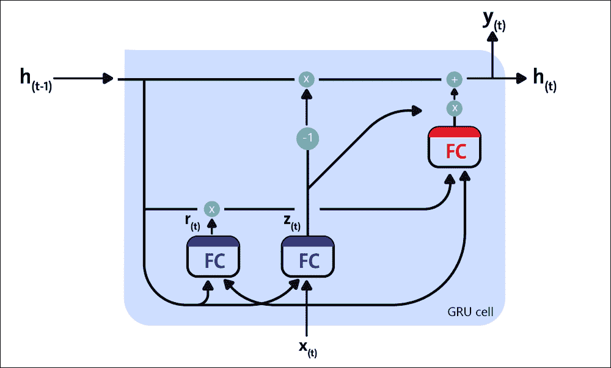
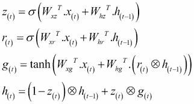

# RNN 和梯度消失 - 爆炸问题

较深层的梯度计算为多层网络中许多激活函数梯度的乘积。当这些梯度很小或为零时，它很容易消失。另一方面，当它们大于 1 时，它可能会爆炸。因此，计算和更新变得非常困难。

让我们更详细地解释一下：

*   如果权重较小，则可能导致称为消失梯度的情况，其中梯度信号变得非常小，以至于学习变得非常慢或完全停止工作。这通常被称为消失梯度。
*   如果该矩阵中的权重很大，则可能导致梯度信号太大而导致学习发散的情况。这通常被称为爆炸梯度。

因此，RNN 的一个主要问题是消失 - 爆炸梯度问题，它直接影响表现。事实上，反向传播时间推出了 RNN，创建了一个非常深的前馈神经网络。从 RNN 获得长期背景的不可能性正是由于这种现象：如果梯度在几层内消失或爆炸，网络将无法学习数据之间的高时间距离关系。

下图显示了发生的情况：计算和反向传播的梯度趋于在每个时刻减少（或增加），然后，在一定数量的时刻之后，成本函数趋于收敛到零（或爆炸到无穷大） ）。

我们可以通过两种方式获得爆炸梯度。由于激活函数的目的是通过压缩它们来控制网络中的重大变化，因此我们设置的权重必须是非负的和大的。当这些权重沿着层次相乘时，它们会导致成本的大幅变化。当我们的神经网络模型学习时，最终目标是最小化成本函数并改变权重以达到最优成本。

例如，成本函数是均方误差。它是一个纯凸函数，目的是找到凸起的根本原因。如果你的权重增加到一定量，那么下降的时刻就会增加，我们会反复超过最佳状态，模型永远不会学习！


在上图中，我们有以下参数：

*   `θ`表示隐藏的复现层的参数
*   `θ[x]`表示隐藏层的输入参数
*   `θ[y]`表示输出层的参数
*   `σ`表示隐藏层的激活函数
*   输入表示为`X[t]`
*   隐藏层的输出为`h[t]`
*   最终输出为`o[t]`
*   `t`（时间步长）

注意，上图表示下面给出的循环神经网络模型的时间流逝。现在，如果你回忆一下图 1，输出可以表示如下：


现在让 E 代表输出层的损失：`E = f(O[t])`。然后，上述三个方程告诉我们 E 取决于输出`O[t]`。输出`O[t]`相对于层的隐藏状态（`h[t]`）的变化而变化。当前时间步长（`h[t]`）的隐藏状态取决于先前时间步长（`h[t-1]`）的神经元状态。现在，下面的等式将清除这个概念。

相对于为隐藏层选择的参数的损失变化率`= ∂E/∂θ`，这是一个可以表述如下的链规则：


（I）

在前面的等式中，项`∂h[t]/∂h[k]`不仅有趣而且有用。


（II）

现在，让我们考虑`t = 5`和`k = 1`然后


（III）

微分方程（II）相对于（`h[t-1]`）给出了：


（IV）

现在，如果我们将方程（III）和（IV）结合起来，我们可以得到以下结果：


在这些情况下，`θ`也随着时间步长而变化。上面的等式显示了当前状态相对于先前状态的依赖性。现在让我们解释这两个方程的解剖。假设您处于时间步长 5（t = 5），那么 k 的范围从 1 到 5（k = 1 到 5），这意味着您必须为以下内容计算 k）：


现在来看上面的每一个等式（II）


而且，它取决于循环层的参数`θ`。如果在训练期间你的权重变大，那么由于每个时间步长的等式（I）（II）的乘法，它们将会出现梯度爆炸的问题。

为了克服消失 - 爆炸问题，已经提出了基本 RNN 模型的各种扩展。将在下一节介绍的 LSTM 网络就是其中之一。

## LSTM 网络

一种 RNN 模型是  LSTM。 LSTM 的精确实现细节不在本书的范围内。 LSTM 是一种特殊的 RNN 架构，最初由 Hochreiter 和 Schmidhuber 于 1997 年构思。

最近在深度学习的背景下重新发现了这种类型的神经网络，因为它没有消失梯度的问题，并且提供了出色的结果和表现。基于 LSTM 的网络是时间序列的预测和分类的理想选择，并且正在取代许多传统的深度学习方法。

这个名称意味着短期模式不会被遗忘。 LSTM 网络由彼此链接的单元（LSTM 块）组成。每个 LSTM 块包含三种类型的门：输入门，输出门和遗忘门，它们分别实现对单元存储器的写入，读取和复位功能。这些门不是二元的，而是模拟的（通常由映射在[0,1]范围内的 S 形激活函数管理，其中 0 表示总抑制，1 表示总激活）。

如果你认为 LSTM 单元是一个黑盒子，它可以像基本单元一样使用，除了它会表现得更好;训练将更快地收敛，它将检测数据中的长期依赖性。在 TensorFlow 中，您只需使用`BasicLSTMCell`代替`BasicRNNCell`：

```py
lstm_cell = tf.nn.rnn_cell.BasicLSTMCell(num_units=n_neurons)
```

LSTM 单元管理两个状态向量，并且出于表现原因，它们默认保持独立。您可以通过在创建`BasicLSTMCell`时设置`state_is_tuple=False`来更改此默认行为。那么，LSTM 单元如何工作？基本 LSTM 单元的架构如下图所示：


图 11：LSTM 单元的框图

现在，让我们看看这个架构背后的数学符号。如果我们不查看 LSTM 框内的内容，LSTM 单元本身看起来就像常规存储单元，除了它的状态被分成两个向量，`h(t)`和`c(t)`：

*   `c`是一个
*   `h(t)`是短期的
*   `c(t)`是长期状态

现在，让我们打开盒子吧！关键的想法是网络可以学习以下内容：

*   在长期的状态下存储什么
*   什么扔掉
*   怎么读它

由于长期`c(t)`从左到右穿过网络，你可以看到它首先通过一个遗忘门，丢弃一些内存，然后它添加一些新的存储器通过加法运算（增加了输入门选择的存储器）。结果`c(t)`直接发送，没有任何进一步的变换

因此，在每个时间步骤，都会丢弃一些内存并添加一些内存。此外，在加法运算之后，长期状态被复制并通过 tanh 函数，该函数产生[-1，+ 1]范围内的输出。

然后输出门过滤结果。这会产生短期`h(t)`（等于此时间步的单元输出`y(t)`）。现在，让我们来看看新记忆的来源以及大门如何运作。首先，当前输入`x(t)`和之前的短路`h(t-1)`被馈送到四个不同的完全连接。这些门的存在允许 LSTM 单元无限期地记住信息：事实上，如果输入门低于激活阈值，单元格将保持先前的状态，如果启用当前状态，它将与输入值组合。顾名思义，遗忘门重置单元的当前状态（当其值被清除为 0 时），输出门决定是否必须执行单元的值。

以下等式用于对单个实例的单元的长期状态，其短期状态及其在每个时间步的输出进行 LSTM 计算：


在前面的方程中，`W[xi]`，`W[xf]`，`W[xo]`和`W[xg]`是四个层中每个层的权重矩阵，用于与输入向量`x(t)`连接。另一方面，`W[hi]`，`W[hf]`，`W[ho]`，和`W[hg]`是四层中每一层的权重矩阵，它们与先前的短期状态有关。`b[i]`、`b[f]`、`b[o]`、`b[g]`是四层中每一层的偏差项。 TensorFlow 初始化它们为一个全 1 的向量而不是全 0 的向量。这可以防止它在训练开始时遗忘一切。

## GRU 单元

LSTM 单元还有许多其他变体。一种特别流行的变体是门控循环单元（GRU）。 Kyunghyun Cho 和其他人在 2014 年的论文中提出了 GRU 单元，该论文还介绍了我们前面提到的自编码器网络。

从技术上讲，GRU 单元是 LSTM 单元的简化版本，其中两个状态向量合并为一个称为`h(t)`的向量。单个门控制器控制遗忘门和输入门。如果门控制器的输出为 1，则输入门打开并且遗忘门关闭。



图 12：GRU 单元

另一方面，如果输出为 0，则相反。每当必须存储存储器时，首先擦除存储它的位置，这实际上是 LSTM 单元本身的常见变体。第二种简化是因为在每个时间步输出满状态向量，所以没有输出门。但是，新的门控制器控制先前状态的哪一部分将显示给主层。

以下等式用于为单个实例，在每个时间步计算 GRU 单元的长期状态，其短期状态及其输出的：



在 TensorFlow 中创建 GRU 单元非常简单。这是一个例子：

```py
gru_cell = tf.nn.rnn_cell.GRUCell(num_units=n_neurons)
```

这些简化并不是这种架构的弱点;它似乎成功地执行。 LSTM 或 GRU 单元是近年来 RNN 成功背后的主要原因之一，特别是在 NLP 中的应用。

我们将在本章中看到使用 LSTM 的示例，但下一节将介绍使用 RNN 进行垃圾邮件/火腿文本分类的示例。