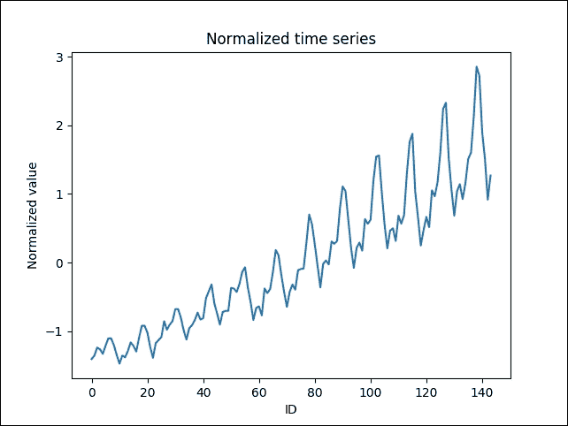

# 开发时间序列数据的预测模型

RNN，特别是  LSTM 模型，通常是一个难以理解的主题。由于数据中的时间依赖性，时间序列预测是 RNN 的有用应用。时间序列数据可在线获取。在本节中，我们将看到使用 LSTM 处理时间序列数据的示例。我们的 LSTM 网络将能够预测未来的航空公司乘客数量。

## 数据集的描述

我将使用的数据集是 1949 年至 1960 年国际航空公司乘客的数据。该数据集可以从[此链接](https://datamarket.com/data/set/22u3/international-airlinepassengers- monthly-totals-in#!ds=22u3&display=line)。以下屏幕截图显示了国际航空公司乘客的元数据：


图 14：国际航空公司乘客的元数据（来源：<https://datamarket.com/>）

您可以通过选择“导出”选项卡，然后在“导出”组中选择 CSV（，）来下载数据。您必须手动编辑 CSV 文件以删除标题行以及其他页脚行。我已经下载并保存了名为`international-airline-passengers.csv`的数据文件。下图是时间序列数据的一个很好的图：


图 15：国际航空公司乘客：1 月 49 日至 12 月 60 日的月度总数为千人

## 预处理和探索性分析

现在让我们加载原始数据集并查看一些事实。首先，我们加载时间序列如下（见`time_series_preprocessor.py`）：

```py
import csv
import numpy as np
```

在这里，我们可以看到`load_series()`的签名，它是一个用户定义的方法，可以加载时间序列并对其进行正则化：

```py
def load_series(filename, series_idx=1):
    try:
        with open(filename) as csvfile:
            csvreader = csv.reader(csvfile)
            data = [float(row[series_idx]) for row in csvreader if len(row) > 0]
            normalized_data = (data - np.mean(data)) / np.std(data)
        return normalized_data
    except IOError:
       Print("Error occurred")

        return None
```

现在让我们调用前面的方法加载时间序列并打印（在终端上发出`$ python3 plot_time_series.py`）数据集中的序列号：

```py
import csv
import numpy as np
import matplotlib.pyplot as plt
import time_series_preprocessor as tsp
timeseries = tsp.load_series('international-airline-passengers.csv')
print(timeseries)
```

以下是前面代码的输出：

```py
>>>
[-1.40777884 -1.35759023 -1.24048348 -1.26557778 -1.33249593 -1.21538918
 -1.10664719 -1.10664719 -1.20702441 -1.34922546 -1.47469699 -1.35759023
…..
 2.85825285  2.72441656  1.9046693   1.5115252   0.91762667  1.26894693]
print(np.shape(timeseries))
```

```py
>>>
144

```

这意味着时间序列中有`144`条目。让我们绘制时间序列：

```py
plt.figure()
plt.plot(timeseries)
plt.title('Normalized time series')
plt.xlabel('ID')
plt.ylabel('Normalized value')
plt.legend(loc='upper left')
plt.show()
```

以下是上述代码的输出：

```py
>>>

```



图 16：时间序列（y 轴，标准化值与 x 轴，ID）

加载时间序列数据集后，下一个任务是准备训练集。由于我们将多次评估模型以预测未来值，因此我们将数据分为训练和测试。更具体地说，`split_data()`函数将数据集划分为两个部分，用于训练和测试，75％用于训练，25％用于测试：

```py
def split_data(data, percent_train):
    num_rows = len(data)
    train_data, test_data = [], []
    for idx, row in enumerate(data):
        if idx < num_rows * percent_train:
            train_data.append(row)
        else:
            test_data.append(row)
    return train_data, test_data
```

## LSTM 预测模型

一旦我们准备好数据集，我们就可以通过以可接受的格式加载数据来训练预测器。在这一步中，我编写了一个名为`TimeSeriesPredictor.py`的 Python 脚本，它首先导入必要的库和模块（在此脚本的终端上发出`$ python3 TimeSeriesPredictor.py`命令）：

```py
import numpy as np
import tensorflow as tf
from tensorflow.python.ops import rnn, rnn_cell
import time_series_preprocessor as tsp
import matplotlib.pyplot as plt
```

接下来，我们为 LSTM 网络定义超参数（相应地调整它）：

```py
input_dim = 1
seq_size = 5
hidden_dim = 5
```

我们现在定义权重变量（无偏差）和输入占位符：

```py
W_out = tf.get_variable("W_out", shape=[hidden_dim, 1], dtype=tf.float32, initializer=None, regularizer=None, trainable=True, collections=None) 
b_out = tf.get_variable("b_out", shape=[1], dtype=tf.float32, initializer=None, regularizer=None, trainable=True, collections=None)
x = tf.placeholder(tf.float32, [None, seq_size, input_dim])
y = tf.placeholder(tf.float32, [None, seq_size])
```

下一个任务是构建 LSTM 网络。以下方法`LSTM_Model()`采用三个参数，如下所示：

*   `x`：大小为[T，batch_size，input_size]的输入
*   `W`：完全连接的输出层权重矩阵
*   `b`：完全连接的输出层偏置向量

现在让我们看一下方法的签名：

```py
def LSTM_Model():
        cell = rnn_cell.BasicLSTMCell(hidden_dim)
        outputs, states = rnn.dynamic_rnn(cell, x, dtype=tf.float32)
        num_examples = tf.shape(x)[0]
        W_repeated = tf.tile(tf.expand_dims(W_out, 0), [num_examples, 1, 1])
        out = tf.matmul(outputs, W_repeated) + b_out
        out = tf.squeeze(out)
        return out
```

此外，我们创建了三个空列表来存储训练损失，测试损失和步骤：

```py
train_loss = []
test_loss = []
step_list = []
```

下一个名为`train()`的方法用于训练 LSTM 网络：

```py
def trainNetwork(train_x, train_y, test_x, test_y):
        with tf.Session() as sess:
            tf.get_variable_scope().reuse_variables()
            sess.run(tf.global_variables_initializer())
            max_patience = 3
            patience = max_patience
            min_test_err = float('inf')
            step = 0
            while patience > 0:
                _, train_err = sess.run([train_op, cost], feed_dict={x: train_x, y: train_y})
                if step % 100 == 0:
                    test_err = sess.run(cost, feed_dict={x: test_x, y: test_y})
                    print('step: {}\t\ttrain err: {}\t\ttest err: {}'.format(step, train_err, test_err))
                    train_loss.append(train_err)
                    test_loss.append(test_err)
                    step_list.append(step)
                    if test_err < min_test_err:
                        min_test_err = test_err
                        patience = max_patience
                    else:
                        patience -= 1
                step += 1
            save_path = saver.save(sess, 'model.ckpt')
            print('Model saved to {}'.format(save_path))
```

接下来的任务是创建成本优化器并实例化`training_op`：

```py
cost = tf.reduce_mean(tf.square(LSTM_Model()- y))
train_op = tf.train.AdamOptimizer(learning_rate=0.003).minimize(cost)
```

另外，这里有一个叫做保存模型的辅助`op`：

```py
saver = tf.train.Saver()
```

现在我们已经创建了模型，下一个方法称为`testLSTM()`，用于测试模型在测试集上的预测能力：

```py
def testLSTM(sess, test_x):
        tf.get_variable_scope().reuse_variables()
        saver.restore(sess, 'model.ckpt')
        output = sess.run(LSTM_Model(), feed_dict={x: test_x})
        return output
```

为了绘制预测结果，我们有一个名为`plot_results()`的函数。签名如下：

```py
def plot_results(train_x, predictions, actual, filename):
    plt.figure()
    num_train = len(train_x)
    plt.plot(list(range(num_train)), train_x, color='b', label='training data')
    plt.plot(list(range(num_train, num_train + len(predictions))), predictions, color='r', label='predicted')
    plt.plot(list(range(num_train, num_train + len(actual))), actual, color='g', label='test data')
    plt.legend()
    if filename is not None:
        plt.savefig(filename)
    else:
        plt.show()
```

## 模型评估

为了评估模型，我们有一个名为`main()`的方法，它实际上调用前面的方法来创建和训练 LSTM 网络。代码的工作流程如下：

1.  加载数据
2.  在时间序列数据中滑动窗口以构建训练数据集
3.  执行相同的窗口滑动策略来构建测试数据集
4.  在训练数据集上训练模型
5.  可视化模型的表现

让我们看看方法的签名：

```py
def main():
    data = tsp.load_series('international-airline-passengers.csv')
    train_data, actual_vals = tsp.split_data(data=data, percent_train=0.75)
    train_x, train_y = [], []
    for i in range(len(train_data) - seq_size - 1):
        train_x.append(np.expand_dims(train_data[i:i+seq_size], axis=1).tolist())
        train_y.append(train_data[i+1:i+seq_size+1])
    test_x, test_y = [], []
    for i in range(len(actual_vals) - seq_size - 1):
        test_x.append(np.expand_dims(actual_vals[i:i+seq_size], axis=1).tolist())
        test_y.append(actual_vals[i+1:i+seq_size+1])
    trainNetwork(train_x, train_y, test_x, test_y)
    with tf.Session() as sess:
        predicted_vals = testLSTM(sess, test_x)[:,0]
        # Following prediction results of the model given ground truth values
        plot_results(train_data, predicted_vals, actual_vals, 'ground_truth_predition.png')
        prev_seq = train_x[-1]
        predicted_vals = []
        for i in range(1000):
            next_seq = testLSTM(sess, [prev_seq])
            predicted_vals.append(next_seq[-1])
            prev_seq = np.vstack((prev_seq[1:], next_seq[-1]))
        # Following predictions results where only the training data was given
        plot_results(train_data, predicted_vals, actual_vals, 'prediction_on_train_set.png')
>>>
```

最后，我们将调用`main()`方法来执行训练。训练完成后，它进一步绘制模型的预测结果，包括地面实况值与预测结果，其中只给出了训练数据：

```py
>>>

```


图 17：模型对地面实况值的结果

下图显示了训练数据的预测结果。此过程可用的信息较少，但它仍然可以很好地匹配数据中的趋势：


图 18：训练集上模型的结果

以下方法帮助我们绘制训练和测试错误：

```py
def plot_error():
    # Plot training loss over time
    plt.plot(step_list, train_loss, 'r--', label='LSTM training loss per iteration', linewidth=4)
    plt.title('LSTM training loss per iteration')
    plt.xlabel('Iteration')
    plt.ylabel('Training loss')
    plt.legend(loc='upper right')
    plt.show()

    # Plot test loss over time
    plt.plot(step_list, test_loss, 'r--', label='LSTM test loss per iteration', linewidth=4)
    plt.title('LSTM test loss per iteration')
    plt.xlabel('Iteration')
    plt.ylabel('Test loss')
    plt.legend(loc='upper left')
    plt.show()
```

现在我们调用上面的方法如下：

```py
plot_error()
>>>
```


图 19：a）每次迭代的 LSTM 训练损失，b）每次迭代的 LSTM 测试损失

我们可以使用时间序列预测器来重现数据中的实际波动。现在，您可以准备自己的数据集并执行其他一些预测分析。下一个示例是关于产品和电影评论数据集的情感分析。我们还将了解如何使用 LSTM 网络开发更复杂的 RNN。