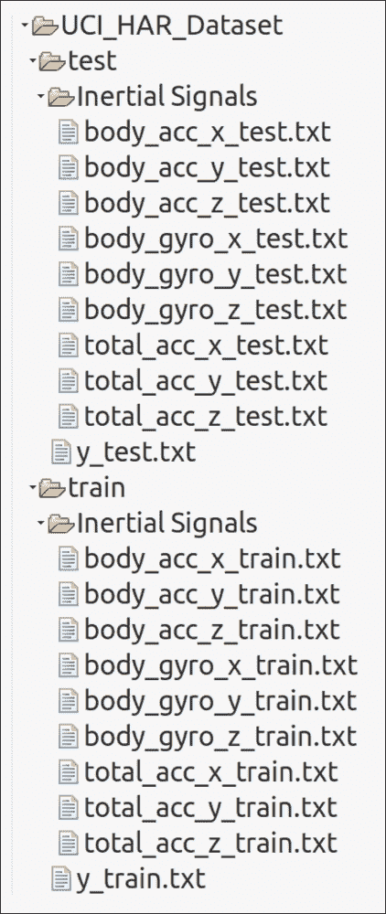
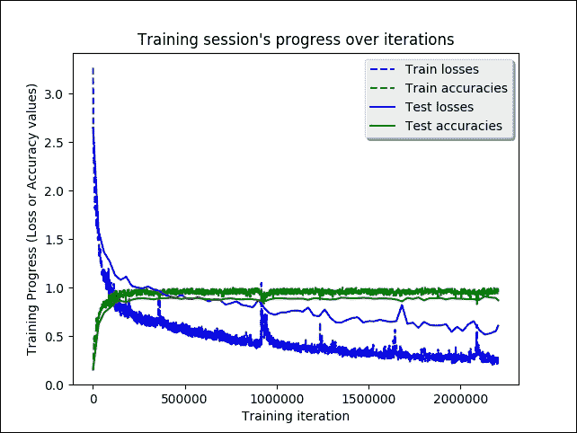

# 使用 LSTM 模型识别人类活动

人类活动识别（HAR）数据库[​​HTG0] 是通过对携带带有嵌入式惯性传感器的腰部智能手机的 30 名参加日常生活活动（ADL）的参与者进行测量而建立的。目标是将他们的活动分类为前面提到的六个类别之一。

## 数据集描述

实验在一组 30 名志愿者中进行，年龄范围为 19-48 岁。每个人都在腰上戴着三星 Galaxy S II 智能手机，完成了六项活动（步行，走楼上，走楼下，坐着，站着，躺着）。使用加速度计和陀螺仪，作者以 50 Hz 的恒定速率捕获了 3 轴线性加速度和 3 轴角速度。

仅使用两个传感器，加速度计和陀螺仪。通过应用噪声滤波器对传感器信号进行预处理，然后在 2.56 秒的固定宽度滑动窗口中采样，重叠 50％。这样每个窗口提供 128 个读数。来自传感器加速度信号的重力和身体运动分量通过巴特沃斯低通滤波器分离成身体加速度和重力。

欲了解更多信息，请参阅本文：Davide Anguita，Alessandro Ghio，Luca Oneto，Xavier Parra 和 Jorge L. Reyes-Ortiz，使用智能手机进行人类活动识别的公共领域数据集和第 21 届关于人工神经网络的欧洲研讨会，计算智能和机器学习，ESANN 2013.比利时布鲁日 24-26，2013 年 4 月。

为简单起见，假设重力仅具有少量低频分量。因此，使用 0.3Hz 截止频率的滤波器。从每个窗口，通过计算来自时域和频域的变量找到特征向量。

已经对实验进行了视频记录以便于手动标记数据。数据集已被随机分为两组，其中 70％的志愿者被选中用于训练数据，30％用于测试数据。当我浏览数据集时，训练集和测试集都具有以下文件结构：



图 24：HAR 数据集文件结构

对于数据集中的每条记录，提供以下内容：

*   来自加速度计的三轴加速度和估计的车身加速度
*   来自陀螺仪传感器的三轴角速度
*   具有时域和频域变量的 561 特征向量
*   它的活动标签
*   进行实验的受试者的标识符

因此，我们知道需要解决的问题。现在是探索技术和相关挑战的时候了。

## HAR 的 LSTM 模型的工作流程

整个算法有以下工作流程：

1.  加载数据。
2.  定义超参数。
3.  使用命令式编程和超参数设置 LSTM 模型。
4.  应用批量训练。也就是说，选择一批数据，将其提供给模型，然后在一些迭代之后，评估模型并打印批次损失和准确率。
5.  输出图的训练和测试误差。

可以遵循上述步骤并构建一个管道：


图 25：用于 HAR 的基于 LSTM 的管道

## 为 HAR 实现 LSTM 模型

首先，我们导入所需的包和模块：

```py
import numpy as np
import matplotlib
import matplotlib.pyplot as plt
import tensorflow as tf
from sklearn import metrics
from tensorflow.python.framework import ops
import warnings
import random
warnings.filterwarnings("ignore")
os.environ['TF_CPP_MIN_LOG_LEVEL'] = '3'
```

如前所述，`INPUT_SIGNAL_TYPES`包含一些有用的常量。它们是神经网络的单独标准化输入特征：

```py
INPUT_SIGNAL_TYPES = [
    "body_acc_x_",
    "body_acc_y_",
    "body_acc_z_",
    "body_gyro_x_",
    "body_gyro_y_",
    "body_gyro_z_",
    "total_acc_x_",
    "total_acc_y_",
    "total_acc_z_"
]
```

标签在另一个数组中定义 - 这是用于学习如何分类的输出类：

```py
LABELS = [
    "WALKING",
    "WALKING_UPSTAIRS",
    "WALKING_DOWNSTAIRS",
    "SITTING",
    "STANDING",
    "LAYING"
]
```

我们现在假设您已经从[此链接](https://archive.ics.uci.edu/ml/machine-learning-databases/00240/UCI HAR Dataset.zip)下载了 HAR 数据集并输入了名为`UCIHARDataset`的文件夹（或者您可以选择听起来更合适的合适名称）。此外，我们需要提供训练和测试集的路径：

```py
DATASET_PATH = "UCIHARDataset/"
print("\n" + "Dataset is now located at: " + DATASET_PATH)

TRAIN = "train/"
TEST = "test/"
```

然后我们加载并根据由`[Array [Array [Float]]]`格式的`INPUT_SIGNAL_TYPES`数组定义的输入信号类型，映射每个`.txt`文件的数据。 `X`表示神经网络的训练和测试输入：

```py
def load_X(X_signals_paths):
    X_signals = []

    for signal_type_path in X_signals_paths:
        file = open(signal_type_path, 'r')
        # Read dataset from disk, dealing with text files' syntax
        X_signals.append(
            [np.array(serie, dtype=np.float32) for serie in [
                row.replace('  ', ' ').strip().split(' ') for row in file
            ]]
        )
        file.close()

    return np.transpose(np.array(X_signals), (1, 2, 0))

X_train_signals_paths = [DATASET_PATH + TRAIN + "Inertial Signals/" + signal + "train.txt" for signal in INPUT_SIGNAL_TYPES]
X_test_signals_paths = [DATASET_PATH + TEST + "Inertial Signals/" + signal + "test.txt" for signal in INPUT_SIGNAL_TYPES]

X_train = load_X(X_train_signals_paths)
X_test = load_X(X_test_signals_paths)
```

然后我们加载`y`，神经网络的训练和测试输出的标签：

```py
def load_y(y_path):
    file = open(y_path, 'r')
    # Read dataset from disk, dealing with text file's syntax
    y_ = np.array(
        [elem for elem in [
            row.replace('  ', ' ').strip().split(' ') for row in file
        ]],
        dtype=np.int32
    )
    file.close()

    # We subtract 1 to each output class for 0-based indexing 
    return y_ - 1

y_train_path = DATASET_PATH + TRAIN + "y_train.txt"
y_test_path = DATASET_PATH + TEST + "y_test.txt"

y_train = load_y(y_train_path)
y_test = load_y(y_test_path)
```

让我们看看一些数据集的统计数据，例如训练系列的数量（如前所述，每个系列之间有 50％的重叠），测试系列的数量，每个系列的时间步数，以及每个时间步输入参数：

```py
training_data_count = len(X_train)
test_data_count = len(X_test)
n_steps = len(X_train[0])  
n_input = len(X_train[0][0])  
print("Number of training series: "+ trainingDataCount)
print("Number of test series: "+ testDataCount)
print("Number of timestep per series: "+ nSteps)
print("Number of input parameters per timestep: "+ nInput) 
```

以下是上述代码的输出：

```py
>>>
Number of training series: 7352
Number of test series: 2947
Number of timestep per series: 128
Number of input parameters per timestep: 9

```

现在让我们为训练定义一些核心参数定义。整个神经网络的结构可以通过枚举这些参数和使用 LSTM 这一事实来概括：

```py
n_hidden = 32 # Hidden layer num of features
n_classes = 6 # Total classes (should go up, or should go down)

learning_rate = 0.0025
lambda_loss_amount = 0.0015
training_iters = training_data_count * 300 #Iterate 300 times 
batch_size = 1500
display_iter = 30000 # to show test set accuracy during training
```

我们已经定义了所有核心参数和网络参数。这些是随机选择。我没有进行超参数调整，但仍然运行良好。因此，我建议使用网格搜索技术调整这些超参数。有许多在线资料可供使用。

然而，在构建 LSTM 网络并开始训练之前，让我们打印一些调试信息，以确保执行不会中途停止：

```py
print("Some useful info to get an insight on dataset's shape and normalization:")
print("(X shape, y shape, every X's mean, every X's standard deviation)")
print(X_test.shape, y_test.shape, np.mean(X_test), np.std(X_test))
print("The dataset is therefore properly normalized, as expected, but not yet one-hot encoded.")
```

以下是上述代码的输出：

```py
>>>
Some useful info to get an insight on dataset's shape and normalization:
(X shape, y shape, every X's mean, every X's standard deviation)
(2947, 128, 9) (2947, 1) 0.0991399 0.395671

```

数据集是  ，因此按预期正确标准化，但尚未进行单热编码。

现在训练数据集处于校正和标准化顺序，现在是构建 LSTM 网络的时候了。以下函数从给定参数返回 TensorFlow LSTM 网络。此外，两个 LSTM 单元堆叠在一起，这增加了神经网络的深度：

```py
def LSTM_RNN(_X, _weights, _biases):
    _X = tf.transpose(_X, [1,0,2])# permute n_steps & batch_size
    _X = tf.reshape(_X, [-1, n_input]) 
    _X = tf.nn.relu(tf.matmul(_X, _weights['hidden']) + _biases['hidden'])
    _X = tf.split(_X, n_steps, 0) 
    lstm_cell_1 = tf.nn.rnn_cell.BasicLSTMCell(n_hidden, forget_bias=1.0, state_is_tuple=True)
    lstm_cell_2 = tf.nn.rnn_cell.BasicLSTMCell(n_hidden, forget_bias=1.0, state_is_tuple=True)
    lstm_cells = tf.nn.rnn_cell.MultiRNNCell([lstm_cell_1, lstm_cell_2], state_is_tuple=True)
    outputs, states = tf.contrib.rnn.static_rnn(lstm_cells, _X, dtype=tf.float32)
    lstm_last_output = outputs[-1]
    return tf.matmul(lstm_last_output, _weights['out']) + _biases['out']
```

如果我们仔细查看前面的代码片段，我们可以看到我们得到了“多对一”样式分类器的最后一步输出特征。现在，问题是什么是多对一 RNN 分类器？好吧，类似于图 5，我们接受特征向量的时间序列（每个时间步长一个向量）并将它们转换为输出中的概率向量以进行分类。

现在我们已经能够构建我们的 LSTM 网络，我们需要将训练数据集准备成批量。以下函数从`(X|y)_train`数据中获取`batch_size`数据量：

```py
def extract_batch_size(_train, step, batch_size):
    shape = list(_train.shape)
    shape[0] = batch_size
    batch_s = np.empty(shape)
    for i in range(batch_size):
        index = ((step-1)*batch_size + i) % len(_train)
        batch_s[i] = _train[index]
    return batch_s
```

之后，我们需要将数字索引的输出标签编码为二元类别。然后我们用`batch_size`执行训练步骤。例如，`[[5], [0], [3]]`需要转换为类似于`[[0, 0, 0, 0, 0, 1], [1, 0, 0, 0, 0, 0], [0, 0, 0, 1, 0, 0]]`的形状。好吧，我们可以用单热编码来做到这一点。以下方法执行完全相同的转换：

```py
def one_hot(y_):
    y_ = y_.reshape(len(y_))
    n_values = int(np.max(y_)) + 1
    return np.eye(n_values)[np.array(y_, dtype=np.int32)]
```

优秀的！我们的数据集准备就绪，因此我们可以开始构建网络。首先，我们为输入和标签创建两个单独的占位符：

```py
x = tf.placeholder(tf.float32, [None, n_steps, n_input])
y = tf.placeholder(tf.float32, [None, n_classes])
```

然后我们创建所需的权重向量：

```py
weights = {
    'hidden': tf.Variable(tf.random_normal([n_input, n_hidden])), 
    'out': tf.Variable(tf.random_normal([n_hidden, n_classes], mean=1.0))
}
```

然后我们创建所需的偏向量：

```py
biases = {
    'hidden': tf.Variable(tf.random_normal([n_hidden])),
    'out': tf.Variable(tf.random_normal([n_classes]))
}
```

然后我们通过传递输入张量，权重向量和偏置向量来构建模型，如下所示：

```py
pred = LSTM_RNN(x, weights, biases)
```

此外，我们还需要计算`cost` op，正则化，优化器和评估。我们使用 L2 损失进行正则化，这可以防止这种过度杀伤神经网络过度适应训练中的问题：

```py
l2 = lambda_loss_amount * sum(tf.nn.l2_loss(tf_var) for tf_var in tf.trainable_variables())

cost = tf.reduce_mean(tf.nn.softmax_cross_entropy_with_logits_v2(labels=y, logits=pred)) + l2

optimizer = tf.train.AdamOptimizer(learning_rate=learning_rate).minimize(cost)
correct_pred = tf.equal(tf.argmax(pred,1), tf.argmax(y,1))
accuracy = tf.reduce_mean(tf.cast(correct_pred, tf.float32))
Great! So far, everything has been fine. Now we are ready to train the neural network. First, we create some lists to hold some training's performance:
```

```py
test_losses = []
test_accuracies = []
train_losses = []
train_accuracies = []
```

然后我们创建一个  TensorFlow 会话，启动图并初始化全局变量：

```py
sess = tf.InteractiveSession(config=tf.ConfigProto(log_device_placement=False))
init = tf.global_variables_initializer()
sess.run(init)
```

然后我们在每个循环中以`batch_size`数量的示例数据执行训练步骤。我们首先使用批量数据进行训练，然后我们仅在几个步骤评估网络以加快训练速度。另外，我们评估测试集（这里没有学习，只是诊断评估）。最后，我们打印结果：

```py
step = 1
while step * batch_size <= training_iters:
    batch_xs =  extract_batch_size(X_train, step, batch_size)
    batch_ys = one_hot(extract_batch_size(y_train, step, batch_size))
    _, loss, acc = sess.run(
        [optimizer, cost, accuracy],
        feed_dict={
            x: batch_xs,
            y: batch_ys
        }
    )
    train_losses.append(loss)
    train_accuracies.append(acc)
    if (step*batch_size % display_iter == 0) or (step == 1) or (step * batch_size > training_iters):
        print("Training iter #" + str(step*batch_size) + \":   Batch Loss = " + "{:.6f}".format(loss) + \", Accuracy = {}".format(acc))
        loss, acc = sess.run(
            [cost, accuracy], 
            feed_dict={
                x: X_test,
                y: one_hot(y_test)
            }
        )
        test_losses.append(loss)
        test_accuracies.append(acc)
        print("PERFORMANCE ON TEST SET: " + \
              "Batch Loss = {}".format(loss) + \
              ", Accuracy = {}".format(acc))
    step += 1
print("Optimization Finished!")
one_hot_predictions, accuracy, final_loss = sess.run(
    [pred, accuracy, cost],
    feed_dict={
        x: X_test,
        y: one_hot(y_test)
    })
test_losses.append(final_loss)
test_accuracies.append(accuracy)

print("FINAL RESULT: " + \
      "Batch Loss = {}".format(final_loss) + \
      ", Accuracy = {}".format(accuracy))
```

以下是上述代码的输出：

```py
>>>
Training iter #1500:   Batch Loss = 3.266330, Accuracy = 0.15733332931995392
PERFORMANCE ON TEST SET: Batch Loss = 2.6498606204986572, Accuracy = 0.15473362803459167
Training iter #30000:   Batch Loss = 1.538126, Accuracy = 0.6380000114440918
…PERFORMANCE ON TEST SET: Batch Loss = 0.5507552623748779, Accuracy = 0.8924329876899719
Optimization Finished!
FINAL RESULT: Batch Loss = 0.6077192425727844, Accuracy = 0.8686800003051758

```

做得好！ 训练进展顺利。但是，视觉概述会更有用：

```py
indep_train_axis = np.array(range(batch_size, (len(train_losses)+1)*batch_size, batch_size))
plt.plot(indep_train_axis, np.array(train_losses),     "b--", label="Train losses")
plt.plot(indep_train_axis, np.array(train_accuracies), "g--", label="Train accuracies")
indep_test_axis = np.append(np.array(range(batch_size, len(test_losses)*display_iter, display_iter)[:-1]),
    [training_iters])
plt.plot(indep_test_axis, np.array(test_losses),     "b-", label="Test losses")
plt.plot(indep_test_axis, np.array(test_accuracies), "g-", label="Test accuracies")
plt.title("Training session's progress over iterations")
plt.legend(loc='upper right', shadow=True)
plt.ylabel('Training Progress (Loss or Accuracy values)')
plt.xlabel('Training iteration')
plt.show()
```

以下是上述代码的输出：

```py
>>>

```



图 26：迭代时的 LSTM 训练课程

我们需要计算其他表现指标，例如`accuracy`，`precision`，`recall`和`f1`度量：

```py
predictions = one_hot_predictions.argmax(1)
print("Testing Accuracy: {}%".format(100*accuracy))
print("")
print("Precision: {}%".format(100*metrics.precision_score(y_test, predictions, average="weighted")))
print("Recall: {}%".format(100*metrics.recall_score(y_test, predictions, average="weighted")))
print("f1_score: {}%".format(100*metrics.f1_score(y_test, predictions, average="weighted")))
```

以下是上述代码的输出：

```py
>>>
Testing Accuracy: 89.51476216316223%
Precision: 89.65053428376297%
Recall: 89.51476077366813%
f1_score: 89.48593061935716%

```

由于我们正在接近的问题是多类分类，因此绘制混淆矩阵是有意义的：

```py
print("")
print ("Showing Confusion Matrix")

cm = metrics.confusion_matrix(y_test, predictions)
df_cm = pd.DataFrame(cm, LABELS, LABELS)
plt.figure(figsize = (16,8))
plt.ylabel('True label')
plt.xlabel('Predicted label')
sn.heatmap(df_cm, annot=True, annot_kws={"size": 14}, fmt='g', linewidths=.5)
plt.show()
```

以下是上述代码的输出：

```py
>>>

```


图 27：多类混淆矩阵（预测与实际）

在混淆矩阵中，训练和测试数据不是在类之间平均分配，因此正常情况下，超过六分之一的数据在最后一类中被正确分类。话虽如此，我们已经设法达到约 87％的预测准确率。我们很快就会看到更多分析。它可能更高，但是训练是在 CPU 上进行的，因此它的精度很低，当然需要很长时间。因此，我建议你在 GPU 上训练，以获得更好的结果。此外，调整超参数可能是一个不错的选择。