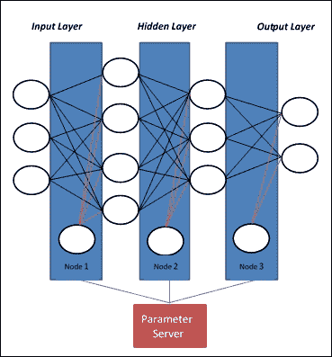

# 七、TensorFlow GPU 配置

要将  TensorFlow 与 NVIDIA GPU 配合使用，第一步是安装 CUDA Toolkit。

### 注意

要了解更多信息，请访问[此链接](https://developer.nvidia.com/cuda-downloads)。

安装 CUDA Toolkit 后，必须从[此链接](https://developer.nvidia.com/cudnn)下载适用于 Linux 的 cuDNN v5.1 库。

cuDNN 是一个有助于加速深度学习框架的库，例如 TensorFlow 和 Theano。以下是 NVIDIA 网站的简要说明：

> “NVIDIACUDA®深度神经网络库（cuDNN）是用于深度神经网络的 GPU 加速原语库.cuDNN 为标准例程提供高度调整的实现，例如前向和后向卷积，池化，正则化和激活层.cuDNN is NVIDIA 深度学习 SDK 的一部分。“

在安装之前，您需要在 NVIDIA 的加速计算开发人员计划中注册。注册后，登录并将 cuDNN 5.1 下载到本地计算机。

下载完成后，解压缩文件并将其复制到 CUDA Toolkit 目录中（我们假设目录为`/usr/local/cuda/`）：

```py
$ sudo tar -xvf cudnn-8.0-linux-x64-v5.1-rc.tgz -C /usr/local

```

## 更新 TensorFlow

我们假设您将使用 TensorFlow 来构建您的深度神经网络模型。只需通过 pip 用`upgrade`标志更新 TensorFlow。

我们假设您当前正在使用 TensorFlow 0.11：

```py
pip install — upgrade https://storage.googleapis.com/tensorflow/linux/gpu/tensorflow-0.10.0rc0-cp27-none-linux_x86_64.whl

```

现在，您应该拥有使用 GPU 运行模型所需的一切。

## GPU 表示

在 TensorFlow 中，  支持的设备表示为字符串：

*   `"/cpu:0"`：您机器的 CPU
*   `"/gpu:0"`：机器的 GPU，如果你有的话
*   `"/gpu:1"`：你机器的第二个 GPU，依此类推

当将操作分配给 GPU 设备时，  执行流程给予优先级。

## 使用 GPU

要在 TensorFlow 程序中使用  GPU，只需键入以下内容：

```py
with tf.device("/gpu:0"):
```

然后你需要进行设置操作。这行代码将创建一个新的上下文管理器，告诉 TensorFlow 在 GPU 上执行这些操作。

让我们考虑以下示例，其中我们要执行以下两个大矩阵的和：`A^n + B^n`。

定义基本导入：

```py
import numpy as np
import tensorflow as tf
import datetime
```

我们可以配置 TensorFlow 程序，以找出您的操作和张量分配给哪些设备。为此，我们将创建一个会话，并将以下`log_device_placement`参数设置为`True`：

```py
log_device_placement = True
```

然后我们设置`n`参数，这是要执行的乘法次数：

```py
n=10
```

然后我们构建两个随机大矩阵。我们使用 NumPy `rand`函数来执行此操作：

```py
A = np.random.rand(10000, 10000).astype('float32')
B = np.random.rand(10000, 10000).astype('float32')
```

`A`和`B`各自的大小为 10000x10000。

以下数组将用于存储结果：

```py
c1 = []
c2 = []
```

接下来，我们定义将由 GPU 执行的内核矩阵乘法函数：

```py
def matpow(M, n):
    if n == 1:
        return M
    else:
        return tf.matmul(M, matpow(M, n-1))
```

正如我们之前解释的  ，我们必须配置 GPU 和 GPU 以执行以下操作：

GPU 将计算`A^n`和`B^n`操作并将结果存储在`c1`中：

```py
with tf.device('/gpu:0'):
    a = tf.placeholder(tf.float32, [10000, 10000])
    b = tf.placeholder(tf.float32, [10000, 10000])
    c1.append(matpow(a, n))
    c1.append(matpow(b, n))
```

`c1`（`A^n + B^n`）中所有元素的添加由 CPU 执行，因此我们定义以下内容：

```py
with tf.device('/cpu:0'):
  sum = tf.add_n(c1) 
```

`datetime`类允许我们评估计算时间：

```py
t1_1 = datetime.datetime.now()
with tf.Session(config=tf.ConfigProto\
          (log_device_placement=log_device_placement)) as sess:
    sess.run(sum, {a:A, b:B})
t2_1 = datetime.datetime.now()
```

然后显示计算时间：

```py
print("GPU computation time: " + str(t2_1-t1_1))
```

在我的笔记本电脑上，使用 GeForce 840M 显卡，结果如下：

```py
GPU computation time: 0:00:13.816644

```

## GPU 内存管理

在一些情况下，希望该过程仅分配可用内存的子集，或者仅增加该过程所需的内存使用量。 TensorFlow 在会话中提供两个配置选项来控制它。

第一个是`allow_growth`选项，它尝试根据运行时分配仅分配尽可能多的 GPU 内存：它开始分配非常少的内存，并且随着会话运行并需要更多 GPU 内存，我们扩展 GPU 内存量 TensorFlow 流程需要。

请注意，  我们不释放内存，因为这可能导致更糟糕的内存碎片。要打开此选项，请在`ConfigProto`中设置选项，如下所示：

```py
config = tf.ConfigProto()
config.gpu_options.allow_growth = True
session = tf.Session(config=config, ...)
```

第二种方法是`per_process_gpu_memory_fraction`选项，它确定应分配每个可见 GPU 的总内存量的分数。例如，您可以告诉 TensorFlow 仅分配每个 GPU 总内存的 40％，如下所示：

```py
config = tf.ConfigProto()
config.gpu_options.per_process_gpu_memory_fraction = 0.4
session = tf.Session(config=config, ...)
```

如果要真正限制 TensorFlow 进程可用的 GPU 内存量，这非常有用。

## 在多 GPU 系统上分配单个 GPU

如果系统中有多个 GPU，则默认情况下将选择 ID 最低的 GPU。如果您想在不同的 GPU 上运行会话，则需要明确指定首选项。

例如，我们可以尝试更改上一代码中的 GPU 分配：

```py
with tf.device('/gpu:1'):
    a = tf.placeholder(tf.float32, [10000, 10000])
    b = tf.placeholder(tf.float32, [10000, 10000])
    c1.append(matpow(a, n))
    c1.append(matpow(b, n))
```

这样，我们告诉 gpu1 执行内核函数。如果我们指定的设备不​​存在（如我的情况），您将获得`InvalidArgumentError`：

```py
InvalidArgumentError (see above for traceback): Cannot assign a device to node 'Placeholder_1': Could not satisfy explicit device specification '/device:GPU:1' because no devices matching that specification are registered in this process; available devices: /job:localhost/replica:0/task:0/cpu:0
     [[Node: Placeholder_1 = Placeholder[dtype=DT_FLOAT, shape=[100,100], _device="/device:GPU:1"]()]]

```

如果您希望 TensorFlow 自动选择现有且受支持的设备来运行操作（如果指定的设备不​​存在），则可以在创建会话时在配置选项中将`allow_soft_placement`设置为 True。

我们再次为以下节点设置`'/gpu:1'`：

```py
with tf.device('/gpu:1'):
    a = tf.placeholder(tf.float32, [10000, 10000])
    b = tf.placeholder(tf.float32, [10000, 10000])
    c1.append(matpow(a, n))
    c1.append(matpow(b, n))
```

然后我们构建一个`Session`，并将以下`allow_soft_placement`参数设置为`True`：

```py
with tf.Session(config=tf.ConfigProto\
                 (allow_soft_placement=True,\
                log_device_placement=log_device_placement))\
                  as sess:
```

这样，当我们运行会话时，不会显示`InvalidArgumentError`。在这种情况下，我们会得到一个正确的结果，但有一点延迟：

```py
GPU computation time: 0:00:15.006644

```

## 具有软放置的 GPU 的源代码

这是完整源代码，仅为了清楚起见：

```py
import numpy as np
import tensorflow as tf
import datetime

log_device_placement = True
n = 10

A = np.random.rand(10000, 10000).astype('float32')
B = np.random.rand(10000, 10000).astype('float32')

c1 = []
c2 = []

def matpow(M, n):
    if n == 1: 
        return M
    else:
        return tf.matmul(M, matpow(M, n-1))

with tf.device('/gpu:0'):
    a = tf.placeholder(tf.float32, [10000, 10000])
    b = tf.placeholder(tf.float32, [10000, 10000])
    c1.append(matpow(a, n))
    c1.append(matpow(b, n))

with tf.device('/cpu:0'):
    sum = tf.add_n(c1) 

t1_1 = datetime.datetime.now()
with tf.Session(config=tf.ConfigProto\
                 (allow_soft_placement=True,\
                log_device_placement=log_device_placement))\
                  as sess:
     sess.run(sum, {a:A, b:B})
t2_1 = datetime.datetime.now()
```

## 使用多个 GPU

如果您想在多个 GPU 上运行 TensorFlow，您可以通过为 GPU 分配特定的代码块来构建模型。例如，如果我们有两个 GPU，我们可以按如下方式拆分前面的代码，将第一个矩阵计算分配给第一个 GPU：

```py
with tf.device('/gpu:0'):
    a = tf.placeholder(tf.float32, [10000, 10000])
    c1.append(matpow(a, n))
```

第二个矩阵计算分配给第二个 GPU：

```py
with tf.device('/gpu:1'):
    b = tf.placeholder(tf.float32, [10000, 10000])
    c1.append(matpow(b, n))
```

CPU 将管理结果。另请注意，我们使用共享`c1`数组来收集它们：

```py
with tf.device('/cpu:0'):
    sum = tf.add_n(c1)
```

在下面的代码片段中，我们提供了两个 GPU 管理的具体示例：

```py
import numpy as np
import tensorflow as tf
import datetime

log_device_placement = True
n = 10

A = np.random.rand(10000, 10000).astype('float32')
B = np.random.rand(10000, 10000).astype('float32')

c1 = []

def matpow(M, n):
    if n == 1:  
        return M
    else:
        return tf.matmul(M, matpow(M, n-1))

#FIRST GPU
with tf.device('/gpu:0'):
    a = tf.placeholder(tf.float32, [10000, 10000])
    c1.append(matpow(a, n))

#SECOND GPU
with tf.device('/gpu:1'):
    b = tf.placeholder(tf.float32, [10000, 10000])
    c1.append(matpow(b, n))

with tf.device('/cpu:0'):
    sum = tf.add_n(c1) 

t1_1 = datetime.datetime.now()
with tf.Session(config=tf.ConfigProto\
                 (allow_soft_placement=True,\
                log_device_placement=log_device_placement))\
                  as sess:
     sess.run(sum, {a:A, b:B})
t2_1 = datetime.datetime.now()
```

# 分布式计算

DL 模型必须接受大量数据的训练，以提高其表现。但是，训练具有数百万参数的深度网络可能需要数天甚至数周。在大规模分布式深度网络中，Dean 等人。提出了两种范例，即模型并行性和数据并行性，它们允许我们在多个物理机器上训练和服务网络模型。在下一节中，我们引入了这些范例，重点关注分布式 TensorFlow 功能。

## 模型并行

模型并行性为每个处理器提供相同的数据，但对其应用不同的模型。如果网络模型太大而无法放入一台机器的内存中，则可以将模型的不同部分分配给不同的机器。可能的模型并行方法是在机器（节点 1）上具有第一层，在第二机器（节点 2）上具有第二层，等等。有时这不是最佳方法，因为最后一层必须等待在前进步骤期间完成第一层的计算，并且第一层必须在反向传播步骤期间等待最深层。只有模型可并行化（例如 GoogleNet）才能在不同的机器上实现，而不会遇到这样的瓶颈：



图 3：在模型并行性中，每个节点计算网络的不同部分

大约 20 年前，  训练神经网络的人可能是术语模型并行性的创始人，因为他们有不同的神经网络模型来训练和测试，并且网络中的多个层可以用相同的数据。

## 数据并行

数据并行性表示将单个指令应用于多个数据项。它是 SIMD（单指令，多数据）计算机架构的理想工作负载，是电子数字计算机上最古老，最简单的并行处理形式。

在这种方法中，网络模型适合于一台机器，称为参数服务器，而大多数计算工作由多台机器完成，称为工作器：

*   参数服务器：这是一个 CPU，您可以在其中存储工作器所需的变量。就我而言，这是我定义网络所需的权重变量的地方。
*   工作器：这是我们完成大部分计算密集型工作的地方。

每个工作器负责读取，计算和更新模型参数，并将它们发送到参数服务器：

*   在正向传播中，工作者从参数服务器获取变量，在我们的工作者上对它们执行某些操作。
*   在向后传递中，工作器将当前状态发送回参数服务器，参数服务器执行更新操作，并为我们提供新的权重以进行尝试：

    

    图 4：在数据并行模型中，每个节点计算所有参数

数据并行可能有两个主要的选项：

*   同步训练：所有工作器同时读取参数，计算训练操作，并等待所有其他人完成。然后将梯度平均，并将单个更新发送到参数服务器。因此，在任何时间点，工作器都将意识到图参数的相同值。
*   异步训练：工作器将异步读取参数服务器，计算训练操作，并发送异步更新。在任何时间点，两个不同的工作器可能会意识到图参数的不同值。

# 分布式 TensorFlow 设置

在本节中，我们将探索 TensorFlow 中的计算可以分布的机制。运行分布式 TensorFlow 的第一步是使用`tf.train.ClusterSpec`指定集群的架构：

```py
import tensorflow as tf

cluster = tf.train.ClusterSpec({"ps": ["localhost:2222"],\
                                "worker": ["localhost:2223",\
                                           "localhost:2224"]})
```

节点通常分为两个作业：主机变量的参数服务器（`ps`）和执行大量计算的工作器。在上面的代码中，我们有一个参数服务器和两个 worker，以及每个节点的 IP 地址和端口。

然后我们必须为之前定义的每个参数服务器和 worker 构建一个`tf.train.Server`：

```py
ps = tf.train.Server(cluster, job_name="ps", task_index=0)

worker0 = tf.train.Server(cluster,\
                          job_name="worker", task_index=0)
worker1 = tf.train.Server(cluster,\
                          job_name="worker", task_index=1)
```

`tf.train.Server`对象包含一组本地设备，一组与`tf.train.ClusterSpec`中其他任务的连接，以及一个可以使用它们执行分布式计算的`tf.Session`。创建它是为了允许设备之间的连接。

接下来，我们使用以下命令将模型变量分配给 worker：

```py
tf.device :

with tf.device("/job:ps/task:0"):
    a = tf.constant(3.0, dtype=tf.float32)
    b = tf.constant(4.0)
```

将这些指令复制到名为`main.py`的文件中。

在两个单独的文件`worker0.py`和`worker1.py`中，我们必须定义工作器。在`worker0.py`中，将两个变量`a`和`b`相乘并打印出结果：

```py
import tensorflow as tf
from main import *

with tf.Session(worker0.target) as sess:
    init = tf.global_variables_initializer()
    add_node = tf.multiply(a,b)
    sess.run(init)
    print(sess.run(add_node))
```

在`worker1.py`中，首先更改`a`的值，然后将两个变量`a`和`b`相乘：

```py
import tensorflow as tf
from main import *

with tf.Session(worker1.target) as sess:
    init = tf.global_variables_initializer()
    a = tf.constant(10.0, dtype=tf.float32)
    add_node = tf.multiply(a,b)
    sess.run(init)
    a = add_node
    print(sess.run(add_node))
```

要执行此示例，首先从命令提示符运行`main.py`文件。

你应该得到这样的结果：

```py
>python main.py

Found device 0 with properties:
name: GeForce 840M
major: 5 minor: 0 memoryClockRate (GHz) 1.124
pciBusID 0000:08:00.0
Total memory: 2.00GiB
Free memory: 1.66GiB

    Started server with target: grpc://localhost:2222
```

然后我们可以运行工作器：

```py
> python worker0.py

Found device 0 with properties:
name: GeForce 840M
major: 5 minor: 0 memoryClockRate (GHz) 1.124
pciBusID 0000:08:00.0
Total memory: 2.00GiB
Free memory: 1.66GiB

    Start master session 83740f48d039c97d with config:
    12.0
> python worker1.py

Found device 0 with properties:
name: GeForce 840M
major: 5 minor: 0 memoryClockRate (GHz) 1.124
pciBusID 0000:08:00.0
Total memory: 2.00GiB
Free memory: 1.66GiB

    Start master session 3465f63a4d9feb85 with config:
    40.0
```

# 总结

在本章中，我们快速了解了与优化 DNN 计算相关的两个基本主题。

第一个主题解释了如何使用 GPU 和 TensorFlow 来实现 DNN。它们以非常统一的方式构造，使得在网络的每一层，数千个相同的人工神经元执行相同的计算。因此，DNN 的架构非常适合 GPU 可以有效执行的计算类型。

第二个主题介绍了分布式计算。这最初用于执行非常复杂的计算，这些计算无法由单个机器完成。同样，在面对如此大的挑战时，通过在不同节点之间拆分此任务来快速分析大量数据似乎是最佳策略。

同时，可以使用分布式计算来利用 DL 问题。 DL 计算可以分为多个活动（任务）;他们每个人都将获得一小部分数据，并返回一个结果，该结果必须与其他活动提供的结果重新组合。或者，在大多数复杂情况下，可以为每台机器分配不同的计算算法。

最后，在最后一个例子中，我们展示了如何分配 TensorFlow 中的计算。

