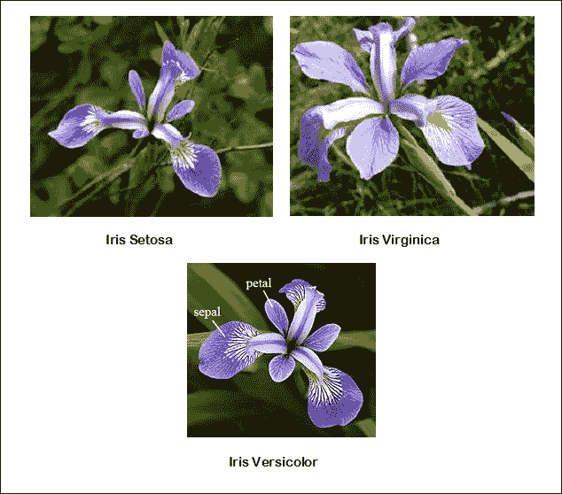

# 第 8 章高级 TensorFlow 编程

深度学习（DL）网络的发展需要在测试新模型时进行快速原型设计。出于这个原因，已经构建了几个基于 TensorFlow 的库，它们抽象了许多编程概念并提供了高级构建块。

我们将通过应用示例描述每个库的主要特征。

本章介绍了以下高级 TensorFlow API 及其概述：

*   tf.estimator
*   TFLearn
*   漂亮的张量
*   Keras

# tf.estimator

tf.estimator 是一个高级 TensorFlow API，用于通过封装训练，评估，预测和导出功能来创建和训练模型。 TensorFlow 最近重新命名并在 TensorFlow 中以新名称 TF Estimator 发布了 TF Learn 软件包，可能是为了避免与 tflearn.org 的 TFLearn 软件包混淆。

tf.estimator 允许开发人员通过使用现有的模块化组件和 TensorFlow 的低级 API（这些 API 作为 ML 算法的构建块），轻松扩展包并实现新的 ML 算法。这些构建块的一些示例是评估度量，层，损失和优化器。

tf.estimator 提供的主要功能将在下一节中介绍。

## Estimators

估计器是计算给定量的估计值的规则。估计器用于训练和评估 TensorFlow 模型。每个估计器是特定类型的 ML 算法的实现。他们目前支持回归和分类问题。可用估计器的列表包括 LinearRegressor / Classifier，DNNRegressor / Classifier，DNNLinearCombinedRegressor / Classifier，TensorForestEstimator，SVM，LogisticRegressor，以及可用于为分类或回归问题构建自定义模型的通用估计器。这提供了广泛的现有 ML 算法，以及用户构建自己的算法所需的构建块。

## 图的动作

图的动作包含用于分布式训练，推理和模型评估的所有复杂逻辑。它们建立在 TensorFlow 的低级 API 之上;这些复杂性远离用户，因此他们可以专注于使用简化的接口进行研究。然后可以使用多台机器和设​​备分发估计器，并且所有扩展估计器都可以免费获得此功能。

例如，tf.estimator.RunConfig 指定 Estimator 运行的运行时配置，提供所需的参数，例如要使用的核心数和要使用的 GPU 内存量。它还包含一个 ClusterConfig，用于指定分布式运行的配置。它配置任务，集群，主节点，参数服务器以及其他所有内容。

## 解析资源

与库  （如 pandas）类似，tf.estimator 中包含一个高级 DataFrame 模块，以便从 TensorFlow 等资源中促进许多常见的数据读取/解析任务。

## 花的预测

为了说明 tf.estimator 模块的基本功能，我们将首先构建一个基本的深度神经网络（DNN）模型并在 Iris 数据集上进行训练，目的是根据萼片预测花卉种类/花瓣几何。 Iris 数据集包含 150 行数据，包括来自三种相关虹膜种类的 50 个样本：Iris Setosa，Iris Virginica 和 Iris Versicolor。每行包含每个花样本的以下数据：萼片长度，萼片宽度，花瓣长度，花瓣宽度和花种。花种表示为整数，0 表示 Iris Setosa，1 表示 Iris Versicolor，2 表示 Iris Virginica：



图 1：Iris 数据集

本节`premade_estimator.py`中描述的例子可从[此链接](https://github.com/tensorflow/models/blob/master/samples/core/get_started/premade_estimator.py)下载。

要获取训练数据，可以使用`iris_data.py`，可从[此链接](https://github.com/tensorflow/models/blob/master/samples/core/get_started/iris_data.py)下载。

Iris 数据集随机化并分成两个独立的 CSV;第一个是 120 个样本的训练集（`iris_training.csv`）：

```py
TRAIN_URL = "http://download.tensorflow.org/data/iris_training.csv"
```

第二个是 30 个样本的测试集（`iris_test.csv`）：

```py
TEST_URL = "http://download.tensorflow.org/data/iris_test.csv"
```

在这里您可以找到特征字段：

```py
CSV_COLUMN_NAMES = ['SepalLength', 'SepalWidth',
                    'PetalLength', 'PetalWidth', 'Species']
```

在这里您可以找到要分类的物种：

```py
SPECIES = ['Setosa', 'Versicolor', 'Virginica']
```

使用`iris_data.load_data()`函数加载训练和测试数据：

```py
(train_x, train_y), (test_x, test_y) = iris_data.load_data()
```

tf.estimator 提供各种预定义估计器，可用于对输入数据运行训练和评估操作。

在这里，我们将配置 DNN 分类器模型以适合 Iris 数据。使用 tf.estimator，我们只用几行代码实例化一个 tf.estimator.DNNClassifier。上面的代码定义了模型的特征，它指定了数据集中特征的数据类型：

```py
my_feature_columns = []
for key in train_x.keys():
 my_feature_columns.append(tf.feature_column.numeric_column(key=key))
```

所有特征数据都是连续的，因此 tf.feature_column.numeric_column 是用于构造特征列的相应函数。数据集中有四个特征（萼片宽度，萼片高度，花瓣宽度和花瓣高度），因此必须将形状设置为[4]以保存所有数据。

现在让我们使用 DNNClassifier 模型构建分类器：

```py
classifier = tf.estimator.DNNClassifier(
        feature_columns=my_feature_columns,
        hidden_units=[10, 10],
        n_classes=3)
```

DNNClassifier 模型使用以下参数：

*   `feature_columns= my_feature_columns`：先前定义的一组特征列
*   `hidden_units=[10, 10]`：两个隐藏层，包含 10 个和 10 个神经元
*   `n_classes=3`：三个目标类，代表三种鸢尾种

定义输入管道（`input_fn`）并使用`train`方法训练数据。训练步骤的数量是 1000：

```py
classifier.train(
        input_fn=lambda:iris_data.train_input_fn(train_x, train_y,
                                                 args.batch_size),
        steps=args.train_steps)
```

使用`evaluate`方法评估模型的准确率：

```py
eval_result = classifier.evaluate(
        input_fn=lambda:iris_data.eval_input_fn(test_x, test_y,
                                                args.batch_size))

print('\nTest set accuracy: {accuracy:0.3f}\n'.format(**eval_result))
```

与方法`train`类似，`evaluate`采用构建其输入管道的输入函数。 evaluate 返回带有评估结果的`dict`。

代码示例（`premade_estimator.py`）输出训练日志，然后对测试集进行一些预测：

```py
INFO:tensorflow:loss = 120.53493, step = 1
INFO:tensorflow:global_step/sec: 437.609
INFO:tensorflow:loss = 14.973656, step = 101 (0.291 sec)
INFO:tensorflow:global_step/sec: 369.482
INFO:tensorflow:loss = 8.025629, step = 201 (0.248 sec)
INFO:tensorflow:global_step/sec: 267.963
INFO:tensorflow:loss = 7.3872843, step = 301 (0.364 sec)
INFO:tensorflow:global_step/sec: 337.761
INFO:tensorflow:loss = 7.1775312, step = 401 (0.260 sec)
INFO:tensorflow:global_step/sec: 684.081
INFO:tensorflow:loss = 6.1282234, step = 501 (0.146 sec)
INFO:tensorflow:global_step/sec: 686.175
INFO:tensorflow:loss = 7.441858, step = 601 (0.146 sec)
INFO:tensorflow:global_step/sec: 731.402
INFO:tensorflow:loss = 4.633889, step = 701 (0.137 sec)
INFO:tensorflow:global_step/sec: 687.698
INFO:tensorflow:loss = 8.395943, step = 801 (0.145 sec)
INFO:tensorflow:global_step/sec: 687.174
INFO:tensorflow:loss = 6.0668287, step = 901 (0.146 sec)
INFO:tensorflow:Saving checkpoints for 1000 into C:\Users\GIANCA~1\AppData\Local\Temp\tmp9yaobdrg\model.ckpt.
INFO:tensorflow:Loss for final step: 7.467471.
INFO:tensorflow:Starting evaluation at 2018-03-03-14:11:13
INFO:tensorflow:Restoring parameters from C:\Users\GIANCA~1\AppData\Local\Temp\tmp9yaobdrg\model.ckpt-1000
INFO:tensorflow:Finished evaluation at 2018-03-03-14:11:14
INFO:tensorflow:Saving dict for global step 1000: accuracy = 0.96666664, average_loss = 0.060853884, global_step = 1000, loss = 1.8256165

Test set accuracy: 0.967

INFO:tensorflow:Restoring parameters from C:\Users\GIANCA~1\AppData\Local\Temp\tmp9yaobdrg\model.ckpt-1000
```

我们可以使用训练模型，根据一些未标记的测量结果来预测鸢尾花的种类。

让我们考虑以下花样：

```py
expected = ['Setosa', 'Versicolor', 'Virginica']
    predict_x = {
        'SepalLength': [5.1, 5.9, 6.9],
        'SepalWidth': [3.3, 3.0, 3.1],
        'PetalLength': [1.7, 4.2, 5.4],
        'PetalWidth': [0.5, 1.5, 2.1],
    }
```

与训练和评估一样，我们通过`predict`方法使用单个`function`调用进行预测：

```py
    predictions = classifier.predict(
        input_fn=lambda:iris_data.eval_input_fn(predict_x,
                                                labels=None,
         batch_size=args.batch_size))

    for pred_dict, expec in zip(predictions, expected):
        template = ('\nPrediction is "{}" ({:.1f}%), expected "{}"')
        class_id = pred_dict['class_ids'][0]
        probability = pred_dict['probabilities'][class_id]
        print(template.format(iris_data.SPECIES[class_id],
                              100 * probability, expec))
```

上面的代码产生以下输出：

```py
Prediction is "Setosa" (99.8%), expected "Setosa"

Prediction is "Versicolor" (99.8%), expected "Versicolor"

Prediction is "Virginica" (97.4%), expected "Virginica"
```