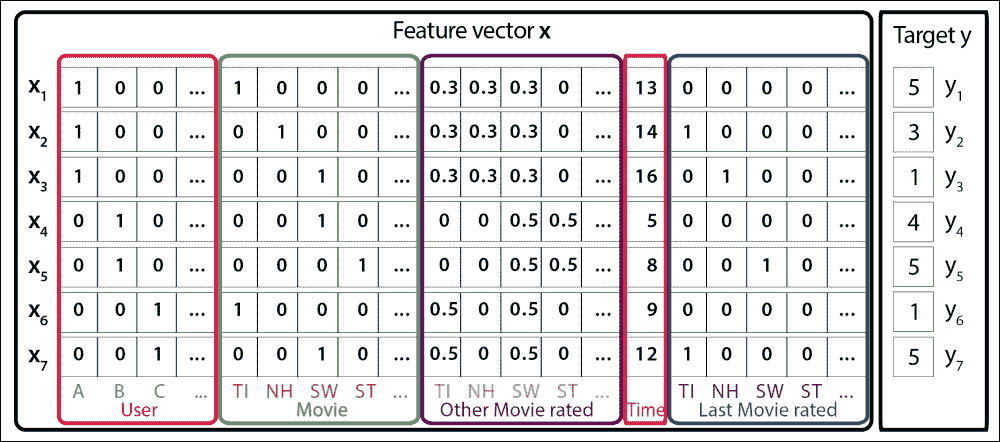
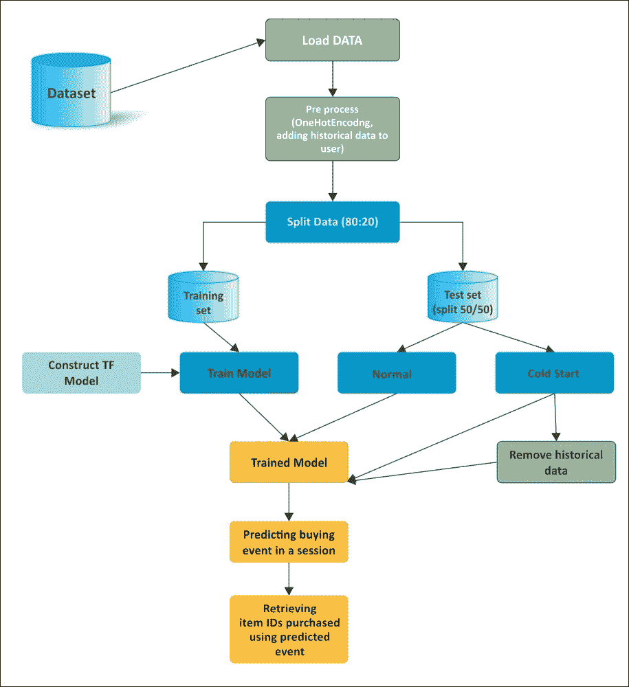
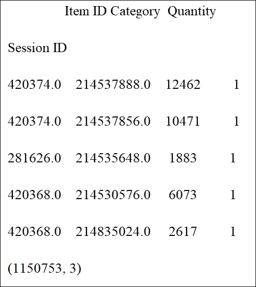
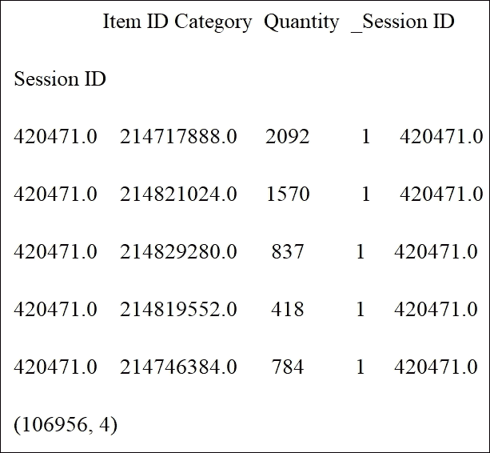
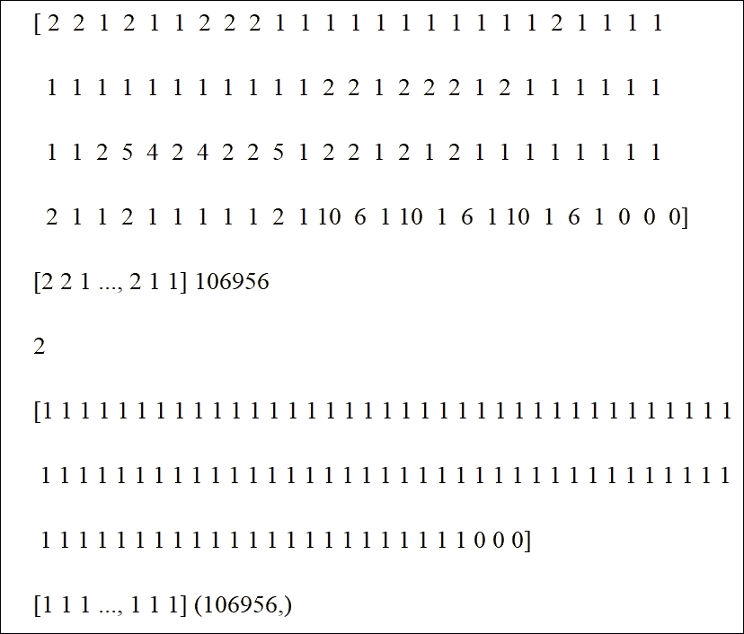

# 推荐系统的分解机

在本节中，我们将看到两个使用 FM 开发更强大的推荐系统的示例  。我们将首先简要介绍 FM 及其在冷启动推荐问题中的应用。

然后我们将看到使用 FM 开发真实推荐系统的简短示例。之后，我们将看到一个使用称为神经分解机（NFM）的 FM 算法的改进版本的示例。

## 分解机

基于 FM 的技术处于个性化的前沿。它们已经被证明是非常强大的，具有足够的表达能力来推广现有模型，例如矩阵/张量分解和多项式核回归。换句话说，这种类型的算法是监督学习方法，其通过结合矩阵分解算法中不存在的二阶特征交互来增强线性模型的表现。

现有的推荐算法需要（用户，项目和评级）元组中的消费（产品）或评级（电影）数据集。这些类型的数据集主要用于协同过滤（CF）算法的变体。 CF 算法已得到广泛采用，并已证明可以产生良好的结果。但是，在许多情况下，我们有大量的项目元数据（标签，类别和流派），可以用来做出更好的预测。不幸的是，CF 算法不使用这些类型的元数据。

FM 可以使用这些特征丰富的（元）数据集。 FM 可以使用这些额外的特征来模拟指定维度参数 d 的高阶交互。最重要的是，FM 还针对处理大规模稀疏数据集进行了优化。因此，二阶 FM 模型就足够了，因为没有足够的信息来估计更复杂的交互：



图 7：表示具有特征向量 x 和目标 y 的个性化问题的示例训练数据集。这里的行指的是导演，演员和流派信息的电影和专栏

假设预测问题的数据集由设计矩阵`X ∈ R^nxp`描述，如图 7 所示。在图 1 中，`X`的第`i`行`X ∈ R^p`描述了一种情况，其中`p`是实数估值变量。另一方面，`y[i]`是第`i`个情况的预测目标。或者，我们可以将此集合描述为元组`(x, y)`的集合`S`，其中（同样）`x ∈ R^p`是特征向量，`y`是其对应的目标或标签。

换句话说，在图 7 中，每行表示特征向量`x[i]`与其相应的目标`y[i]`。为了便于解释，这些特征分为活跃用户（蓝色），活动项目（红色），同一用户评级的其他电影（橙色），月份时间（绿色）和最后一部电影评级指标（棕色）。然后，FM 算法使用以下分解的交互参数来模拟`x`中`p`输入变量之间的所有嵌套交互（直到`d`阶）：


在等式中，v 表示与每个变量（用户和项目）相关联的 k 维潜在向量，并且括号运算符表示内积。具有数据矩阵和特征向量的这种表示在许多机器学习方法中是常见的，例如，在线性回归或支持向量机（SVM）中。

但是，如果您熟悉矩阵分解（MF）模型，则前面的等式应该看起来很熟悉：它包含全局偏差以及用户/项目特定的偏差，并包括用户项目交互。现在，如果我们假设每个 x（j）向量在位置 u 和 i 处仅为非零，我们得到经典的 MF 模型：


然而，用于推荐系统的 MF 模型经常遭受冷启动问题。我们将在下一节讨论这个问题。

### 冷启动问题和协同过滤方法

冷启动这个问题听起来很有趣，但顾名思义，它源于汽车。假设你住在阿拉斯加州。由于寒冷，您的汽车发动机可能无法顺利启动，但一旦达到最佳工作温度，它将启动，运行并正常运行。

在推荐引擎的领域中，术语冷启动仅仅意味着对于引擎来说还不是最佳的环境以提供最佳结果。在电子商务中，冷启动有两个不同的类别：产品冷启动和用户冷启动。

冷启动是基于计算机的信息系统中的潜在问题，涉及一定程度的自动数据建模。具体而言，它涉及的问题是系统无法对尚未收集到足够信息的用户或项目进行任何推断。

冷启动问题在推荐系统中最为普遍。在协同过滤方法中，推荐系统将识别与活动用户共享偏好的用户，并提出志同道合的用户喜欢的项目（并且活跃用户尚未看到）。由于冷启动问题，这种方法将无法考虑社区中没有人评定的项目。

通过在基于内容的匹配和协同过滤之间采用混合方法，通常可以减少冷启动问题。尚未收到用户评级的新项目将根据社区分配给其他类似项目的评级自动分配评级。项目相似性将根据项目的基于内容的特征来确定。

使用基于 CF 的方法的推荐引擎根据用户操作推荐每个项目。项目具有的用户操作越多，就越容易分辨哪个用户对其感兴趣以及其他项目与之类似。随着时间的推移，系统将能够提供越来越准确的建议。在某个阶段，当新项目或用户添加到用户项目矩阵时，会出现此问题：


图 8：用户与项目矩阵有时会导致冷启动问题

在这种情况下，RE 还没有足够的知识来了解这个新用户或这个新项目。类似于 FM 的基于内容的过滤方法是可以结合以减轻冷启动问题的方法。

前两个方程之间的主要区别在于，FM 在潜在向量方面引入了高阶相互作用，潜在向量也受分类或标签数据的影响。这意味着模型超越了共现，以便在每个特征的潜在表示之间找到更强的关系。

## 问题的定义和制定

给定用户在电子商务网站上的典型会话期间执行的点击事件的序列  ，目标是预测用户是否购买或不购买，如果他们正在购买，他们会买什么物品。因此，这项任务可分为两个子目标：

*   用户是否会在此会话中购买物品？
*   如果是，那么将要购买的物品是什么？

为了预测在会话中购买的项目的数量，强大的分类器可以帮助预测用户是否将购买该项目的  。在最初实现 FM 后，训练数据的结构应如下：


图 9：用户与项目/类别/历史表可用于训练推荐模型

为了准备这样的训练集，我们可以使用 pandas 中的`get_dummies()`方法将所有列转换为分类数据，因为 FM 模型使用表示为整数的分类数据。

我们使用两个函数`TFFMClassifier`和`TFFMRegressor`来进行预测（参见`items.py`）并分别计算 MSE（参见来自 tffm 库的`quantity.py`脚本（在 MIT 许可下））。 tffm 是基于 TensorFlow 的 FM 和 pandas 实现，用于预处理和结构化数据。这个基于 TensorFlow 的实现提供了一个任意顺序（&gt; = 2）分解机，它支持：

*   密集和稀疏的输入
*   不同的（基于梯度的）优化方法
*   通过不同的损失函数进行分类/回归（logistic 和 mse 实现）
*   通过 TensorBoard 记录

另一个好处是推理时间相对于特征数量是线性的。

我们要感谢作者并引用他们的工作如下：Mikhail Trofimov，Alexander Novikov，TFFM：TensorFlow 实现任意顺序分解机，[GitHub 仓库](https://github.com/geffy/tffm)，2016。

要使用此库，只需在终端上发出以下命令：

```py
$ sudo pip3 install tffm # For Python3.x
$ sudo pip install tffm # For Python 2.7.x

```

在开始实现之前，让我们看一下我们将在本例中使用的数据集。

## 数据集描述

例如，我将使用 RecSys 2015 挑战数据集来说明如何拟合 FM 模型以获得个性化推荐。该数据包含电子商务网站的点击和购买事件，以及其他项目类别数据。数据集的大小约为 275 MB，可以从[此链接](https://s3-eu-west-1.amazonaws.com/yc-rdata/yoochoose-data.7z)下载。

有三个文件和一个自述文件;但是，我们将使用 youchoose-buys.dat（购买活动）和 youchoose-clicks.dat（点击活动）：

*   `youchoose-clicks.dat`：文件中的每条记录/行都包含以下字段：
    *   会话 ID：一个会话中的一次或多次点击
    *   时间戳：发生点击的时间
    *   项目 ID：项目的唯一标识符
    *   类别：项目的类别
*   `youchoose-buys.dat`：文件中的每条记录/行都包含以下字段：
    *   会话 ID：会话 ID：会话中的一个或多个购买事件
    *   时间戳：购买发生的时间
    *   物料 ID：物品的唯一标识符
    *   价格：商品的价格
    *   数量：购买了多少件商品

youchoose-buys.dat 中的会话 ID 也存在于 youchoose-clicks.dat 文件中。这意味着具有相同会话 ID 的记录一起形成会话期间某个用户的点击事件序列。

会话可能很短（几分钟）或很长（几个小时），可能只需点击一下或点击几百次。这一切都取决于用户的活动。

### 实现工作流程

让我们开发一个预测并生成`solution.data`文件的推荐模型。这是一个简短的工作流程：

1.  下载并加载 RecSys 2015 质询数据集，并复制到本章代码库的“data”文件夹中
2.  购买数据包含会话 ID，时间戳，项目 ID，类别和数量。此外，youchoose-clicks.dat 包含会话 ID，时间戳，项目 ID 和类别。我们不会在这里使用 Timestamp。我们删除时间戳，对所有列进行单热编码，  合并买入和点击数据集以使数据集特征丰富。在预处理之后，数据看起来类似于图 11 中所示的数据。
3.  为简化起见，我们仅考虑前 10,000 个会话，并将数据集拆分为训练（75％）和测试（25％）集。
4.  然后，我们将测试分为正常（保留历史数据）和冷启动（通过删除历史数据），以区分具有历史记录或没有历史记录的用户/项目的模型。
5.  然后我们使用 tffm 训练我们的 FM 模型，这是 TensorFlow 中 FM 的实现，并使用训练数据训练模型。
6.  最后，我们在正常和冷启动数据集上评估模型。

    

    图 10：使用 FM 预测会话中已购买项目列表的工作流程

## 预处理

如果我们想充分利用类别和扩展的历史数据，我们需要加载数据并将其转换为正确的格式。因此，在准备训练集之前，必须进行一些预处理。让我们从加载包和模块开始：

```py
import tensorflow as tf
import pandas as pd
from collections import Counter
from tffm import TFFMClassifier
from sklearn.metrics import mean_squared_error
from sklearn.model_selection import train_test_split
import numpy as np
from sklearn.metrics import accuracy_score
import os
```

我是  ，假设您已经从前面提到的链接下载了数据集。现在让我们加载数据集：

```py
buys = open('data/yoochoose-buys.dat', 'r')
clicks = open('data/yoochoose-clicks.dat', 'r')
```

现在为点击创建 pandas 数据框并购买数据集：

```py
initial_buys_df = pd.read_csv(buys, names=['Session ID', 'Timestamp', 'Item ID', 'Category', 'Quantity'], dtype={'Session ID': 'float32', 'Timestamp': 'str', 'Item ID': 'float32','Category': 'str'})
initial_buys_df.set_index('Session ID', inplace=True)
initial_clicks_df = pd.read_csv(clicks, names=['Session ID', 'Timestamp', 'Item ID', 'Category'],dtype={'Category': 'str'})
initial_clicks_df.set_index('Session ID', inplace=True)
```

我们不需要在这个例子中使用时间戳，所以让我们从数据帧中删除它们：

```py
initial_buys_df = initial_buys_df.drop('Timestamp', 1)
    print(initial_buys_df.head())  # first five records
	print(initial_buys_df.shape)   # shape of the dataframe
>>>
```


```py
initial_clicks_df = initial_clicks_df.drop('Timestamp', 1)
print(initial_clicks_df.head())
print(initial_clicks_df.shape)
>>>
```


由于在此示例中我们不使用时间戳，因此从 dataframe（df）中删除 Timestamp 列：

```py
initial_buys_df = initial_buys_df.drop('Timestamp', 1)
print(initial_buys_df.head(n=5))
print(initial_buys_df.shape)
>>>
```



```py
initial_clicks_df = initial_clicks_df.drop('Timestamp', 1)
print(initial_clicks_df.head(n=5))
print(initial_clicks_df.shape)
>>>
```


让我们选取前 10,000 名购买用户：

```py
x = Counter(initial_buys_df.index).most_common(10000)
top_k = dict(x).keys()
initial_buys_df = initial_buys_df[initial_buys_df.index.isin(top_k)]
    print(initial_buys_df.head())
    print(initial_buys_df.shape)
>>>
```


```py
initial_clicks_df = initial_clicks_df[initial_clicks_df.index.isin(top_k)]
    print(initial_clicks_df.head())
    print(initial_clicks_df.shape)
>>>
```


现在让我们创建索引的副本，因为我们还将对其应用单热编码：

```py
initial_buys_df['_Session ID'] = initial_buys_df.index
print(initial_buys_df.head())
print(initial_buys_df.shape)
>>>
```



正如我们之前提到的  ，我们可以将历史参与数据引入我们的 FM 模型。我们将使用一些`group_by`魔法生成整个用户参与的历史记录。首先，我们对所有列进行单热编码以获得点击和购买：

```py
transformed_buys = pd.get_dummies(initial_buys_df)
   print(transformed_buys.shape)
>>>
(106956, 356)
transformed_clicks = pd.get_dummies(initial_clicks_df)print(transformed_clicks.shape)
>>>
(209024, 56)
```

现在是时候汇总项目和类别的历史数据了：

```py
filtered_buys = transformed_buys.filter(regex="Item.*|Category.*")
   print(filtered_buys.shape)
>>>
(106956, 354)
filtered_clicks = transformed_clicks.filter(regex="Item.*|Category.*")
    print(filtered_clicks.shape)
>>>
(209024, 56)
historical_buy_data = filtered_buys.groupby(filtered_buys.index).sum()
   print(historical_buy_data.shape)
>>>
(10000, 354)
historical_buy_data = historical_buy_data.rename(columns=lambda column_name: 'buy history:' + column_name)
    print(historical_buy_data.shape)
       >>>
      (10000, 354)
historical_click_data = filtered_clicks.groupby(filtered_clicks.index).sum()
    print(historical_click_data.shape)
    >>>
(10000, 56)
historical_click_data = historical_click_data.rename(columns=lambda column_name: 'click history:' + column_name)
```

然后我们合并每个`user_id`的历史数据：

```py
merged1 = pd.merge(transformed_buys, historical_buy_data, left_index=True, right_index=True)
print(merged1.shape)
merged2 = pd.merge(merged1, historical_click_data, left_index=True, right_index=True)
print(merged2.shape)
>>>
(106956, 710)
(106956, 766)
```

然后我们将数量作为目标并将其转换为二元：

```py
y = np.array(merged2['Quantity'].as_matrix())
```

现在让我们将 y 转换为二元：如果购买发生，为`1`；否则为`0`：

```py
for i in range(y.shape[0]):
    if y[i]!=0:
        y[i]=1
    else:
        y[i]=0
print(y.shape)
print(y[0:100])
print(y, y.shape[0])
print(y[0])
print(y[0:100])
print(y, y.shape)
>>>
```



### 训练 FM 模型

由于我们准备了数据集，下一个任务是创建 MF 模型。首先，让我们将数据分成训练和测试集：

```py
X_tr, X_te, y_tr, y_te = train_test_split(merged2, y, test_size=0.25)
```

然后我们将测试数据分成一半，一个用于正常测试，一个用于冷启动测试：

```py
X_te, X_te_cs, y_te, y_te_cs = train_test_split(X_te, y_te, test_size=0.5)
```

现在让我们在数据框中包含会话 ID 和项目 ID：

```py
test_x = pd.DataFrame(X_te, columns = ['Item ID'])
print(test_x.head())
>>>
```


```py
test_x_cs = pd.DataFrame(X_te_cs, columns = ['Item ID'])
print(test_x_cs.head())
>>>
```


然后我们从数据集中删除不需要的特征：

```py
X_tr.drop(['Item ID', '_Session ID', 'click history:Item ID', 'buy history:Item ID', 'Quantity'], 1, inplace=True)
X_te.drop(['Item ID', '_Session ID', 'click history:Item ID', 'buy history:Item ID', 'Quantity'], 1, inplace=True)
X_te_cs.drop(['Item ID', '_Session ID', 'click history:Item ID', 'buy history:Item ID', 'Quantity'], 1, inplace=True)
```

然后我们需要将 DataFrame 转换为数组：

```py
ax_tr = np.array(X_tr)
ax_te = np.array(X_te)
ax_te_cs = np.array(X_te_cs)
```

既然 pandas DataFrames 已经转换为 NumPy 数组，我们需要做一些 null 处理。我们简单地用零替换 NaN：

```py
ax_tr = np.nan_to_num(ax_tr)
ax_te = np.nan_to_num(ax_te)
ax_te_cs = np.nan_to_num(ax_te_cs)
```

然后我们用优化的超参数实例化 TF 模型进行分类：

```py
model = TFFMClassifier(
        order=2, 
        rank=7, 
        optimizer=tf.train.AdamOptimizer(learning_rate=0.001), 
        n_epochs=100, 
        batch_size=1024,
        init_std=0.001,
        reg=0.01,
        input_type='dense',
        log_dir = ' logs/',
        verbose=1,
        seed=12345
    )
```

在我们开始训练模型之前，我们必须为冷启动准备数据：

```py
cold_start = pd.DataFrame(ax_te_cs, columns=X_tr.columns)
```

和前面提到的一样，如果我们只能访问类别而没有历史点击/购买数据，我们也有兴趣了解会发生什么。让我们删除`cold_start`测试集的历史点击和购买数据：

```py
for column in cold_start.columns:
    if ('buy' in column or 'click' in column) and ('Category' not in column):
        cold_start[column] = 0
```

现在让我们训练模型：

```py
model.fit(ax_tr, y_tr, show_progress=True)
```

其中一项最重要的任务是预测会议中的购买事件：

```py
predictions = model.predict(ax_te)
print('accuracy: {}'.format(accuracy_score(y_te, predictions)))
print("predictions:",predictions[:10])
print("actual value:",y_te[:10])
>>>
accuracy: 1.0
predictions: [0 0 1 0 0 1 0 1 1 0]
actual value: [0 0 1 0 0 1 0 1 1 0]

cold_start_predictions = model.predict(ax_te_cs)
print('Cold-start accuracy: {}'.format(accuracy_score(y_te_cs, cold_start_predictions)))
print("cold start predictions:",cold_start_predictions[:10])
print("actual value:",y_te_cs[:10])
>>>
Cold-start accuracy: 1.0
cold start predictions: [1 1 1 1 1 0 1 0 0 1]
actual value: [1 1 1 1 1 0 1 0 0 1]
```

然后让我们将预测值添加到测试数据中：

```py
test_x["Predicted"] = predictions
test_x_cs["Predicted"] = cold_start_predictions
```

现在是时候找到测试数据中每个`session_id`的所有买入事件并检索相应的项目 ID：

```py
sess = list(set(test_x.index))
fout = open("solution.dat", "w")
print("writing the results into .dat file....")
for i in sess:
    if test_x.loc[i]["Predicted"].any()!= 0:
        fout.write(str(i)+";"+','.join(s for s in str(test_x.loc[i]["Item ID"].tolist()).strip('[]').split(','))+'\n')
fout.close()
>>>
writing the results into .dat file....
```

然后我们对冷启动测试数据做同样的事情：

```py
sess_cs = list(set(test_x_cs.index))
fout = open("solution_cs.dat", "w")
print("writing the cold start results into .dat file....")
for i in sess_cs:
    if test_x_cs.loc[i]["Predicted"].any()!= 0:
        fout.write(str(i)+";"+','.join(s for s in str(test_x_cs.loc[i]["Item ID"].tolist()).strip('[]').split(','))+'\n')
fout.close()
>>>
writing the cold start results into .dat file....
print("completed..!!")
>>>
completed!!
```

最后，我们销毁模型以释放内存：

```py
model.destroy()
```

另外，我们可以看到文件的示例内容：

```py
11009963;214853767
10846132;214854343, 214851590
8486841;214848315
10256314;214854125
8912828;214853085
11304897;214567215
9928686;214854300, 214819577
10125303;214567215, 214853852
10223609;214854358
```

考虑到我们使用相对较小的数据集来拟合我们的模型，  实验结果很好。正如预期的那样，如果我们可以通过项目购买和点击访问所有信息集，则更容易生成预测，但我们仍然只使用汇总类别数据获得冷启动建议的预测。

既然我们已经看到客户将在每个会话中购买，那么计算两个测试集的均方误差将会很棒。 `TFFMRegressor`方法可以帮助我们解决这个问题。为此，请使用`quantity.py`脚本。

首先，问题是如果我们只能访问类别而没有历史点击/购买数据会发生什么。让我们删除 cold_start 测试集的历史点击和购买数据：

```py
for column in cold_start.columns:
    if ('buy' in column or 'click' in column) and ('Category' not in column):
        cold_start[column] = 0
```

让我们创建 MF 模型。您可以使用超参数：

```py
reg_model = TFFMRegressor(
    order=2,
    rank=7,
    optimizer=tf.train.AdamOptimizer(learning_rate=0.1),
    n_epochs=100,
    batch_size=-1,
    init_std=0.001,
    input_type='dense',
    log_dir = ' logs/',
    verbose=1
       )
```

在前面的代码块中，随意放入您自己的日志记录路径。现在是时候使用正常和冷启动训练集训练回归模型：

```py
reg_model.fit(X_tr, y_tr, show_progress=True)
```

然后我们计算两个测试集的均方误差：

```py
predictions = reg_model.predict(X_te)
print('MSE: {}'.format(mean_squared_error(y_te, predictions)))
print("predictions:",predictions[:10])
print("actual value:",y_te[:10])
cold_start_predictions = reg_model.predict(X_te_cs)
print('Cold-start MSE: {}'.format(mean_squared_error(y_te_cs, cold_start_predictions)))
print("cold start predictions:",cold_start_predictions[:10])
print("actual value:",y_te_cs[:10])
print("Regression completed..!!")
>>>MSE: 0.4897467853668941
predictions: [ 1.35086     0.03489107  1.0565269  -0.17359206 -0.01603088  0.03424695
  2.29936886  1.65422797  0.01069662  0.02166392]
actual value: [1 0 1 0 0 0 1 1 0 0]
Cold-start MSE: 0.5663486183636738
cold start predictions: [-0.0112379   1.21811676  1.29267406  0.02357371 -0.39662406  1.06616664
 -0.10646269  0.00861482  1.22619736  0.09728943]
actual value: [0 1 1 0 1 1 0 0 1 0]
Regression completed..!!
```

最后，我们销毁模型以释放内存：

```py
reg_model.destroy()
```

因此，从训练数据集中删除类别列会使 MSE 更小，但这样做意味着我们无法解决冷启动建议问题。考虑到我们使用相对较小的数据集的条件，实验结果很好。

正如预期的那样，如果我们可以通过项目购买和点击访问完整的信息设置，则更容易生成预测，但我们仍然只使用汇总的类别数据获得冷启动建议的预测。