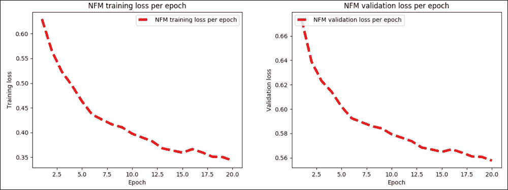

# 改进的分解机

Web 应用的许多预测任务需要对分类变量（例如用户 ID）和人口统计信息（例如性别和职业）进行建模。为了应用标准 ML 技术，需要通过单热编码（或任何其他技术）将这些分类预测变换器转换为一组二元特征。这使得得到的特征向量高度稀疏。要从这种稀疏数据中有效地学习，考虑特征之间的相互作用是很重要的。

在上一节中，我们看到 FM 可以有效地应用于模型二阶特征交互。但是，FM 模型以线性方式进行交互，如果您想捕获真实世界数据的非线性和固有复杂结构，则这种方式是不够的。

Xiangnan He 和 Jun Xiao 等。为了克服这一局限，我们提出了一些研究计划，如神经因子分解机（NFM）和注意因子分解机（AFM）。

有关更多信息，请参阅以下文章：

*   Xiangnan He 和 Tat-Seng Chua，用于稀疏预测分析的神经分解机。在 SIGIR '17，新宿，东京，日本，2017 年 8 月 7 日至 11 日的会议录。
*   Jun Xiao，Hao Ye，Xiantian He，Hanwang Zhang，Fei Wu 和 Tat-Seng Chua（2017），注意分解机：通过注意网络学习特征交互的权重 IJCAI，墨尔本，澳大利亚，2017 年 8 月 19 - 25 日。

通过在建模二阶特征相互作用中无缝地组合 FM 的线性度和在建模高阶特征相互作用中神经网络的非线性，NFM 可用于在稀疏设置下进行预测。

另一方面，即使所有特征交互具有相同的权重，AFM 也可用于对数据建模，因为并非所有特征交互都同样有用且具有预测性。

在下一节中，我们将看到使用 NFM 进行电影推荐的示例。

## 神经分解机

使用原始 FM 算法，其表现可能受到建模方式阻碍，它使用相同权重建模所有特征交互，因为并非所有特征交互都同样有用且具有预测性。例如，与无用特征的交互甚至可能引入噪声并对表现产生不利影响。

最近，Xiangnan H.等。提出了一种称为神经分解机（NFM）的 FM 算法的改进版本。 NFM 在建模二阶特征相互作用中无缝地结合了 FM 的线性度，在建模高阶特征相互作用时无缝地结合了神经网络的非线性。从概念上讲，NFM 比 FM 更具表现力，因为 FM 可以被看作是没有隐藏层的 NFM 的特例。

### 数据集描述

我们使用  MovieLens 数据进行个性化标签推荐。它包含电影上 668,953 个用户的标签应用。使用单热编码将每个标签应用（用户 ID，电影 ID 和标签）转换为特征向量。这留下了 90,445 个二元特征，称为`ml-tag`数据集。

我使用 Perl 脚本将其从.dat 转换为.libfm 格式。转换程序在[此链接](http://www.libfm.org/libfm-1.42.manual.pdf)（第 2.2.1 节）中描述。转换后的数据集包含用于训练，验证和测试的文件，如下所示：

*   `ml-tag.train.libfm`
*   `ml-tag.validation.libfm`
*   `ml-tag.test.libfm`

有关此文件格式的更多信息，请参阅[此链接](http://www.libfm.org/)。

### 使用 NFM 进行电影推荐

我们使用 TensorFlow 并复用来自这个 [GitHub](https://github.com/hexiangnan/neural_factorization_machine) 的扩展 NFM 实现。这是 FM 的深度版本，与常规 FM 相比更具表现力。仓库有三个文件，即`NeuralFM.py`，`FM.py`和`LoadData.py`：

*   `FM.py`用于训练数据集。这是 FM 的原始实现。
*   `NeuralFM.py`用于训练数据集。这是 NFM 的原始实现，但有一些改进和扩展。
*   `LoadData.py`用于以 libfm 格式预处理和加载数据集。

#### 模型训练

首先，我们使用以下命令训练 FM 模型。该命令还包括执行训练所需的参数：

```py
$ python3 FM.py --dataset ml-tag --epoch 20 --pretrain -1 --batch_size 4096 --lr 0.01 --keep 0.7
>>>
FM: dataset=ml-tag, factors=16, #epoch=20, batch=4096, lr=0.0100, lambda=0.0e+00, keep=0.70, optimizer=AdagradOptimizer, batch_norm=1 
#params: 1537566
Init: 	 train=1.0000, validation=1.0000 [5.7 s]
Epoch 1 [13.9 s]    train=0.5413, validation=0.6005 [7.8 s]
Epoch 2 [14.2 s]    train=0.4927, validation=0.5779 [8.3 s]
…
Epoch 19 [15.4 s]    train=0.3272, validation=0.5429 [8.1 s]
Epoch 20 [16.6 s]    train=0.3242, validation=0.5425 [7.8 s]
```

训练结束后，训练好的模型将保存在主目录的`pretrain`文件夹中：

&gt; &gt; &gt;

将模型保存为 pretrain 文件。

此外，我已尝试使用以下代码进行验证和训练损失的训练和验证错误：

```py
    # Plot loss over time
    plt.plot(epoch_list, train_err_list, 'r--', label='FM training loss per epoch', linewidth=4)
    plt.title('FM training loss per epoch')
    plt.xlabel('Epoch')
    plt.ylabel('Training loss')
    plt.legend(loc='upper right')
    plt.show()

    # Plot accuracy over time
    plt.plot(epoch_list, valid_err_list, 'r--', label='FM validation loss per epoch', linewidth=4)
    plt.title('FM validation loss per epoch')
    plt.xlabel('Epoch')
    plt.ylabel('Validation loss')
    plt.legend(loc='upper left')
    plt.show()
```

前面的代码生成绘图，显示 FM 模型中每次迭代的训练与验证损失：


图 11：FM 模型中每次迭代的训练与验证损失

如果查看前面的输出日志，最佳训练（即验证和训练）将在第 20 次和最后一次迭代时进行。但是，您可以进行更多迭代以改进训练，这意味着评估步骤中的 RMSE 值较低：

```py
Best Iter(validation)= 20    train = 0.3242, valid = 0.5425 [490.9 s]
```

现在让我们使用以下命令训练  NFM 模型（但也使用参数）：

```py
$ python3 NeuralFM.py --dataset ml-tag --hidden_factor 64 --layers [64] --keep_prob [0.8,0.5] --loss_type square_loss --activation relu --pretrain 0 --optimizer AdagradOptimizer --lr 0.01 --batch_norm 1 --verbose 1 --early_stop 1 --epoch 20
>>>
Neural FM: dataset=ml-tag, hidden_factor=64, dropout_keep=[0.8,0.5], layers=[64], loss_type=square_loss, pretrain=0, #epoch=20, batch=128, lr=0.0100, lambda=0.0000, optimizer=AdagradOptimizer, batch_norm=1, activation=relu, early_stop=1
#params: 5883150
Init:    train=0.9911, validation=0.9916, test=0.9920 [25.8 s]
Epoch 1 [60.0 s]    train=0.6297, validation=0.6739, test=0.6721 [28.7 s]
Epoch 2 [60.4 s]    train=0.5646, validation=0.6390, test=0.6373 [28.5 s]
…
Epoch 19 [53.4 s]    train=0.3504, validation=0.5607, test=0.5587 [25.7 s]
Epoch 20 [55.1 s]    train=0.3432, validation=0.5577, test=0.5556 [27.5 s]
```

此外，我尝试使用以下代码使验证和训练损失的训练和验证错误可见：

```py
    # Plot test accuracy over time
    plt.plot(epoch_list, test_err_list, 'r--', label='NFM test loss per epoch', linewidth=4)
    plt.title('NFM test loss per epoch')
    plt.xlabel('Epoch')
    plt.ylabel('Test loss')
    plt.legend(loc='upper left')
    plt.show()
```

前面的代码在 NFM 模型中产生每次迭代的训练与验证损失：



图 12：NFM 模型中每次迭代的训练与验证损失

对于  NFM 模型，最佳训练（用于验证和训练）发生在第 20 次和最后一次迭代。但是，您可以进行更多迭代以改进训练，这意味着评估步骤中的 RMSE 值较低：

```py
Best Iter (validation) = 20   train = 0.3432, valid = 0.5577, test = 0.5556 [1702.5 s]
```

#### 模型评估

现在，要评估原始 FM 模型，请执行以下命令：

```py
$ python3 FM.py --dataset ml-tag --epoch 20 --batch_size 4096 --lr 0.01 --keep 0.7 --process evaluate
Test RMSE: 0.5427
```

### 注意

对于 TensorFlow 上的 Attentional Factorization Machines 实现，感兴趣的读者可以参考[此链接](https://github.com/hexiangnan/attentional_factorization_machine)中的 GitHub 仓库。但请注意，某些代码可能无效。我将它们更新为兼容 TensorFlow v1.6。因此，我强烈建议您使用本书提供的代码。

要评估 NFM 模型，只需将以下行添加到`NeuralFM.py`脚本中的`main()`方法，如下所示：

```py
# Model evaluation
print("RMSE: ")
print(model.evaluate(data.Test_data)) #evaluate on test set
>>>
RMSE: 0.5578330373003925
```

因此，RMSE 几乎与 FM 模型相同。现在让我们看看每次迭代的测试错误：

```py
# Plot test accuracy over time
plt.plot(epoch_list, test_err_list, 'r--', label='NFM test loss per epoch', linewidth=4)
plt.title('NFM test loss per epoch')
plt.xlabel('Epoch')
plt.ylabel('Test loss')
plt.legend(loc='upper left')
plt.show()
```

前面的代码绘制了 NFM 模型中每次迭代的测试损失：


图 13：NFM 模型中每次迭代的测试损失