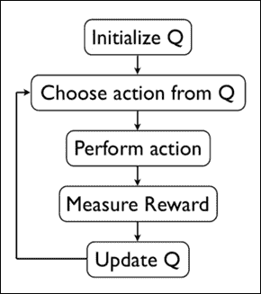
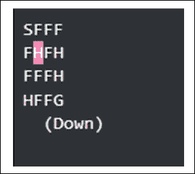

# Q-Learning 算法

解决 RL 问题需要在学习过程中估计评估函数。该函数必须能够通过奖励的总和来评估策略的成功。

Q-Learning 的基本思想是算法学习整个状态和动作空间的最优评估函数（`S×A`）。这种所谓的`Q`函数以`Q: S×A -> R`的形式提供匹配，其中`R`是在状态`s ∈ S`中执行的动作`a ∈ A`的未来奖励的期望值。一旦智能体学会了最佳函数`Q`，它就能够识别哪种行为将导致某种状态下最高的未来奖励。

实现 Q-Learning 算法的最常用示例之一涉及使用表。该表的每个单元格是值`Q(s; a) = R`并且它被初始化为 0.由智能体执行的动作`a ∈ A`是使用相对于 Qε-greedy 的策略来选择的。

Q-Learning 算法的基本思想是训练规则，它更新表格元素`Q(s; a) = R`。

该算法遵循以下基本步骤：

1.  任意初始化`Q(s; a) = R`。
2.  对每个剧集重复以下：
    1.  初始化`s`。
    2.  重复（对于剧集的每一步）：
    3.  使用从`Q`派生的策略从`s ∈ S`中选择一个动作`a ∈ A`。
    4.  选取动作`a`，观察`r`，`s'`： 
    
        ```
        Q(s; a) <= Q(s; a) + a · (r + γ · max Q(s'; a) - Q(s; a))
        s': s <- s'
        ```

    5.  继续直到`s`终点。

我们在下图中描述了算法：



图 2：Q-Learning 算法

让我们总结一下 Q 值更新过程中使用的参数：

*   `α`是学习率，设置在 0 和 1 之间。将其设置为 0 意味着 Q 值永远不会更新，因此不会学习任何内容。设置较高的值（如 0.9）意味着可以快速进行学习。
*   `γ`是折扣因子，设置在 0 和 1 之间。这模拟了未来奖励的价值低于直接奖励的事实。在数学上，需要将折扣因子设置为小于 1 以使算法收敛。
*   `max Q(s'; a)`是在当前状态之后的状态下可获得的最大奖励，即之后采取最佳行动的奖励。

## FrozenLake 环境

智能体控制角色在 4×4 网格世界中的移动。网格的一些瓷砖是可行走的，而其他瓷砖则导致落入水中。另外，智能体的移动方向是不确定的，并且仅部分地取决于所选择的方向。智能体因找到目标图块的可行走路径而获得奖励：



图 3：Frozen-Lake v0 网格字的表示

使用如下网格描述上面所示的表面：

```py
SFFF   (S: starting point, safe)
FHFH   (F: frozensurface, safe)
FFFH   (H: hole, fall to yourdoom)
HFFG   (G: goal, where the frisbee islocated)
```

当我们到达目标或陷入一个洞时，这一集结束。如果达到目标，我们会收到`1`的奖励，否则会收到`0`。

针对 FrozenLake 问题的 Q-Learning

在为高度结构化数据提供良好功能方面，神经网络非常强大。

为了解决 FrozenLake 问题，我们将构建一个单层网络，该网络采用[1×16]向量中编码的状态并学习最佳移动（动作），在向量中映射可能的动作长度为四。

以下实现基于 TensorFlow：

首先，我们需要导入所有库：

```py
import gym
import numpy as np
import random
import tensorflow as tf
import matplotlib.pyplot as plt
```

然后我们加载并设置环境以进行测试：

```py
env = gym.make('FrozenLake-v0')
```

输入网络是一种状态，以张量形状[1,16]编码。因此，我们定义了 input1 占位符：

```py
inputs1 = tf.placeholder(shape=[1,16],dtype=tf.float32)
```

网络权重最初由`tf.random_uniform`函数随机选择：

```py
W = tf.Variable(tf.random_uniform([16,4],0,0.01))
```

网络输出由`inputs1`占位符和权重的乘积给出：

```py
Qout = tf.matmul(inputs1,W)
```

在`Qout`上评估的`argmax`将给出预测值：

```py
predict = tf.argmax(Qout,1)
```

最佳动作（`nextQ`）以张量形状编码[1,4]：

```py
nextQ = tf.placeholder(shape=[1,4],dtype=tf.float32)
```

接下来，我们定义一个损失函数来实现反向传播过程。

损失函数是`loss = ∑(Q - target - Q)`，其中计算当前预测的 Q 值和目标值之间的差异，并且梯度通过网络传递：

```py
loss = tf.reduce_sum(tf.square(nextQ - Qout))
```

优化函数是众所周知的`GradientDescentOptimizer`：

```py
trainer = tf.train.GradientDescentOptimizer(learning_rate=0.1)
updateModel = trainer.minimize(loss)
```

重置并初始化计算图：

```py
tf.reset_default_graph()
init = tf.global_variables_initializer()
```

然后我们设置 Q-Learning 训练过程的参数：

```py
y = .99
e = 0.1
num_episodes = 6000

jList = []
rList = []
```

我们定义会话`sess`，其中网络必须学习最佳的移动顺序：

```py
with tf.Session() as sess:
    sess.run(init)
    for i in range(num_episodes):
        s = env.reset()
        rAll = 0
        d = False
        j = 0

        while j < 99:
            j+=1
```

输入状态用于为网络提供信息：

```py
            a,allQ = sess.run([predict,Qout],\
                              feed_dict=\
                              {inputs1:np.identity(16)[s:s+1]})
```

从输出张量`a`中选择一个随机状态：

```py
            if np.random.rand(1) < e:
                a[0] = env.action_space.sample()
```

使用`env.step()`函数评估`a[0]`动作，获得奖励，`r`和状态，`s1`：

```py
                     s1,r,d,_ = env.step(a[0])
```

新状态`s1`用于更新 Q 张量：

```py
            Q1 = sess.run(Qout,feed_dict=\
                          {inputs1:np.identity(16)[s1:s1+1]})
            maxQ1 = np.max(Q1)
            targetQ = allQ
            targetQ[0,a[0]] = r + y*maxQ1
```

当然，必须为反向传播过程更新权重：

```py
           _,W1 = sess.run([updateModel,W],\
                             feed_dict=\
                           {inputs1:np.identity(16)[s:s+1],nextQ:targetQ})
```

`rAll`这里定义了会话期间获得的总奖励。让我们回想一下，RL 智能体的目标是最大化它从长远来看所获得的总奖励：

```py
rAll += r
```

更新下一步的环境状态：

```py
          s = s1
           if d == True:
                e = 1./((i/50) + 10)
                break
   jList.append(j)
   rList.append(rAll)
```

计算结束时，将显示成功剧集的百分比：

```py
print ("Percent of successfulepisodes: " +\
str(sum(rList)/num_episodes) + "%")
```

如果我们运行模型，我们应该得到这样的结果，可以通过调整网络参数来改进：

```py
>>>[2017-01-15 16:56:01,048] Making new env: FrozenLake-v0
Percentage of successful episodes: 0.558%
```