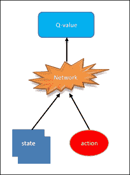
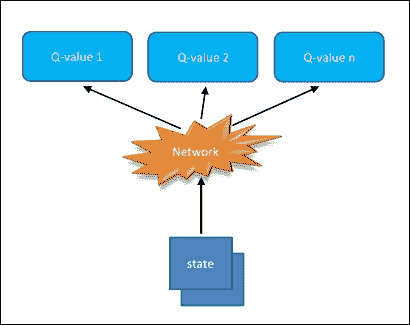
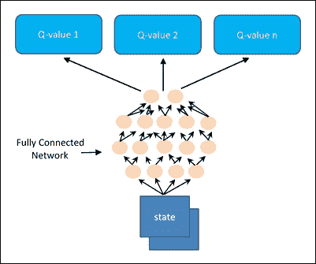
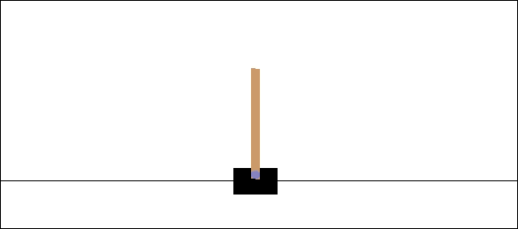
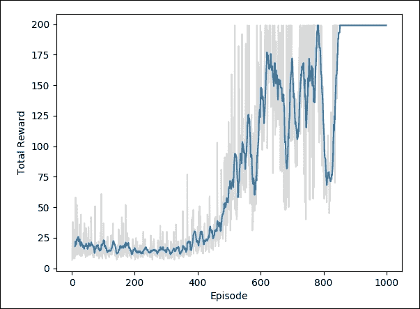

# 深度 Q 学习

多亏了 DeepMind 在 2013 年和 2016 年取得的近期成就，它成功地在 Atari 游戏中达到了所谓的超人级别，并击败了世界冠军 Go，RL 在机器学习社区中变得非常有趣。这种新的兴趣也是由于深度神经网络（DNN）表现为近似函数，使这种算法的潜在价值达到了更高的水平。最近获得最多兴趣的算法肯定是深度 Q-Learning。以下部分介绍深度 Q-Learning 算法，并讨论一些优化技术以最大化其表现。

## 深度 Q 神经网络

当状态数和可能的动作增加并且从矩阵的角度来看变得难以管理时，Q 学习基础算法会引起巨大的问题。想想谷歌使用的结构输入配置，以达到 Atari 游戏的表现水平。州空间是离散的，但国家的数量是巨大的。这就是深度学习的步骤。神经网络非常擅长为高度结构化的数据提供良好的功能。事实上，我们可以用神经网络识别 Q 函数，它将状态和动作作为输入并输出相应的 Q 值：

Q（状态;行动）=价值

深度神经网络最常见的实现如下图所示：



图 4：Deep Q 神经网络的通用实现

或者，  可以将状态作为输入，并为每个可能的动作生成相应的值：

Q（状态）=每个可能操作的值

这个优化的实现可以在下图中看到：



图 5：Deep Q 神经网络的优化实现

最后的方法在计算上是有利的，因为要更新 Q 值（或选择最高的 Q 值），我们只需要通过网络向前迈出一步，我们将立即获得所有可用操作的所有 Q 值。

## Cart-Pole 问题

我们将建立一个深度神经网络，可以学习通过 RL 玩游戏。更具体地说，我们将使用深度 Q 学习训练智能体玩 Cart-Pole 游戏。

在这个游戏中，  自由摆动杆连接到推车。推车可以向左和向右移动，目标是尽可能长时间保持杆直立：


图 6：Cart-Pole

我们使用 OpenAI Gym 模拟这个游戏。我们需要导入所需的库：

```py
import gym
import tensorflow as tf
import numpy as np
import time
```

让我们创建 Cart-Pole 游戏环境：

```py
env = gym.make('CartPole-v0')
```

初始化环境，奖励列表和开始时间：

```py
env.reset()
rewards = []
tic = time.time()
```

这里使用`env.render()`语句来显示运行模拟的窗口：

```py
for _ in range(1000):
    env.render()
```

`env.action_space.sample()`被传递给`env.step()`语句以构建模拟的下一步：

```py
    state, reward, done, info = \
           env.step\
           (env.action_space.sample())
```

在  Cart-Pole 游戏中，有两种可能的动作：向左或向右移动  。因此，我们可以采取两种操作，编码为 0 和 1。

在这里，我们采取随机行动：

```py
    rewards.append(reward)
    if done:
        rewards = []
        env.reset()
toc = time.time()
```

10 秒后，模拟结束：

```py
if toc-tic > 10:
    env.close()
```

要关闭显示模拟的窗口，请使用`env.close()`。

当我们运行模拟时，我们有一个奖励列表，如下所示：

```py
[1.0, 1.0, 1.0, 1.0, 1.0, 1.0, 1.0, 1.0, 1.0, 1.0, 1.0, 1.0, 1.0, 1.0, 1.0, 1.0, 1.0, 1.0, 1.0]
```

在极点超过一定角度后，游戏重置。对于正在运行的每个帧，模拟返回 1.0 的奖励。游戏运行的时间越长，获得的奖励就越多。因此，我们的网络的目标是通过保持杆垂直来最大化奖励。它将通过向左和向右移动推车来完成此操作。

### 针对 Cart-Pole 问题的深度 Q 网络

我们使用 Bellman 方程再次训练我们的  Q 学习智能体：


这里，s 是状态，a 是动作，s'是状态 s 和动作 a 的下一个状态。

之前，我们使用这个等式来学习 Q 表的值  。但是，这个游戏有很多州可供使用。状态有四个值：推车的位置和速度，以及杆的位置和速度。这些都是实数值，所以如果我们忽略浮点精度，我们实际上有无限状态。然后，我们将用一个近似于 Q 表查找功能的神经网络替换它，而不是使用表格。

通过将状态传递到网络来计算 Q 值，而输出将是每个可用动作的 Q 值，具有完全连接的隐藏层：



图 7：深度 Q-Learning

在这个 Cart-Pole 游戏中，我们有四个输入，一个用于状态中的每个值;和两个输出，每个动作一个。网络权重更新将通过选择动作并使用所选动作模拟游戏来进行。这将把我们带到下一个州然后再到奖励。

以下是用于解决 Cart-Pole 问题的神经网络的简短代码片段：

```py
import tensorflow as tf
class DQNetwork:
    def __init__(self,\
                 learning_rate=0.01, \
                 state_size=4,\
                 action_size=2, \
                 hidden_size=10,\
                 name='DQNetwork'):
```

隐藏层由两个完全连接的层组成，具有 ReLU 激活：

```py
            self.fc1 =tf.contrib.layers.fully_connected\
                       (self.inputs_,\
                        hidden_size)
            self.fc2 = tf.contrib.layers.fully_connected\
                       (self.fc1,\
                        hidden_size)
```

输出层是线性输出层：

```py
            self.output = tf.contrib.layers.fully_connected\
                          (self.fc2,\
                           action_size,activation_fn=None)
```

### 经验重放方法

近似函数可能会受到非独立且相同分布和非平稳数据（状态之间的相关性）的影响。

使用 Experience Replay 方法可以克服这种问题。

在智能体和环境之间的交互过程中，所有体验（`state`，`action`，`reward`和`next_state`）都保存在重放内存中，这是固定大小的内存并以先进先出（以先进先出的方式运行） FIFO）。

这是重放内存类的实现：

```py
from collections import deque
import numpy as np

class replayMemory():
    def __init__(self, max_size = 1000):
        self.buffer = \
                    deque(maxlen=max_size)

    def build(self, experience):
        self.buffer.append(experience)

    def sample(self, batch_size):
        idx = np.random.choice\
              (np.arange(len(self.buffer)), 
                               size=batch_size, 
                               replace=False)
        return [self.buffer[ii] for ii in idx]
```

这将允许在网络训练期间使用在重放存储器中随机获取的小批量经验，而不是一个接一个地使用最近的经验。

使用体验重放方法有助于缓解顺序训练数据的问题，这可能导致算法保持在局部最小值，从而使其无法获得最佳解决方案。

### 利用和探索

每当智能体必须选择要采取的行动时，它基本上有两种方式可以执行其策略。第一种模式称为利用，包括根据目前获得的信息，即过去和存储的经验，做出最佳决策。此信息始终作为值函数提供，该函数表示哪个操作为每个状态 - 操作对提供最大的最终累积回报。

第二种模式称为探索，它是一种决策策略，不同于目前认为最优的策略。

探索阶段非常重要，因为它用于收集未探测状态的信息。实际上，只有执行最佳操作的智能体才有可能始终遵循相同的操作顺序，而没有机会探索并发现可能存在从长远来看可能导致的策略更好的结果，即使这意味着立即获得的收益更低。

最常用于在利用和探索之间达成正确妥协的策略是贪婪的策略。它代表了一种选择动作的方法，基于使用均匀概率分布来选择随机动作的可能性。

### Deep Q-Learning 训练算法

让我们看看如何构建一个深度 Q-Learning 算法来解决 Cart-Pole 问题。

该项目相当复杂。为此原因。它已被细分为几个文件模块：

*   `DQNetwork.py`：实现深度神经网络
*   `memory.py`：实现体验重放方法
*   `start_simulation.py`：创建我们想要解决的 Cart-Pole 环境
*   `solve_cart_pole.py`：用经过训练的神经网络解决 Cart-Pole 环境
*   `plot_result_DQN.py`：绘制最后的奖励与剧集
*   `deepQlearning.py`：主程序

以下命令提供了`deepQlearning.py`文件实现的简要说明：

```py
import tensorflow as tf
import gym
import numpy as np
import time
import os
from create_cart_pole_env import *
from DQNetwork import *
from memory import *
from solve_cart_pole import *
from plot_result_DQN import *
```

接下来要做的是定义用于此实现的超参数，因此我们需要定义要学习的最大剧集数，一集中的最大步数以及未来的奖励折扣：

```py
train_episodes = 1000
max_steps = 200
gamma = 0.99
```

探索参数是探索开始时的探索概率，最小探索概率和探索概率的指数衰减率：

```py
explore_start = 1.0
explore_stop = 0.01
decay_rate = 0.0001 
```

网络参数是每个隐藏 Q 网络层中的单元数和 Q 网络学习率：

```py
hidden_size = 64
learning_rate = 0.0001
```

定义以下内存参数：

```py
memory_size = 10000             
batch_size = 20 
```

然后我们有大量的经验来预先记录内存：

```py
pretrain_length = batch_size
```

现在我们可以创建环境并启动 Cart-Pole 模拟：

```py
env = gym.make('CartPole-v0')
start_simulation(env)
```

接下来，我们使用`hidden_size`和`learning_rate`超参数实例化 DNN：

```py
tf.reset_default_graph()
deepQN = DQNetwork(name='main', hidden_size=64, \
                  learning_rate=0.0001)
```

最后，我们重新初始化模拟：

```py
env.reset()
```

让我们采取随机步骤，从中我们可以获得状态和奖励：

```py
state, rew, done, _ = env.step(env.action_space.sample())
```

实例化`replayMemory`对象以实现体验重放方法：

```py
memory = replayMemory(max_size=10000)
```

使用`memory.build`方法获取随机动作的块，来存储相对经验，状态和动作：

```py
pretrain_length= 20

for j in range(pretrain_length):
    action = env.action_space.sample()
    next_state, rew, done, _ = \
                env.step(env.action_space.sample())
    if done:
        env.reset()
        memory.build((state,\
                      action,\
                      rew,\
                      np.zeros(state.shape)))
        state, rew, done, _ = \
               env.step(env.action_space.sample())
    else:
        memory.build((state, action, rew, next_state))
        state = next_state
```

通过获得的新经验，我们可以进行神​​经网络的训练：

```py
rew_list = []
train_episodes = 100
max_steps=200

with tf.Session() as sess:
    sess.run(tf.global_variables_initializer())
    step = 0
    for ep in range(1, train_episodes):
        tot_rew = 0
        t = 0
        while t < max_steps:
            step += 1
            explore_p = stop_exp + (start_exp - stop_exp)*\
                        np.exp(-decay_rate*step)

            if explore_p > np.random.rand():
                action = env.action_space.sample()

            else:
```

然后我们计算 Q 状态：

```py
                Qs = sess.run(deepQN.output, \
                              feed_dict={deepQN.inputs_: \
                                         state.reshape\
                                         ((1, *state.shape))})
```

我们现在可以获得动作：

```py
                action = np.argmax(Qs)

            next_state, rew, done, _ = env.step(action)
            tot_rew += rew

            if done:
                next_state = np.zeros(state.shape)
                t = max_steps

                print('Episode: {}'.format(ep),
                      'Total rew: {}'.format(tot_rew),
                      'Training loss: {:.4f}'.format(loss),
                      'Explore P: {:.4f}'.format(explore_p))

                rew_list.append((ep, tot_rew))
                memory.build((state, action, rew, next_state))
                env.reset()
                state, rew, done, _ = env.step\
                                         (env.action_space.sample())

            else:
                memory.build((state, action, rew, next_state))
                state = next_state
                t += 1

            batch_size = pretrain_length               
            states = np.array([item[0] for item \
                               in memory.sample(batch_size)])
            actions = np.array([item[1] for item \
                                in memory.sample(batch_size)])
            rews = np.array([item[2] for item in \
                             memory.sample(batch_size)])
            next_states = np.array([item[3] for item\
                                    in memory.sample(batch_size)])
```

最后，我们开始训练智能体。训练很慢，因为它渲染的帧比网络可以训练的慢：

```py
 target_Qs = sess.run(deepQN.output, \
                                 feed_dict=\
                                 {deepQN.inputs_: next_states})

            target_Qs[(next_states == \
                       np.zeros(states[0].shape))\
                      .all(axis=1)] = (0, 0)

            targets = rews + 0.99 * np.max(target_Qs, axis=1)

            loss, _ = sess.run([deepQN.loss, deepQN.opt],
                                feed_dict={deepQN.inputs_: states,
                                           deepQN.targetQs_: targets,
                                           deepQN.actions_: actions})

 env = gym.make('CartPole-v0')
```

要测试模型，我们调用以下函数：

```py
 solve_cart_pole(env,deepQN,state,sess)

 plot_result(rew_list)
```

这里是用于测试购物车杆问题的神经网络实现：

```py
import numpy as np

def solve_cart_pole(env,dQN,state,sess):
    test_episodes = 10
    test_max_steps = 400
    env.reset()
    for ep in range(1, test_episodes):
        t = 0
        while t < test_max_steps:
            env.render() 
            Qs = sess.run(dQN.output, \
                          feed_dict={dQN.inputs_: state.reshape\
                                     ((1, *state.shape))})
            action = np.argmax(Qs)
            next_state, reward, done, _ = env.step(action)

            if done:
                t = test_max_steps
                env.reset()
                state, reward, done, _ =    

                               env.step(env.action_space.sample())

            else:
                state = next_state
                t += 1     
```

最后，如果我们运行`deepQlearning.py`脚本，我们应该得到这样的结果：

```py
[2017-12-03 10:20:43,915] Making new env: CartPole-v0
[]
Episode: 1 Total reward: 7.0 Training loss: 1.1949 Explore P: 0.9993
Episode: 2 Total reward: 21.0 Training loss: 1.1786 Explore P: 0.9972
Episode: 3 Total reward: 38.0 Training loss: 1.1868 Explore P: 0.9935
Episode: 4 Total reward: 8.0 Training loss: 1.3752 Explore P: 0.9927
Episode: 5 Total reward: 9.0 Training loss: 1.6286 Explore P: 0.9918
Episode: 6 Total reward: 32.0 Training loss: 1.4313 Explore P: 0.9887
Episode: 7 Total reward: 19.0 Training loss: 1.2806 Explore P: 0.9868
……
Episode: 581 Total reward: 47.0 Training loss: 0.9959 Explore P: 0.1844
Episode: 582 Total reward: 133.0 Training loss: 21.3187 Explore P: 0.1821
Episode: 583 Total reward: 54.0 Training loss: 42.5041 Explore P: 0.1812
Episode: 584 Total reward: 95.0 Training loss: 1.5211 Explore P: 0.1795
Episode: 585 Total reward: 52.0 Training loss: 1.3615 Explore P: 0.1787
Episode: 586 Total reward: 78.0 Training loss: 1.1606 Explore P: 0.1774
…….
Episode: 984 Total reward: 199.0 Training loss: 0.2630 Explore P: 0.0103
Episode: 985 Total reward: 199.0 Training loss: 0.3037 Explore P: 0.0103
Episode: 986 Total reward: 199.0 Training loss: 256.8498 Explore P: 0.0103
Episode: 987 Total reward: 199.0 Training loss: 0.2177 Explore P: 0.0103
Episode: 988 Total reward: 199.0 Training loss: 0.3051 Explore P: 0.0103
Episode: 989 Total reward: 199.0 Training loss: 218.1568 Explore P: 0.0103
Episode: 990 Total reward: 199.0 Training loss: 0.1679 Explore P: 0.0103
Episode: 991 Total reward: 199.0 Training loss: 0.2048 Explore P: 0.0103
Episode: 992 Total reward: 199.0 Training loss: 0.4215 Explore P: 0.0102
Episode: 993 Total reward: 199.0 Training loss: 0.2133 Explore P: 0.0102
Episode: 994 Total reward: 199.0 Training loss: 0.1836 Explore P: 0.0102
Episode: 995 Total reward: 199.0 Training loss: 0.1656 Explore P: 0.0102
Episode: 996 Total reward: 199.0 Training loss: 0.2620 Explore P: 0.0102
Episode: 997 Total reward: 199.0 Training loss: 0.2358 Explore P: 0.0102
Episode: 998 Total reward: 199.0 Training loss: 0.4601 Explore P: 0.0102
Episode: 999 Total reward: 199.0 Training loss: 0.2845 Explore P: 0.0102
[2017-12-03 10:23:43,770] Making new env: CartPole-v0
>>>
```

随着训练损失减少，总奖励增加。

在测试期间，推车杆完美平衡：



图 8：解决了 Cart-Pole 问题

为了可视化训练，我们使用了`plot_result()`函数（它在`plot_result_DQN.py`函数中定义）。

`plot_result()`函数绘制每集的总奖励：

```py
def plot_result(rew_list):
    eps, rews = np.array(rew_list).T
    smoothed_rews = running_mean(rews, 10)
    smoothed_rews = running_mean(rews, 10)  
    plt.plot(eps[-len(smoothed_rews):], smoothed_rews)
    plt.plot(eps, rews, color='grey', alpha=0.3)
    plt.xlabel('Episode')
    plt.ylabel('Total Reward')
    plt.show()
```

以下绘图显示,每个事件的总奖励随着智能体改进其对价值函数的估计而增加：

