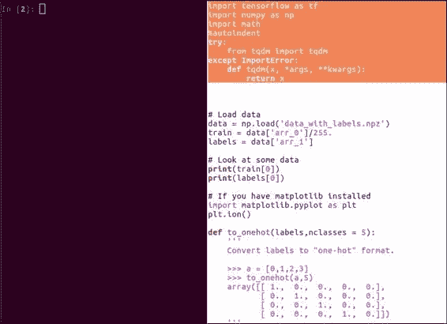

# 多隐藏层模型

在本节中，我们将向您展示如何使用其他隐藏层构建更复杂的模型。 我们将单层隐藏模型改编为称为深度神经网络的多层模型。 然后，我们将讨论选择要使用的神经元和层数。 最后，我们将耐心地训练模型本身，因为这可能需要一段时间才能计算出来。

还记得我们向逻辑回归模型添加神经元的隐藏层吗？ 好了，我们可以再做一次，在我们的单个隐藏层模型中添加另一层。 一旦您拥有一层以上的神经元，我们就将其称为深度神经网络。 但是，您以前所学的一切都可以立即应用。 与本章前面的部分一样，您应该进行一个全新的 Python 会话并执行本部分代码文件中直到`num_hidden1`的代码。 然后，乐趣开始了。



## 探索多隐藏层模型

首先，将旧的`num_hidden`更改为`num_hidden1`，以指示第一个隐藏层上的神经元数量：

```py
# Hidden layer 1
num_hidden1 = 128
```

确保更改变量，同时定义权重和偏差变量。 现在，我们将插入第二个隐藏层：

```py
W1 = tf.Variable(tf.truncated_normal([1296,num_hidden1],
                               stddev=1./math.sqrt(1296)))
b1 = tf.Variable(tf.constant(0.1,shape=[num_hidden1]))
h1 = tf.sigmoid(tf.matmul(x,W1) + b1)
```

这次使用带有`32`神经元的神经元。 请注意，权重的形状必须如何解释来自上一层的 128 个中间输出中的每一个进入当前层的 32 个输入或神经元，但是我们初始化权重和偏差的方式基本上相同：

```py
# Hidden Layer 2
num_hidden2 = 32
W2 = tf.Variable(tf.truncated_normal([num_hidden1,
            num_hidden2],stddev=2./math.sqrt(num_hidden1)))
b2 = tf.Variable(tf.constant(0.2,shape=[num_hidden2]))
h2 = tf.sigmoid(tf.matmul(h1,W2) + b2)
```

如您在前面的代码中所见，我们像以前一样使用`sigmoid`函数创建`h2`输出，并使用矩阵乘法，加法和函数调用。

对于输出逻辑回归层，我们只需要更新变量名称：

```py
# Output Layer
W3 = tf.Variable(tf.truncated_normal([num_hidden2, 5],
                                   stddev=1./math.sqrt(5)))
b3 = tf.Variable(tf.constant(0.1,shape=[5]))
```

现在这是第三组权重，当然，此形状必须与前面的隐藏层的输出匹配，因此 32 x 5：


不要忘记使用`h2`，`W3`和`b3`变量更新`y`模型函数。 您不想只使用旧模型就更新所有代码。

您可能想知道我们如何决定第一层的 128 个神经元和第二层的 32 个神经元。 事实是，为网络确定合适的尺寸和形状可能是一个具有挑战性的问题。 尽管计算可能会很昂贵，但是反复试验是开发模型的一种方法。 通常，您可能会从旧模型开始并从那里开始工作。 在这里，我们从 128 个神经元的单个隐藏层开始，然后尝试在其下添加一个新层。 我们要计算一些特征以区分五类，因此在选择神经元数量时应牢记这一点。

通常，最好从小处着手，逐步发展到解释数据的最小模型。 如果在顶层具有 128 个神经元而在下一层具有 8 个神经元的模型的效果较差，则可能表明我们需要为最后一层提供更多特征，并应添加更多而不是更少的神经元。

尝试将最后一层中的神经元数量加倍，当然，最好回到较早的层并调整那里的神经元数量。 同样，您可以更改优化器的学习率，从而改变每一步调整权重的程度，甚至更改用于优化的函数。

### 注意

设置所有这些值称为超参数优化，这是机器学习研究中的热门话题。

请注意，我们实际上是从最简单的模型，逻辑回归开始，然后慢慢添加新的功能和结构。 如果一个简单的模型运行良好，那么甚至没有必要花时间在更高级的东西上。

现在已经指定了我们的模型，让我们实际进行训练：

```py
# Climb on cross-entropy
cross_entropy = tf.reduce_mean(
     tf.nn.softmax_cross_entropy_with_logits(logits= y + 1e-50, labels= y_))

# How we train
train_step = tf.train.GradientDescentOptimizer(0.01).minimize(cross_entropy)

# Define accuracy
correct_prediction = tf.equal(tf.argmax(y,1),tf.argmax(y_,1))
accuracy=tf.reduce_mean(tf.cast(correct_prediction, "float"))
```

同样，我们需要在 T​​ensorFlow 图中重新定义我们的训练节点，但是这些与以前完全相同。 请注意，由于我们的第一个隐藏层现在挂接到神经元的另一层，因此我们需要计算更多的权重。 以下是实际的训练代码：

```py
epochs = 25000
train_acc = np.zeros(epochs//10)
test_acc = np.zeros(epochs//10)
for i in tqdm(range(epochs)):
    # Record summary data, and the accuracy
    if i % 10 == 0:
        # Check accuracy on train set
        A = accuracy.eval(feed_dict={
            x: train.reshape([-1,1296]),
            y_: onehot_train})
        train_acc[i//10] = A
        # And now the validation set
        A = accuracy.eval(feed_dict={
            x: test.reshape([-1,1296]),
            y_: onehot_test})
        test_acc[i//10] = A
    train_step.run(feed_dict={
        x: train.reshape([-1,1296]),
        y_: onehot_train})
```

以前，我们有 128 乘以 5 的权重，但是现在我们有 128 乘以 32 的权重-这是该层的六倍，这是从像素到神经元第一层的初始权重之上。 深度神经网络的一个缺点是它们可能需要一段时间才能训练。 在这里，我们将运行`25000`个周期，以确保权重收敛：


这可能需要一个小时或更长时间，具体取决于您的计算机和 GPU。 尽管这看起来似乎过多，但专业的机器学习研究人员通常会训练模型长达两个星期。 您可能会学得很快，但是计算机需要一些时间。

在本节中，我们使用 TensorFlow 构建并训练了一个真正的深度神经网络。 许多专业的机器学习模型没有您已经编写的复杂。