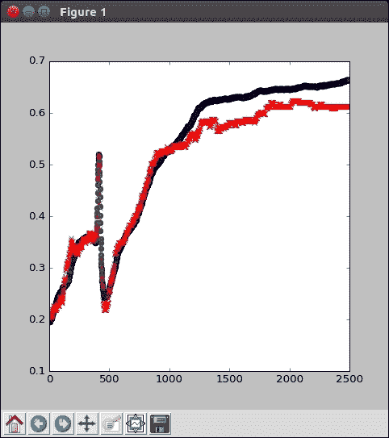
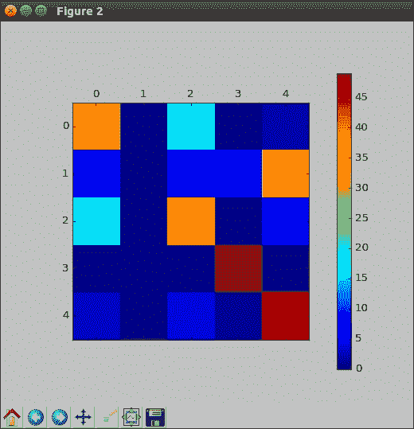
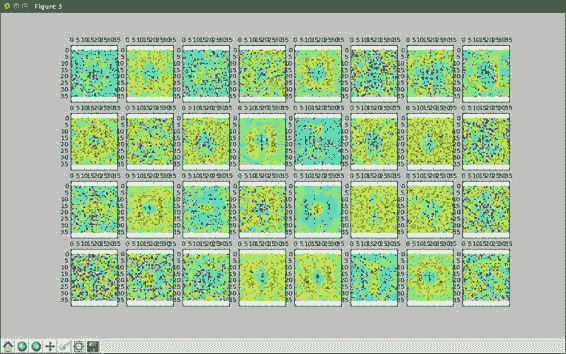

# 多隐藏层的结果

现在，我们将研究深度神经网络内部的情况。 首先，我们将验证模型的准确率。 然后，我们将可视化并研究像素权重。 最后，我们还将查看输出权重。

训练完您的深度神经网络后，让我们看一下模型的准确率。 我们将以与单隐藏层模型相同的方式进行操作。 这次的唯一区别是，从更多的周期开始，我们保存了更多的训练和测试准确率样本。

和往常一样，如果您没有 Matplotlib，请不要担心。 打印数组的一部分很好。

## 了解多隐藏层图

执行以下代码以查看结果：

```py
# Plot the accuracy curves
plt.figure(figsize=(6,6))
plt.plot(train_acc,'bo')
plt.plot(test_acc,'rx')
```



从前面的输出图中，我们可以达到约 68％的训练精度，也许还有 63％的验证精度。 这还不错，但是确实留出了一些改进的空间。

让我们花点时间看一下准确率在许多周期如何增长。 当然，它起步非常糟糕，并且存在一些最初的麻烦，但是权重是随机的，并且在那个时候仍在学习，并且在最初的数千个周期中它很快得到了改善。 虽然可能会暂时卡在局部最大值中，但通常会爬出并最终减慢其重音。 请注意，它仍然可以很好地进入训练阶段。 只是到了尽头，模型才可能达到其最大容量。 根据随机初始化，您的曲线可能看起来有些不同，但这没关系； 这是您的模型，非常好。

要查看我们的模型在哪里出现问题，让我们看一下混淆矩阵：

```py
pred = np.argmax(y.eval(feed_dict={x:
    test.reshape([-1,1296]), y_: onehot_test}), axis = 1)
conf = np.zeros([5,5])
for p,t in zip(pred,np.argmax(onehot_test,axis=1)):
    conf[t,p] += 1

plt.matshow(conf)
plt.colorbar()
```

同样，这与我们用于单个隐藏层模型的过程完全相同，只是在更高级的方面：



对此进行绘图，就像在前面的输出中一样，我们看到该模型总体上运行良好，但是仍然难以识别其中一个类，这次是`1`。 我们正在逐步取得进展。 验证准确率之后，让我们检查一下我们的第一层神经元，即 128 个人，发现了什么样的现象：

```py
# Let's look at a subplot of some weights
f, plts = plt.subplots(4,8, sharex=True)
for i in range(32):
    plts[i//8, i%8].matshow(W1.eval()[:,i].reshape([36,36]))
```

为了简单起见，我们仅查看前 32 个此类神经元。 使用与先前模型相同的代码，可以轻松地使用 Matplotlib 进行绘制或打印出来：



毫不奇怪，我们看到了许多与先前模型相同的函数。 尽管在这里，由于随机初始化，即使它们看起来像是同一类型的特征，它们也会位于不同的位置。 同样，您有一些环形神经元，具有非常条纹状特征的神经元，以及具有宽条纹状特征的另一个神经元。 就我们的神经网络而言，圆形和条纹形状是确定字体类别的良好成分。

尽管我们其他隐藏层中的权重不再具有图像的结构，但查看输出的权重可能会很有帮助。 这将告诉我们每个最终神经元对每个类别的贡献。 我们可以将其绘制为热力图，或使用`W3.eval`任意方式打印单个数组：

```py
# Examine the output weights
plt.matshow(W3.eval())
plt.colorbar()
```

因为我们仔细指定了`W3`，所以每一行将代表一个神经元，每一列将代表一个类：


从前面的输出图中我们可以看到，不同的神经元对某些类别的贡献要大于其他类别，这表明神经元正在计算的某些总体非线性特征与该特定字体类别有关。 也就是说，虽然这些神经元产生的值用于计算每种字体的分数，但非常重要且权重较大的一种字体的神经元可能与另一种字体几乎无关。 例如，对于`2`类，`N1`神经元的权重非常大，而对于所有其他类别，`N1`神经元的权重几乎为零。 该神经元具有什么计算特征，对于`2`类而言非常重要，但对于其他类别而言则没有那么重要。