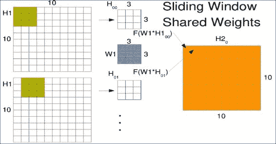
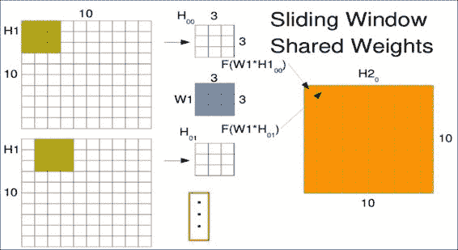
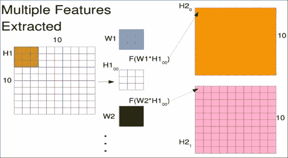

# 卷积层动机

在本节中，我们将逐步使用示例图像上的卷积层。 我们将以图形方式看到卷积只是一个滑动窗口。 此外，我们将学习如何从窗口中提取多个特征以及如何接受到窗口的多层输入。

在给定神经元的神经网络的经典密集层中，每个输入特征都具有自己的权重。

如果输入特征完全独立并测量不同的事物，那么这很好，但是如果特征之间存在结构，那该怎么办。 想象发生这种情况的最简单示例是，如果您的输入特征是图像中的像素。 一些像素彼此相邻，而其他像素则相距较远。

对于诸如图像分类（尤其是字体分类）之类的任务，图像中出现小比例尺特征通常并不重要。 我们可以通过在整个图像中滑动较小的窗口来在较大的图像中查找小比例尺特征，这对于使用相同的权重矩阵至关重要，无论该窗口在图像中的位置如何。 这样，我们可以随时随地寻找相同的特征。

假设我们有一个 10x10 的图像，并且想在其中滑动 3x3 的窗口。 通常，机器学习工程师每次只能将此窗口滑动一个像素。 这称为跨步，因此从一个窗口到下一个窗口会有一些重叠。 然后逐个元素地将我们小的 3x3 权重矩阵`W1`乘到我们的窗口`H1[00]`中，对结果求和，并通过称为`F`的激活函数进行处理。

第一个窗口`W1`进入新矩阵的第一个位置，如右图`H2`所示。 窗口以相同的权重滑过一个，但结果占据第二个位置。 请注意，我们实际上是使用左上像素作为存储结果的参考点。 在整个输入图像上滑动窗口以生成卷积输出。 下图中的点只是提醒您，您将在整个空间中滑动此窗口，而不仅是图中所示的两个位置：

您可能想知道当窗口到达图像边缘时会发生什么。 选择实际上是在忽略超出边缘的窗口和使用占位符值填充窗口之间。 对于卷积层，通常的选择是经常用零或平均值填充它们。 由于卷积的输出形状保持不变，因此在 Tensorflow 中被称为相同的填充。

请注意，在最后一个窗口中，这实际上只是看一个值。 但是该像素还参与了许多其他位置，因此不要觉得它被排除在外了。

## 提取多个特征

上一节介绍了滑动窗口的一组权重。 这实际上使您可以计算滑动特征。 但是您可能想要在同一窗口中查找多个对象，例如垂直或水平边缘。

要提取多个特征，您只需要将其他权重矩阵初始化为不同的值即可。 这些多组权重类似于其他神经元和紧密连接的层。 中心的每个权重矩阵`W1`（蓝色）和`W2`（绿色）将为您提供另一个输出矩阵，如下图所示，它们分别为`H2[1]`（粉红色）和`H2[0]`（橙色）。 正确的。

正如您可以从卷积中提取多个特征一样，也可以将多个特征放入这样的网络中。 最明显的例子是具有多种颜色的图像。

现在，观察上图中所示的矩阵。 您确实有一个红色值的矩阵，一个绿色值的矩阵和一个蓝色值的矩阵。 现在，您的权重矩阵实际上是大小为 3x3x3 的权重张量，并且在所有颜色上的窗口大小均相同。 当然，您可以组合所有这些方法，并且通常在计算完窗口上的 32 个特征后，尤其是在第一个卷积层之后进行； 现在，您有许多用于下一层的输入通道。