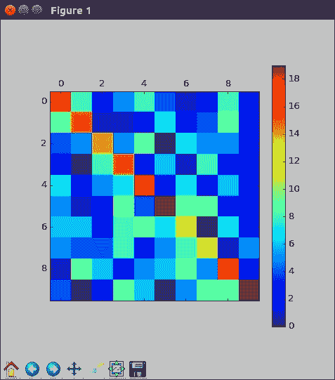

# 卷积层应用

现在让我们在 TensorFlow 中实现一个简单的卷积层。 首先，我们将遍历此示例中使用的显式形状，因为这通常很棘手。 然后，我们将完成实现和卷积的 TensorFlow 调用。 最后，我们将通过传递一个简单的示例图像直观地检查卷积的结果。

## 探索卷积层

让我们通过一个新的 IPython 会话直接进入代码。


这只是一个小例子，可以帮助我们熟悉将 TensorFlow 用于卷积层。

导入必要的工具后，让我们制作一个假的 10x10 图像，但对角线的值较大：

```py
# Make some fake data, 1 data points
image = np.random.randint(10,size=[1,10,10]) + np.eye(10)*10
```

请注意前面代码中指定的异常大小。 `10, 10`只是图像尺寸，但是`1`是指输入通道的数量。 在这种情况下，我们使用一个输入通道，就像一个灰度图像。 如果您有彩色图像，则这可能是代表红色，绿色和蓝色的三个通道。

尽管此处的示例和研究问题只有一个通道（灰度级），但我们将在 Deep CNN 部分中看到如何从卷积层产生多个输入，从而在下一个卷积层中产生多通道输入。 因此，您仍然会感觉如何处理。

向下移动到 TensorFlow 占位符，我们还做了一些看似不寻常的事情。

```py
x = tf.placeholder("float", [None, 10, 10])
x_im = tf.reshape(x, [-1,10,10,1])
```

在用`10, 10`和`None`自然地写入了占位符变量以用于可能的许多图像批量之后，我们将其称为`tf.reshape`。 这是为了重新排列图像的尺寸，并使它们具有 TensorFlow 期望的形状。 `-1`只是意味着根据需要填写尺寸以保持整体尺寸。 `10,10`当然是我们的图像尺寸，最后的`1`现在是通道数。 同样，如果您有一个带有三个通道的彩色图像，则为三个。

对于我们的卷积层示例，我们希望查看图像的三个像素高和三个像素宽的窗口。 因此，我们指定了以下代码所示的内容：

```py
# Window size to use, 3x3 here
winx = 3
winy = 3
```

另外，让我们从每个窗口中提取两个特征，这就是我们的过滤器数量：

```py
# How many features to compute on the window
num_filters = 2
```

您可能还会看到称为内核数量的信息。

指定权重是使事情真正有趣的地方，但是一旦您知道语法，这并不难。

```py
W1 = tf.Variable(tf.truncated_normal(
    [winx, winy,1, num_filters],
    stddev=1./math.sqrt(winx*winy)))
```

我们正在像以前一样使用`tf.truncated_normal`来生成随机权重。 但是大小非常特殊。 属性`winx`和`winy`当然是我们窗口的尺寸，`1`这里是输入通道的数量，因此只是灰度，而最终尺寸（`num_filters`）是输出尺寸，过滤器的数量。

同样，这类似于密集连接层的神经元数量。 对于随机性的标准差，我们仍然可以缩放到参数数量，但是请注意，每个权重都有一个参数，因此`win x*win y`。

当然，每个输出神经元的偏差都需要一个变量，因此每个滤波器需要一个变量：

```py
b1 = tf.Variable(tf.constant(
    0.1,shape=[num_filters]))
```

`tf.nn.conv2d`函数实际上是此处操作的核心。 我们首先传递调整后的输入`x_im`，然后传递应用于每个窗口的权重，然后传递`strides`参数。

### 注意

`strides`参数告诉 TensorFlow 每一步移动窗口多少。

卷积层的典型用法是向右移动一个像素，完成一行后，向下移动一个像素。 因此有很多重叠之处。 如果要向右移动两个像素，向下移动两个像素； 但是，您可以输入`strides=[1,2,2,1]`。 最后一个数字用于在通道上移动，第一个数字用于在一批中移动单独的图像。 将这些设置为`1`是最常见的方法。

```py
xw = tf.nn.conv2d(x_im, W1,
        strides=[1, 1, 1, 1],
        padding='SAME')
```

`padding='SAME'`与上一节完全相同。 这意味着即使部分滑动窗口超出了输入图像的范围，滑动窗口也会运行。 结合跨度为 1 的步长，这意味着卷积输出尺寸将与输入相同，当然不计算通道或滤波器的数量。

最后，我们要通过激活函数传递此卷积输出：

```py
h1 = tf.nn.relu(xw + b1)
```

在这里，我们使用`relu`函数，它代表整流线性。 基本上，这仅意味着将任何负输入设置为零，而将正输入保持不变。 您会看到这种激活常与卷积神经网络一起使用。 因此，熟悉它是一件好事。 由于我们已经乘以`W1`权重，因此我们只需要在此处添加偏置项即可产生卷积层输出。

在 TensorFlow 中初始化变量：

```py
# Remember to initialize!
sess.run(tf.global_variables_initializer())
```

现在，您有了一个有效的卷积。 太好了！ 让我们快速看一下我们劳动成果。

首先，我们需要评估`h1`节点，并将示例图像作为数据传递：

```py
# Peek inside
H = h1.eval(feed_dict = {x: image})
```

因此，我们知道从哪里开始，让我们使用以下代码查看示例图像：

```py
# Let's take a look
import matplotlib.pyplot as plt
plt.ion()

# Original
plt.matshow(image[0])
plt.colorbar()
```

前面代码中的`0`只是因为奇怪的整形，实际上并没有多个数据点。 您可以看到对角线上的值大于其他值，这与纯随机的区别在于：



让我们看一下第一个输出特征，回想一下输出`H`的形状为`1,10,10,2`，因为有`1`数据点，`10`像素的宽度和高度以及`2`特征。 因此，要抓住第一个，我们需要所有像素和零个带过滤器。 好吧，那很有趣。

```py
# Conv channel 1
plt.matshow(H[0,:,:,0])
plt.colorbar()
```

请注意清零了多少个头寸：


这是`relu`激活的纠正部分。 整齐。 第二个特征应该看起来相似，直到随机初始化为止。 这些权重尚未经过任何训练，因此我们不应该期望它们产生有意义的输出。 在这里，我们看到碰巧有很多零，否则，有很多小值。


您的图像看起来或多或少会有所不同，需要注意的重要一点是，我们的输出尺寸相同，但是就像我们对同一图像有两个不同的视图一样。 在本部分中，我们在 TensorFlow 中创建了我们的第一个卷积层，以掌握所需的奇数形状。