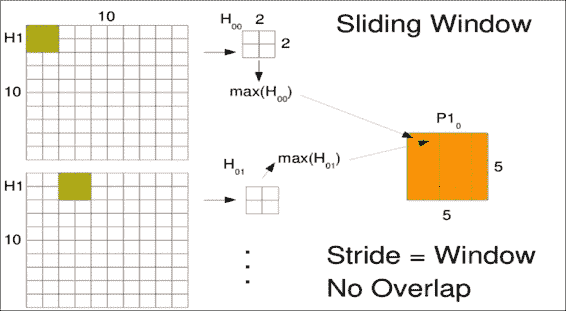
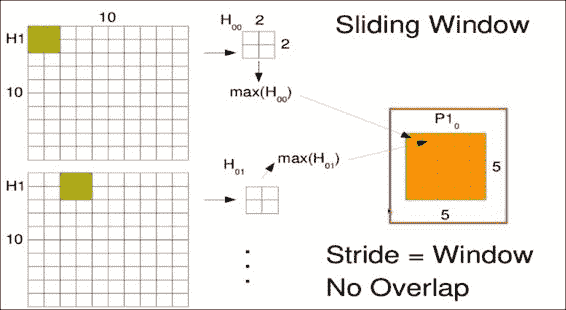
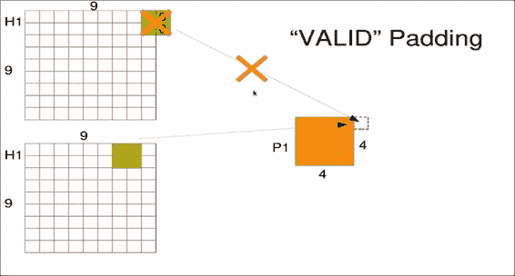

# 池化层动机

现在，让我们了解池层的共同合作伙伴。 在本节中，我们将学习与卷积层相似的最大池化层，尽管它们在通用用法上有所不同。 最后，我们将展示如何组合这些层以获得最大效果。

## 最大池化层

假设您使用了卷积层从图像中提取特征，并假设，您有一个小的权重矩阵，可以检测图像窗口中的狗形。

当您围绕输出进行卷积时，可能会报告许多附近呈狗形的区域。 但这实际上只是由于重叠。 尽管可能只有小狗的形象，但彼此之间可能并没有多少只狗。 您真的只希望一次看到该特征，最好是在特征最强大的位置。 最大池化层尝试执行此操作。 像卷积层一样，池化层在图像的小滑动窗口上工作。

通常，研究人员在一个或多个卷积层之后添加一个池化层。 您最常看到的窗口大小是 2x2。 您要做的只是提取四个相邻的值，此处指的是`H[00]`，通常不会对其施加任何权重。 现在，我们希望以某种方式组合这四个值，以提取此窗口最有趣的特征。 通常，我们要提取最引人注目的特征，因此我们选择最大值（`max(H[00])`）的像素，然后丢弃其余像素。 但是，您也可以平均结果或做一些更奇特的事情。 同样，尽管我们的卷积窗口有很多重叠，但对于合并窗口，我们通常不希望有任何重叠，因此此步长将等于窗口大小 2。

在前面的 10x10 示例输出中，由于步幅的变化，我们的池化输出仅为 5x5。

与卷积层的另一个主要区别是，池化层通常使用不同的填充方案，而卷积层乐于使用相同的填充并以零填充，我们最常使用具有有效填充的池化层。 这意味着，如果窗口超出图像的范围，则将其丢弃。

这确实会丢失一些边缘信息，但要确保输出不会因填充值而产生偏差。

### 注意

请注意，此示例对池化层使用 9x9 输入，但由于有效的填充和跨度为 2，因此输出仅为 4x4。 8x8 输入也将具有 4x4 输出。

当您将卷积层和池化层组合在一起时，它们的真正优势就体现出来了。 通常，您会在模型的顶部输入端看到一个卷积层，也许带有 3x3 窗口。

这会在图像中的任何位置寻找相同的特征集。

然后立即出现一个 2x2 的最大池化层，仅池出最具特征的区域并缩小尺寸。 您也可以重复此过程。

合并后，您现在实际上具有较小的图像`P1`，但是具有像素强度，而不是像素颜色强度。 因此，您可以创建另一个卷积层以读取第一个池的输出，即底部出现的`P1`，然后可以对此应用另一个最大池化层。 请注意，由于池化，图像大小是如何逐渐缩小的。 直观地，您可以将其视为建立跨越图像较大区域的较大比例的特征。

早期的卷积权重经常训练以检测简单的边缘，而连续的卷积层将这些边缘组合成逐渐更复杂的形状，例如人脸，汽车甚至狗。