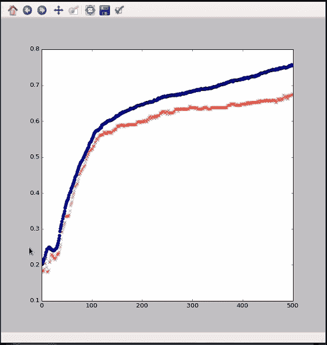
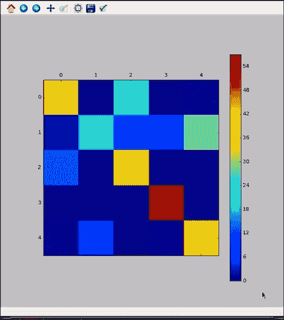

# 深度 CNN

现在，在本节中，让我们着重考虑。 在本节中，我们将向我们的字体分类模型添加卷积和池化层组合。 我们将确保将其填充到一个密集层中，然后我们将看到此模型的工作方式。 在进入新的卷积模型之前，请确保开始一个新的 IPython 会话。 执行所有操作，直到`num_filters = 4`，您就可以准备就绪。

## 添加卷积和池化层组合

对于卷积层，我们将使用 5x5 窗口，其中提取了四个特征。 这比示例要大一些。

我们真的希望模型现在学习一些东西。 首先，我们应该使用`tf.reshape`将 36x36 的图像放入大小为 36x36x1 的张量中。

```py
x_im = tf.reshape(x, [-1,36,36,1])
```

这仅对于保持通道数笔直很重要。 现在，我们将如上所述为过滤器和窗口的数量设置常量：

```py
num_filters = 4
winx = 5
winy = 5
```

我们可以像示例问题中那样设置权重张量：

```py
W1 = tf.Variable(tf.truncated_normal(
    [winx, winy, 1 , num_filters],
    stddev=1./math.sqrt(winx*winy)))
```

`winx`和`winy`常数只是窗口尺寸。 `1`值是输入通道数，仅是灰色，`num_filters`是我们要提取的特征数。 同样，这就像密集层中神经元的数量。 偏差的工作方式相同，但只担心过滤器的数量：

```py
b1 = tf.Variable(tf.constant(0.1,
                shape=[num_filters]))
```

对`conv2d`本身的调用也与我们的示例相同。

```py
xw = tf.nn.conv2d(x_im, W1,
                  strides=[1, 1, 1, 1],
                  padding='SAME')
```

好东西，我们在那里推广了它，现在使生活变得轻松。 以下是上述代码行的描述：

*   `x_im`已转换输入
*   `W1`属性是我们刚刚指定的权重矩阵
*   `strides`告诉 TensorFlow 每一步将窗口移动一次
*   `padding='SAME'`表示接受图像边缘上的窗口

现在，我们可以通过`relu`激活函数进行卷积，以完成卷积层。 做得好！

```py
h1 = tf.nn.relu(xw + b1)
```

池化层也与上一节完全相同：

```py
# 2x2 Max pooling, no padding on edges
p1 = tf.nn.max_pool(h1, ksize=[1, 2, 2, 1],
        strides=[1, 2, 2, 1], padding='VALID')
```

只是为了回顾一下，我们在每次跨步时将 2x2 窗口`ksize`在卷积输出上滑动两个。 当我们超出数据范围时，`padding='VALID'`告诉我们停止。 现在我们有了卷积池和池化层的组合，让我们附加一个典型的密集连接层：

```py
p1_size = np.product(
          [s.value for s in p1.get_shape()[1:]])
p1f = tf.reshape(p1, [-1, p1_size ])
```

首先，我们需要将合​​并输出调整为一维向量。 这正是我们在上一节中所做的。 我们自动计算池输出的尺寸，以获取用于展平的参数数量。

## CNN 字体分类

现在让我们创建一个包含 32 个神经元的密集连接层：

```py
# Dense layer
num_hidden = 32
W2 = tf.Variable(tf.truncated_normal(
     [p1_size, num_hidden],
     stddev=2./math.sqrt(p1_size)))
b2 = tf.Variable(tf.constant(0.2,
     shape=[num_hidden]))
h2 = tf.nn.relu(tf.matmul(p1f,W2) + b2)
```

当然，我们需要使用`p1_size`该层的输入数量来初始化权重矩阵。 那只是卷积和池输出中的扁平数组。 我们需要`num_hidden` 32 个输出。 有偏项对一些小的非零初始值以相同的方式工作。 在这里，我们碰巧也在使用`relu`激活。

最后，我们像往常一样定义输出逻辑回归：

```py
# Output Layer
W3 = tf.Variable(tf.truncated_normal(
     [num_hidden, 5],
     stddev=1./math.sqrt(num_hidden)))
b3 = tf.Variable(tf.constant(0.1,shape=[5]))

keep_prob = tf.placeholder("float")
h2_drop = tf.nn.dropout(h2, keep_prob)
```

使用旧模型工作，只需确保最终权重使用`num_hidden, 5`作为尺寸即可。 我们在这里有一个名为`dropout`的新元素。 现在不用担心。 我们将在下一部分中确切描述它的作用。 只知道它有助于过拟合。

现在，您可以初始化所有变量并实现对`softmax`的最终调用：

```py
# Just initialize
sess.run(tf.global_variables_initializer())

# Define model
y = tf.nn.softmax(tf.matmul(h2_drop,W3) + b3)
```

请注意您的变量名正确匹配。 好的，现在完成设置，让我们对其进行训练：

```py
# Climb on cross-entropy
cross_entropy = tf.reduce_mean(
        tf.nn.softmax_cross_entropy_with_logits(
        logits = y + 1e-50, labels = y_))

# How we train
train_step = tf.train.GradientDescentOptimizer(
             0.01).minimize(cross_entropy)

# Define accuracy
correct_prediction = tf.equal(tf.argmax(y,1),
                              tf.argmax(y_,1))
accuracy = tf.reduce_mean(tf.cast(
           correct_prediction, "float"))
```

实际上，我们训练模型的方式与之前的模型完全相同。 `cross_entropy`节点测量我们的预测有多少误差，`GradientDescentOptimizer`调整矩阵的权重。 我们还应谨慎定义节点以提高准确率，以便以后进行测量。 现在让我们训练模型约 5,000 次：

```py
# Actually train
epochs = 5000
train_acc = np.zeros(epochs//10)
test_acc = np.zeros(epochs//10)
for i in tqdm(range(epochs), ascii=True):
    # Record summary data, and the accuracy
    if i % 10 == 0:  
        # Check accuracy on train set
        A = accuracy.eval(feed_dict={x: train,
            y_: onehot_train, keep_prob: 1.0})
        train_acc[i//10] = A
        # And now the validation set
        A = accuracy.eval(feed_dict={x: test,
            y_: onehot_test, keep_prob: 1.0})
        test_acc[i//10] = A
    train_step.run(feed_dict={x: train,
        y_: onehot_train, keep_prob: 0.5})
```

这可能需要一个小时或更长时间。 但是试想一下，如果您必须为卷积中的每个窗口训练不同的权重。 通过训练模型，让我们看一下精度曲线。



我们可以看到，该模型优于旧的紧密连接模型，现在达到了 76％的训练准确率和约 68％的验证。

这可能是因为字体即使创建许多不同的字母也以相同的方式使用了许多小范围的特征。 让我们也看看混淆矩阵。



在这里，我们看到该模型仍不完美，但正在取得进展。 第一类仍然没有得到很好的代表，但是它至少在某种程度上是正确的，这与某些以前的模型从来都不是正确的不同。 其他班级大多都不错。 第三课实际上是完美的。 这不是一个容易的问题，因此任何改进都是好的。 我们还设置了一些代码来专门检查权重，但是我们将在以后的部分中保存它。 不过，请随时与他们一起玩耍。 您可以将模型权重和信息保存在检查点文件中。

```py
# Save the weights
saver = tf.train.Saver()
saver.save(sess, "conv1.ckpt")

# Restore
saver.restore(sess, "conv1.ckpt")
```

这很简单。 您只需创建一个`saver`对象，然后将会话保存到文件名即可。 恢复同样容易。 您告诉 TensorFlow 哪个会话将已保存的文件放入和退出。 如果您更喜欢使用 NumPy 手动保存权重，则代码文件还提供以下函数：

```py
# Or use Numpy manually
def save_all(name = 'conv1'):
    np.savez_compressed(name, W1.eval(),
            b1.eval(), W2.eval(), b2.eval(),
            W3.eval(), b3.eval())

save_all()

def load_all(name = 'conv1.npz'):
    data = np.load(name)
    sess.run(W1.assign(data['arr_0']))
    sess.run(b1.assign(data['arr_1']))
    sess.run(W2.assign(data['arr_2']))
    sess.run(b2.assign(data['arr_3']))
    sess.run(W3.assign(data['arr_4']))
    sess.run(b3.assign(data['arr_5']))

load_all()
```

因为 NumPy 格式非常可移植且相当轻巧，所以这会更方便。 如果要将值导出到另一个 Python 脚本中，从而不需要 TensorFlow，则您可能更喜欢 NumPy。 在本节中，我们建立了卷积神经网络对字体进行分类。 一个类似的模型可以解决当前的研究问题。 您处于 TensorFlow 深度学习的最前沿。