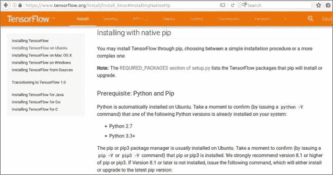
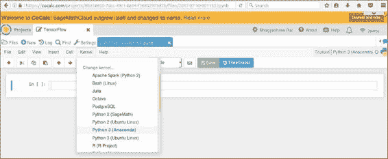
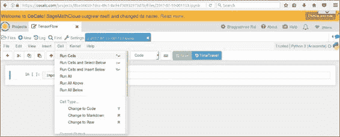
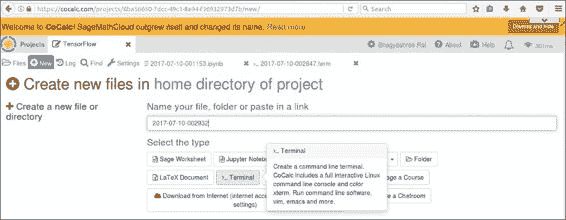
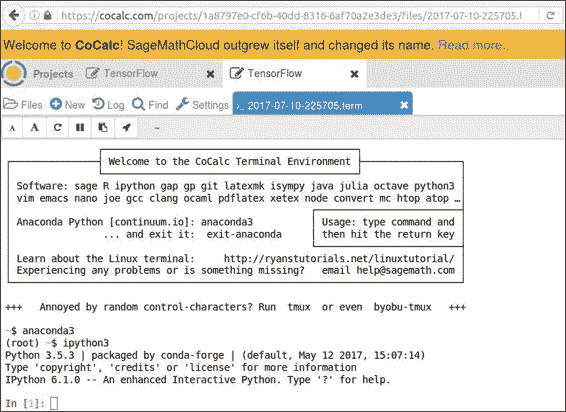

# 安装 TensorFlow

在本节中，您将学习什么是 TensorFlow，如何安装 TensorFlow 以及如何构建简单模型和进行简单计算。 此外，您将学习如何建立用于分类的逻辑回归模型，并介绍机器学习问题以帮助我们学习 TensorFlow。

我们将学习 TensorFlow 是什么类型的库，并将其安装在我们自己的 Linux 机器上；如果您无法访问 Linux 机器，则将其安装在 CoCalc 的免费实例中。

## TensorFlow 主页

首先，什么是 TensorFlow？ TensorFlow 是 Google 推出的新的机器学习库。 它被设计为非常易于使用且非常快。 如果您访问[ TensorFlow 网站](http://tensorflow.org)，则可以访问有关 TensorFlow 是什么以及如何使用的大量信息。 我们将经常提到这一点，特别是文档。

## TensorFlow 安装页面

在我们开始使用 TensorFlow 之前，请注意，您需要先安装它，因为它可能尚未预先安装在您的操作系统上。 因此，如果转到 TensorFlow 网页上的“安装”选项卡，单击在 Ubuntu 上安装 TensorFlow，然后单击“本机” pip，您将学习如何安装 TensorFlow。



即使对于经验丰富的系统管理员来说，安装 TensorFlow 也是非常困难的。 因此，我强烈建议您使用类似`pip`的安装方式。 或者，如果您熟悉 Docker，请使用 Docker 安装。 您可以从源代码安装 TensorFlow，但这可能非常困难。 我们将使用称为 wheel 文件的预编译二进制文件安装 TensorFlow。 您可以使用 Python 的`pip`模块安装程序来安装此文件。

## 通过 pip 安装

对于`pip`安装，您可以选择使用 Python 2 或 Python 3 版本。 另外，您可以在 CPU 和 GPU 版本之间进行选择。 如果您的计算机具有功能强大的显卡，则可能适合您使用 GPU 版本。


但是，您需要检查显卡是否与 TensorFlow 兼容。 如果不是，那很好。 本系列中的所有内容都可以仅使用 CPU 版本来完成。

### 注意

我们可以使用`pip install tensorflow`命令（基于您的 CPU 或 GPU 支持以及`pip`版本）安装 TensorFlow，如前面的屏幕截图所示。

因此，如果您为 TensorFlow 复制以下行，则也可以安装它：

```py
# Python 3.4 installation
sudo pip3 install --upgrade \
https://storage.googleapis.com/tensorflow/linux/cpu/tensorflow-1.2.1-cp34-cp34m-linux_x86_64.whl

```

如果您没有 Python 3.4，请按照 wheel 文件的要求进行操作，那就可以了。 您可能仍然可以使用相同的 wheel 文件。 让我们看一下如何在 Python 3.5 上执行此操作。 首先，只需将以下 URL 放在浏览器中，或使用命令行程序（例如`wget`）直接下载 wheel 文件，就像我们在这里所做的那样：

```py
wget  https://storage.googleapis.com/tensorflow/linux/cpu/tensorflow-1.2.1-cp34-cp34m-linux_x86_64.whl

```

如果下载此文件，它将很快被您的计算机抓住。

现在，您需要做的就是将文件名从`cp34`（代表 Python 3.4）更改为您使用的任何版本的 Python 3。 在这种情况下，我们将其更改为使用 Python 3.5 的版本，因此我们将`4`更改为`5`：

```py
mv tensorflow-1.2.1-cp34-cp34m-linux_x86_64.whl tensorflow-1.2.1-cp35-cp35m-linux_x86_64.whl

```

现在您可以通过简单地将安装行更改为`pip3 install`并将新 wheel 文件的名称更改为 3.5 后，来安装 TensorFlow for Python 3.5：

```py
sudo pip3 install ./tensorflow-1.2.1-cp35-cp35m-linux_x86_64.whl

```

我们可以看到这很好。 现在，您已经安装了 TensorFlow。


如果您的安装以后因某种原因损坏了，您可以随时跳回到该部分，以提醒自己有关安装所涉及的步骤。

## 通过 CoCalc 安装

如果您没有计算机的管理或安装权限，但仍然想尝试 TensorFlow，则可以尝试在 CoCalc 实例中通过 Web 运行 TensorFlow。 如果转到 [cocalc.com](https://cocalc.com/) 并创建一个新帐户，则可以创建一个新项目。 这将为您提供一种可以玩耍的虚拟机。 方便的是，TensorFlow 已经安装在 Anaconda 3 内核中。


让我们创建一个名为`TensorFlow`的新项目。 单击+创建新项目...，为您的项目输入标题，然后单击创建项目。 现在，我们可以通过单击标题进入我们的项目。 加载将需要几秒钟。


单击+新建以创建一个新文件。 在这里，我们将创建一个 Jupyter 笔记本：


Jupyter 是与 IPython 进行交互的便捷方法，也是使用 CoCalc 进行这些计算的主要手段。 加载可能需要几秒钟。

进入下面的屏幕快照中所示的界面时，您需要做的第一件事是通过转到内核|将内核更改为 Anaconda Python 3。 更改内核…| Python 3（Anaconda）：



这将为您提供适当的依赖关系以使用 TensorFlow。 更改内核可能需要几秒钟。 连接到新内核后，可以在单元格中键入`import tensorflow`，然后转到 Cell |。 运行单元格以检查其是否有效：



如果 Jupyter 笔记本需要很长时间才能加载，则可以使用以下屏幕截图中所示的按钮在 CoCalc 中创建终端：



到那里后，键入`anaconda3`切换环境，然后键入`ipython3`启动交互式 Python 会话，如以下屏幕截图所示：



尽管您无法可视化输出，但是您可以在这里轻松地工作。 在终端中输入`import tensorflow`，然后离开。

到目前为止，您已经了解了 TensorFlow 是什么以及如何在本地或 Web 上的虚拟机上安装 TensorFlow。 现在我们准备在 TensorFlow 中探索简单的计算。