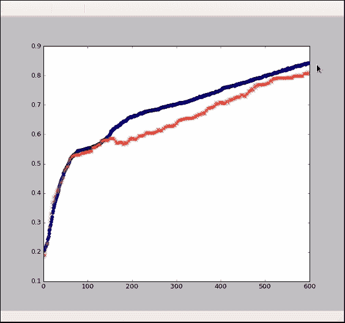
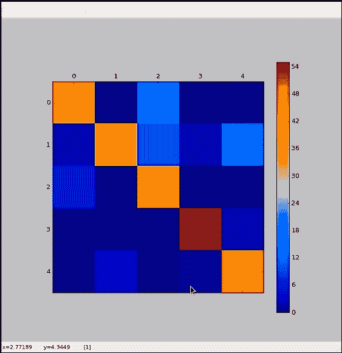
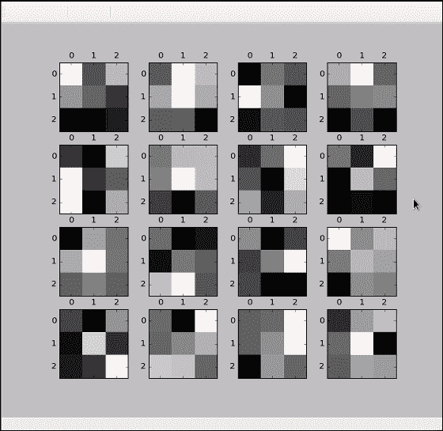
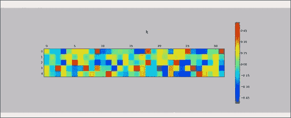

# 深度 CNN 总结

我们将通过评估模型的准确率来总结深层的 CNN。 上一次，我们建立了最终的字体识别模型。 现在，让我们看看它是如何工作的。 在本节中，我们将学习如何在训练期间处理 dropout 问题。 然后，我们将看到模型达到了什么精度。 最后，我们将权重可视化以了解模型学到了什么。

确保在上一个模型中进行训练后，在 IPython 会话中接手。 回想一下，当我们训练模型时，我们使用`dropout`删除了一些输出。

尽管这有助于过拟合，但在测试过程中，我们要确保使用每个神经元。 这既提高了准确率，又确保我们不会忘记评估模型的一部分。 这就是为什么在以下代码行中，`keep_prob`为`1.0`以便始终保留所有神经元的原因。

```py
# Check accuracy on train set
        A = accuracy.eval(feed_dict={x: train,
            y_: onehot_train, keep_prob: 1.0})
        train_acc[i//10] = A
        # And now the validation set
        A = accuracy.eval(feed_dict={x: test,
            y_: onehot_test, keep_prob: 1.0})
        test_acc[i//10] = A
```

让我们看看最终模型是如何做的； 像往常一样看一下训练和测试的准确率：



这里的训练准确率高达 85％，并且测试准确率也相差不远。还不错。模型的效果取决于输入数据的噪声。 如果我们仅包含少量信息，无论是示例数量还是参数或像素数量，那么我们都无法期望模型表现完美。

在这种情况下，您可以应用的一种度量标准是人类将单个字母的图像分类到这些字体中的每种字体的程度。 一些字体非常有特色，而另一些则相似，尤其是某些字母。 由于这是一个新颖的数据集，因此没有直接的基准可以与之进行比较，但是您可以挑战自己以击败本课程中介绍的模型。 如果这样做，您可能希望减少训练时间。 当然，具有较少参数和更简单计算的较小网络将更快。 另外，如果您开始使用 GPU 或至少使用多核 CPU，则可以显着提高速度。 通常 10 倍更好，具体取决于硬件。

其中一部分是并行性，一部分是针对神经网络进行了微调的高效低层库。 但是，最简单的方法是从简单开始，逐步发展到更复杂的模型，就像您一直在处理此问题一样。 回到这个模型，让我们看一下混淆矩阵：

```py
# Look at the final testing confusion matrix
pred = np.argmax(y.eval(
       feed_dict={x: test, keep_prob: 1.0,
       y_: onehot_test}), axis = 1)
conf = np.zeros([5,5])
for p,t in zip(pred,np.argmax(onehot_test,
                              axis=1)):
    conf[t,p] += 1

plt.matshow(conf)
plt.colorbar()
```

以下是输出：



在这里，我们可以看到该模型通常在各个类上都做得很好。 类`1`仍然不是完美的，但是比以前的模型要好得多。 通过将较小比例的特征分解为较大的片段，我们终于找到了一些适合这些类的指标。 您的图像可能看起来不完全相同。 根据权重的随机初始化，结果可能会有些不幸。

让我们看一下第一卷积层的 16 个特征的权重：

```py
# Let's look at a subplot of some weights
f, plts = plt.subplots(4,4)
for i in range(16):
    plts[i//4,i%4].matshow(W1.eval()[:,:,0,i],
            cmap = plt.cm.gray_r)
```

因为窗口大小是 3x3，所以每个都是 3x3 矩阵。 嗯！ 我们可以看到，权重肯定是缩小了小范围的特征。



您可以看到某些事物，例如检测到边缘或圆角，诸如此类。 如果我们使用更大的窗口重做模型，这可能会更加明显。 但是令人印象深刻的是，您可以在这些小补丁中发现多少特征。

我们还要看一下最终的层权重，以了解不同的字体类如何解释最终的紧密连接的神经元。



每行代表一类，每列代表最终的隐藏层神经元之一。 有些类别受到某些神经元的强烈影响，而另一些类别的影响则微乎其微。 您会看到，对于某些类别，给定的神经元在积极或消极方面非常重要，而对于其他类别则非常重要。

请注意，因为我们已经使卷积变平，所以我们不希望在输出中看到明显的结构。 这些列可以按任何顺序排列，但仍会产生相同的结果。 在本章的最后部分，我们检查了一个真实的，实时的，坦率的，非常好的深度卷积神经网络模型。 我们使用卷积层和池化层的做法来构筑该思想，以便提取结构化数据（例如图像）中的小规模和大规模型征。

对于许多问题，这是神经网络最强大的类型之一。