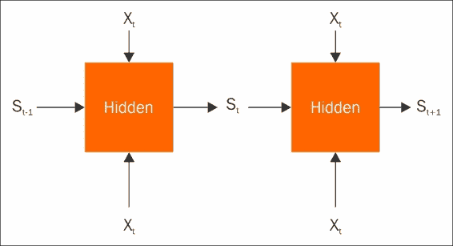

# 探索 RNN

在本节中，我们将探索 RNN。 一些背景信息将使我们开始工作，然后我们将探讨一个激发性的天气建模问题。 我们还将在 TensorFlow 中实现和训练 RNN。



在典型模型中，您要预测一些`X`输入特征和一些`Y`输出。 我们通常将不同的训练样本视为独立的观察结果。 因此，数据点 1 的特征不应影响数据点 2 的预测。 但是，如果我们的数据点相互关联怎么办？ 最常见的示例是每个数据点`Xt`代表在时间`t`收集的特征。 自然地假设时间`t`和时间`t+1`的特征对于时间`t+1`的预测都将很重要。 换句话说，历史很重要。

现在，在建模时，您可以只包含两倍的输入特征，将前一个时间步长添加到当前特征中，并计算两倍的输入权重。 但是，如果您正在努力构建神经网络来计算变换特征，那么可以在当前时间步网络中使用上一个时间步的中间特征就很好了。

RNN 正是这样做的。 像往常一样考虑您的输入`Xt`，但在某些状态下添加来自上一个时间步的`St-1`作为附加特征。 现在，您可以像往常一样计算权重以预测`Yt`，并产生一个新的内部状态`St`，以供下一步使用。 对于第一步，通常使用默认或零初始状态。 经典的 RNN 实际上就是这么简单，但是当今文学中有更高级的结构，例如门控循环单元和长短期存储电路。 这些不在本书的讨论范围之内，但是它们遵循相同的原理，并且通常适用于相同类型的问题。

## 权重建模

您可能想知道我们如何根据上一个时间步长计算所有这些相关性的权重。 计算梯度确实涉及到时间计算的递归，但不要担心，TensorFlow 处理乏味的东西，让我们进行建模：

```py
# read in data
filename = 'weather.npz'
data = np.load(filename)
daily = data['daily']
weekly = data['weekly']

num_weeks = len(weekly)
dates = np.array([datetime.datetime.strptime(str(int(d)),
                '%Y%m%d') for d in weekly[:,0]])
```

要使用 RNN，我们需要一个带有时间成分的数据建模问题。

字体分类问题在这里并不是很合适。 因此，让我们看一些天气数据。 `weather.npz`文件是几十年来来自美国一个城市的气象站数据的集合。 `daily`数组包含一年中每一天的测量值。 数据有六列，从日期开始。 接下来是降雨量，以英寸为单位测量当日的降雨量。 之后，出现两列降雪-第一列是当前地面上的实测雪，而第二列是当天的降雪，单位是英寸。 最后，我们有一些温度信息，以华氏度为单位的每日最高和最低每日温度。

我们将使用的`weekly`数组是每日信息的每周摘要。 我们将使用中间日期来表示一周，然后，我们将汇总一周中的所有降雨量。 但是，对于降雪，我们将平均降雪量，因为从一个寒冷的天气到第二天坐在地上的积雪都没有意义。 虽然降雪，但我们总共要一周，就像下雨一样。 最后，我们将平均一周的高温和低温。 现在您已经掌握了数据集，我们该如何处理？ 一个有趣的基于时间的建模问题是，尝试使用天气信息和前几周的历史来预测特定一周的季节。

在美国的北半球，6 月至 8 月的气温较高，而 12 月至 2 月的气温较低，两者之间有过渡。 春季通常是多雨的，冬季通常包括雪。 尽管一周的变化很大，但一周的历史应该可以提供一定的预测能力。

## 了解 RNN

首先，让我们从压缩的 NumPy 数组中读取数据。 如果您想探索自己的模型，`weather.npz`文件也包括每日数据。 `np.load`将两个数组都读入字典，并将每周设置为我们感兴趣的数据； `num_weeks`自然就是我们拥有多少个数据点，在这里，几十年的信息价值：

```py
num_weeks = len(weekly)
```

为了格式化星期，我们使用 Python `datetime.datetime`对象以年月日格式读取存储字符串：

```py
dates = np.array([datetime.datetime.strptime(str(int(d)),
                '%Y%m%d') for d in weekly[:,0]])
```

我们可以使用每周的日期来指定其季节。 对于此模型，因为我们正在查看天气数据，所以我们使用气象季节而不是普通的天文季节。 幸运的是，这很容易通过 Python 函数实现。 从`datetime`对象中获取月份，我们可以直接计算出该季节。 春季，零季节是 3 月至 5 月，夏季是 6 月至 8 月，秋天是 9 月至 11 月，最后是冬季 12 月至 2 月。 以下是简单的函数，它仅评估月份并实现该月份：

```py
def assign_season(date):
    ''' Assign season based on meteorological season.
        Spring - from Mar 1 to May 31
        Summer - from Jun 1 to Aug 31
        Autumn - from Sep 1 to Nov 30
        Winter - from Dec 1 to Feb 28 (Feb 29 in a leap year)
    '''
    month = date.month
    # spring = 0
    if 3 <= month < 6:
        season = 0
    # summer = 1
    elif 6 <= month < 9:
        season = 1
    # autumn = 2
    elif 9 <= month < 12:
        season = 2
    # winter = 3
    elif month == 12 or month < 3:
        season = 3
    return season
```

让我们注意一下，我们有四个季节和五个输入变量，例如历史状态中的 11 个值：

```py
# There are 4 seasons
num_classes = 4

# and 5 variables
num_inputs = 5

# And a state of 11 numbers
state_size = 11
```

现在您可以计算标签了：

```py
labels = np.zeros([num_weeks,num_classes])
# read and convert to one-hot
for i,d in enumerate(dates):
    labels[i,assign_season(d)] = 1
```

通过制作全零数组并在分配季节的位置放置一个全零，我们直接以一键式格式执行此操作。

凉！ 您仅用几个命令就总结了几十年的时间。

由于这些输入特征在非常不同的尺度上测量非常不同的事物，即降雨，降雪和温度，因此我们应注意将它们全部置于相同的尺度上。 在下面的代码中，我们抓住了输入特征，当然跳过了日期列，并减去平均值以将所有特征居中为零：

```py
# extract and scale training data
train = weekly[:,1:]
train = train - np.average(train,axis=0)
train = train / train.std(axis=0)
```

然后，我们将每个特征除以其标准偏差来缩放。 这说明温度范围大约为 0 到 100，而降雨量仅在大约 0 到 10 之间变化。数据准备工作不错！ 它并不总是很有趣，但这是机器学习和 TensorFlow 的关键部分。

现在进入 TensorFlow 模型：

```py
# These will be inputs
x = tf.placeholder("float", [None, num_inputs])
# TF likes a funky input to RNN
x_ = tf.reshape(x, [1, num_weeks, num_inputs])
```

我们使用占位符变量正常输入数据，但是随后您会看到将整个数据集奇怪地重塑为一个大张量。 不用担心，这是因为从技术上讲，我们有一个漫长而连续的观测序列。 `y_`变量只是我们的输出：

```py
y_ = tf.placeholder("float", [None,num_classes])
```

我们将计算每个季节每周的概率。

`cell`变量是循环神经网络的关键：

```py
cell = tf.nn.rnn_cell.BasicRNNCell(state_size)
```

这告诉 TensorFlow 当前时间步长如何取决于前一个时间步长。 在这种情况下，我们将使用基本的 RNN 单元。 因此，我们一次只回首一周。 假设它具有状态大小或 11 个值。 随意尝试使用更多奇异的单元和不同的状态大小。

要使用该单元格，我们将使用`tf.nn.dynamic_rnn`：

```py
outputs, states = tf.nn.dynamic_rnn(cell,x_,
            dtype=tf.nn.dtypes.float32, initial_state=None)
```

这可以智能地处理递归，而不是简单地将所有时间步长展开成一个巨大的计算图。 因为我们在一个序列中有成千上万的观测值，所以这对于获得合理的速度至关重要。 在单元格之后，我们指定输入`x_`，然后指定`dtype`以使用 32 位将十进制数字存储在浮点数中，然后指定空的`initial_state`。 我们使用此输出建立一个简单的模型。 从这一点开始，该模型几乎完全符合您对任何神经网络的期望：

我们将 RNN 单元的输出，一些权重相乘，并添加一个偏差以获得该周每个班级的分数：

```py
W1 = tf.Variable(tf.truncated_normal([state_size,num_classes],
                          stddev=1./math.sqrt(num_inputs)))
b1 = tf.Variable(tf.constant(0.1,shape=[num_classes]))
# reshape the output for traditional usage
h1 = tf.reshape(outputs,[-1,state_size])
```

### 注意

请注意，由于我们有一个长序列，因此我们确实需要进行此重塑操作以再次获得合适的大小。

您应该非常熟悉我们的分类`cross_entropy`损失函数和训练优化器：

```py
# Climb on cross-entropy
cross_entropy = tf.reduce_mean(
     tf.nn.softmax_cross_entropy_with_logits(y + 1e-50, y_))

# How we train
train_step = tf.train.GradientDescentOptimizer(0.01
                    ).minimize(cross_entropy)

# Define accuracy
correct_prediction = tf.equal(tf.argmax(y,1),tf.argmax(y_,1))
accuracy=tf.reduce_mean(tf.cast(correct_prediction, "float"))
```

搭建 TensorFlow 模型的出色工作！ 为了训练这一点，我们将使用一个熟悉的循环：

```py
# Actually train
epochs = 100
train_acc = np.zeros(epochs//10)
for i in tqdm(range(epochs), ascii=True):
    if i % 10 == 0: 
  # Record summary data, and the accuracy
        # Check accuracy on train set
        A = accuracy.eval(feed_dict={x: train, y_: labels})
        train_acc[i//10] = A
    train_step.run(feed_dict={x: train, y_: labels})
```

由于这是一个虚拟的问题，因此我们不必担心模型的实际准确率。 这里的目的只是看 RNN 的工作原理。 您可以看到它像任何 TensorFlow 模型一样运行：


如果您确实看过准确率，您会发现它做得很好。 比 25％的随机猜测要好得多，但仍有很多东西需要学习。