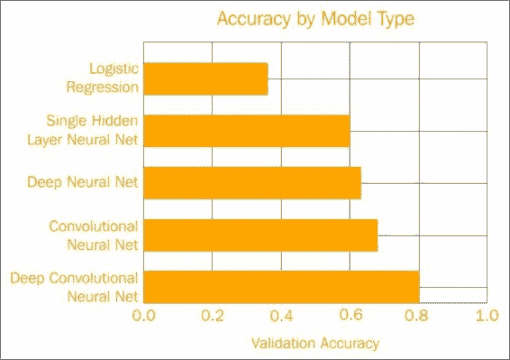
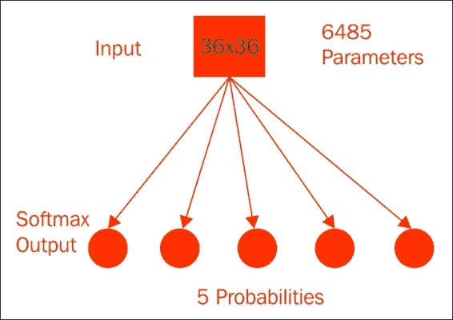
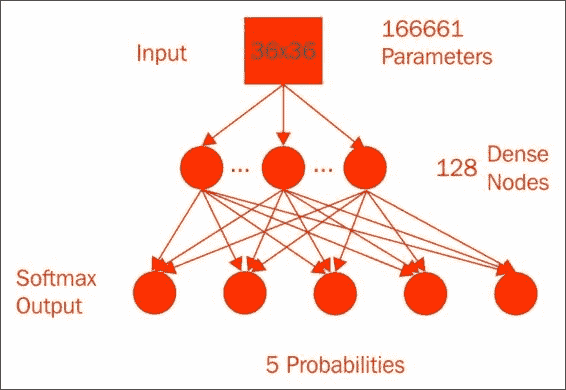

# 快速浏览所有模型

让我们回顾一下我们构建的每个模型，以对这些字体及其优点和缺点进行建模：



乍一看，我们缓慢地建立了更复杂的模型，并考虑了数据的结构以提高准确率。

## 逻辑回归模型

首先，我们从一个简单的逻辑回归模型开始：



它具有 36x36 像素外加 1 倍乘以 5 类总权重，即我们需要训练的 6,485 个参数。 经过 1,000 次训练后，此模型的验证准确率达到了 40％。 您的结果可能会有所不同。 这相对较差，但是该模型具有一些优势。

让我们回头看一下代码：

```py
# These will be inputs
## Input pixels, flattened
x = tf.placeholder("float", [None, 1296])
## Known labels
y_ = tf.placeholder("float", [None,5])

# Variables
W = tf.Variable(tf.zeros([1296,5]))
b = tf.Variable(tf.zeros([5]))

# Just initialize
sess.run(tf.initialize_all_variables())

# Define model
y = tf.nn.softmax(tf.matmul(x,W) + b)
```

逻辑回归的简单性意味着我们可以直接看到并计算每个像素如何影响类概率。 这种简单性也使模型在训练中相对较快地收敛，并且当然也易于编程，因为它只需要几行 TensorFlow 代码。

## 单隐层神经网络模型

我们的下一个模型是具有最终 Softmax 激活层的单个隐藏层密集连接的神经网络，等效于逻辑回归：



该模型具有 36x36 像素，外加 1 个偏移乘以 128 个节点，再加上 128 个隐藏节点加上 1 个偏移乘以 5 个类的总权重，即 166,661 个参数。 隐藏层使用`sigmoid`激活函数来实现非线性。 在经过 5,000 个周期后，参数的纠缠达到了约 60％的验证准确率，这是一个很大的改进。 但是，此改进的代价是大量增加了计算复杂性中的参数数量，您可以从代码中大致了解一下：

```py
# These will be inputs
## Input pixels, flattened
x = tf.placeholder("float", [None, 1296])
## Known labels
y_ = tf.placeholder("float", [None,5])

# Hidden layer
num_hidden = 128
W1 = tf.Variable(tf.truncated_normal([1296, num_hidden],
                                stddev=1./math.sqrt(1296)))
b1 = tf.Variable(tf.constant(0.1,shape=[num_hidden]))
h1 = tf.sigmoid(tf.matmul(x,W1) + b1)

# Output Layer
W2 = tf.Variable(tf.truncated_normal([num_hidden, 5],
                                   stddev=1./math.sqrt(5)))
b2 = tf.Variable(tf.constant(0.1,shape=[5]))

# Just initialize
sess.run(tf.initialize_all_variables())

# Define model
y = tf.nn.softmax(tf.matmul(h1,W2) + b2)
```

我们不再具有将单个像素分类到概率的简单函数。 但这仅需要几行编码，并且表现会更好。

## 深度神经网络

深度神经网络更进一步，由第一层的 128 个节点组成，馈入下一层的 32 个节点，然后馈入 Softmax 以获得 170,309 个参数； 真的没有那么多：


经过 25,000 个周期后，我们的验证准确率微幅提高了 63％：

```py
# These will be inputs
## Input pixels, flattened
x = tf.placeholder("float", [None, 1296])
## Known labels
y_ = tf.placeholder("float", [None,5])

# Hidden layer 1
num_hidden1 = 128
W1 = tf.Variable(tf.truncated_normal([1296,num_hidden1],
                               stddev=1./math.sqrt(1296)))
b1 = tf.Variable(tf.constant(0.1,shape=[num_hidden1]))
h1 = tf.sigmoid(tf.matmul(x,W1) + b1)

# Hidden Layer 2
num_hidden2 = 32
W2 = tf.Variable(tf.truncated_normal([num_hidden1,
            num_hidden2],stddev=2./math.sqrt(num_hidden1)))
b2 = tf.Variable(tf.constant(0.2,shape=[num_hidden2]))
h2 = tf.sigmoid(tf.matmul(h1,W2) + b2)

# Output Layer
W3 = tf.Variable(tf.truncated_normal([num_hidden2, 5],
                                   stddev=1./math.sqrt(5)))
b3 = tf.Variable(tf.constant(0.1,shape=[5]))

# Just initialize
sess.run(tf.initialize_all_variables())

# Define model
y = tf.nn.softmax(tf.matmul(h2,W3) + b3)
```

更深层次的静态模型可能会做得更好，但这证明了深度学习的某些优势，可以处理相当大的非线性，并且这再次花费了一些额外的编程精力。

## 卷积神经网络

紧密连接的神经网络工作得很好，但是字体是由它们的样式而不是特定的像素定义的：


重复出现的局部特征应该是您模型的重要线索。 我们使用卷积神经网络捕获了其中一些局部特征。 我们从一个卷积层开始，一个 5x5 窗口，使用整流线性单元，通过四个额外的偏项计算四个特征，并提取了有趣的局部参数。 接下来，我们将 2x2 的最大池化层应用于每个特征，从而将中间值的数量减少到 18x18x4 加上 1 个偏差。 将其平整为 1,297 个数字，并放入一个密集的神经网络的 32 个节点，然后进行 Softmax 激活，从而完成了具有 41,773 个参数的模型。

尽管实现和代码比以前要花更多的精力，但是这可以很好地缩减模型的整体大小：

```py
# Conv layer 1
num_filters = 4
winx = 5
winy = 5
W1 = tf.Variable(tf.truncated_normal(
    [winx, winy, 1 , num_filters],
    stddev=1./math.sqrt(winx*winy)))
b1 = tf.Variable(tf.constant(0.1,
                shape=[num_filters]))
# 5x5 convolution, pad with zeros on edges
xw = tf.nn.conv2d(x_im, W1,
                  strides=[1, 1, 1, 1],
                  padding='SAME')
h1 = tf.nn.relu(xw + b1)
# 2x2 Max pooling, no padding on edges
p1 = tf.nn.max_pool(h1, ksize=[1, 2, 2, 1],
        strides=[1, 2, 2, 1], padding='VALID')

# Need to flatten convolutional output for use in dense layer
p1_size = np.product(
          [s.value for s in p1.get_shape()[1:]])
p1f = tf.reshape(p1, [-1, p1_size ])

# Dense layer
num_hidden = 32
W2 = tf.Variable(tf.truncated_normal(
     [p1_size, num_hidden],
     stddev=2./math.sqrt(p1_size)))
b2 = tf.Variable(tf.constant(0.2,
     shape=[num_hidden]))
h2 = tf.nn.relu(tf.matmul(p1f,W2) + b2)

# Output Layer
W3 = tf.Variable(tf.truncated_normal(
     [num_hidden, 5],
     stddev=1./math.sqrt(num_hidden)))
b3 = tf.Variable(tf.constant(0.1,shape=[5]))

keep_prob = tf.placeholder("float")
h2_drop = tf.nn.dropout(h2, keep_prob)
```

仅训练了 5000 个周期后，我们就清除了 68％的准确率。 我们确实必须对卷积进行编码，但这并不是那么困难。 通过对问题的结构应用一些知识，我们同时减小了模型大小，但提高了准确率。 干得好！

## 深卷积神经网络

结合了深度和卷积方法，我们最终创建了一个具有几个卷积层的模型：


尽管我们使用了较小的 3x3 窗口，但我们在第一个卷积层上计算了 16 个滤镜。 在进行最大 2x2 的池化之后，我们再次使用另一个 3x3 窗口和 4 个过滤器对池化值进行了处理。 另一个合并层再次馈入 32 个紧密连接的神经元和 Softmax 输出。 因为在馈入密集神经网络之前我们在池中有更多的卷积，所以在此模型中实际上我们具有较少的参数（准确地说是 10,765 个），几乎与逻辑回归模型一样少。 但是，该模型以 6,000 个周期的速度达到了 80％的验证准确率，证明了您的新深度学习和 TensorFlow 技能。

```py
# Conv layer 1
num_filters1 = 16
winx1 = 3
winy1 = 3
W1 = tf.Variable(tf.truncated_normal(
    [winx1, winy1, 1 , num_filters1],
    stddev=1./math.sqrt(winx1*winy1)))
b1 = tf.Variable(tf.constant(0.1,
                shape=[num_filters1]))
# 5x5 convolution, pad with zeros on edges
xw = tf.nn.conv2d(x_im, W1,
                  strides=[1, 1, 1, 1],
                  padding='SAME')
h1 = tf.nn.relu(xw + b1)
# 2x2 Max pooling, no padding on edges
p1 = tf.nn.max_pool(h1, ksize=[1, 2, 2, 1],
        strides=[1, 2, 2, 1], padding='VALID')

# Conv layer 2
num_filters2 = 4
winx2 = 3
winy2 = 3
W2 = tf.Variable(tf.truncated_normal(
    [winx2, winy2, num_filters1, num_filters2],
    stddev=1./math.sqrt(winx2*winy2)))
b2 = tf.Variable(tf.constant(0.1,
     shape=[num_filters2]))
# 3x3 convolution, pad with zeros on edges
p1w2 = tf.nn.conv2d(p1, W2,
       strides=[1, 1, 1, 1], padding='SAME')
h1 = tf.nn.relu(p1w2 + b2)
# 2x2 Max pooling, no padding on edges
p2 = tf.nn.max_pool(h1, ksize=[1, 2, 2, 1],
     strides=[1, 2, 2, 1], padding='VALID')
```