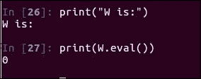
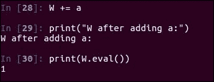

# 简单的计算

首先，我们将看一下张量对象类型。 然后，我们将理解定义计算的 TensorFlow 图。 最后，我们将使用会话运行图，显示如何替换中间值。

## 定义标量和张量

您需要做的第一件事是下载本书的源代码包并打开`simple.py`文件。 您可以使用此文件将行复制并粘贴到 TensorFlow 或 CoCalc 中，也可以直接键入它们。 首先，让我们将`tensorflow`导入为`tf`。 这是在 Python 中引用它的便捷方法。 您需要在`tf.constant`通话中保留常数。 例如，做`a = tf.constant(1)`和`b = tf.constant(2)`：

```py
import tensorflow as tf
# You can create constants in TF to hold specific values
a = tf.constant(1)
b = tf.constant(2)
```

当然，您可以将它们相加并相乘以获得其他值，即`c`和`d`：

```py
# Of course you can add, multiply, and compute on these as you like
c = a + b
d = a * b
```

TensorFlow 数字以张量存储，这是多维数组的一个花哨术语。 如果您将 Python 列表传递给 TensorFlow，它将做正确的事并将其转换为适当尺寸的张量。 您可以在以下代码中看到这一点：

```py
# TF numbers are stored in "tensors", a fancy term for multidimensional arrays. If you pass TF a Python list, it can convert it
V1 = tf.constant([1., 2.])   # Vector, 1-dimensional
V2 = tf.constant([3., 4.])   # Vector, 1-dimensional
M = tf.constant([[1., 2.]])             # Matrix, 2d
N = tf.constant([[1., 2.],[3.,4.]])     # Matrix, 2d
K = tf.constant([[[1., 2.],[3.,4.]]])   # Tensor, 3d+
```

`V1`向量（一维张量）作为`[1\. , 2.]`的 Python 列表传递。 这里的点只是强制 Python 将数字存储为十进制值而不是整数。 `V2`向量是`[3\. , 4\. ]`的另一个 Python 列表。 `M`变量是由 Python 中的列表列表构成的二维矩阵，在 TensorFlow 中创建了二维张量。 `N`变量也是二维矩阵。 请注意，这一行实际上有多行。 最后，`K`是一个真实的张量，包含三个维度。 请注意，最终维度仅包含一个条目，即一个 2 x 2 框。

如果该术语有点混乱，请不要担心。 每当您看到一个奇怪的新变量时，都可以跳回到这一点以了解它可能是什么。

## 张量计算

您还可以做一些简单的事情，例如将张量相加：

```py
V3 = V1 + V2
```

或者，您可以将它们逐个元素相乘，以便将每个公共位置相乘在一起：

```py
# Operations are element-wise by default
M2 = M * M
```

但是，对于真正的矩阵乘法，您需要使用`tf.matmul`，传入两个张量作为参数：

```py
NN = tf.matmul(N,N)
```

## 执行计算

到目前为止，所有内容都已指定 TensorFlow 图； 我们还没有计算任何东西。 为此，我们需要启动一个进行计算的会话。 以下代码创建一个新的会话：

```py
sess = tf.Session()
```

打开会话后，请执行以下操作：`sess.run(NN)`将计算给定的表达式并返回一个数组。 通过执行以下操作，我们可以轻松地将其发送到变量：

```py
output = sess.run(NN)
print("NN is:")
print(output)
```

如果现在运行此单元格，则应该在屏幕上看到`NN`输出的正确张量数组：


使用完会话后，最好将其关闭，就像关闭文件句柄一样：

```py
# Remember to close your session when you're done using it
sess.close()
```

对于交互式工作，我们可以像这样使用`tf.InteractiveSession()`：

```py
sess = tf.InteractiveSession()
```

然后，您可以轻松计算任何节点的值。 例如，输入以下代码并运行单元格将输出`M2`的值：

```py
# Now we can compute any node
print("M2 is:")
print(M2.eval())
```

## 可变张量

当然，并非我们所有的数字都是恒定的。 例如，要更新神经网络中的权重，我们需要使用`tf.Variable`创建适当的对象：

```py
W = tf.Variable(0, name="weight")
```

请注意，TensorFlow 中的变量不会自动初始化。 为此，我们需要使用一个特殊的调用，即`tf.global_variables_initializer()`，然后使用`sess.run()`运行该调用：

```py
init_op = tf.global_variables_initializer()
sess.run(init_op)
```

这是在该变量中放置一个值。 在这种情况下，它将把`0`值填充到`W`变量中。 让我们验证一下`W`是否具有该值：

```py
print("W is:")
print(W.eval())
```

您应该在单元格中看到`0`的`W`的输出值：



让我们看看向其中添加`a`会发生什么：

```py
W += a
print("W after adding a:")
print(W.eval())
```

回想一下`a`是`1`，因此您在这里得到`1`的期望值：



让我们再次添加`a`，以确保我们可以递增并且它确实是一个变量：

```py
W += a
print("W after adding a:")
print(W.eval())
```

现在您应该看到`W`持有`2`，因为我们已经使用`a`对其进行了两次递增：


## 查看和替换中间值

在执行 TensorFlow 计算时，您可以返回或提供任意节点。 让我们定义一个新节点，但同时在 fetch 调用中返回另一个节点。 首先，让我们定义新节点`E`，如下所示：

```py
E = d + b # 1*2 + 2 = 4
```

让我们看看`E`的开头是：

```py
print("E as defined:")
print(E.eval())
```

如您所料，您应该看到`E`等于`4`。 现在让我们看一下如何传递`E`和`d`多个节点，以从`sess.run`调用中返回多个值：

```py
# Let's see what d was at the same time
print("E and d:")
print(sess.run([E,d]))
```

您应该看到输出中返回了多个值，即`4`和`2`：


现在假设我们要使用其他中间值，例如出于调试目的。 返回值时，我们可以使用`feed_dict`将自定义值提供给计算中任何位置的节点。 让我们现在用`d`等于`4`而不是`2`来做：

```py
# Use a custom d by specifying a dictionary
print("E with custom d=4:")
print(sess.run(E, feed_dict = {d:4.}))
```

请记住，`E` 等于 `d + b`，`d`和`b`的值都是`2`。 尽管我们为`d`插入了`4`的新值，但是您应该看到`E`的值现在将输出为`6`：


您现在已经了解了如何使用 TensorFlow 张量进行核心计算。 现在是时候通过建立逻辑回归模型来迈出下一步。