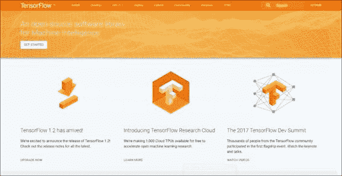
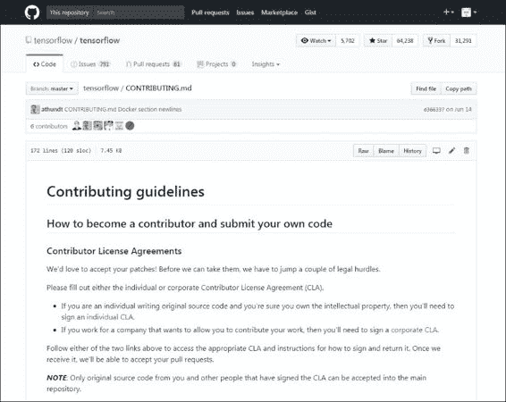

# TensorFlow 的未来

在本部分中，我们将观察 TensorFlow 的变化方式，谁开始使用 TensorFlow 以及如何产生影响。

自 2015 年底发布以来，TensorFlow 已经看到更多发布版本：

TensorFlow 不断更新。 尽管它不是 Google 的正式产品，但它还是开源的，并托管在 GitHub 上。 在撰写本文时，TensorFlow 的版本为 1.2。 最新版本增加了分布式计算功能。 这些超出了本书的范围，但总的来说，它们允许跨多台机器上的多个 GPU 进行计算，以实现最大程度的并行化。 在繁重的开发过程中，更多功能总是指日可待。 TensorFlow 每天变得越来越流行。

几家软件公司最近发布了机器学习框架，但 TensorFlow 在采用方面表现突出。 在内部，Google 正在实践他们的讲道。 他们广受赞誉的 DeepMind 团队已改用 TensorFlow。

此外，许多拥有机器学习或数据科学程序的大学都将 TensorFlow 用于课程和研究项目。 当然，您已经在研究项目中使用过 TensorFlow，因此您处于领先地位。

## 其他一些 TensorFlow 项目

最后，无论大小，其他公司都在使用 TensorFlow。 现在您是 TensorFlow 的从业人员，唯一的限制就是您可能遇到的问题和您的计算资源。 以下是一些有关 TensorFlow 下一步可以解决的问题的想法：

*   Leaf classification from images:

    像字体一样，植物叶子在一个物种中具有相似的样式。 您是否可以修改在本课程中建立的模型，以仅使用图像识别物种？

*   Road sign identification with dashcam video:

    假设您从长途旅行中获得了许多行车记录仪镜头。 高速公路上的路标可以为您提供许多信息，例如您在哪里以及应该走多快。 您可以建立一系列 TensorFlow 模型来查找素材中的速度限制吗？

*   Transportation research predicting travel times:

    此外，无论您的工作距离有多近，通勤时间都太长。 在交通和天气等当前条件下，您应该能够建立基于回归的模型来预测您的旅行时间。

*   Matching algorithm, as for finding a compatible date:

    最后，一家初创公司正在探索使用 TensorFlow 来寻找匹配算法。 如果将来算法会给您带来一个约会，请不要感到惊讶。

基于 TensorFlow 的整洁项目太多，无法一一列举。 但是，有机会，您会发现与自己的兴趣有关的东西，如果没有，那是贡献自己的完美场所。 机器学习库很多，但是 TensorFlow 仍然存在。

尽管本书侧重于深度学习，但 TensorFlow 是一个通用的图计算库。

深度神经网络确实是 TensorFlow 能够很好处理的一小部分数据建模。 但是，正如您在第 1 章入门中的“简单计算”部分所看到的那样，在简单计算中，可以为图规定的任何操作都可以在 TensorFlow 中进行。 一个实际的例子是在 TensorFlow 中实现 k 均值聚类。

更一般而言，可以很好地向量化并且需要某种训练的操作可能会受益于 TensorFlow 的使用。 这一切都说明您是 TensorFlow 的未来！

TensorFlow 是开源的，并且一直在变化。 因此，您可以在 GitHub 上轻松贡献新功能。 这些可能是高度复杂的新模型类型或简单的文档更新。

所有更改都可以改善库。 TensorFlow 的日益普及意味着您是最早掌握它的专业人士之一。 您在机器学习事业或研究中拥有优势。 而且由于它不仅仅是深度学习，所以无论您处于哪个领域，TensorFlow 都可能适用于它的某些方面。