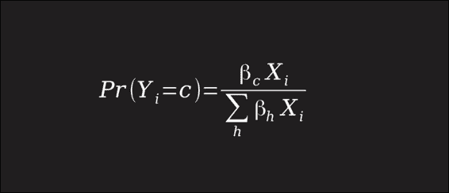

# 逻辑回归模型构建

好的，让我们开始构建一个真正的机器学习模型。 首先，我们将看到提出的机器学习问题：字体分类。 然后，我们将回顾一个简单的分类算法，称为逻辑回归。 最后，我们将在 TensorFlow 中实现逻辑回归。

## 字体分类数据集简介

在开始之前，让我们加载所有必需的模块：

```py
import tensorflow as tf
import numpy as np
```

如果要复制并粘贴到 IPython，请确保将`autoindent`属性设置为`OFF`：

```py
%autoindent
```

`tqdm`模块是可选的； 它只是显示了不错的进度条：

```py
try:
    from tqdm import tqdm
except ImportError:
    def tqdm(x, *args, **kwargs):
        return x
```

接下来，我们将设置`0`的种子，以使每次运行之间的数据分割保持一致：

```py
# Set random seed
np.random.seed(0)
```

在本书中，我们提供了使用五种字体的字符图像数据集。 为方便起见，这些文件存储在压缩的 NumPy 文件（`data_with_labels.npz`）中，该文件可在本书的下载包中找到。 您可以使用`numpy.load`轻松将它们加载到 Python 中：

```py
# Load data
data = np.load('data_with_labels.npz')
train = data['arr_0']/255.
labels = data['arr_1']
```

这里的`train`变量保存从 0 到 1 缩放的实际像素值，`labels`保留原来的字体类型。 因此，它将是 0、1、2、3 或 4，因为总共有五种字体。 您可以打印这些值，因此可以使用以下代码查看它们：

```py
# Look at some data
print(train[0])
print(labels[0])
```

但是，这不是很有启发性，因为大多数值都是零，并且仅屏幕的中央部分包含图像数据：


如果您已安装 Matplotlib，则现在是导入它的好地方。 在需要时，我们将使用`plt.ion()`自动调出数字：

```py
# If you have matplotlib installed
import matplotlib.pyplot as plt
plt.ion()
```

这是每种字体的一些字符示例图：


是的，他们很浮华。 在数据集中，每个图像都表示为像素暗度值的 36 x 36 二维矩阵。 0 值表示白色像素，而 255 表示黑色像素。 两者之间的一切都是灰色阴影。 这是在您自己的计算机上显示这些字体的代码：

```py
# Let's look at a subplot of one of A in each font
f, plts = plt.subplots(5, sharex=True)
c = 91
for i in range(5):
    plts[i].pcolor(train[c + i * 558],
                   cmap=plt.cm.gray_r)
```

如果您的图看起来确实很宽，则可以使用鼠标轻松调整窗口大小。 如果您只是以交互方式进行绘图，则在 Python 中提前调整其大小通常需要做很多工作。 鉴于我们还有许多其他标记的字体图像，我们的目标是确定图像属于哪种字体。 为了扩展数据集并避免过拟合，我们还在 36 x 36 区域内抖动了每个字符，为我们提供了 9 倍的数据点。

在使用较新的模型后重新回到这一点可能会有所帮助。 无论最终模型有多高级，记住原始数据都非常重要。

## 逻辑回归

如果您熟悉线性回归，那么您将了解逻辑回归。 基本上，我们将为图像中的每个像素分配一个权重，然后对这些像素进行加权求和（权重为 beta，像素为`X`）。 这将为我们提供该图像是特定字体的分数。 每种字体都有自己的权重集，因为它们对像素的重视程度不同。 要将这些分数转换为适当的概率（由`Y`表示），我们将使用`softmax`函数将其总和强制在 0 到 1 之间，如下所示。 对于特定图像而言，无论最大概率是多少，我们都将其分类为关联的类别。

您可以在大多数统计建模教科书中阅读有关逻辑回归理论的更多信息。 这是它的公式：



William H. Greene 的《计量经济学分析》（Pearson）于 2012 年出版，这是一本针对应用的很好的参考。

## 准备数据

在 TensorFlow 中实现逻辑回归非常容易，并将作为更复杂的机器学习算法的基础。 首先，我们需要将整数标签转换为单格式。 这意味着，不是将字体类标记为 2，而是将标签转换为[0，0，1，0，0]。 也就是说，我们将`1`放在第二个位置（注意，向上计数在计算机科学中很常见），而`0`则放在其他位置。 这是我们的`to_onehot`函数的代码：

```py
def to_onehot(labels,nclasses = 5):
    '''
    Convert labels to "one-hot" format.
    >>> a = [0,1,2,3]
    >>> to_onehot(a,5)
    array([[ 1.,  0.,  0.,  0.,  0.],
           [ 0.,  1.,  0.,  0.,  0.],
           [ 0.,  0.,  1.,  0.,  0.],
           [ 0.,  0.,  0.,  1.,  0.]])
    '''
    outlabels = np.zeros((len(labels),nclasses))
    for i,l in enumerate(labels):
        outlabels[i,l] = 1
    return outlabels
```

完成此操作后，我们可以继续调用该函数：

```py
onehot = to_onehot(labels)
```

对于像素，在这种情况下，我们实际上并不需要矩阵，因此我们将 36 x 36 的数字展平为长度为 1,296 的一维向量，但这会在以后出现。 另外，回想一下，我们已经重新调整了 0-255 的像素值，使其介于 0 和 1 之间。

好的，我们的最后准备是将数据集分为训练和验证集。 这将有助于我们稍后解决过拟合问题。 训练集将帮助我们确定逻辑回归模型中的权重，而验证集将仅用于确认这些权重在新数据上是否合理：

```py
# Split data into training and validation
indices = np.random.permutation(train.shape[0])
valid_cnt = int(train.shape[0] * 0.1)
test_idx, training_idx = indices[:valid_cnt],\
                         indices[valid_cnt:]
test, train = train[test_idx,:],\
              train[training_idx,:]
onehot_test, onehot_train = onehot[test_idx,:],\
                        onehot[training_idx,:]
```

## 建立 TensorFlow 模型

好的，让我们通过创建一个交互式会话来开始 TensorFlow 代码：

```py
sess = tf.InteractiveSession()
```

这样，我们就在 TensorFlow 中开始了我们的第一个模型。

我们将为`x`使用占位符变量，该变量代表我们的输入图像。 这只是告诉 TensorFlow 我们稍后将通过`feed_dict`为该节点提供值：

```py
# These will be inputs
## Input pixels, flattened
x = tf.placeholder("float", [None, 1296])
```

另外，请注意，我们可以指定此张量的形状，在这里我们将`None`用作大小之一。 `None`的大小允许我们立即将任意数量的数据点发送到算法中以进行批量。 同样，我们将使用变量`y_`来保存我们已知的标签，以便稍后进行训练：

```py
## Known labels
y_ = tf.placeholder("float", [None,5])
```

要执行逻辑回归，我们需要一组权重（`W`）。 实际上，五个字体类别中的每一个都需要 1,296 的权重，这将为我们提供形状。 请注意，我们还希望为每个类别添加一个额外的权重作为偏差（`b`）。 这与添加始终为`1`值的额外输入变量相同：

```py
# Variables
W = tf.Variable(tf.zeros([1296,5]))
b = tf.Variable(tf.zeros([5]))
```

随着所有这些 TensorFlow 变量浮动，我们需要确保对其进行初始化。 现在给他们打电话：

```py
# Just initialize
sess.run(tf.global_variables_initializer())
```

做得好！ 您已经准备好一切。 现在，您可以实现`softmax`公式来计算概率。 由于我们非常仔细地设置权重和输入，因此 TensorFlow 只需调用`tf.matmul`和`tf.nn.softmax`就可以轻松完成此任务：

```py
# Define model
y = tf.nn.softmax(tf.matmul(x,W) + b)
```

而已！ 您已经在 TensorFlow 中实现了整个机器学习分类器。辛苦了。但是，我们从哪里获得权重的值？ 让我们看一下使用 TensorFlow 训练模型。