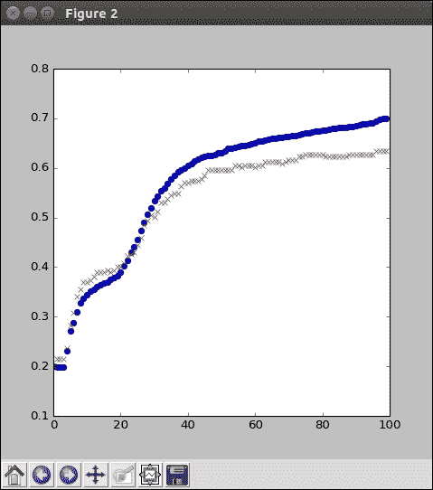
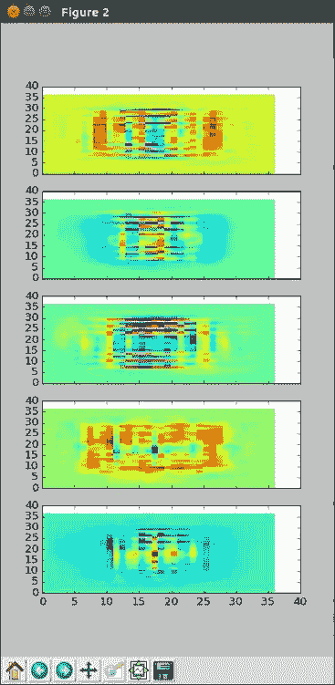

# 逻辑回归训练

首先，您将了解我们的机器学习分类器的损失函数，并在 TensorFlow 中实现它。 然后，我们将通过评估正确的 TensorFlow 节点来快速训练模型。 最后，我们将验证我们的模型是否合理准确，权重是否合理。

## 定义损失函数

优化我们的模型实际上意味着最大程度地减少我们的误差。 使用我们的标签，可以很容易地将它们与模型预测的类概率进行比较。 类别`cross_entropy`函数是测量此函数的正式方法。 尽管确切的统计信息超出了本课程的范围，但是您可以将其视为对模型的惩罚，以期获得更不准确的预测。 为了进行计算，我们将单热的实数标签与预测概率的自然对数相乘，然后将这些值相加并取反。 为方便起见，TensorFlow 已经包含此函数为`tf.nn.softmax_cross_entropy_with_logits()`，我们可以这样称呼它：

```py
# Climb on cross-entropy
cross_entropy = tf.reduce_mean(
        tf.nn.softmax_cross_entropy_with_logits(
        logits = y + 1e-50, labels = y_))
```

请注意，我们在此处添加了一个较小的`1e-50`误差值，以避免数值不稳定问题。

## 训练模型

TensorFlow 的便利之处在于它提供了内置的优化器，以利用我们刚刚编写的损失函数。 梯度下降是一种常见的选择，它将使我们的权重逐渐趋于更好。 这是将更新我们权重的节点：

```py
# How we train
train_step = tf.train.GradientDescentOptimizer(
                0.02).minimize(cross_entropy)
```

在我们实际开始训练之前，我们应该指定一些其他节点来评估模型的表现：

```py
# Define accuracy
correct_prediction = tf.equal(tf.argmax(y,1),
                     tf.argmax(y_,1))
accuracy = tf.reduce_mean(tf.cast(
           correct_prediction, "float"))
```

如果我们的模型将最高概率分配给正确的类别，则`correct_prediction`节点为`1`，否则为`0`。 `accuracy`变量对可用数据的这些预测取平均值，从而使我们对模型的执行情况有一个整体认识。

在进行机器学习训练时，我们经常希望多次使用同一数据点，以挤出所有信息。 每次遍历整个训练数据都称为一个周期。 在这里，我们将每 10 个时间段同时保存训练和验证准确率：

```py
# Actually train
epochs = 1000
train_acc = np.zeros(epochs//10)
test_acc = np.zeros(epochs//10)
for i in tqdm(range(epochs)):
    # Record summary data, and the accuracy
    if i % 10 == 0:
        # Check accuracy on train set
        A = accuracy.eval(feed_dict={
            x: train.reshape([-1,1296]),
            y_: onehot_train})
        train_acc[i//10] = A
        # And now the validation set
        A = accuracy.eval(feed_dict={
            x: test.reshape([-1,1296]),
            y_: onehot_test})
        test_acc[i//10] = A
    train_step.run(feed_dict={
        x: train.reshape([-1,1296]),
        y_: onehot_train})
```

请注意，我们使用`feed_dict`传递不同类型的数据以获得不同的输出值。 最后，`train_step.run`每次迭代都会更新模型。 在典型的计算机上，这只需几分钟，如果使用 GPU，则要少得多，而在功率不足的计算机上则要花更多时间。

您刚刚使用 TensorFlow 训练了模型; 真棒！

## 评估模型准确率

在 1,000 个周期之后，让我们看一下模型。 如果您安装了 Matplotlib，则可以在绘图中查看精度； 如果没有，您仍然可以查看电话号码。 对于最终结果，请使用以下代码：

```py
# Notice that accuracy flattens out
print(train_acc[-1])
print(test_acc[-1])
```

如果您确实安装了 Matplotlib，则可以使用以下代码显示图：

```py
# Plot the accuracy curves
plt.figure(figsize=(6,6))
plt.plot(train_acc,'bo')
plt.plot(test_acc,'rx')
```

您应该看到类似下面的图（请注意，我们使用了一些随机初始化，因此可能并不完全相同）：



验证精度似乎在经过约 400-500 次迭代后趋于平稳； 除此之外，我们的模型可能过拟合或没有学到更多。 同样，即使最终精度大约是 40％，看起来也很差，但请记住，对于五个类别，完全随机的猜测将仅具有 20％的精度。 有了这个有限的数据集，简单的模型就可以做到。

查看计算出的权重通常也很有帮助。 这些可以为您提供有关模型认为重要的线索。 让我们按给定类的像素位置绘制它们：

```py
# Look at a subplot of the weights for each font
f, plts = plt.subplots(5, sharex=True)
for i in range(5):
    plts[i].pcolor(W.eval()[:,i].reshape([36,36]))
```

这应该给您类似于以下的结果（同样，如果图显示得很宽，则可以挤压窗口大小以使其平方）：



我们可以看到，在某些模型中，靠近内部的权重很重要，而外部的权重基本上为零。 这是有道理的，因为没有字体字符到达图像的角落。

同样，请注意，由于随机初始化的影响，最终结果可能看起来有些不同。 随时可以尝试并更改模型的参数； 这就是您学习新事物的方式。

## 总结

在本章中，我们在可以使用的机器上安装了 TensorFlow。 经过一些基本计算的小步骤，我们跳入了机器学习问题，仅通过逻辑回归和几行 TensorFlow 代码就成功构建了一个体面的模型。

在下一章中，我们将看到 TensorFlow 在深度神经网络方面的优势。