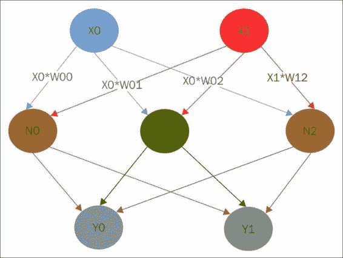

# 基本神经网络

我们的逻辑回归模型运作良好，但本质上是线性的。 将像素的强度加倍会使像素对得分的贡献增加一倍，但我们可能只真正关心像素是否在某个阈值之上或将较小的权重放在较小的值上。 线性可能无法捕获问题的所有细微差别。 解决此问题的一种方法是使用非线性函数转换输入。 让我们看一下 TensorFlow 中的一个简单示例。

首先，请确保加载所需的模块（`tensorflow`，`numpy`和`math`）并启动交互式会话：

```py
import tensorflow as tf
import numpy as np
import math

sess = tf.InteractiveSession()
```

在下面的示例中，我们创建了三个五长向量的正常随机数，这些向量被截断以防止它们过于极端，中心不同：

```py
x1 = tf.Variable(tf.truncated_normal([5],
                 mean=3, stddev=1./math.sqrt(5)))
x2 = tf.Variable(tf.truncated_normal([5],
                 mean=-1, stddev=1./math.sqrt(5)))
x3 = tf.Variable(tf.truncated_normal([5],
                 mean=0, stddev=1./math.sqrt(5)))

sess.run(tf.global_variables_initializer())
```

### 注意

请注意，由于这是随机的，因此您的值可能会有所不同，但这很好。

常见的转换是对输入求平方。 这样做会使更大的值变得更加极端，当然也使所有事情都变得积极起来：

```py
sqx2 = x2 * x2
print(x2.eval())
print(sqx2.eval())
```

您可以在以下屏幕截图中看到结果：


## 对数函数

相反，如果您需要在较小的值中有更多细微差别，则可以尝试采用输入的自然对数或任何基本对数：

```py
logx1 = tf.log(x1)
print(x1.eval())
print(logx1.eval())
```

请参考以下屏幕截图，请注意，较大的值往往会挤在一起，而较小的值则散布得多：


但是，对数不能处理负输入，并且您越接近零，小输入就变得越负。 因此，请注意对数。 最后，是 S 形变换。

## sigmoid 函数

不必担心公式，只需知道正负两个极值分别被压缩为加一或零，而接近零的输入就接近二分之一：

```py
sigx3 = tf.sigmoid(x3)
print(x3.eval())
print(sigx3.eval())
```

在这里，您将看到一个接近一半的示例。 它从四分之一开始，到现在将近一半：


在机器学习中，我们通常将这些转换称为激活函数。 我们通常将输入的加权总和组合到其中。 当您考虑输入，权重和激活函数时，就将其称为神经元，因为它是受生物神经元启发的。

真正的神经元如何在物理大脑中工作的细节不在本书的讨论范围之内。 如果您对此感兴趣，则神经生物学文章可能包含更多内容，或者您​​可以参考 Gordon M. Shepherd 的《神经元学说》作为近期参考。 让我们看一下 TensorFlow 中的一个简单示例：

```py
w1 = tf.constant(0.1)
w2 = tf.constant(0.2)
sess.run(tf.global_variables_initializer())
```

首先，只需创建一些常量`w1`和`w2`即可。 我们将`x1`乘以`w1`，将`x2`乘以`w2`，然后将这些中间值相加，最后将结果通过`tf.sigmoid`的`sigmoid`激活函数进行处理。 查看以下屏幕快照中显示的结果：


同样，现在不必担心确切的公式，您可以拥有各种不同的激活函数。 请注意，这是您迈向自己的神经网络的第一步。

那么，我们如何从单个神经元到整个网络？ 简单！ 一个神经元的输入仅成为网络下一层中另一神经元的输入。



在上图中，我们有一个简单的网络，其中有两个输入`X0`和`X1`，两个输出`Y0`和`Y1`，中间有三个神经元。 `X0`中的值被发送到每个`N`神经元，但是权重不同，该权重乘以与每个相关的`X0`。 `X1`也发送到每个神经元，并具有自己的一组权重。 对于每个神经元，我们计算输入的加权总和，将其通过激活函数，然后产生中间输出。 现在，我们做同样的事情，但是将神经元的输出视为 Ys 的输入。 注意，通过对输入加权和进行非线性激活，我们实际上只是为最终模型计算了一组新的特征。

现在您已经了解了 TensorFlow 中非线性转换的基础以及什么是神经网络。 好吧，它们可能不会让您读懂思想，它们对于深度学习至关重要。 在下一节中，我们将使用简单的神经网络来改进分类算法。