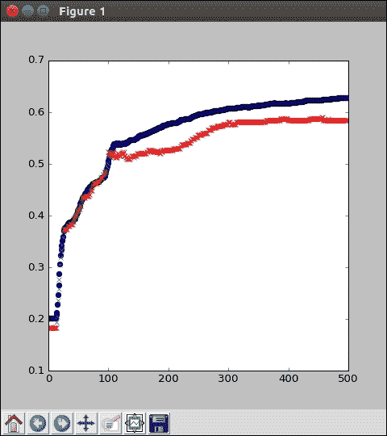
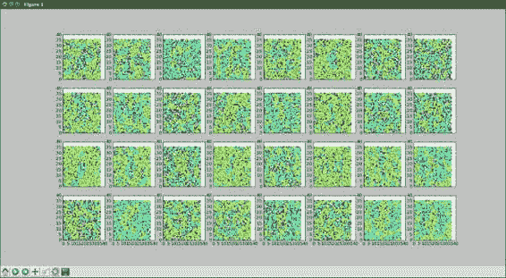

# 单隐藏层的说明

在本节中，我们将仔细研究构建的模型。 首先，我们将验证模型的整体准确率，然后查看模型出了哪些问题。 最后，我们将可视化与多个神经元相关的权重，以查看它们在寻找什么：

```py
plt.figure(figsize=(6, 6))
plt.plot(train_acc,'bo')
plt.plot(test_acc,'rx')
```

确保您已经按照上一节中的步骤训练了模型，如果没有，您可能要在这里停下来并首先进行操作。 由于我们每隔 10 个训练周期就评估模型的准确率并保存结果，因此现在很容易探索模型的演变方式。

使用 Matplotlib，我们可以在同一张图上绘制训练精度（蓝色点）和测试精度（红色点）：



同样，如果您没有 Matplotlib，那就没关系。 您可以只查看数组值本身。 请注意，训练精度（蓝色）通常比测试精度（红色）好一点。 这并不奇怪，因为测试图像对于模型来说是全新的，并且可能包含以前看不见的特征。 另外，观察精度通常会攀升到更多的周期，然后逐渐上升，然后逐渐上升。 我们的模型在这里达到约 60％的准确率； 并非完美，但对简单逻辑回归进行了改进。

要查看我们的模型在哪里混淆，创建混淆矩阵会很有帮助。 也就是说，我们将寻找一个可以说的实际绘图类别。 该模型将其分类为什么？ 形式上是 5x5 矩阵。 对于每个测试图像，如果图像实际上是类别`i`和模型预测类别`j`，则我们增加值和位置`i j`。 请注意，当模型正确时，则为`i = j`。

一个好的模型在对角线上将具有很大的价值，而在其他地方则没有很多。 通过这种类型的分析，很容易看出两个类是否经常彼此混淆，或者模型很少选择某些类。

在以下示例中，我们通过评估`y`（类概率）来创建预测类：

```py
pred = np.argmax(y.eval(feed_dict={x: 
     test.reshape([-1,1296]), y_: onehot_test}), axis = 1)
conf = np.zeros([5,5])
for p,t in zip(pred,np.argmax(onehot_test,axis=1)):
    conf[t,p] += 1

plt.matshow(conf)
plt.colorbar()
```

`np.argmax`函数提取概率最大的位置。 同样，为了确定实际的类别，我们使用`np.argmax`撤消一次热编码。 创建混乱矩阵始于全零数组，然后逐步遍历所有填充的测试数据。Matplotlib 让我们看一下彩色图像，但打印与会者的效果几乎相同：


在前面的输出中，我们看到模型通常做得不错，只是它很少预测类`2`。 由于初始的随机性，您的确切结果可能看起来有些不同。

## 了解模型的权重

正如我们查看逻辑回归模型的权重一样，我们可以监视此模型的权重：

```py
plt.figure(figsize=(6, 6))
f, plts = plt.subplots(4,8, sharex=True)
for i in range(32):
    plts[i//8, i%8].pcolormesh(W1.eval()[:,i].reshape([36,36]))
```

但是，现在我们有 128 个神经元，每个神经元的权重都来自输入像素，权重为 36x36。 让我们看看其中的一些，以了解他们的发现。 同样，如果您没有 Matplotlib，则可以简单地打印出数组以查看相同的行为。 在这里，我们将研究 128 个神经元中的 32 个。 因此，让我们将子图的格式设置为四行八列。 现在，我们逐步评估每个神经元的权重，并将其重塑为图像大小。 双斜杠（`//`）使用整数除法将图像放入适当的行，而百分号（`%`）使用余数（实际上是模块化算术）来选择列。



视觉上，在前面的输出中，您可以看到一些形状突出。 与它们的权重模式相比，某些神经元或多或少具有圆形形状。 其他人看起来很随意，但可能会选择我们不容易理解的特征。 我们也可以尝试可视化输出层的权重，但是这些不再直观。 我们称其为神经网络。 现在，输出逻辑回归是 128 个输入值，以及用于计算 5 个分数的权重。 不再有图像结构，因为每个像素都进入了隐藏层的每个神经元。 现在您知道了如何评估和解释神经网络结果。 做得好！