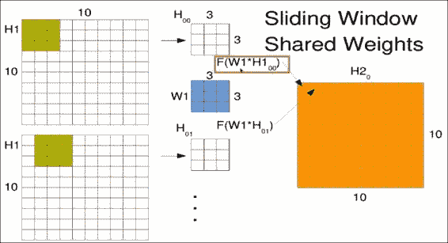
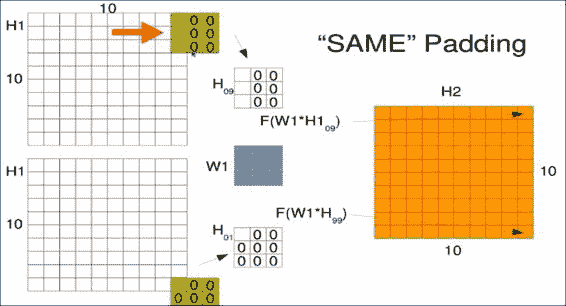
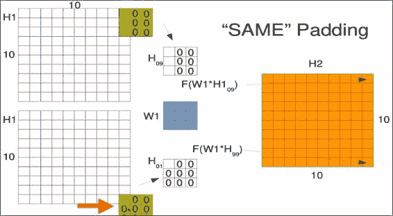
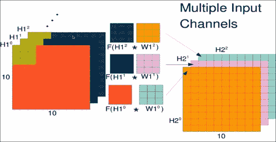
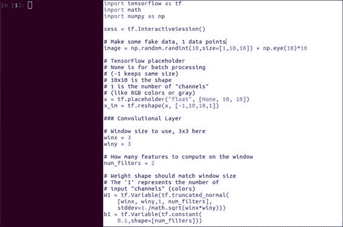
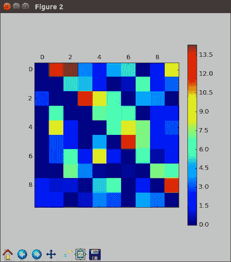
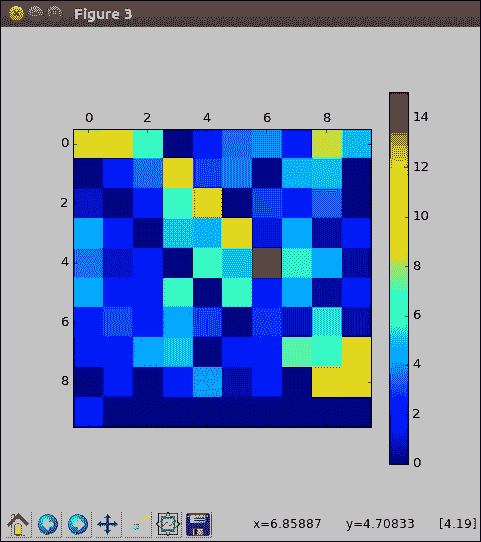
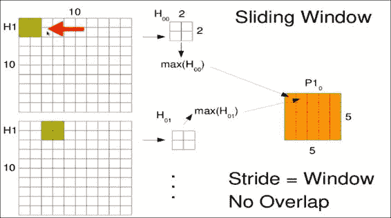
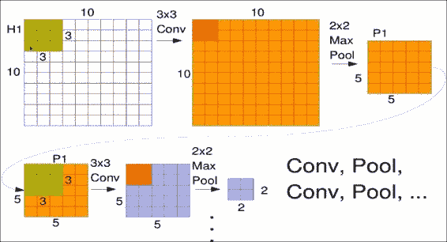
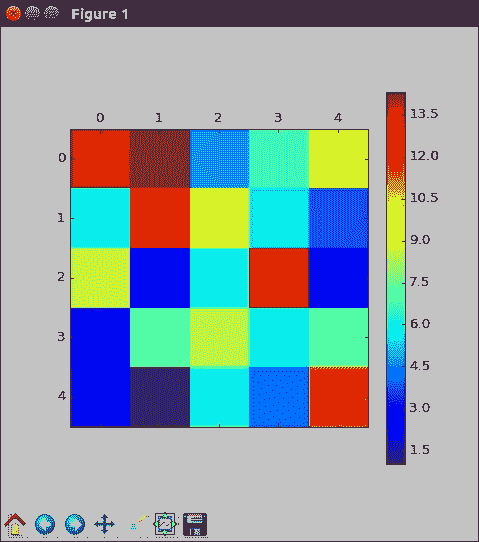

# 三、卷积神经网络

在上一章中，我们探讨了深度神经网络，该神经网络需要更多的参数才能拟合。 本章将指导您完成深度学习中最强大的开发之一，并让我们使用有关问题空间的一些知识来改进模型。 首先，我们将解释一个神经网络中的卷积层，然后是一个 TensorFlow 示例。 然后，我们将对池化层执行相同的操作。 最后，我们将字体分类模型改编为卷积神经网络（CNN），然后看看它是如何工作的。

在本章中，我们将介绍卷积神经网络的背景。 我们还将在 TensorFlow 中实现卷积层。 我们将学习最大池化层并将其付诸实践，并以单个池化层为例。

在本章的最后，您将对以下概念有很好的控制：

*   卷积层动机
*   卷积层应用
*   池化层动机
*   池化层应用
*   深度 CNN
*   更深的 CNN
*   深层 CNN 总结

现在让我们进入卷积层。

# 卷积层动机

在本节中，我们将逐步使用示例图像上的卷积层。 我们将以图形方式看到卷积只是一个滑动窗口。 此外，我们将学习如何从窗口中提取多个特征以及如何接受到窗口的多层输入。

在给定神经元的神经网络的经典密集层中，每个输入特征都具有自己的权重。


如果输入特征完全独立并测量不同的事物，那么这很好，但是如果特征之间存在结构，那该怎么办。 想象发生这种情况的最简单示例是，如果您的输入特征是图像中的像素。 一些像素彼此相邻，而其他像素则相距较远。

对于诸如图像分类（尤其是字体分类）之类的任务，图像中出现小比例尺特征通常并不重要。 我们可以通过在整个图像中滑动较小的窗口来在较大的图像中查找小比例尺特征，这对于使用相同的权重矩阵至关重要，无论该窗口在图像中的位置如何。 这样，我们可以随时随地寻找相同的特征。

假设我们有一个 10x10 的图像，并且想在其中滑动 3x3 的窗口。 通常，机器学习工程师每次只能将此窗口滑动一个像素。 这称为跨步，因此从一个窗口到下一个窗口会有一些重叠。 然后逐个元素地将我们小的 3x3 权重矩阵`W1`乘到我们的窗口`H1[00]`中，对结果求和，并通过称为`F`的激活函数进行处理。



第一个窗口`W1`进入新矩阵的第一个位置，如右图`H2`所示。 窗口以相同的权重滑过一个，但结果占据第二个位置。 请注意，我们实际上是使用左上像素作为存储结果的参考点。 在整个输入图像上滑动窗口以生成卷积输出。 下图中的点只是提醒您，您将在整个空间中滑动此窗口，而不仅是图中所示的两个位置：


您可能想知道当窗口到达图像边缘时会发生什么。 选择实际上是在忽略超出边缘的窗口和使用占位符值填充窗口之间。 对于卷积层，通常的选择是经常用零或平均值填充它们。 由于卷积的输出形状保持不变，因此在 Tensorflow 中被称为相同的填充。



请注意，在最后一个窗口中，这实际上只是看一个值。 但是该像素还参与了许多其他位置，因此不要觉得它被排除在外了。



## 提取多个特征

上一节介绍了滑动窗口的一组权重。 这实际上使您可以计算滑动特征。 但是您可能想要在同一窗口中查找多个对象，例如垂直或水平边缘。

要提取多个特征，您只需要将其他权重矩阵初始化为不同的值即可。 这些多组权重类似于其他神经元和紧密连接的层。 中心的每个权重矩阵`W1`（蓝色）和`W2`（绿色）将为您提供另一个输出矩阵，如下图所示，它们分别为`H2[1]`（粉红色）和`H2[0]`（橙色）。 正确的。


正如您可以从卷积中提取多个特征一样，也可以将多个特征放入这样的网络中。 最明显的例子是具有多种颜色的图像。



现在，观察上图中所示的矩阵。 您确实有一个红色值的矩阵，一个绿色值的矩阵和一个蓝色值的矩阵。 现在，您的权重矩阵实际上是大小为 3x3x3 的权重张量，并且在所有颜色上的窗口大小均相同。 当然，您可以组合所有这些方法，并且通常在计算完窗口上的 32 个特征后，尤其是在第一个卷积层之后进行； 现在，您有许多用于下一层的输入通道。

# 卷积层应用

现在让我们在 TensorFlow 中实现一个简单的卷积层。 首先，我们将遍历此示例中使用的显式形状，因为这通常很棘手。 然后，我们将完成实现和卷积的 TensorFlow 调用。 最后，我们将通过传递一个简单的示例图像直观地检查卷积的结果。

## 探索卷积层

让我们通过一个新的 IPython 会话直接进入代码。



这只是一个小例子，可以帮助我们熟悉将 TensorFlow 用于卷积层。

导入必要的工具后，让我们制作一个假的 10x10 图像，但对角线的值较大：

```py
# Make some fake data, 1 data points
image = np.random.randint(10,size=[1,10,10]) + np.eye(10)*10
```

请注意前面代码中指定的异常大小。 `10, 10`只是图像尺寸，但是`1`是指输入通道的数量。 在这种情况下，我们使用一个输入通道，就像一个灰度图像。 如果您有彩色图像，则这可能是代表红色，绿色和蓝色的三个通道。

尽管此处的示例和研究问题只有一个通道（灰度级），但我们将在 Deep CNN 部分中看到如何从卷积层产生多个输入，从而在下一个卷积层中产生多通道输入。 因此，您仍然会感觉如何处理。

向下移动到 TensorFlow 占位符，我们还做了一些看似不寻常的事情。

```py
x = tf.placeholder("float", [None, 10, 10])
x_im = tf.reshape(x, [-1,10,10,1])
```

在用`10, 10`和`None`自然地写入了占位符变量以用于可能的许多图像批量之后，我们将其称为`tf.reshape`。 这是为了重新排列图像的尺寸，并使它们具有 TensorFlow 期望的形状。 `-1`只是意味着根据需要填写尺寸以保持整体尺寸。 `10,10`当然是我们的图像尺寸，最后的`1`现在是通道数。 同样，如果您有一个带有三个通道的彩色图像，则为三个。

对于我们的卷积层示例，我们希望查看图像的三个像素高和三个像素宽的窗口。 因此，我们指定了以下代码所示的内容：

```py
# Window size to use, 3x3 here
winx = 3
winy = 3
```

另外，让我们从每个窗口中提取两个特征，这就是我们的过滤器数量：

```py
# How many features to compute on the window
num_filters = 2
```

您可能还会看到称为内核数量的信息。

指定权重是使事情真正有趣的地方，但是一旦您知道语法，这并不难。

```py
W1 = tf.Variable(tf.truncated_normal(
    [winx, winy,1, num_filters],
    stddev=1./math.sqrt(winx*winy)))
```

我们正在像以前一样使用`tf.truncated_normal`来生成随机权重。 但是大小非常特殊。 属性`winx`和`winy`当然是我们窗口的尺寸，`1`这里是输入通道的数量，因此只是灰度，而最终尺寸（`num_filters`）是输出尺寸，过滤器的数量。

同样，这类似于密集连接层的神经元数量。 对于随机性的标准差，我们仍然可以缩放到参数数量，但是请注意，每个权重都有一个参数，因此`win x*win y`。

当然，每个输出神经元的偏差都需要一个变量，因此每个滤波器需要一个变量：

```py
b1 = tf.Variable(tf.constant(
    0.1,shape=[num_filters]))
```

`tf.nn.conv2d`函数实际上是此处操作的核心。 我们首先传递调整后的输入`x_im`，然后传递应用于每个窗口的权重，然后传递`strides`参数。

### 注意

`strides`参数告诉 TensorFlow 每一步移动窗口多少。

卷积层的典型用法是向右移动一个像素，完成一行后，向下移动一个像素。 因此有很多重叠之处。 如果要向右移动两个像素，向下移动两个像素； 但是，您可以输入`strides=[1,2,2,1]`。 最后一个数字用于在通道上移动，第一个数字用于在一批中移动单独的图像。 将这些设置为`1`是最常见的方法。

```py
xw = tf.nn.conv2d(x_im, W1,
        strides=[1, 1, 1, 1],
        padding='SAME')
```

`padding='SAME'`与上一节完全相同。 这意味着即使部分滑动窗口超出了输入图像的范围，滑动窗口也会运行。 结合跨度为 1 的步长，这意味着卷积输出尺寸将与输入相同，当然不计算通道或滤波器的数量。

最后，我们要通过激活函数传递此卷积输出：

```py
h1 = tf.nn.relu(xw + b1)
```

在这里，我们使用`relu`函数，它代表整流线性。 基本上，这仅意味着将任何负输入设置为零，而将正输入保持不变。 您会看到这种激活常与卷积神经网络一起使用。 因此，熟悉它是一件好事。 由于我们已经乘以`W1`权重，因此我们只需要在此处添加偏置项即可产生卷积层输出。

在 TensorFlow 中初始化变量：

```py
# Remember to initialize!
sess.run(tf.global_variables_initializer())
```

现在，您有了一个有效的卷积。 太好了！ 让我们快速看一下我们劳动成果。

首先，我们需要评估`h1`节点，并将示例图像作为数据传递：

```py
# Peek inside
H = h1.eval(feed_dict = {x: image})
```

因此，我们知道从哪里开始，让我们使用以下代码查看示例图像：

```py
# Let's take a look
import matplotlib.pyplot as plt
plt.ion()

# Original
plt.matshow(image[0])
plt.colorbar()
```

前面代码中的`0`只是因为奇怪的整形，实际上并没有多个数据点。 您可以看到对角线上的值大于其他值，这与纯随机的区别在于：


让我们看一下第一个输出特征，回想一下输出`H`的形状为`1,10,10,2`，因为有`1`数据点，`10`像素的宽度和高度以及`2`特征。 因此，要抓住第一个，我们需要所有像素和零个带过滤器。 好吧，那很有趣。

```py
# Conv channel 1
plt.matshow(H[0,:,:,0])
plt.colorbar()
```

请注意清零了多少个头寸：



这是`relu`激活的纠正部分。 整齐。 第二个特征应该看起来相似，直到随机初始化为止。 这些权重尚未经过任何训练，因此我们不应该期望它们产生有意义的输出。 在这里，我们看到碰巧有很多零，否则，有很多小值。



您的图像看起来或多或少会有所不同，需要注意的重要一点是，我们的输出尺寸相同，但是就像我们对同一图像有两个不同的视图一样。 在本部分中，我们在 TensorFlow 中创建了我们的第一个卷积层，以掌握所需的奇数形状。

# 池化层动机

现在，让我们了解池化层的共同合作伙伴。 在本节中，我们将学习与卷积层相似的最大池化层，尽管它们在通用用法上有所不同。 最后，我们将展示如何组合这些层以获得最大效果。

## 最大池化层

假设您使用了卷积层从图像中提取特征，并假设，您有一个小的权重矩阵，可以检测图像窗口中的狗形。


当您围绕输出进行卷积时，可能会报告许多附近呈狗形的区域。 但这实际上只是由于重叠。 尽管可能只有小狗的形象，但彼此之间可能并没有多少只狗。 您真的只希望一次看到该特征，最好是在特征最强大的位置。 最大池化层尝试执行此操作。 像卷积层一样，池化层在图像的小滑动窗口上工作。



通常，研究人员在一个或多个卷积层之后添加一个池化层。 您最常看到的窗口大小是 2x2。 您要做的只是提取四个相邻的值，此处指的是`H[00]`，通常不会对其施加任何权重。 现在，我们希望以某种方式组合这四个值，以提取此窗口最有趣的特征。 通常，我们要提取最引人注目的特征，因此我们选择最大值（`max(H[00])`）的像素，然后丢弃其余像素。 但是，您也可以平均结果或做一些更奇特的事情。 同样，尽管我们的卷积窗口有很多重叠，但对于合并窗口，我们通常不希望有任何重叠，因此此步长将等于窗口大小 2。

在前面的 10x10 示例输出中，由于步幅的变化，我们的池化输出仅为 5x5。


与卷积层的另一个主要区别是，池化层通常使用不同的填充方案，而卷积层乐于使用相同的填充并以零填充，我们最常使用具有有效填充的池化层。 这意味着，如果窗口超出图像的范围，则将其丢弃。


这确实会丢失一些边缘信息，但要确保输出不会因填充值而产生偏差。

### 注意

请注意，此示例对池化层使用 9x9 输入，但由于有效的填充和跨度为 2，因此输出仅为 4x4。 8x8 输入也将具有 4x4 输出。

当您将卷积层和池化层组合在一起时，它们的真正优势就体现出来了。 通常，您会在模型的顶部输入端看到一个卷积层，也许带有 3x3 窗口。



这会在图像中的任何位置寻找相同的特征集。

然后立即出现一个 2x2 的最大池化层，仅池出最具特征的区域并缩小尺寸。 您也可以重复此过程。

合并后，您现在实际上具有较小的图像`P1`，但是具有像素强度，而不是像素颜色强度。 因此，您可以创建另一个卷积层以读取第一个池的输出，即底部出现的`P1`，然后可以对此应用另一个最大池化层。 请注意，由于池化，图像大小是如何逐渐缩小的。 直观地，您可以将其视为建立跨越图像较大区域的较大比例的特征。

早期的卷积权重经常训练以检测简单的边缘，而连续的卷积层将这些边缘组合成逐渐更复杂的形状，例如人脸，汽车甚至狗。

# 池化层应用

在本节中，我们将研究用于最大池化的 TensorFlow 函数，然后我们将讨论从池化层过渡到完全连接层的过程。 最后，我们将目视观察池输出以验证其减小的大小。

让我们从上一节中停下来的示例开始。 在开始本练习之前，请确保您已执行所有操作直到英镑池化层。

回想一下，我们通过 3x3 卷积和校正的线性激活来放置 10x10 图像。 现在，让我们在卷积层之后添加一个最大 2x2 的池化层。

```py
p1 = tf.nn.max_pool(h1, ksize=[1, 2, 2, 1],
          strides=[1, 2, 2, 1], padding='VALID')
```

关键是`tf.nn.max_pool`。 第一个参数只是我们先前的卷积层`h1`的输出。 接下来，我们有一个奇怪的`ksize`。 这实际上只是定义了池的窗口大小。 在这种情况下，为 2x2。 第一个`1`指的是一次或批量多少个数据点。 通常，我们将其保留为`1`。 最后的`1`指的是一次包含在合并中的通道数。 请注意，这里有两个通道，因为卷积产生了两个输出滤波器。 但是我们只有`1`在这个位置； 这是一次最多只有一个特征的唯一故障。 步幅的工作方式与卷积层相同。 此处的区别在于我们使用 2x2（即合并窗口的大小），因为我们不希望有任何重叠。 `1`之前和之后的值与卷积层中的值完全相同。

因此，我们的输出将是每个尺寸的一半，这里是 5x5。 最后，我们将`padding`设置为`VALID`。 这意味着，如果一个窗口超出了图像的边缘（实际上是卷积输出），我们将把它扔掉而不使用它。 如果我们的池化层进入另一个卷积层，则可以在以下代码行中添加它：

```py
# We automatically determine the size
p1_size = np.product([s.value for s in p1.get_shape()[1:]])
```

但是，如果您已经完成了卷积层的工作，并且想要像上一节中的模型那样馈入经典的完全连接层，该怎么办？ 这很容易做到； 我们只需要将具有许多输出通道的 2D 矩阵的输出展平到长的一维向量即可。

该行是自动计算展平池输出长度的一种方法。 它所做的就是乘以所有尺寸的大小。 因此，具有两个通道的 5x5 矩阵将产生`5x5x2`，即`50`输出。 下一行`tf.reshape`使用此值实际展平数组：

```py
p1f = tf.reshape(p1, [-1, p1_size ])
```

前面的代码行中的`-1`用于一次处理许多输入图像的潜在批量。 它告诉 TensorFlow 选择第一个维度，以便参数的总数保持不变。 让我们看一下池化层的输出，以便可以看到一个具体示例：

```py
P = p1.eval(feed_dict = {x: image})
```

首先，我们必须根据给定输入图像来实际评估池输出。

由于池化层取决于卷积层，因此 TensorFlow 会自动将图像首先放置在其中。 我们可以以与卷积输出完全相同的方式查看结果。



仅查看前面的第一个过滤器输出，您会注意到它是 5x5。

还要注意，存在的值全部在卷积输出的某些单元中。 由于我们在池化层上的唯一激活是最大值，因此在每个 2x2 窗口中会丢弃三个值，并且一个值会前进到下一层。

# 深度 CNN

现在，在本节中，让我们着重考虑。 在本节中，我们将向我们的字体分类模型添加卷积和池化层组合。 我们将确保将其填充到一个密集层中，然后我们将看到此模型的工作方式。 在进入新的卷积模型之前，请确保开始一个新的 IPython 会话。 执行所有操作，直到`num_filters = 4`，您就可以准备就绪。

## 添加卷积和池化层组合

对于卷积层，我们将使用 5x5 窗口，其中提取了四个特征。 这比示例要大一些。

我们真的希望模型现在学习一些东西。 首先，我们应该使用`tf.reshape`将 36x36 的图像放入大小为 36x36x1 的张量中。

```py
x_im = tf.reshape(x, [-1,36,36,1])
```

这仅对于保持通道数笔直很重要。 现在，我们将如上所述为过滤器和窗口的数量设置常量：

```py
num_filters = 4
winx = 5
winy = 5
```

我们可以像示例问题中那样设置权重张量：

```py
W1 = tf.Variable(tf.truncated_normal(
    [winx, winy, 1 , num_filters],
    stddev=1./math.sqrt(winx*winy)))
```

`winx`和`winy`常数只是窗口尺寸。 `1`值是输入通道数，仅是灰色，`num_filters`是我们要提取的特征数。 同样，这就像密集层中神经元的数量。 偏差的工作方式相同，但只担心过滤器的数量：

```py
b1 = tf.Variable(tf.constant(0.1,
                shape=[num_filters]))
```

对`conv2d`本身的调用也与我们的示例相同。

```py
xw = tf.nn.conv2d(x_im, W1,
                  strides=[1, 1, 1, 1],
                  padding='SAME')
```

好东西，我们在那里推广了它，现在使生活变得轻松。 以下是上述代码行的描述：

*   `x_im`是要转换的输入
*   `W1`属性是我们刚刚指定的权重矩阵
*   `strides`告诉 TensorFlow 每一步将窗口移动一次
*   `padding='SAME'`表示接受图像边缘上的窗口

现在，我们可以通过`relu`激活函数进行卷积，以完成卷积层。 做得好！

```py
h1 = tf.nn.relu(xw + b1)
```

池化层也与上一节完全相同：

```py
# 2x2 Max pooling, no padding on edges
p1 = tf.nn.max_pool(h1, ksize=[1, 2, 2, 1],
        strides=[1, 2, 2, 1], padding='VALID')
```

只是为了回顾一下，我们在每次跨步时将 2x2 窗口`ksize`在卷积输出上滑动两个。 当我们超出数据范围时，`padding='VALID'`告诉我们停止。 现在我们有了卷积池和池化层的组合，让我们附加一个典型的密集连接层：

```py
p1_size = np.product(
          [s.value for s in p1.get_shape()[1:]])
p1f = tf.reshape(p1, [-1, p1_size ])
```

首先，我们需要将合​​并输出调整为一维向量。 这正是我们在上一节中所做的。 我们自动计算池输出的尺寸，以获取用于展平的参数数量。

## CNN 字体分类

现在让我们创建一个包含 32 个神经元的密集连接层：

```py
# Dense layer
num_hidden = 32
W2 = tf.Variable(tf.truncated_normal(
     [p1_size, num_hidden],
     stddev=2./math.sqrt(p1_size)))
b2 = tf.Variable(tf.constant(0.2,
     shape=[num_hidden]))
h2 = tf.nn.relu(tf.matmul(p1f,W2) + b2)
```

当然，我们需要使用`p1_size`该层的输入数量来初始化权重矩阵。 那只是卷积和池输出中的扁平数组。 我们需要`num_hidden` 32 个输出。 有偏项对一些小的非零初始值以相同的方式工作。 在这里，我们碰巧也在使用`relu`激活。

最后，我们像往常一样定义输出逻辑回归：

```py
# Output Layer
W3 = tf.Variable(tf.truncated_normal(
     [num_hidden, 5],
     stddev=1./math.sqrt(num_hidden)))
b3 = tf.Variable(tf.constant(0.1,shape=[5]))

keep_prob = tf.placeholder("float")
h2_drop = tf.nn.dropout(h2, keep_prob)
```

使用旧模型工作，只需确保最终权重使用`num_hidden, 5`作为尺寸即可。 我们在这里有一个名为`dropout`的新元素。 现在不用担心。 我们将在下一部分中确切描述它的作用。 只知道它有助于过拟合。

现在，您可以初始化所有变量并实现对`softmax`的最终调用：

```py
# Just initialize
sess.run(tf.global_variables_initializer())

# Define model
y = tf.nn.softmax(tf.matmul(h2_drop,W3) + b3)
```

请注意您的变量名正确匹配。 好的，现在完成设置，让我们对其进行训练：

```py
# Climb on cross-entropy
cross_entropy = tf.reduce_mean(
        tf.nn.softmax_cross_entropy_with_logits(
        logits = y + 1e-50, labels = y_))

# How we train
train_step = tf.train.GradientDescentOptimizer(
             0.01).minimize(cross_entropy)

# Define accuracy
correct_prediction = tf.equal(tf.argmax(y,1),
                              tf.argmax(y_,1))
accuracy = tf.reduce_mean(tf.cast(
           correct_prediction, "float"))
```

实际上，我们训练模型的方式与之前的模型完全相同。 `cross_entropy`节点测量我们的预测有多少误差，`GradientDescentOptimizer`调整矩阵的权重。 我们还应谨慎定义节点以提高准确率，以便以后进行测量。 现在让我们训练模型约 5,000 次：

```py
# Actually train
epochs = 5000
train_acc = np.zeros(epochs//10)
test_acc = np.zeros(epochs//10)
for i in tqdm(range(epochs), ascii=True):
    # Record summary data, and the accuracy
    if i % 10 == 0:  
        # Check accuracy on train set
        A = accuracy.eval(feed_dict={x: train,
            y_: onehot_train, keep_prob: 1.0})
        train_acc[i//10] = A
        # And now the validation set
        A = accuracy.eval(feed_dict={x: test,
            y_: onehot_test, keep_prob: 1.0})
        test_acc[i//10] = A
    train_step.run(feed_dict={x: train,
        y_: onehot_train, keep_prob: 0.5})
```

这可能需要一个小时或更长时间。 但是试想一下，如果您必须为卷积中的每个窗口训练不同的权重。 通过训练模型，让我们看一下精度曲线。


我们可以看到，该模型优于旧的紧密连接模型，现在达到了 76％的训练准确率和约 68％的验证。

这可能是因为字体即使创建许多不同的字母也以相同的方式使用了许多小范围的特征。 让我们也看看混淆矩阵。


在这里，我们看到该模型仍不完美，但正在取得进展。 第一类仍然没有得到很好的代表，但是它至少在某种程度上是正确的，这与某些以前的模型从来都不是正确的不同。 其他班级大多都不错。 第三课实际上是完美的。 这不是一个容易的问题，因此任何改进都是好的。 我们还设置了一些代码来专门检查权重，但是我们将在以后的部分中保存它。 不过，请随时与他们一起玩耍。 您可以将模型权重和信息保存在检查点文件中。

```py
# Save the weights
saver = tf.train.Saver()
saver.save(sess, "conv1.ckpt")

# Restore
saver.restore(sess, "conv1.ckpt")
```

这很简单。 您只需创建一个`saver`对象，然后将会话保存到文件名即可。 恢复同样容易。 您告诉 TensorFlow 哪个会话将已保存的文件放入和退出。 如果您更喜欢使用 NumPy 手动保存权重，则代码文件还提供以下函数：

```py
# Or use Numpy manually
def save_all(name = 'conv1'):
    np.savez_compressed(name, W1.eval(),
            b1.eval(), W2.eval(), b2.eval(),
            W3.eval(), b3.eval())

save_all()

def load_all(name = 'conv1.npz'):
    data = np.load(name)
    sess.run(W1.assign(data['arr_0']))
    sess.run(b1.assign(data['arr_1']))
    sess.run(W2.assign(data['arr_2']))
    sess.run(b2.assign(data['arr_3']))
    sess.run(W3.assign(data['arr_4']))
    sess.run(b3.assign(data['arr_5']))

load_all()
```

因为 NumPy 格式非常可移植且相当轻巧，所以这会更方便。 如果要将值导出到另一个 Python 脚本中，从而不需要 TensorFlow，则您可能更喜欢 NumPy。 在本节中，我们建立了卷积神经网络对字体进行分类。 一个类似的模型可以解决当前的研究问题。 您处于 TensorFlow 深度学习的最前沿。

# 更深的 CNN

在本节中，我们将向模型添加另一个卷积层。 不用担心，我们将逐步遍历参数以使尺寸调整一致，并且我们将学习什么是 dropout 训练。

## 将 CNN 的一层添加到另一层

与往常一样，在启动新模型时，进行一个新的 IPython 会话并执行直到`num_filters1`的代码。 太好了，现在您都可以开始学习了。 让我们跳入卷积模型。

我们为何不抱有雄心，将第一个卷积层设置为具有`16`过滤器，远远超过旧模型中的`4`。 但是，这次我们将使用较小的窗口大小。 只有 3x3。 另请注意，我们将某些变量名称（例如`num_filters`更改为`num_filters1`）。 这是因为我们将在短时间内拥有另一个卷积层，并且我们可能希望在每个卷积层上使用不同数量的过滤器。 该层的其余部分与以前完全一样，我们可以进行卷积并进行 2x2 max 池化，并使用整流的线性激活单元。

现在，我们添加另一个卷积层。 一些模型先进行几次卷积，然后再进行池化，另一些模型先进行一次卷积，再进行一次池化，再进行一次卷积，依此类推。 我们在这里做后者。 假设您需要四个滤镜和一个 3x3 的窗口。 这很容易产生权重； 与上一层的唯一大不同是我们现在有许多输入通道，请参见`num_filters1`：

```py
# Conv layer 2
num_filters2 = 4
winx2 = 3
winy2 = 3
W2 = tf.Variable(tf.truncated_normal(
    [winx2, winy2, num_filters1, num_filters2],
    stddev=1./math.sqrt(winx2*winy2)))
b2 = tf.Variable(tf.constant(0.1,
     shape=[num_filters2]))
```

这是因为我们有`16`输入通道来自上一层。 如果我们使用`num_filters1 = 8`，则只有`8`输入通道。 将此视为我们将要建立的低级特征。 请记住，通道的数量和输入就像颜色的数量一样，因此，如果您要这样考虑，可能会有所帮助。

当我们进行实际的第二个卷积层时，请确保传入第一个池化层`p1`的输出。 现在，这可以进入新的`relu`激活函数，然后是另一个池化层。 像往常一样，我们使用有效填充进行最大 2x2 的池化：

```py
# 3x3 convolution, pad with zeros on edges
p1w2 = tf.nn.conv2d(p1, W2,
       strides=[1, 1, 1, 1], padding='SAME')
h1 = tf.nn.relu(p1w2 + b2)
# 2x2 Max pooling, no padding on edges
p2 = tf.nn.max_pool(h1, ksize=[1, 2, 2, 1],
     strides=[1, 2, 2, 1], padding='VALID')
```

展平卷积的池化输出也遵循与最后一个模型相同的过程。 但是，这次，我们当然致力于合并输出 2。 将其所有参数从窗口中的所有特征转换为一个大向量：

```py
# Need to flatten convolutional output
p2_size = np.product(
        [s.value for s in p2.get_shape()[1:]])
p2f = tf.reshape(p2, [-1, p2_size ])
```

现在，就像在前面的部分中所做的那样，将密集连接的层插入到我们的神经网络中。 只要确保更新变量名即可。

```py
# Dense layer
num_hidden = 32
W3 = tf.Variable(tf.truncated_normal(
     [p2_size, num_hidden],
     stddev=2./math.sqrt(p2_size)))
b3 = tf.Variable(tf.constant(0.2,
     shape=[num_hidden]))
h3 = tf.nn.relu(tf.matmul(p2f,W3) + b3)
```

现在，我们看到了与我们使用的相同的`tf.nn.dropout`，但在上一个模型中没有解释：

```py
# Drop out training
keep_prob = tf.placeholder("float")
h3_drop = tf.nn.dropout(h3, keep_prob)
```

dropout 是一种从模型中暂时切断神经元的方法。 我们在训练过程中这样做是为了避免过拟合。 每批 TensorFlow 将在此连接层选择不同的神经元输出以进行删除。 面对训练期间的细微变化，这有助于模型变得健壮。 `keep_prob`是保持特定神经元输出的概率。 在训练过程中通常将其设置为`0.5`。

再一次，最终的逻辑回归层和训练节点代码与之前的相同：

```py
# Output Layer
W4 = tf.Variable(tf.truncated_normal(
     [num_hidden, 5],
     stddev=1./math.sqrt(num_hidden)))
b4 = tf.Variable(tf.constant(0.1,shape=[5]))

# Just initialize
sess.run(tf.initialize_all_variables())

# Define model
y = tf.nn.softmax(tf.matmul(h3_drop,W4) + b4)

### End model specification, begin training code

# Climb on cross-entropy
cross_entropy = tf.reduce_mean(
        tf.nn.softmax_cross_entropy_with_logits(
        y + 1e-50, y_))

# How we train
train_step = tf.train.GradientDescentOptimizer(
             0.01).minimize(cross_entropy)

# Define accuracy
correct_prediction = tf.equal(tf.argmax(y,1),
                              tf.argmax(y_,1))
accuracy = tf.reduce_mean(tf.cast(
           correct_prediction, "float"))
```

您现在可以执行该操作。 现在，我们可以训练我们的完整卷积神经网络，这是到目前为止建模的顶点：

```py
# Actually train
epochs = 6000
train_acc = np.zeros(epochs//10)
test_acc = np.zeros(epochs//10)
for i in tqdm(range(epochs), ascii=True):
    # Record summary data, and the accuracy
    if i % 10 == 0:  
        # Check accuracy on train set
        A = accuracy.eval(feed_dict={x: train,
            y_: onehot_train, keep_prob: 1.0})
        train_acc[i//10] = A
        # And now the validation set
        A = accuracy.eval(feed_dict={x: test,
            y_: onehot_test, keep_prob: 1.0})
        test_acc[i//10] = A
    train_step.run(feed_dict={x: train,\
        y_: onehot_train, keep_prob: 0.5})
```

训练该模型可能需要几个小时，因此您可能希望在下一节之前立即开始。

# 深度 CNN 总结

我们将通过评估模型的准确率来总结深层的 CNN。 上一次，我们建立了最终的字体识别模型。 现在，让我们看看它是如何工作的。 在本节中，我们将学习如何在训练期间处理 dropout 问题。 然后，我们将看到模型达到了什么精度。 最后，我们将权重可视化以了解模型学到了什么。

确保在上一个模型中进行训练后，在 IPython 会话中接手。 回想一下，当我们训练模型时，我们使用`dropout`删除了一些输出。

尽管这有助于过拟合，但在测试过程中，我们要确保使用每个神经元。 这既提高了准确率，又确保我们不会忘记评估模型的一部分。 这就是为什么在以下代码行中，`keep_prob`为`1.0`以便始终保留所有神经元的原因。

```py
# Check accuracy on train set
        A = accuracy.eval(feed_dict={x: train,
            y_: onehot_train, keep_prob: 1.0})
        train_acc[i//10] = A
        # And now the validation set
        A = accuracy.eval(feed_dict={x: test,
            y_: onehot_test, keep_prob: 1.0})
        test_acc[i//10] = A
```

让我们看看最终模型是如何做的； 像往常一样看一下训练和测试的准确率：


这里的训练准确率高达 85％，并且测试准确率也相差不远。还不错。模型的效果取决于输入数据的噪声。 如果我们仅包含少量信息，无论是示例数量还是参数或像素数量，那么我们都无法期望模型表现完美。

在这种情况下，您可以应用的一种度量标准是人类将单个字母的图像分类到这些字体中的每种字体的程度。 一些字体非常有特色，而另一些则相似，尤其是某些字母。 由于这是一个新颖的数据集，因此没有直接的基准可以与之进行比较，但是您可以挑战自己以击败本课程中介绍的模型。 如果这样做，您可能希望减少训练时间。 当然，具有较少参数和更简单计算的较小网络将更快。 另外，如果您开始使用 GPU 或至少使用多核 CPU，则可以显着提高速度。 通常 10 倍更好，具体取决于硬件。

其中一部分是并行性，一部分是针对神经网络进行了微调的高效低层库。 但是，最简单的方法是从简单开始，逐步发展到更复杂的模型，就像您一直在处理此问题一样。 回到这个模型，让我们看一下混淆矩阵：

```py
# Look at the final testing confusion matrix
pred = np.argmax(y.eval(
       feed_dict={x: test, keep_prob: 1.0,
       y_: onehot_test}), axis = 1)
conf = np.zeros([5,5])
for p,t in zip(pred,np.argmax(onehot_test,
                              axis=1)):
    conf[t,p] += 1

plt.matshow(conf)
plt.colorbar()
```

以下是输出：


在这里，我们可以看到该模型通常在各个类上都做得很好。 类`1`仍然不是完美的，但是比以前的模型要好得多。 通过将较小比例的特征分解为较大的片段，我们终于找到了一些适合这些类的指标。 您的图像可能看起来不完全相同。 根据权重的随机初始化，结果可能会有些不幸。

让我们看一下第一卷积层的 16 个特征的权重：

```py
# Let's look at a subplot of some weights
f, plts = plt.subplots(4,4)
for i in range(16):
    plts[i//4,i%4].matshow(W1.eval()[:,:,0,i],
            cmap = plt.cm.gray_r)
```

因为窗口大小是 3x3，所以每个都是 3x3 矩阵。 嗯！ 我们可以看到，权重肯定是缩小了小范围的特征。


您可以看到某些事物，例如检测到边缘或圆角，诸如此类。 如果我们使用更大的窗口重做模型，这可能会更加明显。 但是令人印象深刻的是，您可以在这些小补丁中发现多少特征。

我们还要看一下最终的层权重，以了解不同的字体类如何解释最终的紧密连接的神经元。


每行代表一类，每列代表最终的隐藏层神经元之一。 有些类别受到某些神经元的强烈影响，而另一些类别的影响则微乎其微。 您会看到，对于某些类别，给定的神经元在积极或消极方面非常重要，而对于其他类别则非常重要。

请注意，因为我们已经使卷积变平，所以我们不希望在输出中看到明显的结构。 这些列可以按任何顺序排列，但仍会产生相同的结果。 在本章的最后部分，我们检查了一个真实的，实时的，坦率的，非常好的深度卷积神经网络模型。 我们使用卷积层和池化层的做法来构筑该思想，以便提取结构化数据（例如图像）中的小规模和大规模型征。

对于许多问题，这是神经网络最强大的类型之一。

# 总结

在本章中，我们遍历了示例图像上的卷积层。 我们解决了理解卷积的实际问题。 它们可以令人费解，但希望不再造成混淆。 我们最终将此概念应用于 TensorFlow 中的一个简单示例。 我们探索了卷积，池化层的共同伙伴。 我们解释了常见的卷积伙伴 max pooling 层的工作原理。 然后，随着我们的进步，我们通过在示例中添加一个池化层将其付诸实践。 我们还练习了在 TensorFlow 中创建最大池化层。 我们开始将卷积神经网络添加到字体分类问题中。

在下一章中，我们将研究具有时间成分的模型，即循环神经网络（RNN）。

