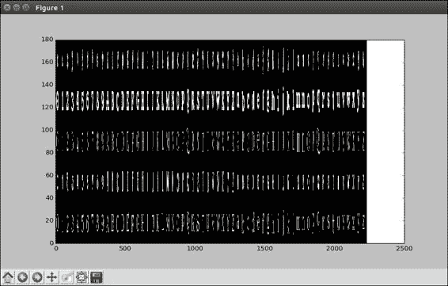
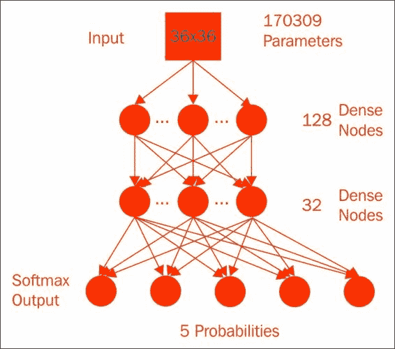
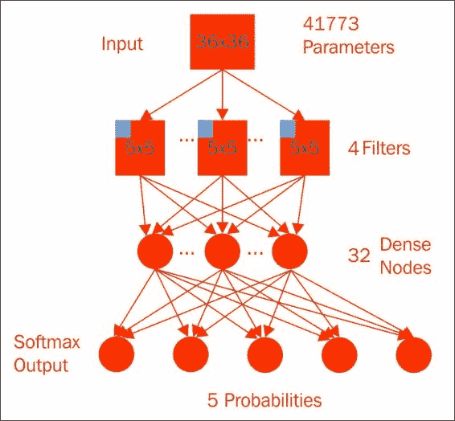
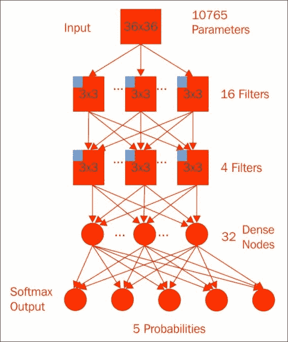
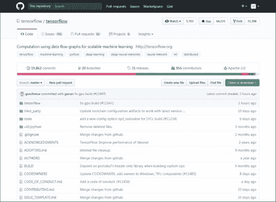

# 五、总结

在上一章中，我们了解了 TensorFlow 和 RNN 模型的另一个接口。 本章将对 TensorFlow 进行总结，探讨我们已经走了多远，以及从这里可以去哪里。 首先，我们将回顾字体分类问题的研究进展，然后简要介绍除深度学习之外的 TensorFlow，并查看其将来的发展方向。 在本章的最后，您将熟悉以下概念：

*   研究评价
*   快速浏览所有模型
*   TensorFlow 的未来
*   其他一些 TensorFlow 项目

现在让我们开始详细研究研究评估。

# 研究评价

在本节中，我们将比较字体分类问题中的模型。 首先，我们应该提醒自己数据是什么样的。 然后，我们将检查简单的逻辑密集神经网络和卷积神经网络模型。 使用 TensorFlow 建模已经走了很长一段路。

但是，在继续进行深度学习之前，让我们回头看看模型如何比较字体分类问题。 首先，让我们再次查看数据，这样我们就不会忽略这个问题。 实际上，让我们看一个包含每种字体的所有字母和数字的图像，只是看看我们有什么形状：

```py
# One look at a letter/digit from each font
# Best to reshape as one large array, then plot
all_letters = np.zeros([5*36,62*36])
for font in range(5):
    for letter in range(62):
        all_letters[font*36:(font+1)*36,
                letter*36:(letter+1)*36] = \
                train[9*(font*62 + letter)]
```

Matplotlib 需要处理很多子图。 因此，我们将创建一个新数组，高 5 幅图像，5 种字体乘以 36 像素，宽 62 幅图像，62 个字母或数字乘以 36 像素。 分配零数组后，我们可以将训练图像堆叠到其中。 字体和字母充当索引，并且我们在大型数组中一次设置 36x36 的值。 注意，这里我们在`train`数组中有`9`，因为我们每个字母只采取一种抖动类型。

让我们来看一下`pcolormesh`的快速调用：

```py
plt.pcolormesh(all_letters,
        cmap=plt.cm.gray)
```



如您所见，我们拥有整个字母，大写和小写以及数字 0 到 9。某些字体看起来与其他字体相似，而无论如何`0`字体在其自身的世界中，无论如何对于人眼都是如此。 每种字体都有有趣的样式属性，我们希望我们的模型能够继续使用。

# 快速浏览所有模型

让我们回顾一下我们构建的每个模型，以对这些字体及其优点和缺点进行建模：


乍一看，我们缓慢地建立了更复杂的模型，并考虑了数据的结构以提高准确率。

## 逻辑回归模型

首先，我们从一个简单的逻辑回归模型开始：


它具有 36x36 像素外加 1 倍乘以 5 类总权重，即我们需要训练的 6,485 个参数。 经过 1,000 次训练后，此模型的验证准确率达到了 40％。 您的结果可能会有所不同。 这相对较差，但是该模型具有一些优势。

让我们回头看一下代码：

```py
# These will be inputs
## Input pixels, flattened
x = tf.placeholder("float", [None, 1296])
## Known labels
y_ = tf.placeholder("float", [None,5])

# Variables
W = tf.Variable(tf.zeros([1296,5]))
b = tf.Variable(tf.zeros([5]))

# Just initialize
sess.run(tf.initialize_all_variables())

# Define model
y = tf.nn.softmax(tf.matmul(x,W) + b)
```

逻辑回归的简单性意味着我们可以直接看到并计算每个像素如何影响类概率。 这种简单性也使模型在训练中相对较快地收敛，并且当然也易于编程，因为它只需要几行 TensorFlow 代码。

## 单隐层神经网络模型

我们的下一个模型是具有最终 Softmax 激活层的单个隐藏层密集连接的神经网络，等效于逻辑回归：


该模型具有 36x36 像素，外加 1 个偏移乘以 128 个节点，再加上 128 个隐藏节点加上 1 个偏移乘以 5 个类的总权重，即 166,661 个参数。 隐藏层使用`sigmoid`激活函数来实现非线性。 在经过 5,000 个周期后，参数的纠缠达到了约 60％的验证准确率，这是一个很大的改进。 但是，此改进的代价是大量增加了计算复杂性中的参数数量，您可以从代码中大致了解一下：

```py
# These will be inputs
## Input pixels, flattened
x = tf.placeholder("float", [None, 1296])
## Known labels
y_ = tf.placeholder("float", [None,5])

# Hidden layer
num_hidden = 128
W1 = tf.Variable(tf.truncated_normal([1296, num_hidden],
                                stddev=1./math.sqrt(1296)))
b1 = tf.Variable(tf.constant(0.1,shape=[num_hidden]))
h1 = tf.sigmoid(tf.matmul(x,W1) + b1)

# Output Layer
W2 = tf.Variable(tf.truncated_normal([num_hidden, 5],
                                   stddev=1./math.sqrt(5)))
b2 = tf.Variable(tf.constant(0.1,shape=[5]))

# Just initialize
sess.run(tf.initialize_all_variables())

# Define model
y = tf.nn.softmax(tf.matmul(h1,W2) + b2)
```

我们不再具有将单个像素分类到概率的简单函数。 但这仅需要几行编码，并且表现会更好。

## 深度神经网络

深度神经网络更进一步，由第一层的 128 个节点组成，馈入下一层的 32 个节点，然后馈入 Softmax 以获得 170,309 个参数； 真的没有那么多：



经过 25,000 个周期后，我们的验证准确率微幅提高了 63％：

```py
# These will be inputs
## Input pixels, flattened
x = tf.placeholder("float", [None, 1296])
## Known labels
y_ = tf.placeholder("float", [None,5])

# Hidden layer 1
num_hidden1 = 128
W1 = tf.Variable(tf.truncated_normal([1296,num_hidden1],
                               stddev=1./math.sqrt(1296)))
b1 = tf.Variable(tf.constant(0.1,shape=[num_hidden1]))
h1 = tf.sigmoid(tf.matmul(x,W1) + b1)

# Hidden Layer 2
num_hidden2 = 32
W2 = tf.Variable(tf.truncated_normal([num_hidden1,
            num_hidden2],stddev=2./math.sqrt(num_hidden1)))
b2 = tf.Variable(tf.constant(0.2,shape=[num_hidden2]))
h2 = tf.sigmoid(tf.matmul(h1,W2) + b2)

# Output Layer
W3 = tf.Variable(tf.truncated_normal([num_hidden2, 5],
                                   stddev=1./math.sqrt(5)))
b3 = tf.Variable(tf.constant(0.1,shape=[5]))

# Just initialize
sess.run(tf.initialize_all_variables())

# Define model
y = tf.nn.softmax(tf.matmul(h2,W3) + b3)
```

更深层次的静态模型可能会做得更好，但这证明了深度学习的某些优势，可以处理相当大的非线性，并且这再次花费了一些额外的编程精力。

## 卷积神经网络

紧密连接的神经网络工作得很好，但是字体是由它们的样式而不是特定的像素定义的：



重复出现的局部特征应该是您模型的重要线索。 我们使用卷积神经网络捕获了其中一些局部特征。 我们从一个卷积层开始，一个 5x5 窗口，使用整流线性单元，通过四个额外的偏项计算四个特征，并提取了有趣的局部参数。 接下来，我们将 2x2 的最大池化层应用于每个特征，从而将中间值的数量减少到 18x18x4 加上 1 个偏差。 将其平整为 1,297 个数字，并放入一个密集的神经网络的 32 个节点，然后进行 Softmax 激活，从而完成了具有 41,773 个参数的模型。

尽管实现和代码比以前要花更多的精力，但是这可以很好地缩减模型的整体大小：

```py
# Conv layer 1
num_filters = 4
winx = 5
winy = 5
W1 = tf.Variable(tf.truncated_normal(
    [winx, winy, 1 , num_filters],
    stddev=1./math.sqrt(winx*winy)))
b1 = tf.Variable(tf.constant(0.1,
                shape=[num_filters]))
# 5x5 convolution, pad with zeros on edges
xw = tf.nn.conv2d(x_im, W1,
                  strides=[1, 1, 1, 1],
                  padding='SAME')
h1 = tf.nn.relu(xw + b1)
# 2x2 Max pooling, no padding on edges
p1 = tf.nn.max_pool(h1, ksize=[1, 2, 2, 1],
        strides=[1, 2, 2, 1], padding='VALID')

# Need to flatten convolutional output for use in dense layer
p1_size = np.product(
          [s.value for s in p1.get_shape()[1:]])
p1f = tf.reshape(p1, [-1, p1_size ])

# Dense layer
num_hidden = 32
W2 = tf.Variable(tf.truncated_normal(
     [p1_size, num_hidden],
     stddev=2./math.sqrt(p1_size)))
b2 = tf.Variable(tf.constant(0.2,
     shape=[num_hidden]))
h2 = tf.nn.relu(tf.matmul(p1f,W2) + b2)

# Output Layer
W3 = tf.Variable(tf.truncated_normal(
     [num_hidden, 5],
     stddev=1./math.sqrt(num_hidden)))
b3 = tf.Variable(tf.constant(0.1,shape=[5]))

keep_prob = tf.placeholder("float")
h2_drop = tf.nn.dropout(h2, keep_prob)
```

仅训练了 5000 个周期后，我们就清除了 68％的准确率。 我们确实必须对卷积进行编码，但这并不是那么困难。 通过对问题的结构应用一些知识，我们同时减小了模型大小，但提高了准确率。 干得好！

## 深卷积神经网络

结合了深度和卷积方法，我们最终创建了一个具有几个卷积层的模型：



尽管我们使用了较小的 3x3 窗口，但我们在第一个卷积层上计算了 16 个滤镜。 在进行最大 2x2 的池化之后，我们再次使用另一个 3x3 窗口和 4 个过滤器对池化值进行了处理。 另一个合并层再次馈入 32 个紧密连接的神经元和 Softmax 输出。 因为在馈入密集神经网络之前我们在池中有更多的卷积，所以在此模型中实际上我们具有较少的参数（准确地说是 10,765 个），几乎与逻辑回归模型一样少。 但是，该模型以 6,000 个周期的速度达到了 80％的验证准确率，证明了您的新深度学习和 TensorFlow 技能。

```py
# Conv layer 1
num_filters1 = 16
winx1 = 3
winy1 = 3
W1 = tf.Variable(tf.truncated_normal(
    [winx1, winy1, 1 , num_filters1],
    stddev=1./math.sqrt(winx1*winy1)))
b1 = tf.Variable(tf.constant(0.1,
                shape=[num_filters1]))
# 5x5 convolution, pad with zeros on edges
xw = tf.nn.conv2d(x_im, W1,
                  strides=[1, 1, 1, 1],
                  padding='SAME')
h1 = tf.nn.relu(xw + b1)
# 2x2 Max pooling, no padding on edges
p1 = tf.nn.max_pool(h1, ksize=[1, 2, 2, 1],
        strides=[1, 2, 2, 1], padding='VALID')

# Conv layer 2
num_filters2 = 4
winx2 = 3
winy2 = 3
W2 = tf.Variable(tf.truncated_normal(
    [winx2, winy2, num_filters1, num_filters2],
    stddev=1./math.sqrt(winx2*winy2)))
b2 = tf.Variable(tf.constant(0.1,
     shape=[num_filters2]))
# 3x3 convolution, pad with zeros on edges
p1w2 = tf.nn.conv2d(p1, W2,
       strides=[1, 1, 1, 1], padding='SAME')
h1 = tf.nn.relu(p1w2 + b2)
# 2x2 Max pooling, no padding on edges
p2 = tf.nn.max_pool(h1, ksize=[1, 2, 2, 1],
     strides=[1, 2, 2, 1], padding='VALID')
```

# TensorFlow 的未来

在本部分中，我们将观察 TensorFlow 的变化方式，谁开始使用 TensorFlow 以及如何产生影响。

自 2015 年底发布以来，TensorFlow 已经看到更多发布版本：



TensorFlow 不断更新。 尽管它不是 Google 的正式产品，但它还是开源的，并托管在 GitHub 上。 在撰写本文时，TensorFlow 的版本为 1.2。 最新版本增加了分布式计算功能。 这些超出了本书的范围，但总的来说，它们允许跨多台机器上的多个 GPU 进行计算，以实现最大程度的并行化。 在繁重的开发过程中，更多功能总是指日可待。 TensorFlow 每天变得越来越流行。

几家软件公司最近发布了机器学习框架，但 TensorFlow 在采用方面表现突出。 在内部，Google 正在实践他们的讲道。 他们广受赞誉的 DeepMind 团队已改用 TensorFlow。


此外，许多拥有机器学习或数据科学程序的大学都将 TensorFlow 用于课程和研究项目。 当然，您已经在研究项目中使用过 TensorFlow，因此您处于领先地位。

## 其他一些 TensorFlow 项目

最后，无论大小，其他公司都在使用 TensorFlow。 现在您是 TensorFlow 的从业人员，唯一的限制就是您可能遇到的问题和您的计算资源。 以下是一些有关 TensorFlow 下一步可以解决的问题的想法：

*   图像中的叶子分类：

    像字体一样，植物叶子在一个物种中具有相似的样式。 您是否可以修改在本课程中建立的模型，以仅使用图像识别物种？

*   带有行车记录仪视频的路标识别：

    假设您从长途旅行中获得了许多行车记录仪镜头。 高速公路上的路标可以为您提供许多信息，例如您在哪里以及应该走多快。 您可以建立一系列 TensorFlow 模型来查找素材中的速度限制吗？

*   预测出行时间的运输研究：

    此外，无论您的工作距离有多近，通勤时间都太长。 在交通和天气等当前条件下，您应该能够建立基于回归的模型来预测您的旅行时间。

*   用于查找兼容日期的匹配算法：

    最后，一家初创公司正在探索使用 TensorFlow 来寻找匹配算法。 如果将来算法会给您带来一个约会，请不要感到惊讶。

基于 TensorFlow 的整洁项目太多，无法一一列举。 但是，有机会，您会发现与自己的兴趣有关的东西，如果没有，那是贡献自己的完美场所。 机器学习库很多，但是 TensorFlow 仍然存在。

尽管本书侧重于深度学习，但 TensorFlow 是一个通用的图计算库。


深度神经网络确实是 TensorFlow 能够很好处理的一小部分数据建模。 但是，正如您在第 1 章入门中的“简单计算”部分所看到的那样，在简单计算中，可以为图规定的任何操作都可以在 TensorFlow 中进行。 一个实际的例子是在 TensorFlow 中实现 k 均值聚类。

更一般而言，可以很好地向量化并且需要某种训练的操作可能会受益于 TensorFlow 的使用。 这一切都说明您是 TensorFlow 的未来！

TensorFlow 是开源的，并且一直在变化。 因此，您可以在 GitHub 上轻松贡献新功能。 这些可能是高度复杂的新模型类型或简单的文档更新。


所有更改都可以改善库。 TensorFlow 的日益普及意味着您是最早掌握它的专业人士之一。 您在机器学习事业或研究中拥有优势。 而且由于它不仅仅是深度学习，所以无论您处于哪个领域，TensorFlow 都可能适用于它的某些方面。

# 总结

在本章中，我们回顾了如何从谦虚的 Logistic 回归模型爬升到使用深度卷积神经网络对字体进行分类的高度。 我们还讨论了 TensorFlow 的未来。 最后，我们回顾了用于字体分类的 TensorFlow 模型，并回顾了其准确率。 我们还花了一些时间来讨论 TensorFlow 的发展方向。 恭喜！ 您现在已经精通 TensorFlow。 您已将其应用于本系列中的多个研究问题和模型，并了解了其广泛应用。

下一步是在您自己的项目中部署 TensorFlow。 造型愉快！

