# 十、自动图像字幕生成器

在前面的章节中，我们研究了一些案例研究，这些案例研究将迁移学习应用于计算机视觉以及**自然语言处理**（**NLP**）中的问题。 但是，这些都是它们各自特定领域中的问题。 在本章中，我们将专注于构建将这两个流行领域（计算机视觉和 NLP）结合在一起的智能系统。 更具体地说，我们将专注于构建与机器翻译相结合的对象识别系统，以构建自动图像字幕生成器。

图像字幕的想法并不是什么新鲜事物。 通常，存在于各种媒体资源（例如书籍，论文或社交媒体）中的任何图像通常都需要加上适当的文本说明，以获取更好的含义和上下文。 使这项任务变得艰巨的是，图像标题通常是由一个或多个句子组成的自由流动的自然语言。 因此，由于用于图像标题的文本数据的非结构化性质，这不是传统的图像分类问题。

可以通过结合使用计算机视觉领域专家的预训练模型（例如**视觉几何组**（**VGG**）和 Inception ）以及序列模型（例如**循环神经网络**（**RNN**）或**长短期记忆**（**LSTM**）），以生成单词序列以形成图片说明的适当单词。 在本章中，我们将探索一种有趣的方法来构建自动图像字幕或场景识别系统。

我们将涵盖构建此系统的以下主要方面，该系统由深度学习和迁移学习提供支持：

*   了解图像字幕
*   制定目标
*   了解数据
*   自动图像字幕的方法
*   使用迁移学习的图像特征提取
*   为我们的字幕建立词汇表
*   构建图像标题数据集生成器
*   建立我们的图像字幕编解码器深度学习模型
*   训练我们的图像字幕深度学习模型
*   自动图像字幕实战

我们将涵盖计算机视觉和 NLP 的基本概念，以构建我们的自动图像标题生成器。 我们将深入研究适合的深度学习架构，并结合迁移学习，以在流行且易于使用的图像数据集之上实现该系统。 我们还将展示如何在新的照片和场景上构建和测试我们的自动图像标题生成器。 您可以在 [GitHub 存储库](https://github.com/dipanjanS/hands-on-transfer-learning-with-python)中的`Chapter 11`文件夹中快速阅读本章的代码。 可以根据需要参考本章。 我们还将在那里发布一些奖金示例。

# 了解图像字幕

到目前为止，您应该了解图像字幕的意义和含义。 该任务可以简单地定义为为任何图像编写和记录自由流动的自然文本描述。 通常用于描述图像中的各种场景或事件。 这也通常称为**场景识别**。 让我们看下面的例子：

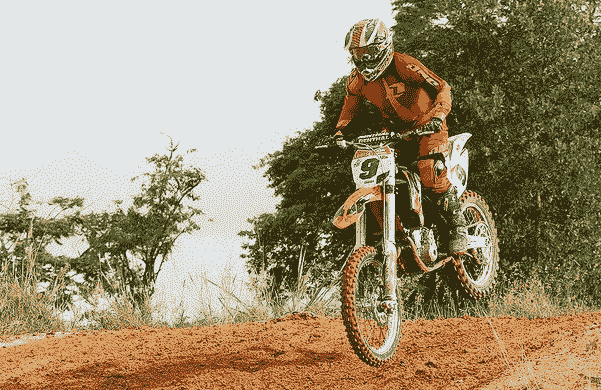

看着这个场景，合适的标题或描述是什么？ 以下是对场景的所有有效描述：

*   越野摩托车手在山上
*   一个家伙在山上的空中的自行车上
*   一辆越野车车手正在一条肮脏的道路上快速移动
*   骑自行车的人在空中骑黑摩托车

您会看到所有这些标题都是有效的并且相似，但是使用不同的词来传达相同的含义。 这就是为什么自动生成图像标题并非易事的原因。

实际上，流行论文[《展示和演讲：神经图像字幕生成器》](https://arxiv.org/abs/1411.4555)（Vinyals 及其合作者，2015 年）描述了图像字幕，从中我们汲取了构建此系统的灵感：

*自动描述图像的内容是连接计算机视觉和自然语言处理的人工智能的基本问题。*

对于一个人来说，只需瞥一眼照片或图像几秒钟就足以生成基于自然语言的字幕。 但是，由于大多数计算机视觉问题都集中在识别和分类问题上，因此使**人工智能**（**AI**）执行此任务极具挑战性。 就复杂性而言，这是有关核心计算机视觉问题的一些主要任务：

*   **图像分类和识别**：这涉及经典的有监督学习问题，其中主要目标是基于几个预定义的类类别（通常称为**类标签**）将图像分配给特定类别 。 流行的 ImageNet 竞赛就是这样一项任务。
*   **图像标注**：稍微复杂一点的任务，我们尝试使用图像中各个实体的描述来标注图像。 通常，这涉及图像中特定部分或区域的类别，甚至是基于自然语言的文本描述。
*   **图像标题或场景识别**：我们尝试使用准确的基于自然语言的文本描述来描述图像的另一项复杂任务。 这是本章重点关注的领域。

图像字幕的任务不是什么新鲜事。 已有多种利用技术的现有方法，例如将图像中各个实体的文本描述缝合在一起以形成描述，甚至使用基于模板的文本生成技术。 但是，对于该任务，使用深度学习是一种更强大，更有效的方法。

# 制定目标

我们实际案例研究的主要目标是图像字幕或场景识别。 在一定程度上，这是一个监督学习问题，而不是传统的分类问题。 在这里，我们将处理一个称为`Flickr8K`的图像数据集，其中包含图像或场景的样本以及描述它们的相应自然语言标题。 这个想法是建立一个可以从这些图像中学习并自动开始为图像添加字幕的系统。

如前所述，传统的图像分类系统通常将图像分类或分类为预定义的类。 在前面的章节中，我们已经构建了这样的系统。 但是，图像字幕系统的输出通常是形成自然语言文本描述的单词序列； 这比传统的监督分类系统更加困难。

我们仍将监督模型训练的性质，因为我们将必须基于训练图像数据及其相应的字幕说明来构建模型。 但是，建立模型的方法会略有不同。 我们将利用迁移学习和深度学习中的概念照常构建此系统。 更具体地说，我们将结合使用**深层卷积神经网络**（**DCNNs**）和顺序模型。

# 了解数据

让我们看一下将用于构建模型的数据。 为简单起见，我们将使用`Flickr8K`数据集。 该数据集包括从流行的图像共享网站 Flickr 获得的图像。 要下载数据集，可以通过填写以下[伊利诺伊大学计算机科学系的表格](https://forms.illinois.edu/sec/1713398)来请求它，您应该在电子邮件中获取下载链接。

要查看与每个图像有关的详细信息，可以访问[其网站](http://nlp.cs.illinois.edu/HockenmaierGroup/8k-pictures.html)，其中讨论了每个图像及其图像。 源，以及每个图像的五个基于文本的标题。 通常，任何样本图像都将具有类似于以下内容的标题：


您可以清楚地看到图像及其相应的标题。 很明显，所有标题都试图描述相同的图像或场景，但是它可能专注于图像的特定和不同方面，这使自动化成为一项艰巨的任务。 我们还建议读者查看[《将图像描述作为排名任务：数据，模型和评估指标》](https://pdfs.semanticscholar.org/f126/ec304cdad464f6248ac7f73a186ca26db526.pdf)（Micah Hodosh 等人，IJCAI 2015）。

单击下载链接时，将获得两个文件：

*   `Flickr8k_Dataset.zip`：所有原始图像和照片的 1 GB ZIP 存档
*   `Flickr8k_text.zip`：3 MB 的 ZIP 存档，其中包含照片的所有自然语言文本说明，这些文本说明为标题

`Flickr_8k.devImages.txt`，`lickr_8k.trainImages.txt`和`Flickr_8k.testImages.txt`文件分别包含 6,000、1,000 和 1,000 个图像的文件名。 我们将合并`dev`和`train`图像，以构建包含 7,000 张图像的训练数据集，并使用包含 1,000 张图像的测试数据集进行评估。 每个图像都有五个不同但相似的标题，可在`Flickr8k.token.txt`文件中找到。

# 自动图像字幕的方法

现在，我们将讨论构建自动图像字幕系统的方法。 正如我之前提到的，我们的方法将利用基于深度神经网络的方法以及将学习迁移到图像字幕的方法。 这得益于流行论文[《Show and Tell：神经图像字幕生成器》](https://arxiv.org/abs/1411.4555)（Oriol Vinyals 等人，2015）。 我们将在概念上概述我们的方法，然后将其转换为将用于构建自动图像字幕系统的实用方法。 让我们开始吧！

# 概念方法

成功的图像字幕系统需要一种将给定图像转换为单词序列的方法。 为了从图像中提取正确和相关的特征，我们可以利用 DCNN，再结合循环神经网络模型（例如 RNN 或 LSTM），我们可以在给定源图像的情况下，构建混合生成模型以开始生成单词序列作为标题。

因此，从概念上讲，这个想法是建立一个混合模型，该模型可以将源图像`I`作为输入，并可以进行训练以使可能性最大， `P(S|I)`，这样`S`是单词序列的输出，这是我们的目标输出，可以由`S = {S [1], S[2], ..., S[n]}`表示，这样每个单词`S[w]`都来自给定的词典，这就是我们的词汇。 该标题`S`应该能够对输入图像给出恰当的描述。

神经机器翻译是构建这样一个系统的绝佳灵感。 通常在语言模型中用于语言翻译，模型架构涉及使用 RNN 或 LSTM 构建的编码器-解码器架构。 通常，编码器涉及一个 LSTM 模型，该模型从源语言中读取输入语句并将其转换为密集的定长向量。 然后将其用作解码器 LSTM 模型的初始隐藏状态，最终以目标语言生成输出语句。

对于图像字幕，我们将利用类似的策略，其中处理输入的编码器将利用 DCNN 模型，因为我们的源数据是图像。 到目前为止，我们已经看到了基于 CNN 的模型在从图像中进行有效且丰富的特征提取的优势。 因此，源图像数据将转换为密集数字固定长度向量。 通常，利用迁移学习方法的预训练模型将是最有效的方法。 此向量将用作我们的解码器 LSTM 模型的输入，该模型将生成字幕说明（如单词序列）。 从原始论文中汲取灵感，可以用数学方式表示要最大化的目标，如下所示：


在此，`Θ`表示模型参数，`I`表示输入图像，`S`是其相应的由单词序列组成的标题描述。 考虑到长度为`N`的字幕说明，表示总共`N`个字，我们可以对`{S[0], S[1], ...，S[N]}`使用链式规则，如下所示：


因此，在模型训练期间，我们有一对`(I, S)`图像标题作为输入，其思想是针对上一个方程式优化对数概率的总和，使用有效算法（例如随机梯度下降）来完整训练数据。 考虑到前面公式的 RHS 中的项序列，基于 RNN 的模型是合适的选择，这样，直到`t-1`的可变单词数依次由存储状态`h[t]`表示。 根据先前的`t-1`状态和输入对（图像和下一个字）`x[t]`，使用以下命令在每个步骤中按以下步骤更新此内容： 非线性函数`f(...)`：

`h[t+1] = f(h[t], x[t])`

通常， `x[t]`代表我们的图像特征和文本，它们是我们的输入。 对于图像特征，我们利用了前面提到的 DCNN。 对于函数`f`，我们选择使用 LSTM，因为它们在处理消失和探索梯度等问题方面非常有效，这已在本书的初始章节中进行了讨论。 考虑到 LSTM 存储器块的简要介绍，让我们参考《Show and Tell》研究论文中的下图：

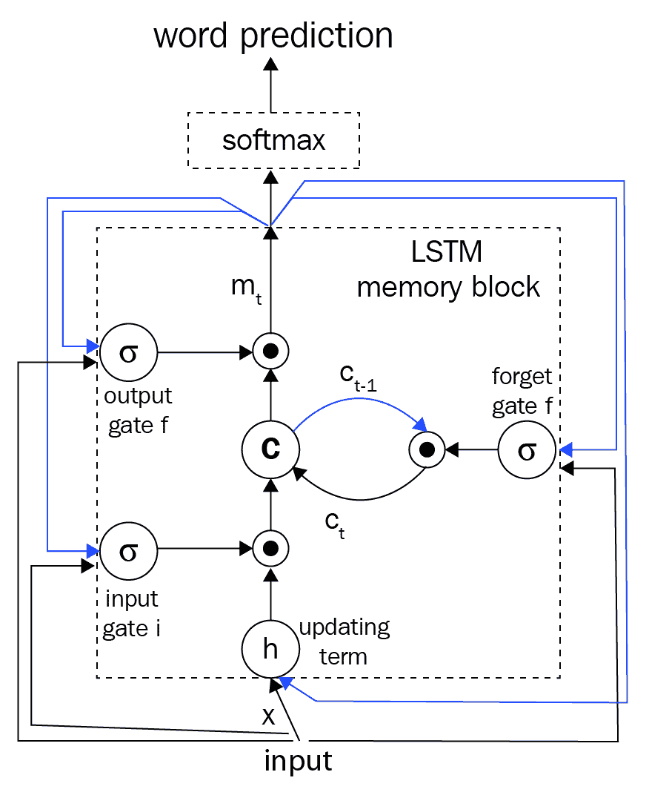

存储块包含 LSTM 单元`c`，该单元由输入，输出和忘记门控制。 单元`c`将根据输入对每个时间步的知识进行编码，直到先前的时间步为止。 如果门是 *1* 或 *0* ，则这三个门是可以相乘的层，以保持或拒绝来自门控层的值。 循环连接在上图中以蓝色显示。 我们通常在模型中有多个 LSTM，并且在时间`t-1`的输出`m[t-1]`在时间被馈送到下一个 LSTM。因此，使用以下三个时间，将在时间`t-1`处的输出`m[t-1]`反馈到存储块。 我们前面讨论过的门。 实际的单元格值也使用“忘记门”反馈。 通常将时间`t`处的存储器输出`m[t]`输出到 softmax 以预测下一个单词。

这通常是从输出门`o[t]`和当前单元状态`c[t]`获得的。 下图中描述了其中的一些定义和操作以及必要的方程式：

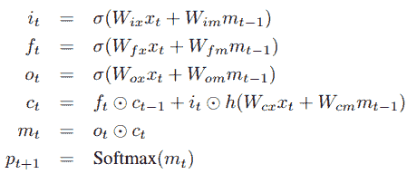

在这里，`⊙`是乘积运算符，尤其用于当前的门状态和值。 `W`矩阵是网络中的可训练参数。 这些门有助于解决诸如爆炸和消失梯度的问题。 网络中的非线性是由我们的常规 S 型`σ`和双曲正切`h`函数引入的。 如前所述，内存输出`m[t]`被馈送到 softmax 以预测下一个单词，其中输出是所有单词上的概率分布。

因此，基于此知识，您可以考虑基于 LSTM 的序列模型需要与必要的词嵌入层和基于 CNN 的模型结合，以从源图像生成密集特征。 因此，LSTM 模型的目标是根据预测的所有先前单词以及输入图像（由我们先前的`p(S[t] | I, S[0], S[1], ..., S[t-1])`。 为了简化 LSTM 中的循环连接，我们可以以展开形式来表示它，其中我们代表一系列 LSTM，它们共享下图所示的相同参数：

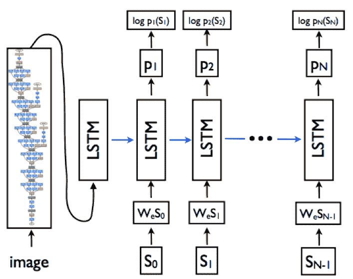

从上图可以明显看出，基于展开的 LSTM 架构，循环连接由蓝色水平箭头表示，并已转换为前馈连接。 同样，很明显，在时间`t-1`处 LSTM 的输出`m[t-1]`在时间`t`被馈送到下一个 LSTM。 将源输入图像视为`I`，将字幕视为`S = {S[0], S[1], ..., S[N]}`，下图描述了先前描述的展开架构中涉及的主要操作：


在这里，标题中的每个文本单词都由单热门向量`S[t]`表示，因此其尺寸等于我们词汇量（唯一的单词）。 另外要注意的一点是，我们为`S[0]`设置了特殊的标记或分隔符，分别由`<START>`和`S[N]`表示，我们用`<END>`来表示字幕的开头和结尾。 这有助于 LSTM 理解何时完全生成了字幕。

输入图像`I`输入到我们的 DCNN 模型中，该模型生成密集特征向量，并将基于嵌入层的单词转换为密集单词嵌入`W[eps]`。 因此，要最小化的整体损失函数是每个步骤右词的对数似然比，如以下等式所示：


因此，在模型训练期间，考虑模型中的所有参数（包括 DCNN，LSTM 和嵌入），可以将这种损失最小化。 现在让我们看一下如何将其付诸实践。

# 实用的实践方法

现在我们知道了可用于构建成功的图像字幕生成器的基本概念和理论，下面让我们看一下需要动手实践来解决此问题的主要构建块。 基于图像字幕的主要操作，要构建模型，我们将需要以下主要组件：

*   图像特征提取器 — 带迁移学习的 DCNN 模型
*   文本字幕生成器 - 使用 LSTM 的基于序列的语言模型
*   编解码器模型

在为字幕生成系统实现它们之前，让我们简要介绍一下这三个组件。

# 图像特征提取器 – 使用迁移学习的 DCNN 模型

我们系统的主要输入之一是源图像或照片。 我们都知道，**机器学习**（**ML**）或深度学习模型不能仅使用原始图像。 我们需要进行一些处理，还需要从图像中提取相关特征，然后将这些特征用于识别和分类等任务。

图像特征提取器本质上应该接收输入图像，从中提取丰富的层次特征表示，并以固定长度的密集向量的形式表示输出。 我们已经看到了 DCNN 在处理计算机视觉任务方面的强大功能。 在这里，我们将通过使用预训练的 VGG-16 模型作为特征提取器来从所有图像中提取瓶颈特征，从而充分利用迁移学习的力量。 就像快速刷新一样，下图显示了 VGG-16 模型：

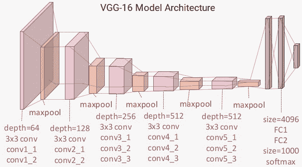

为了进行特征提取，我们将删除模型的顶部，即 softmax 层，并使用其余的层从输入图像中获取密集的特征向量。 这通常是编码过程的一部分，输出被馈送到产生字幕的解码器中。

# 文本字幕生成器 – 使用 LSTM 的基于序列的语言模型

如果传统的基于序列的语言模型知道序列中已经存在的先前单词，则它将预测下一个可能的单词。 对于我们的图像字幕问题，如上一节所述，基于 DCNN 模型的特征和字幕序列中已经生成的单词，LSTM 模型应该能够在每个时间步长预测我们字幕中的下一个可能单词 。

嵌入层用于为字幕数据字典或词汇表中的每个唯一单词生成单词嵌入，通常将其作为 LSTM 模型（解码器的一部分）的输入，来根据图像特征和先前的词序在我们的字幕中生成下一个可能的单词。 想法是最终生成一系列单词，这些单词一起在描述输入图像时最有意义。

# 编解码器架构

这是将前面两个组件联系在一起的模型架构。 它最初是在神经机器翻译方面取得的巨大成功，通常您将一种语言的单词输入编码器，而解码器则输出另一种语言的单词。 好处是，使用单个端到端架构，您可以连接这两个组件并解决问题，而不必尝试构建单独的和断开的模型来解决一个问题。

DCNN 模型通常形成编码器，该编码器将源输入图像编码为固定长度的密集向量，然后由基于 LSTM 的序列模型将其解码为单词序列，从而为我们提供了所需的标题。 同样，如前所述，必须训练该模型以使给定输入图像的字幕文本的可能性最大化。 为了进行改进，您可以考虑将详细信息添加到此模型中，作为将来范围的一部分。

现在，让我们使用这种方法来实现我们的自动图像标题生成器。

# 使用迁移学习的图像特征提取

我们模型的第一步是利用预训练的 DCNN 模型，使用迁移学习的原理从源图像中提取正确的特征。 为简单起见，我们不会对 VGG-16 模型进行微调或将其连接到模型的其余部分。 我们将事先从所有图像中提取瓶颈特征，以加快以后的训练速度，因为使用多个 LSTM 构建序列模型即使在 GPU 上也需要大量的训练时间，我们很快就会看到。

首先，我们将从源数据集中的`Flickr8k_text`文件夹中加载所有源图像文件名及其相应的标题。 同样，我们将把`dev`和`train`数据集图像组合在一起，正如我们之前提到的：

```py
import pandas as pd 
import numpy as np 

# read train image file names 
with open('../Flickr8k_text/Flickr_8k.trainImages.txt','r') as tr_imgs: 
    train_imgs = tr_imgs.read().splitlines() 

# read dev image file names     
with open('../Flickr8k_text/Flickr_8k.devImages.txt','r') as dv_imgs: 
    dev_imgs = dv_imgs.read().splitlines() 

# read test image file names     
with open('../Flickr8k_text/Flickr_8k.testImages.txt','r') as ts_imgs: 
    test_imgs = ts_imgs.read().splitlines() 

# read image captions     
with open('../Flickr8k_text/Flickr8k.token.txt','r') as img_tkns: 
    captions = img_tkns.read().splitlines() 
# combine dev and train image names into one set 
train_imgs = train_imgs + dev_imgs 
```

现在我们已经整理好输入图像的文件名并加载了相应的标题，我们需要构建一个基于字典的映射，该映射将源图像及其对应的标题映射在一起。 正如我们前面提到的，一个图像由五个不同的人字幕，因此，我们将为每个图像列出五个字幕。 下面的代码可以帮助我们做到这一点：

```py
from collections import defaultdict 

caption_map = defaultdict(list) 
# store five captions in a list for each image 
for record in captions: 
    record = record.split('\t') 
    img_name = record[0][:-2] 
    img_caption = record[1].strip() 
    caption_map[img_name].append(img_caption) 
```

我们稍后将在构建数据集进行训练和测试时利用它。 现在让我们集中讨论特征提取。 在提取图像特征之前，我们需要将原始输入图像预处理为正确的大小，并根据将要使用的模型缩放像素值。 以下代码将帮助我们进行必要的图像预处理步骤：

```py
from keras.preprocessing import image 
from keras.applications.vgg16 import preprocess_input as preprocess_vgg16_input 

def process_image2arr(path, img_dims=(224, 224)): 
    img = image.load_img(path, target_size=img_dims) 
    img_arr = image.img_to_array(img) 
    img_arr = np.expand_dims(img_arr, axis=0) 
    img_arr = preprocess_vgg16_input(img_arr) 
    return img_arr 
```

我们还需要加载预训练的 VGG-16 模型以利用迁移学习。 这是通过以下代码片段实现的：

```py
from keras.applications import vgg16 
from keras.models import Model 

vgg_model = vgg16.VGG16(include_top=True, weights='imagenet',  
                        input_shape=(224, 224, 3)) 
vgg_model.layers.pop() 
output = vgg_model.layers[-1].output 
vgg_model = Model(vgg_model.input, output) 
vgg_model.trainable = False 

vgg_model.summary() 

_________________________________________________________________ 
Layer (type)                 Output Shape              Param #    
================================================================= 
input_1 (InputLayer)         (None, 224, 224, 3)       0          
_________________________________________________________________ 
block1_conv1 (Conv2D)        (None, 224, 224, 64)      1792       
_________________________________________________________________ 
... 
... 
block5_conv3 (Conv2D)        (None, 14, 14, 512)       2359808    
_________________________________________________________________ 
block5_pool (MaxPooling2D)   (None, 7, 7, 512)         0          
_________________________________________________________________ 
flatten (Flatten)            (None, 25088)             0          
_________________________________________________________________ 
fc1 (Dense)                  (None, 4096)              102764544  
_________________________________________________________________ 
fc2 (Dense)                  (None, 4096)              16781312   
================================================================= 
Total params: 134,260,544 
Trainable params: 0 
Non-trainable params: 134,260,544 
_________________________________________________________________ 
```

很明显，我们删除了 softmax 层，并使模型不可训练，因为我们只对从输入图像中提取密集的特征向量感兴趣。 现在，我们将构建一个利用我们的工具函数并帮助从输入图像中提取正确特征的函数：

```py
def extract_tl_features_vgg(model, image_file_name, 
                            image_dir='../Flickr8k_imgs/'): 
    pr_img = process_image2arr(image_dir+image_file_name) 
    tl_features = model.predict(pr_img) 
    tl_features = np.reshape(tl_features, tl_features.shape[1]) 
    return tl_features 
```

现在，我们通过提取图像特征并构建训练和测试数据集来对所有先前的函数和预先训练的模型进行测试：

```py
img_tl_featureset = dict() 
train_img_names = [] 
train_img_captions = [] 
test_img_names = [] 
test_img_captions = [] 

for img in train_imgs: 
    img_tl_featureset[img] = extract_tl_features_vgg(model=vgg_model, 
                              image_file_name=img) 
    for caption in caption_map[img]: 
        train_img_names.append(img) 
        train_img_captions.append(caption) 

for img in test_imgs: 
    img_tl_featureset[img] = extract_tl_features_vgg(model=vgg_model, 
                              image_file_name=img) 
    for caption in caption_map[img]: 
        test_img_names.append(img) 
        test_img_captions.append(caption) 

train_dataset = pd.DataFrame({'image': train_img_names, 'caption': 
                               train_img_captions}) 
test_dataset = pd.DataFrame({'image': test_img_names, 'caption': 
                              test_img_captions}) 
print('Train Dataset Size:', len(train_dataset), '\tTest Dataset Size:', len(test_dataset)) 

Train Dataset Size: 35000  Test Dataset Size: 5000 
```

我们还可以通过使用以下代码来查看训练数据集的外观：

```py
train_dataset.head(10) 
```

前面代码的输出如下：

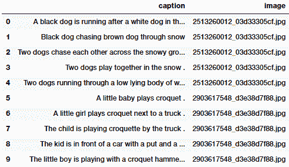

显然，每个输入图像都有五个标题，并且将其保留在数据集中。 现在，我们将这些数据集的记录和从迁移学习中学到的图像特征保存到磁盘上，以便我们可以在模型训练期间轻松地将其加载到内存中，而不必每次运行模型时都提取这些特征：

```py
# save dataset records 
train_dataset = train_dataset[['image', 'caption']] 
test_dataset = test_dataset[['image', 'caption']] 

train_dataset.to_csv('image_train_dataset.tsv', sep='\t', index=False) 
test_dataset.to_csv('image_test_dataset.tsv', sep='\t', index=False) 

# save transfer learning image features 
from sklearn.externals import joblib 
joblib.dump(img_tl_featureset, 'transfer_learn_img_features.pkl') 

['transfer_learn_img_features.pkl'] 
```

另外，如果需要，您可以使用以下代码段进行一些初始检查来验证图像特征的外观：

```py
[(key, value.shape) for key, value in  
                         img_tl_featureset.items()][:5] 

[('3079787482_0757e9d167.jpg', (4096,)), 
 ('3284955091_59317073f0.jpg', (4096,)), 
 ('1795151944_d69b82f942.jpg', (4096,)), 
 ('3532192208_64b069d05d.jpg', (4096,)), 
 ('454709143_9c513f095c.jpg', (4096,))] 

[(k, np.round(v, 3)) for k, v in img_tl_featureset.items()][:5] 

[('3079787482_0757e9d167.jpg', 
  array([0., 0., 0., ..., 0., 0., 0.], dtype=float32)), 
 ('3284955091_59317073f0.jpg', 
  array([0.615, 0\.   , 0.653, ..., 0\.   , 1.559, 2.614], dtype=float32)), 
 ('1795151944_d69b82f942.jpg', 
  array([0\.   , 0\.   , 0\.   , ..., 0\.   , 0\.   , 0.538], dtype=float32)), 
 ('3532192208_64b069d05d.jpg', 
  array([0\.   , 0\.   , 0\.   , ..., 0\.   , 0\.   , 2.293], dtype=float32)), 
 ('454709143_9c513f095c.jpg', 
  array([0\.   , 0\.   , 0.131, ..., 0.833, 4.263, 0\.   ], dtype=float32))] 
```

我们将在建模的下一部分中使用这些特征。

# 为我们的字幕建立词汇表

下一步涉及对字幕数据进行一些预处理，并为字幕构建词汇表或元数据字典。 我们首先读取训练数据集记录并编写一个函数来预处理文本标题：

```py
train_df = pd.read_csv('image_train_dataset.tsv', delimiter='\t') 
total_samples = train_df.shape[0] 
total_samples 

35000 

# function to pre-process text captions 
def preprocess_captions(caption_list): 
    pc = [] 
    for caption in caption_list: 
        caption = caption.strip().lower() 
        caption = caption.replace('.', '').replace(',',   
                      '').replace("'", "").replace('"', '') 
        caption = caption.replace('&','and').replace('(','').replace(')',   
                                         '').replace('-', ' ') 
        caption = ' '.join(caption.split())  
        caption = '<START> '+caption+' <END>' 
        pc.append(caption) 
    return pc 
```

现在，我们将对字幕进行预处理，并为词汇建立一些基本的元数据，包括用于将唯一的单词转换为数字表示的工具，反之亦然：

```py
# pre-process caption data 
train_captions = train_df.caption.tolist() 
processed_train_captions = preprocess_captions(train_captions) 

tc_tokens = [caption.split() for caption in  
                      processed_train_captions] 
tc_tokens_length = [len(tokenized_caption) for tokenized_caption  
                        in tc_tokens] 

# build vocabulary metadata 
from collections import Counter 

tc_words = [word.strip() for word_list in tc_tokens for word in  
                           word_list] 
unique_words = list(set(tc_words)) 
token_counter = Counter(unique_words) 

word_to_index = {item[0]: index+1 for index, item in  
                   enumerate(dict(token_counter).items())} 
word_to_index['<PAD>'] = 0 
index_to_word = {index: word for word, index in  
                       word_to_index.items()} 
vocab_size = len(word_to_index) 
max_caption_size = np.max(tc_tokens_length) 
```

重要的是要确保将词汇表元数据保存到磁盘上，以便将来在任何时候都可以将其重新用于模型训练和预测。 否则，如果我们重新生成词汇表，则很有可能已使用其他版本的词汇表来训练模型，其中单词到数字的映射可能有所不同。 这将给我们带来错误的结果，并且我们将浪费宝贵的时间：

```py
from sklearn.externals import joblib 

vocab_metadata = dict() 
vocab_metadata['word2index'] = word_to_index 
vocab_metadata['index2word'] = index_to_word 
vocab_metadata['max_caption_size'] = max_caption_size 
vocab_metadata['vocab_size'] = vocab_size 
joblib.dump(vocab_metadata, 'vocabulary_metadata.pkl') 

['vocabulary_metadata.pkl'] 
```

如果需要，您可以使用以下代码片段检查词汇元数据的内容，还可以查看常规预处理的文本标题对于其中一张图像的外观：

```py
# check vocabulary metadata 
{k: v if type(v) is not dict  
         else list(v.items())[:5]  
             for k, v in vocab_metadata.items()} 

{'index2word': [(0, '<PAD>'), (1, 'nearby'), (2, 'flooded'), 
                (3, 'fundraising'), (4, 'snowboarder')], 
 'max_caption_size': 39, 
 'vocab_size': 7927, 
 'word2index': [('reflections', 4122), ('flakes', 1829),    
       ('flexing', 7684), ('scaling', 1057), ('pretend', 6788)]} 

# check pre-processed caption 
processed_train_captions[0] 

'<START> a black dog is running after a white dog in the snow <END>' 
```

在构建数据生成器函数时，我们将在不久的将来利用它，它将用作模型训练期间深度学习模型的输入。

# 构建图像标题数据集生成器

在消耗大量数据的任何复杂深度学习系统中，最重要的步骤之一就是构建高效的数据集生成器。 这在我们的系统中非常重要，尤其是因为我们将处理图像和文本数据。 除此之外，我们将处理序列模型，在训练过程中，我们必须多次将相同数据传递给我们的模型。 将列表中的所有数据解压缩后，预先构建数据集将是解决此问题的最无效的方法。 因此，我们将为我们的系统利用生成器的力量。

首先，我们将使用以下代码加载从迁移学习中学到的图像特征以及词汇元数据：

```py
from sklearn.externals import joblib 

tl_img_feature_map = joblib.load('transfer_learn_img_features.pkl') 
vocab_metadata = joblib.load('vocabulary_metadata.pkl') 

train_img_names = train_df.image.tolist() 
train_img_features = [tl_img_feature_map[img_name] for img_name in train_img_names] 
train_img_features = np.array(train_img_features) 

word_to_index = vocab_metadata['word2index'] 
index_to_word = vocab_metadata['index2word']  
max_caption_size = vocab_metadata['max_caption_size'] 
vocab_size = vocab_metadata['vocab_size'] 

train_img_features.shape 

(35000, 4096) 
```

我们可以看到有 35,000 张图像，其中每张图像都有大小为 4,096 的密集特征向量表示。 现在的想法是构建一个模型数据集生成器，该生成器将生成（输入，输出）对。 对于我们的输入，我们将使用转换为密集特征向量的源图像以及相应的图像标题，在每个时间步添加一个单词。 对应的输出将是对应输入图像和标题的相同标题的下一个单词（必须预测）。 下图使此方法更加清晰：

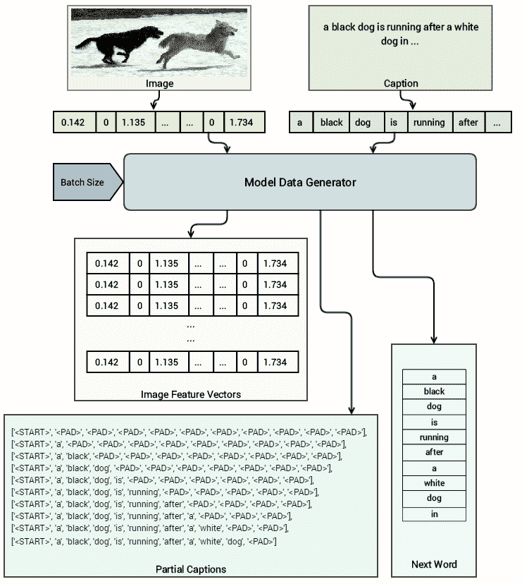

基于此架构，很明显，对于同一图像，在每个时间步上，我们都传递相同的特征向量，并保持每次添加一个单词的标题，同时传递下一个要预测的单词作为相应的输出来训练我们的模型。 以下函数将帮助我们实现这一点，我们利用 Python 生成器进行延迟加载并提高内存效率：

```py
from keras.preprocessing import sequence 

def dataset_generator(processed_captions, transfer_learnt_features, vocab_size, max_caption_size, batch_size=32): 
    partial_caption_set = [] 
    next_word_seq_set = [] 
    img_feature_set = [] 
    batch_count = 0 
    batch_num = 0 

    while True: 
        for index, caption in enumerate(processed_captions): 
            img_features = transfer_learnt_features[index] 
            for cap_idx in range(len(caption.split()) - 1): 
                partial_caption = [word_to_index[word] for word in  
                                     caption.split()[:cap_idx+1]] 
                partial_caption_set.append(partial_caption) 

                next_word_seq = np.zeros(vocab_size) 
                next_word_seq[word_to_index 
                                 [caption.split()[cap_idx+1]]] = 1 
                next_word_seq_set.append(next_word_seq) 
                img_feature_set.append(img_features) 
                batch_count+=1 

                if batch_count >= batch_size: 
                    batch_num += 1 
                    img_feature_set = np.array(img_feature_set) 
                    partial_caption_set =  
                                 sequence.pad_sequences( 
                                    sequences=partial_caption_set,   
                                    maxlen=max_caption_size,  
                                    padding='post') 
                    next_word_seq_set =  
                                      np.array(next_word_seq_set) 

                    yield [[img_feature_set, partial_caption_set],  
                           next_word_seq_set]                     
                    batch_count = 0 
                    partial_caption_set = [] 
                    next_word_seq_set = [] 
                    img_feature_set = [] 
```

让我们尝试了解此函数的真正作用！ 尽管我们确实在上图中描绘了一个不错的视觉效果，但现在我们将使用以下代码为`10`的批量大小生成示例数据：

```py
MAX_CAPTION_SIZE = max_caption_size 
VOCABULARY_SIZE = vocab_size 
BATCH_SIZE = 10 

print('Vocab size:', VOCABULARY_SIZE) 
print('Max caption size:', MAX_CAPTION_SIZE) 
print('Test Batch size:', BATCH_SIZE) 

d = dataset_generator(processed_captions=processed_train_captions,  
                      transfer_learnt_features=train_img_features,  
                      vocab_size=VOCABULARY_SIZE,  
                      max_caption_size=MAX_CAPTION_SIZE, 
                      batch_size=BATCH_SIZE) 
d = list(d) 
img_features, partial_captions = d[0][0] 
next_word = d[0][1] 

Vocab size: 7927 
Max caption size: 39 
Test Batch size: 10 
```

现在，我们可以使用以下代码从数据生成器函数验证返回的数据集的维数：

```py
img_features.shape, partial_captions.shape, next_word.shape 

((10, 4096), (10, 39), (10, 7927)) 
```

很明显，我们的图像特征本质上是每个向量中 4,096 个特征的密集向量。 在字幕的每个时间步都对同一图像重复相同的特征向量。 字幕生成的向量的大小为`MAX_CAPTION_SIZE`，即`39`。 下一个单词通常以单次编码的方式返回，这对于用作 softmax 层的输入非常有用，以检查模型是否预测了正确的单词。 以下代码向我们展示了图像特征向量如何查找输入图像的`10`批量大小：

```py
np.round(img_features, 3) 

array([[0\.   , 0\.   , 1.704, ..., 0\.   , 0\.   , 0\.   ], 
       [0\.   , 0\.   , 1.704, ..., 0\.   , 0\.   , 0\.   ], 
       [0\.   , 0\.   , 1.704, ..., 0\.   , 0\.   , 0\.   ], 
       ..., 
       [0\.   , 0\.   , 1.704, ..., 0\.   , 0\.   , 0\.   ], 
       [0\.   , 0\.   , 1.704, ..., 0\.   , 0\.   , 0\.   ], 
       [0\.   , 0\.   , 1.704, ..., 0\.   , 0\.   , 0\.   ]], dtype=float32) 
```

如前所述，在批量数据生成过程中的每个时间步都重复了相同的图像特征向量。 我们可以检查在输入给模型的每个时间步骤中标题的形成方式。 为了简单起见，我们仅显示前 11 个单词：

```py
# display raw caption tokens at each time-step 
print(np.array([partial_caption[:11] for partial_caption in   
                 partial_captions])) 

[[6917    0    0    0    0    0    0    0    0    0    0] 
 [6917 2578    0    0    0    0    0    0    0    0    0] 
 [6917 2578 7371    0    0    0    0    0    0    0    0] 
 [6917 2578 7371 3519    0    0    0    0    0    0    0] 
 [6917 2578 7371 3519 3113    0    0    0    0    0    0] 
 [6917 2578 7371 3519 3113 6720    0    0    0    0    0] 
 [6917 2578 7371 3519 3113 6720    7    0    0    0    0] 
 [6917 2578 7371 3519 3113 6720    7 2578    0    0    0] 
 [6917 2578 7371 3519 3113 6720    7 2578 1076    0    0] 
 [6917 2578 7371 3519 3113 6720    7 2578 1076 3519    0]] 

# display actual caption tokens at each time-step 
print(np.array([[index_to_word[word] for word in cap][:11] for cap  
                                     in partial_captions])) 

[['<START>' '<PAD>' '<PAD>' '<PAD>' '<PAD>' '<PAD>' '<PAD>' '<PAD>' '<PAD>' '<PAD>' '<PAD>'] 
 ['<START>' 'a' '<PAD>' '<PAD>' '<PAD>' '<PAD>' '<PAD>' '<PAD>' '<PAD>' '<PAD>' '<PAD>'] 
 ['<START>' 'a' 'black' '<PAD>' '<PAD>' '<PAD>' '<PAD>' '<PAD>' '<PAD>' '<PAD>' '<PAD>'] 
 ['<START>' 'a' 'black' 'dog' '<PAD>' '<PAD>' '<PAD>' '<PAD>' '<PAD>' '<PAD>' '<PAD>'] 
 ['<START>' 'a' 'black' 'dog' 'is' '<PAD>' '<PAD>' '<PAD>' '<PAD>' 
  '<PAD>' '<PAD>'] 
 ['<START>' 'a' 'black' 'dog' 'is' 'running' '<PAD>' '<PAD>' '<PAD>' '<PAD>' '<PAD>'] 
 ['<START>' 'a' 'black' 'dog' 'is' 'running' 'after' '<PAD>' '<PAD>' '<PAD>' '<PAD>'] 
 ['<START>' 'a' 'black' 'dog' 'is' 'running' 'after' 'a' '<PAD>' '<PAD>' '<PAD>'] 
 ['<START>' 'a' 'black' 'dog' 'is' 'running' 'after' 'a' 'white' '<PAD>' '<PAD>'] 
 ['<START>' 'a' 'black' 'dog' 'is' 'running' 'after' 'a' 'white' 'dog' '<PAD>']] 
```

我们可以清楚地看到在`<START>`符号后的每个步骤中如何将一个单词添加到输入标题，这表示文本标题的开始。 现在让我们看一下对应的下一单词生成输出（通常是根据两个输入预测的下一单词）：

```py
next_word 

array([[0., 0., 0., ..., 0., 0., 0.], 
       [0., 0., 0., ..., 0., 0., 0.], 
       [0., 0., 0., ..., 0., 0., 0.], 
       ..., 
       [0., 0., 0., ..., 0., 0., 0.], 
       [0., 0., 0., ..., 0., 0., 0.], 
       [0., 0., 0., ..., 0., 0., 0.]]) 

print('Next word positions:', np.nonzero(next_word)[1]) 
print('Next words:', [index_to_word[word] for word in  
                np.nonzero(next_word)[1]]) 

Next word positions: [2578 7371 3519 3113 6720    7 2578 1076 3519 5070] 
Next words: ['a', 'black', 'dog', 'is', 'running', 'after', 'a', 'white', 'dog', 'in'] 
```

很清楚，下一个单词通常基于输入字幕中每个时间步的单词顺序指向字幕中的下一个正确单词。 这些数据将在训练期间的每个周期馈入我们的模型。

# 建立我们的图像字幕编解码器深度学习模型

现在，我们拥有构建模型所需的所有基本组件和工具。 如前所述，我们将使用编码器-解码器深度学习模型架构来构建图像捕获系统。

以下代码帮助我们构建此模型的架构，在该模型中，我们将成对的图像特征和字幕序列作为输入，以预测每个时间步长的字幕中的下一个可能单词：

```py
from keras.models import Sequential, Model 
from keras.layers import LSTM, Embedding, TimeDistributed, Dense, RepeatVector, Activation, Flatten, concatenate 

DENSE_DIM = 256 
EMBEDDING_DIM = 256 
MAX_CAPTION_SIZE = max_caption_size 
VOCABULARY_SIZE = vocab_size 

image_model = Sequential() 
image_model.add(Dense(DENSE_DIM, input_dim=4096, activation='relu')) 
image_model.add(RepeatVector(MAX_CAPTION_SIZE)) 

language_model = Sequential() 
language_model.add(Embedding(VOCABULARY_SIZE, EMBEDDING_DIM, input_length=MAX_CAPTION_SIZE)) 
language_model.add(LSTM(256, return_sequences=True)) 
language_model.add(TimeDistributed(Dense(DENSE_DIM))) 

merged_output = concatenate([image_model.output, language_model.output]) 
merged_output = LSTM(1024, return_sequences=False)(merged_output) 
merged_output = (Dense(VOCABULARY_SIZE))(merged_output) 
merged_output = Activation('softmax')(merged_output) 

model = Model([image_model.input, language_model.input], merged_output) 
model.compile(loss='categorical_crossentropy', optimizer='rmsprop', metrics=['accuracy']) 

model.summary() 
```

前面的代码的输出如下：

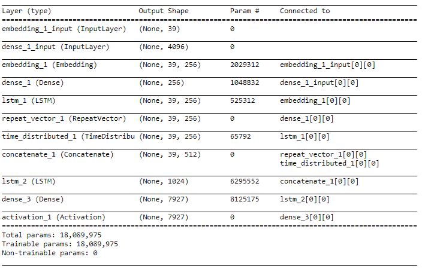

从前面的架构中我们可以看到，我们有一个图像模型，该模型更着重于处理基于图像的特征作为其输入，而语言模型则利用 LSTM 来处理每个图像标题中流入的单词序列。 最后一层是 softmax 层，具有 7,927 个单元，因为我们的词汇表中总共有 7,927 个唯一词，并且字幕中的下一个预测词将是其中一个作为输出生成的词。 我们还可以使用以下代码片段来可视化我们的模型架构：

```py
from IPython.display import SVG 
from keras.utils.vis_utils import model_to_dot 

SVG(model_to_dot(model, show_shapes=True, show_layer_names=False,  
    rankdir='TB').create(prog='dot', format='svg')) 
```

前面的代码的输出如下：

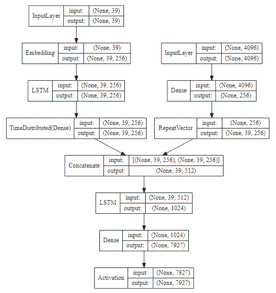

# 训练我们的图像字幕深度学习模型

在开始训练模型之前，由于我们正在处理模型中的一些复杂组件，因此在模型的准确率在整个连续周期中都达到稳定状态的情况下，我们会在模型中使用回调来降低学习率。 这对于在不停止训练的情况下即时更改模型的学习率非常有帮助：

```py
from keras.callbacks import ReduceLROnPlateau 
reduce_lr = ReduceLROnPlateau(monitor='loss', factor=0.15, 
                              patience=2, min_lr=0.000005) 
```

让我们现在训练我们的模型！ 我们已经将模型训练到大约 30 到 50 个周期，并在大约 30 个周期和 50 个周期保存了模型：

```py
BATCH_SIZE = 256 
EPOCHS = 30 
cap_lens = [(cl-1) for cl in tc_tokens_length] 
total_size = sum(cap_lens) 

history = model.fit_generator( 
  dataset_generator(processed_captions=processed_train_captions,  
                    transfer_learnt_features=train_img_features,  
                    vocab_size=VOCABULARY_SIZE,  
                    max_caption_size=MAX_CAPTION_SIZE, 
                    batch_size=BATCH_SIZE),  
  steps_per_epoch=int(total_size/BATCH_SIZE),  
  callbacks=[reduce_lr], 
  epochs=EPOCHS, verbose=1) 

Epoch 1/30 
1617/1617 - 724s 448ms/step - loss: 4.1236 - acc: 0.2823 
Epoch 2/30 
1617/1617 - 725s 448ms/step - loss: 3.9182 - acc: 0.3150 
Epoch 3/30 
1617/1617 - 724s 448ms/step - loss: 3.8286 - acc: 0.3281 
... 
... 
Epoch 29/30 
1617/1617 - 724s 447ms/step - loss: 3.6443 - acc: 0.3885 
Epoch 30/30 
1617/1617 - 724s 448ms/step - loss: 3.4656 - acc: 0.4078 

model.save('ic_model_rmsprop_b256ep30.h5') 
```

保存该模型后，我们将继续训练并对其进行另外 20 个周期的训练，并在`50`处停止。 当然，您也可以随意在 Keras 中使用模型检查点定期自动保存它：

```py
EPOCHS = 50 

history_rest = model.fit_generator( 
   dataset_generator(processed_captions=processed_train_captions,  
                     transfer_learnt_features=train_img_features,  
                     vocab_size=VOCABULARY_SIZE,  
                     max_caption_size=MAX_CAPTION_SIZE, 
                     batch_size=BATCH_SIZE),  
   steps_per_epoch=int(total_size/BATCH_SIZE),  
   callbacks=[reduce_lr], 
   epochs=EPOCHS, verbose=1, initial_epoch=30) 

Epoch 31/50 
1617/1617 - 724s 447ms/step - loss: 3.3988 - acc: 0.4144 
Epoch 32/50 
1617/1617 - 724s 448ms/step - loss: 3.3633 - acc: 0.4184 
... 
... 
Epoch 49/50 
1617/1617 - 724s 448ms/step - loss: 3.1330 - acc: 0.4509 
Epoch 50/50 
1617/1617 - 724s 448ms/step - loss: 3.1260 - acc: 0.4523 

model.save('ic_model_rmsprop_b256ep50.h5') 
```

这样就结束了我们的模型训练过程； 我们已经成功地训练了图像字幕模型，并可以开始使用它来为新图像生成图像字幕。

模型训练技巧：图像字幕模型通常使用大量数据，并且在训练过程中涉及许多参数。 建议使用生成器来构建和生成数据以训练深度学习模型。 否则，您可能会遇到内存问题。 另外，在带有 Tesla K80 GPU 的 Amazon AWS p2.x 实例上，该模型在每个周期运行将近 12 分钟，因此请考虑在 GPU 上构建该模型，因为在传统系统上进行训练可能会花费很长时间。

我们还可以根据训练过程中的不同周期，查看有关模型准确率，损失和学习率的趋势：

```py
epochs = list(range(1,51)) 
losses = history.history['loss'] + history_rest.history['loss']  
accs = history.history['acc'] + history_rest.history['acc']  
lrs = history.history['lr'] + history_rest.history['lr'] 

f, (ax1, ax2, ax3) = plt.subplots(1, 3, figsize=(14, 4)) 
title = f.suptitle("Model Training History", fontsize=14) 
f.subplots_adjust(top=0.85, wspace=0.35) 

ax1.plot(epochs, losses, label='Loss') 
ax2.plot(epochs, accs,  label='Accuracy') 
ax3.plot(epochs, lrs, label='Learning Rate') 

ax1.set_xlabel('Epochs') 
ax2.set_xlabel('Epochs') 
ax3.set_xlabel('Epochs') 
ax1.set_ylabel('Loss') 
ax2.set_ylabel('Accuracy') 
ax3.set_ylabel('Learning Rate') 
```

前面的代码的输出如下：

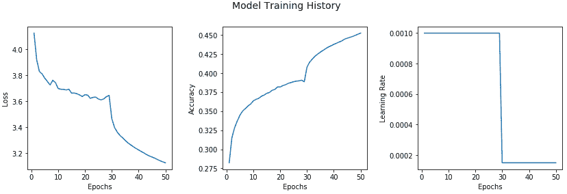

我们可以看到，在第 28 和 29 阶段，准确率略有下降，损失增加了，这导致我们的回调成功降低了学习率，从第 30 阶段开始提高了准确率。 这无疑为我们提供了有关模型行为的有用见解！

# 评估我们的图像字幕深度学习模型

训练模型而不评估其表现根本没有任何意义。 因此，我们现在将在测试数据集上评估深度学习模型的表现，该数据集与`Flickr8K`数据集共有 1000 幅不同的图像。 我们从加载通常的依赖关系开始（如果您还没有的话）：

```py
import pandas as pd 
import numpy as np 
import matplotlib.pyplot as plt 

pd.options.display.max_colwidth = 500 

%matplotlib inline 
```

# 加载数据和模型

下一步包括将必要的数据，模型和其他资产从磁盘加载到内存中。 我们首先加载测试数据集和训练有素的深度学习模型：

```py
# load test dataset 
test_df = pd.read_csv('image_test_dataset.tsv', delimiter='\t') 

# load the models 
from keras.models import load_model 

model1 = load_model('ic_model_rmsprop_b256ep30.h5') 
model2 = load_model('ic_model_rmsprop_b256ep50.h5') 
```

现在，我们需要加载必要的元数据资产，例如之前为测试数据提取的图像特征以及词汇元数据：

```py
from sklearn.externals import joblib 

tl_img_feature_map = joblib.load('transfer_learn_img_features.pkl') 
vocab_metadata = joblib.load('vocabulary_metadata.pkl') 
word_to_index = vocab_metadata['word2index'] 
index_to_word = vocab_metadata['index2word'] 
max_caption_size = vocab_metadata['max_caption_size'] 
vocab_size = vocab_metadata['vocab_size'] 
```

# 了解贪婪和集束搜索

为了从基于深度学习的神经图像字幕模型生成预测，请记住，它不像基本分类或分类模型那样简单。 我们将需要根据输入图像特征在每个时间步从模型中生成一系列单词。 有多种方式为字幕生成这些单词序列。

一种方法称为**采样**或**贪婪搜索**，我们从`<START>`令牌开始，输入图像特征，然后基于 LSTM 输出中的`p1`来生成第一个单词。 然后，我们将相应的预测词嵌入作为输入，并根据来自下一个 LSTM 的`p2`生成下一个词（以我们之前讨论的展开形式）。 继续此步骤，直到到达`<END>`令牌（表示字幕结束）为止，或者达到基于预定义阈值的令牌的最大可能长度。

第二种方法称为**集束搜索**，它比基于贪婪的搜索更有效，在基于贪婪的搜索中，我们在考虑到每个单词之前生成的单词的基础上，根据最高概率在每个步骤中选择最可能的单词顺序，这正是采样的作用。 集束搜索扩展了贪婪搜索技术，并始终返回最可能输出的项的序列的列表。 因此，在构建每个序列时，为了在时间步`t+1`生成下一项，而不是进行贪婪搜索并生成最可能的下一项，迭代地考虑了一组`k`最佳句子基于下一步扩展到所有可能的下一词。 `k`的值通常是用户指定的参数，用于控制进行平行搜索或集束搜索以生成字幕序列的总数。 因此，在集束搜索中，我们以`k`最可能的单词作为字幕序列中的第一时间步输出开始，并继续生成下一个序列项，直到其中一个达到结束状态为止。 涵盖围绕集束搜索的详细概念的全部范围将不在当前范围之内，因此，如果您有兴趣，我们建议您查看有关 AI 上下文中集束搜索的任何标准文献。

# 实现基于集束搜索的字幕生成器

现在，我们将实现一种基于集束搜索的基本算法来生成字幕序列：

```py
from keras.preprocessing import image, sequence 

def get_raw_caption_sequences(model, word_to_index, image_features, 
                              max_caption_size, beam_size=1): 

    start = [word_to_index['<START>']] 
    caption_seqs = [[start, 0.0]] 

    while len(caption_seqs[0][0]) < max_caption_size: 
        temp_caption_seqs = [] 
        for caption_seq in caption_seqs: 
            partial_caption_seq = sequence.pad_sequences( 
                                               [caption_seq[0]],  
                                               maxlen=max_caption_size,  
                                               padding='post') 
            next_words_pred = model.predict( 
                                   [np.asarray([image_features]),    
                                   np.asarray(partial_caption_seq)])[0] 
            next_words = np.argsort(next_words_pred)[-beam_size:] 

            for word in next_words: 
                new_partial_caption, new_partial_caption_prob =   
                                      caption_seq[0][:], caption_seq[1] 
                new_partial_caption.append(word) 
                new_partial_caption_prob += next_words_pred[word] 
                temp_caption_seqs.append([new_partial_caption,  
                                          new_partial_caption_prob]) 

        caption_seqs = temp_caption_seqs 
        caption_seqs.sort(key = lambda item: item[1]) 
        caption_seqs = caption_seqs[-beam_size:] 

    return caption_seqs 
```

这有助于我们使用集束搜索基于输入图像特征生成字幕。 但是，它是在每个步骤中基于先前标记的原始标记序列。 因此，我们将在此基础上构建一个包装器函数，该函数将利用先前的函数生成一个纯文本句子作为输入图像的标题：

```py
def generate_image_caption(model, word_to_index_map, index_to_word_map, 
                           image_features, max_caption_size,   
                           beam_size=1): 

    raw_caption_seqs = get_raw_caption_sequences(model=model,  
                                     word_to_index=word_to_index_map,  
                                     image_features=image_features,  
                                     max_caption_size=max_caption_size,  
                                     beam_size=beam_size) 
    raw_caption_seqs.sort(key = lambda l: -l[1]) 
    caption_list = [item[0] for item in raw_caption_seqs] 
    captions = [[index_to_word_map[idx] for idx in caption]  
                                   for caption in caption_list] 

    final_captions = [] 
    for caption in captions: 
        start_index = caption.index('<START>')+1 
        max_len = len(caption)  
                   if len(caption) < max_caption_size  
                   else max_caption_size 
        end_index = caption.index('<END>')  
                   if '<END>' in caption  
                   else max_len-1 
        proc_caption = ' '.join(caption[start_index:end_index]) 
        final_captions.append(proc_caption) 

    return final_captions 
```

我们还需要之前的字幕预处理函数，用于训练模型时用来预处理初始字幕：

```py
def preprocess_captions(caption_list): 
    pc = [] 
    for caption in caption_list: 
        caption = caption.strip().lower() 
        caption = caption.replace('.', '') 
                         .replace(',', '') 
                         .replace("'", "") 
                         .replace('"', '') 
        caption = caption.replace('&','and') 
                         .replace('(','') 
                         .replace(')', '') 
                         .replace('-', ' ') 
        caption = ' '.join(caption.split())  
        pc.append(caption) 
    return pc  
```

# 了解和实现 BLEU 评分

现在，我们需要选择适当的模型表现评估指标，以评估模型的表现。 这里的一个相关指标是**双语评估学习**（**BLEU**）得分。 这是一种评估模型在翻译语言时的表现的出色算法。 BLEU 背后的动机是，所生成的输出越接近于人工翻译，则得分越高。 时至今日，它仍然是将模型输出与人为输出进行比较的最受欢迎的指标之一。

BLEU 算法的简单原理是针对一组参考字幕评估生成的文本字幕（通常针对一个或多个字幕评估一个字幕，在这种情况下，每个图像五个字幕）。 计算每个字幕的分数，然后在整个语料库中平均以得到质量的总体估计。 BLEU 分数始终介于 0 到 1 之间，分数接近 1 表示高质量的翻译。 甚至参考文本数据也不是完美的，因为人类在字幕图像期间也会出错，因此，其想法不是获得完美的 1，而是获得良好的整体 BLEU 分数。

我们将使用 NLTK 中的翻译模块中的[`corpus_bleu(...)`函数](http://www.nltk.org/api/nltk.translate.html#nltk.translate.bleu_score.corpus_bleu)来计算 BLEU 分数。 我们将计算 1、2、3 和 4 元组的总累积 BLEU 分数。 如我们已实现的评估函数所示，为`bleu2`，`bleu3`和`bleu4`分数的每个 n-gram 分数分配了相等的权重：

```py
from nltk.translate.bleu_score import corpus_bleu 

def compute_bleu_evaluation(reference_captions,  
                                            predicted_captions): 
    actual_caps = [[caption.split() for caption in sublist]  
                            for sublist in reference_captions] 
    predicted_caps = [caption.split()  
                            for caption in predicted_captions] 

    bleu1 = corpus_bleu(actual_caps,  
                        predicted_caps, weights=(1.0, 0, 0, 0)) 
    bleu2 = corpus_bleu(actual_caps,  
                        predicted_caps, weights=(0.5, 0.5, 0, 0)) 
    bleu3 = corpus_bleu(actual_caps,  
                        predicted_caps,  
                        weights=(0.3, 0.3, 0.3, 0)) 
    bleu4 = corpus_bleu(actual_caps, predicted_caps,  
                        weights=(0.25, 0.25, 0.25, 0.25)) 

    print('BLEU-1: {}'.format(bleu1)) 
    print('BLEU-2: {}'.format(bleu2)) 
    print('BLEU-3: {}'.format(bleu3)) 
    print('BLEU-4: {}'.format(bleu4)) 

    return [bleu1, bleu2, bleu3, bleu4] 
```

# 评估测试数据的模型表现

现在已经准备好用于模型表现评估的所有组件。 为了评估模型在测试数据集上的表现，我们现在将使用传递学习来加载之前提取的图像特征，这些特征将作为模型的输入。 我们还将加载字幕，对其进行预处理，并将其作为每个图像的参考字幕列表进行分离，如下所示：

```py
test_images = list(test_df['image'].unique()) 
test_img_features = [tl_img_feature_map[img_name]  
                               for img_name in test_images] 
actual_captions = list(test_df['caption']) 
actual_captions = preprocess_captions(actual_captions) 
actual_captions = [actual_captions[x:x+5]  
                       for x in range(0, len(actual_captions),5)] 
actual_captions[:2]  

[['the dogs are in the snow in front of a fence', 
  'the dogs play on the snow', 
  'two brown dogs playfully fight in the snow', 
  'two brown dogs wrestle in the snow', 
  'two dogs playing in the snow'], 
 ['a brown and white dog swimming towards some in the pool', 
  'a dog in a swimming pool swims toward sombody we cannot see', 
  'a dog swims in a pool near a person', 
  'small dog is paddling through the water in a pool', 
  'the small brown and white dog is in the pool']] 
```

您可以清楚地看到每个图像标题现在如何位于整齐的单独列表中，这些列表将在计算 BLEU 分数时形成我们的标题参考集。 现在，我们可以生成 BLEU 分数，并使用不同的光束大小值测试模型的表现。 这里描述了一些示例：

```py
# Beam Size 1 - Model 1 with 30 epochs 
predicted_captions_ep30bs1 = [generate_image_caption(model=model1,  
                                  word_to_index_map=word_to_index,  
                                  index_to_word_map=index_to_word,  
                                          image_features=img_feat,  
                                max_caption_size=max_caption_size,  
                                beam_size=1)[0]  
                                    for img_feat  
                                         in test_img_features] 
ep30bs1_bleu = compute_bleu_evaluation( 
                    reference_captions=actual_captions, 
                    predicted_captions=predicted_captions_ep30bs1) 

BLEU-1: 0.5049574449416513 
BLEU-2: 0.3224643449851107 
BLEU-3: 0.22962263359362023 
BLEU-4: 0.1201459697546317 

# Beam Size 1 - Model 2 with 50 epochs 
predicted_captions_ep50bs1 = [generate_image_caption(model=model2,  
                                  word_to_index_map=word_to_index,  
                                  index_to_word_map=index_to_word,  
                                          image_features=img_feat,  
                                max_caption_size=max_caption_size,  
                                     beam_size=1)[0]  
                                        for img_feat  
                                            in test_img_features] 
ep50bs1_bleu = compute_bleu_evaluation( 
                   reference_captions=actual_captions, 
                   predicted_captions=predicted_captions_ep50bs1) 

```

您可以清楚地看到，随着我们开始考虑更高水平的 n-gram，分数开始下降。 总体而言，运行此过程非常耗时，要在集束搜索中获得更高的阶数会花费大量时间。 我们尝试了光束大小分别为 1、3、5 和 10 的实验。下表描述了每个实验的模型表现：

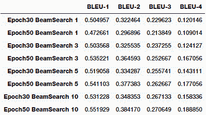

我们还可以通过图表的形式轻松地将其可视化，以查看哪种模型参数组合为我们提供了具有最高 BLEU 得分的最佳模型：

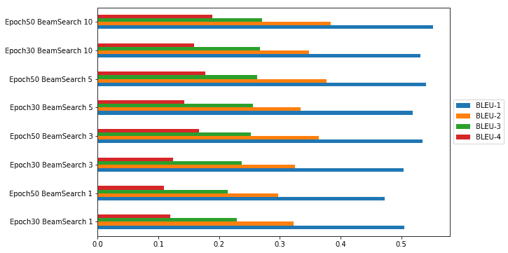

从上一张图可以很明显地看出，基于 BLEU 指标，我们在集束搜索期间具有 50 个周期且集束大小为 10 的模型为我们提供了最佳表现。

# 自动图片字幕实战！

对我们的测试数据集进行评估是测试模型表现的好方法，但是我们如何开始在现实世界中使用模型并为全新照片加上标题呢？ 在这里，我们需要一些知识来构建端到端系统，该系统以任何图像作为输入，并为我们提供自由文本的自然语言标题作为输出。

以下是我们的自动字幕生成器的主要组件和函数：

*   字幕模型和元数据初始化器
*   图像特征提取模型初始化器
*   基于迁移学习的特征提取器
*   字幕生成器

为了使它通用，我们构建了一个类，该类利用了前面几节中提到的几个工具函数：

```py
from keras.preprocessing import image 
from keras.applications.vgg16 import preprocess_input as preprocess_vgg16_input 
from keras.applications import vgg16 
from keras.models import Model 

class CaptionGenerator: 

    def __init__(self, image_locations=[],  
                 word_to_index_map=None, index_to_word_map=None,  
                 max_caption_size=None, caption_model=None,  
                                                    beam_size=1): 
        self.image_locs = image_locations 
        self.captions = [] 
        self.image_feats = [] 
        self.word2index = word_to_index_map 
        self.index2word = index_to_word_map 
        self.max_caption_size = max_caption_size 
        self.vision_model = None 
        self.caption_model = caption_model 
        self.beam_size = beam_size 

    def process_image2arr(self, path, img_dims=(224, 224)): 
        img = image.load_img(path, target_size=img_dims) 
        img_arr = image.img_to_array(img) 
        img_arr = np.expand_dims(img_arr, axis=0) 
        img_arr = preprocess_vgg16_input(img_arr) 
        return img_arr 

    def initialize_model(self): 

        vgg_model = vgg16.VGG16(include_top=True, weights='imagenet',  
                                input_shape=(224, 224, 3)) 
        vgg_model.layers.pop() 
        output = vgg_model.layers[-1].output 
        vgg_model = Model(vgg_model.input, output) 
        vgg_model.trainable = False 
        self.vision_model = vgg_model 

    def process_images(self): 
        if self.image_locs: 
            image_feats = [self.vision_model.predict
                                         (self.process_image2arr
                                         (path=img_path)) for img_path   
                                            in self.image_locs] 
            image_feats = [np.reshape(img_feat, img_feat.shape[1]) for  
                                      img_feat in image_feats] 
            self.image_feats = image_feats 
        else: 
            print('No images specified') 

    def generate_captions(self): 
        captions = [generate_image_caption(model=self.caption_model, 
                    word_to_index_map=self.word2index,  
                    index_to_word_map=self.index2word,  
                    image_features=img_feat, 
                                           max_caption_size=self.max_caption_size, beam_size=self.beam_size)[0] 
                           for img_feat in self.image_feats] 
        self.captions = captions 
```

现在我们的字幕生成器已经实现，现在该将其付诸实践了！ 为了测试字幕生成器，我们下载了几张全新的图像，这些图像在`Flickr8K`数据集中不存在。 我们从 Flickr 下载了特定的图像，这些图像遵循必要的基于商业使用的许可证，因此我们可以在本书中进行描述。 我们将在下一部分中展示一些演示。

# 为室外场景中的样本图像加字幕

我们从 Flickr 拍摄了几张针对各种户外场景的图像，并使用了我们的两个图像字幕模型为每个图像生成字幕，如下所示：

```py
# load files 
import glob 
outdoor1_files = glob.glob('real_test/outdoor1/*') 

# initialize caption generators and generate captions 
cg1 = CaptionGenerator(image_locations=outdoor1_files, word_to_index_map=word_to_index, index_to_word_map=index_to_word,  
                       max_caption_size=max_caption_size, caption_model=model1, beam_size=3) 
cg2 = CaptionGenerator(image_locations=outdoor1_files, word_to_index_map=word_to_index, index_to_word_map=index_to_word,  
                       max_caption_size=max_caption_size, caption_model=model2, beam_size=3) 
cg1.initialize_model() 
cg1.process_images() 
cg1.generate_captions() 
cg2.initialize_model() 
cg2.process_images() 
cg2.generate_captions() 

model30ep_captions_outdoor1 = cg1.captions 
model50ep_captions_outdoor1 = cg2.captions 

# plot images and their captions 
fig=plt.figure(figsize=(13, 11)) 
plt.suptitle('Automated Image Captioning: Outdoor Scenes 1', verticalalignment='top', size=15) 
columns = 2 
rows = 3 
for i in range(1, columns*rows +1): 
    fig.add_subplot(rows, columns, i) 
    image_name = outdoor1_files[i-1] 
    img = image.load_img(image_name) 
    plt.imshow(img, aspect='auto') 
    modelep30_caption_text = 'Caption(ep30): '+ model30ep_captions_outdoor1[i-1] 
    modelep50_caption_text = 'Caption(ep50): '+ model50ep_captions_outdoor1[i-1] 
    plt.xlabel(modelep30_caption_text+'\n'+modelep50_caption_text,size=11, wrap=True) 
fig.tight_layout() 
plt.subplots_adjust(top=0.955) 
```

前面代码的输出如下：

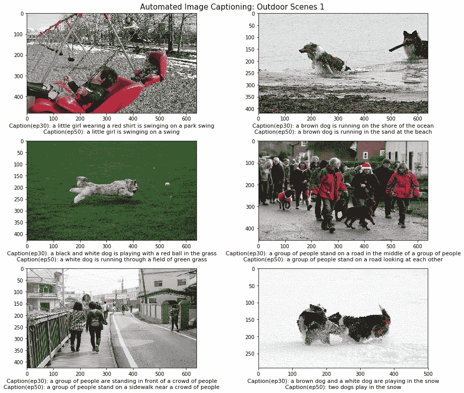

根据前面的图像，您可以清楚地看到它已正确识别每个场景。 这不是一个完美的模型，因为我们可以清楚地看到它并没有在第二行的第二张图像中识别出狗，而是清楚地识别了一群人。 此外，我们的模型确实犯了一些颜色识别错误，例如将绿色球识别为红色球。 总体而言，生成的字幕绝对适用于源图像！

以下图像是从更多样化的户外场景中摘录的，并基于流行的户外活动。 我们将专注于不同的活动，以查看我们的模型在不同类型的场景上的表现如何，而不是仅关注一个特定的场景：

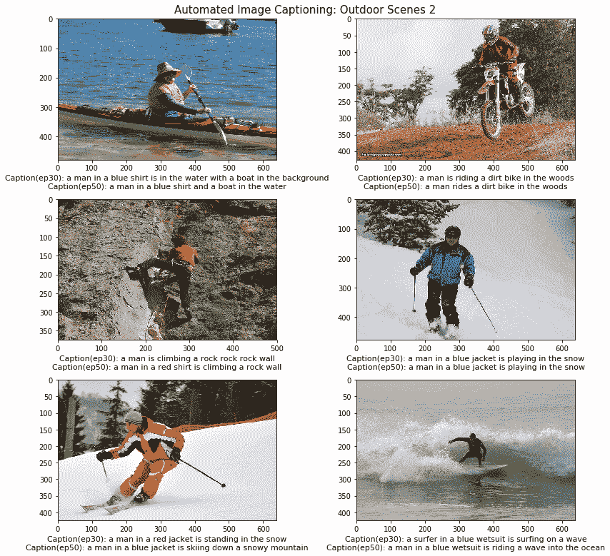

在前面的图像中，我们专注于各种各样的户外活动，包括越野自行车，滑雪，冲浪，皮划艇和攀岩。 如果您查看生成的字幕，它们与每个场景都相关，并可以很好地描述它们。 在某些情况下，我们的模型会变得非常具体，甚至描述每个人的穿着。 但是，正如我们前面提到的，它会在几种情况下错误地识别颜色，可能可以通过添加更多数据以及对高分辨率图像进行训练来改善颜色。

# 为流行运动的样本图像加字幕

在模型测试的最后一部分，我们从 Flickr 拍摄了几张图像，这些图像专注于世界各地通常进行的各种体育运动。 我们肯定获得了一些有趣的结果，因为我们不仅仅关注一两个基于运动的场景。 生成此代码的代码与我们在上一节中使用的代码完全相同，只是源图像发生了变化。 与往常一样，笔记本中提供了详细的代码以供参考。 以下是我们的字幕生成器在第一批运动场景上的结果：

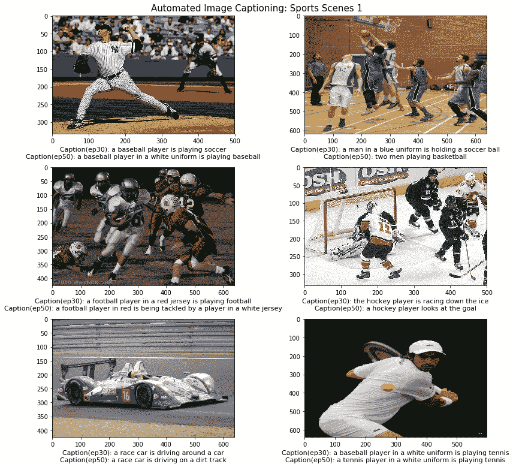

在前面的图像中，我们可以清楚地看到训练有 50 个周期的模型在视觉上更详细地描述图像方面优于具有 30 个周期的模型。 这包括特定的球衣和服装颜色，例如白色，蓝色和红色。 我们还看到字幕中提到了一些具体的活动，例如：踢足球，看曲棍球的进球或在泥泞的赛道上驾驶。 这无疑为生成的字幕提供了更多的深度和含义。 我们的模型具有 30 个周期，因此在某些图像中所进行的确切运动方面也会犯一些错误。

现在，让我们看一下体育场景的最后一组，以了解我们的字幕生成器在与前一组场景完全不同的体育活动中的表现：

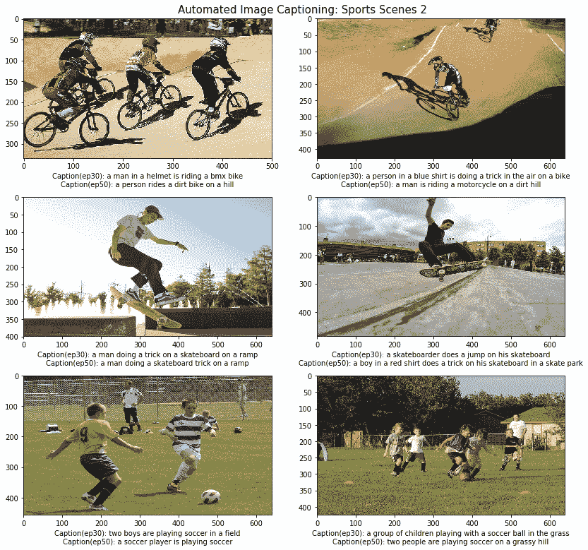

我们可以从前面的输出中观察到，我们的两个模型都运行良好，在 30 个周期上训练的模型在几种情况下都表现出色，例如识别出踢足球的孩子或男孩，甚至是比赛中 BMX 骑手的颜色和配饰。 总体而言，这两种模型都表现良好，并且在某种程度上解释了风景，类似于人类对这些场面的描述。

成功的主要方面是我们的模型不仅可以正确识别每个活动，而且还能够生成有意义且适用的标题。 我们鼓励您尝试在不同的场景上构建和测试自己的字幕生成器！

# 未来的改进空间

根据我们在本章中采用的方法，有多种方法可以改进此模型。 以下是一些可以改进的特定方面：

*   使用更好的图像特征提取模型，例如 Google 的 Inception 模型
*   分辨率更高，质量更好的训练图像（需要 GPU 功能！）
*   基于 Flickr30K 等数据集甚至图像增强的更多训练数据
*   在模型中引入注意力

如果您拥有必要的数据和基础架构，那么这些点子值得探讨！

# 总结

这绝对是我们整本书中解决的最棘手的现实问题之一。 它是迁移学习和生成型深度学习的完美结合，可应用于来自图像和文本的数据组合，这些组合结合了围绕计算机视觉和 NLP 的不同领域。 我们介绍了有关理解图像字幕的基本概念，构建字幕生成器所需的主要组件，并从头开始构建了我们自己的模型。 我们通过利用预先训练的计算机视觉模型从要字幕的图像中提取正确的特征，然后将它们与一些顺序模型（例如 LSTM）结合使用，以有效地利用迁移学习原理。 顺序模型的有效评估非常困难，我们利用行业标准的 BLEU 评分标准来达到目的。 我们从头开始实现评分函数，并在测试数据集上评估了我们的模型。

最后，我们使用以前构建的所有资产和组件从头构建了一个通用的自动图像字幕系统，并在来自不同领域的多种图像上对其进行了测试。 我们希望这能给您一个很好的入门介绍，这是计算机视觉和 NLP 的完美结合，并且我们绝对鼓励您构建自己的图像捕获系统！