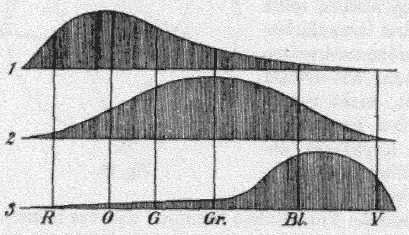
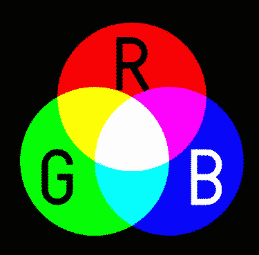
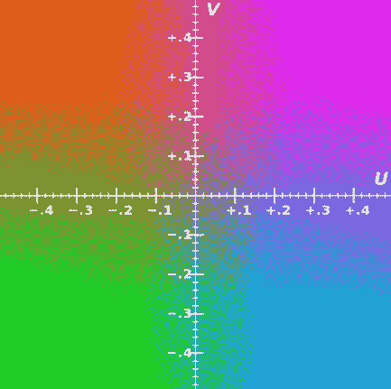
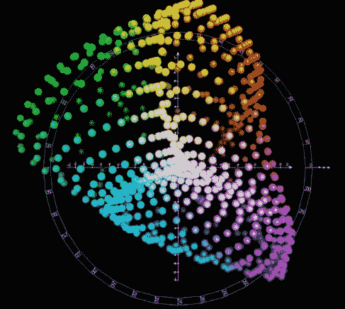
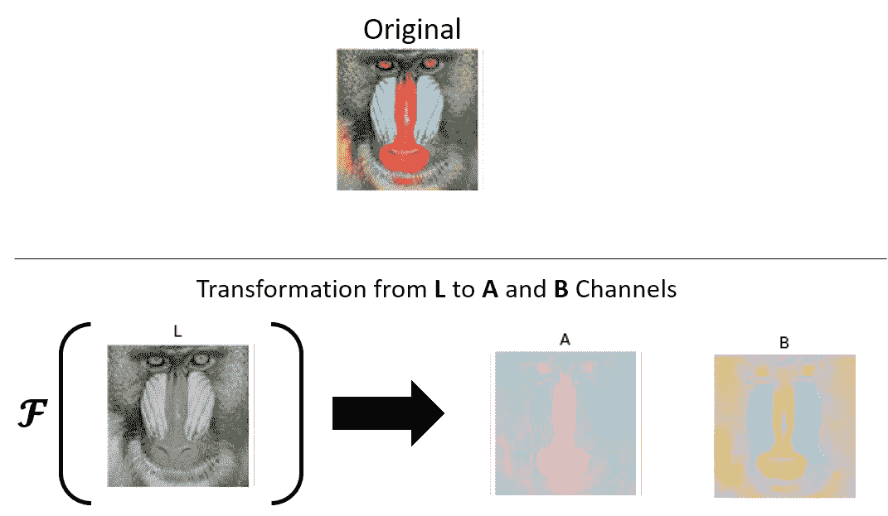
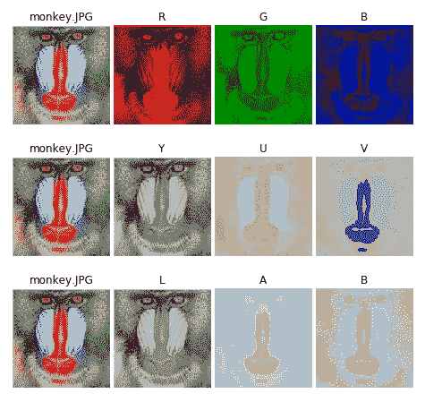
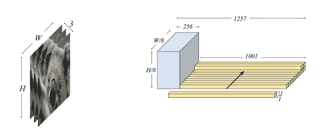
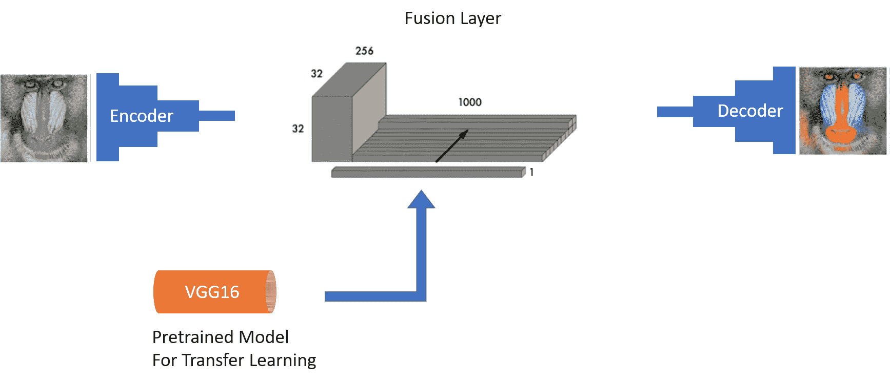
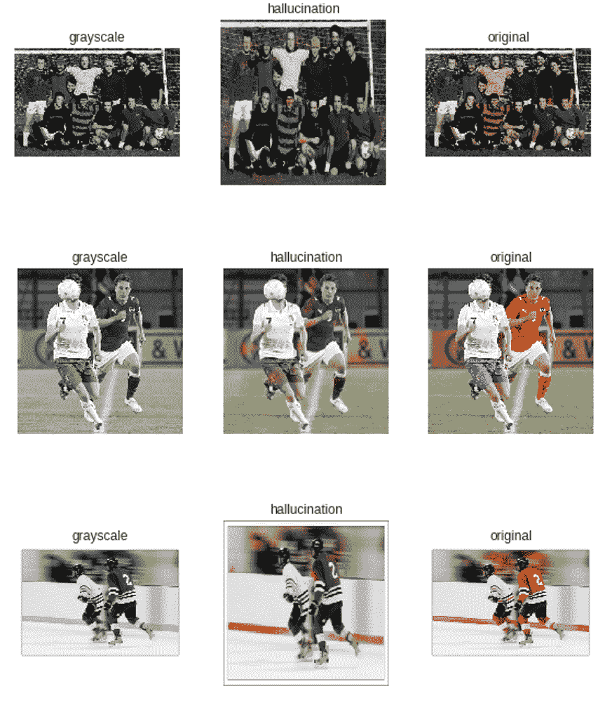

# 十一、图像着色

颜色是大自然的笑容。

–雷·亨特

直到 1840 年代，世界都是以黑白捕获。 加布里埃尔·利普曼（Gabriel Lippmann）于 1908 年获得诺贝尔物理学奖，从而开始了色彩捕捉的时代。 1935 年，伊士曼·柯达（Eastman Kodak）推出了一体式三重彩色胶卷，称为 *Kodachrome*，用于拍摄彩色照片。

彩色图像不仅与美学和美感有关，而且比黑白图像捕获的信息要多得多。 颜色是现实世界对象的重要属性，它为我们对周围世界的感知增加了另一个维度。 色彩的重要性是如此之大，以至于有许多项目为整个历史上的艺术作品和摄影作品着色。 随着 Adobe Photoshop 和 GIMP 等工具的出现，人们一直在努力地将旧照片转换为彩色照片。 reddit r / Colorization 子组是一个在线社区，人们在这里分享经验并致力于将黑白图像转换为彩色图像。

到目前为止，在本书中，我们涵盖了不同的领域和场景，以展示迁移学习的惊人好处。 在本章中，我们将介绍使用深度学习进行图像着色的概念，并利用迁移学习来改善结果。 本章将涵盖以下主题：

*   问题陈述
*   了解图像色彩
*   彩色图像
*   建立基于深度神经网络的着色网络
*   改进之处
*   挑战性

在接下来的部分中，我们将使用术语黑白，单色和灰度来表示没有任何颜色信息的图像。 我们将这些术语互换使用。

# 问题陈述

照片可以帮助我们及时保存事件。 它们不仅帮助我们重温记忆，还提供对过去重要事件的见解。 在彩色摄影成为主流之前，我们的摄影历史是用黑白拍摄的。 图像着色的任务是将给定的灰度图像转换为合理的颜色版本。

图像着色的任务可以从不同的角度进行。 手动过程非常耗时，[并且需要出色的技能](https://www.reddit.com/r/Colorization/)。 计算机视觉和深度学习领域的研究人员一直在研究使过程自动化的不同方法。 通过本章，我们将努力理解如何将深层神经网络用于此类任务。 我们还将尝试利用迁移学习的力量来改善结果。

我们鼓励读者在继续进行之前，先对问题陈述进行思考。 考虑一下您将如何处理这样的任务。 在深入探讨该解决方案之前，让我们获取有关彩色图像和相关概念的一些信息。 下一节涵盖了处理当前任务所需的基本概念。

# 彩色图像

不到 100 年前，单色捕获是一个限制，而不是一种选择。 数码和移动摄影的出现使黑白图像或灰度图像成为一种艺术选择。 当然，这样的图像具有戏剧性的效果，但是黑白图像不仅仅是改变捕获设备（无论是数码相机还是电话）上的选项。

我们对颜色和正式颜色模型的了解早于彩色图像。 托马斯·杨（Thomas Young）在 1802 年提出了三种类型的感光器或视锥细胞的存在（如下图所示）。 他的理论详述了这三个视锥细胞中的每一个仅对特定范围的可见光敏感。 进一步发展了该理论，将这些视锥细胞分为短，中和长三种，分别优选蓝色，绿色和红色：



托马斯·杨（Thomas Young）和赫尔曼·赫尔姆霍尔茨（Hermann Helmholtz）：[三锥细胞理论](https://en.wikipedia.org/wiki/Color_space#/media/File:YoungHelm.jpg)

我们对颜色的理解以及对颜色的理解方式的进步导致了颜色理论的形式化。 由于色彩理论本身是一个完整的领域，因此在本章中，我们将对其进行简要介绍。 关于这些主题的详细讨论超出了本书的范围。

# 色彩理论

简单来说，色彩理论是用于指导色彩感知，混合，匹配和复制方法的正式框架。 多年来，已经进行了各种尝试来基于色轮，原色，第二色等正式定义颜色。 因此，颜色理论是一个广阔的领域，在此之下，我们可以正式定义与色度，色相，配方等颜色相关的属性。

# 色彩模型和色彩空间

颜色模型是颜色理论到颜色表示的表述。 颜色模型是一种抽象的数学概念，当与它的组成的精确理解相关联时，被称为**颜色空间**。 大多数颜色模型都用表示特定颜色成分的三到四个数字的元组表示。

# RGB

托马斯·杨（Thomas Young）三锥理论**红色绿色蓝色**（**RGB**）的延续，是最古老，使用最广泛的颜色模型和颜色空间之一。 RGB 是加色模型。 在此模型中，以不同的浓度添加了光的三个分量（红色，绿色和蓝色），以实现可见光的完整光谱。 附加色空间如下图所示：



RGB 颜色空间（[来源：英语 Wikipedia 的 SharkD。更高版本由 Jacobolus 上传，已从 wikipedia en 转移到 Public Commons 域](https://commons.wikimedia.org/w/index.php?curid=2529435)）

每种成分的零强度会导致黑色，而全强度会导致对白色的感觉。 尽管简单，但此颜色模型和颜色空间构成了大多数电子显示器（包括 CRT，LCD 和 LED）的基础。

# YUV

`Y`代表**亮度**，而`U`和`V`通道代表**色度**。 该编码方案在视频系统中被广泛使用以映射人类的颜色感知。 紫外线通道主要帮助确定红色和蓝色的相对含量。 由于该方案使用较低的带宽并且不易出现传输错误的能力，因此被广泛使用，如下所示：



YUV 色彩空间（[来源：Tonyle](https://commons.wikimedia.org/w/index.php?curid=6977944)，本人著作，CC BY-SA 3.0）

此图像是 UV 颜色通道在 0.5 Y 处的样本表示。

# LAB

这种与设备无关的色彩空间参考是由国际照明委员会开发的。 `L`通道表示颜色的亮度（0 为黑色，而 100 为漫射白色）。

`A`表示绿色和品红色之间的位置，而`B`表示蓝色和黄色之间的位置，如下所示：



LAB 色彩空间（[来源：Holger kkk Everding](https://commons.wikimedia.org/w/index.php?curid=38366968)，自己的作品，CC BY-SA 4.0）

除了这三种以外，还存在其他各种颜色模型。 出于当前有关图像着色的用例的目的，我们将采用一种非常有趣的方法。

# 重新陈述问题

如果我们遵循使用最广泛的颜色模型 RGB，那么事实证明，训练模型以将输入的单色图像映射到颜色将是一项艰巨的任务。

深度学习领域的研究人员在解决和提出问题方面颇具创造力。 在图像着色的情况下，研究人员巧妙地研究了利用不同输入来实现灰度图像逼真的幻觉的方法。

在最初的尝试中，参考图像和颜色涂鸦形式的颜色引导输入的不同变体被用来产生巨大的效果。 请参阅威尔士和合著者以及莱文和合著者。

最近的工作集中在利用深层 CNN 中的迁移学习使整个过程自动化。 结果令人鼓舞，有时甚至足以愚弄人类。

最近的工作，以及迁移学习的力量，已经巧妙地尝试利用包含灰度通道作为其组成部分之一的颜色模型。 那会响吗？ 现在让我们从另一个角度看问题陈述。

除了无所不在的 RGB 颜色空间外，我们还讨论了 LAB。 LAB 色彩空间包含灰度值，因为`L`通道（用于亮度），而其余两个通道（`a`和`b`）赋予颜色属性。 因此，着色问题可以用以下数学方式建模：


在上述方程式中，我们表示从给定数据将`L`通道映射到同一图像的`a`和`b`通道的函数。 下图说明了这一点：



colornet 转换

简而言之，我们已经将图像着色的任务转换为将一个通道（灰度`L`通道）转换为两个颜色通道（`A`和`B`）的任务 ，说明如下：



彩色图像及其组件 -- RGB，YUV 和 LAB

前面的图像显示了彩色图像的`L`，`A`和`B`通道，基于 [Zhang 及其合著者（2016）和 Federico 及其合著者（2017）](https://arxiv.org/abs/1603.08511)的作品。 我们将在接下来的部分中详细研究它们。

我们鼓励读者阅读标题为[《Deep Koalarization：使用 CNN 和 Inception-ResNet-v2 进行图像着色》](https://arxiv.org/abs/1712.03400)的论文。 我们要感谢 Federico Baldassarre，Diego Gonzalez-Morin 和 Lucas Rodes-Guirao 为他们的工作及其实施提供了详细的信息和见解。 我们还要感谢 Emil Wallner 使用 Keras 出色地实现了本文。

读者应注意，类似的过程也可以应用于 YUV 色彩空间。 [Jeff Hwang 和他的合著者在题为《利用深度卷积神经网络进行图像着色》的论文中讨论了利用这种色彩空间的尝试，效果也很好](http://cs231n.stanford.edu/reports/2016/pdfs/219_Report.pdf)。

# 建立着色深层神经网络

现在是时候构建着色深层神经网络或色网。 如前一节所述，如果我们使用替代颜色空间，例如 LAB（或 YUV），则可以将着色任务转换为数学转换。 转换如下：


数学公式和创造力很好，但是学习这些转换的图像在哪里呢？ 深度学习网络需要大量数据，但幸运的是，我们有来自各种开源数据集的大量不同图像的集合。 在本章中，我们将依赖于 ImageNet 本身的一些示例图像。 由于 ImageNet 是一个庞大的数据集，因此我们为问题陈述随机选择了一些彩色图像。 在后面的部分中，我们将讨论为什么选择此子集及其一些细微差别。

我们依靠 Baldassarre 及其合作者开发的图像提取实用程序，用于[《Deep Koalarization：使用 CNN 和 Inception-ResNet-v2 进行图像着色》](https://arxiv.org/abs/1712.03400)的论文，来整理本章中使用的 ImageNet 样本的子集。 可以在[这个页面](https://github.com/baldassarreFe/deep-koalarization/tree/master/dataset)上获取数据提取的代码。

本书的 GitHub 存储库中提供了本章使用的代码和示例图像以及`colornet_vgg16.ipynb`笔记本。

# 预处理

获取/整理所需数据集后的第一步是预处理。 对于当前的图像着色任务，我们需要执行以下预处理步骤：

*   **重新缩放**：ImageNet 是一个具有各种图像的多样化数据集，包括类和大小（尺寸）。 为了实现此目的，我们将所有图像重新缩放为固定大小。
*   **利用 24 位 RGB**：由于人眼只能区分 2 和 1000 万种颜色，因此我们可以利用 24 位 RGB 来近似 1600 万种颜色。 减少每个通道的位数将有助于我们以更少的资源更快地训练模型。 这可以通过简单地将像素值除以 255 来实现。
*   **RGB 到 LAB**：由于在 LAB 色彩空间中更容易解决图像着色问题，因此我们将利用 skimage 来转换和提取 RGB 图像中的 LAB 通道。

# 标准化

LAB 颜色空间的值介于 -128 至 +128 之间。 由于神经网络对输入值的大小敏感，因此我们将从-128 到+128 的变换后的像素值归一化，并将它们置于 -1 到 +1 范围内。 以下代码片段中展示了相同的内容：

```py
def prep_data(file_list=[],
              dir_path=None,
              dim_x=256,
              dim_y=256):

    #Get images

    X = []
for filename in file_list:
    X.append(img_to_array(
                        sp.misc.imresize(
                        load_img(
                        dir_path+filename),
                        (dim_x, dim_y))

           )

        )
    X = np.array(X, dtype=np.float64)
    X = 1.0/255*X
    return X
```

转换后，我们将数据分为训练集和测试集。 对于拆分，我们使用了 sklearn 的`train_test_split utility`。

# 损失函数

模型是通过改善损失函数或目标函数来学习的。 任务是使用反向传播学习最佳参数，以最小化原始彩色图像和模型输出之间的差异。 来自模型的输出彩色图像也称为灰度图像的幻觉着色。 在此实现中，我们将**均方误差**（**MSE**）用作损失函数。 以下等式对此进行了总结：


原始颜色和色网输出之间的损失函数（来源：Baldassarre 和合著者）

对于 Keras，使用此损失函数就像在编译 Keras 模型时设置参数一样容易。 我们利用 RMSprop 优化器来训练我们的模型（本文使用 Adam 代替）。

# 编码器

**卷积神经网络**（**CNN**）是令人惊叹的图像分类器。 他们通过提取位置不变特征来实现。 在此过程中，它们倾向于使输入图像失真。

在图像着色的情况下，这种失真将是灾难性的。 为此，我们使用编码器将`H x W`尺寸的输入灰度图像转换为`H / 8 x W / 8`。 编码器通过使用零填充来保持图像通过不同层的纵横比。 以下代码片段显示了使用 Keras 的编码器：

```py
#Encoder
enc_input = Input(shape=(DIM, DIM, 1,))
enc_output = Conv2D(64, (3,3),
               activation='relu',
               padding='same', strides=2)(enc_input)
enc_output = Conv2D(128, (3,3),
               activation='relu',
               padding='same')(enc_output)
enc_output = Conv2D(128, (3,3),
              activation='relu',
              padding='same', strides=2)(enc_output)
```

```py
enc_output = Conv2D(256, (3,3),
              activation='relu',
              padding='same')(enc_output)
enc_output = Conv2D(256, (3,3),
              activation='relu',
              padding='same', strides=2)(enc_output)
enc_output = Conv2D(512, (3,3),
              activation='relu',
              padding='same')(enc_output)
enc_output = Conv2D(512, (3,3),
              activation='relu',
              padding='same')(enc_output)
enc_output = Conv2D(256, (3,3),
              activation='relu',
              padding='same')(enc_output)
```

在前面的代码片段中，有趣的方面是对第 1 层，第 3 层和第 5 层使用了 2 的步幅大小。2 的步幅长度将图像尺寸减半，但仍设法保持了纵横比。 这有助于增加信息密度而不会扭曲原始图像。

# 迁移学习 – 特征提取

本章讨论的图像着色网络是一个非常独特的网络。 它的独特性来自我们使用迁移学习来增强模型的方式。 我们知道可以将预训练的网络用作特征提取器，以帮助迁移学习的模式并提高模型的性能。

在这种当前设置下，我们利用预训练的 VGG16（本文指的是利用预训练的 Inception 模型）进行迁移学习。 由于 VGG16 需要以特定格式输入，因此我们通过调整输入图像的大小并将其连接 3 次以补偿丢失的通道信息，来转换输入的灰度图像（输入到网络编码器部分的相同灰度图像）。

以下代码段获取输入的灰度图像并生成所需的嵌入：

```py
#Create embedding
def create_vgg_embedding(grayscaled_rgb):
    gs_rgb_resized = []
    for i in grayscaled_rgb:
        i = resize(i, (224, 224, 3),
                   mode='constant')
        gs_rgb_resized.append(i)
    gs_rgb_resized = np.array(gs_rgb_resized)
    gs_rgb_resized = preprocess_input(gs_rgb_resized)
    with vgg16.graph.as_default():
      embedding = vgg16.predict(gs_rgb_resized)
    return embedding
```

前面的代码段生成大小为`1,000 x 1 x 1`的输出特征向量。

# 融合层

我们在前几章中构建的大多数网络都使用了 Keras 的顺序 API。 融合层是在这种情况下利用迁移学习的创新方式。 请记住，我们已将输入灰度图像用作两个不同网络（一个编码器和一个预训练的 VGG16）的输入。 由于两个网络的输出具有不同的形状，因此我们将 VGG16 的输出重复 1,000 次，然后将其与编码器输出连接或合并。 以下代码段准备了融合层：

```py
#Fusion
fusion_layer_output = RepeatVector(32*32)(emd_input)
fusion_layer_output = Reshape(([32,32,
                          1000]))(fusion_layer_output)
fusion_layer_output = concatenate([enc_output,
                                   fusion_layer_output], axis=3)
fusion_layer_output = Conv2D(DIM, (1, 1),
                       activation='relu',
                       padding='same')(fusion_layer_output)
```

VGG16 的输出重复沿编码器输出的深度轴连接。 这样可以确保从 VGG16 中提取的图像特征嵌入均匀地分布在整个图像中：



级联灰度输入预训练网络（左），融合层（右）
来源：Baldassarre 等

上图显示了特征提取器或预训练的 VGG16 的输入以及融合层的结构。

# 解码器

网络的最后阶段是解码器。 在网络的前两个部分中，我们利用编码器和预训练模型来学习不同的功能并生成嵌入。 融合层的输出为张量，大小为`H / 8 x W / 8 x 256`，其中`H`和`W`是灰度图像的原始高度和宽度（在我们的情况是`256 x 256`）。 该输入经过一个八层解码器，该解码器使用五个卷积层和三个上采样层构建。 上采样层可帮助我们使用基本的最近邻方法将图像大小增加一倍。 以下代码片段展示了网络的解码器部分：

```py
#Decoder
dec_output = Conv2D(128, (3,3),
                        activation='relu',
                        padding='same')(fusion_layer_output)
dec_output = UpSampling2D((2, 2))(dec_output)
dec_output = Conv2D(64, (3,3),
                        activation='relu',
                        padding='same')(dec_output)
dec_output = UpSampling2D((2, 2))(dec_output)
dec_output = Conv2D(32, (3,3),
                        activation='relu',
                        padding='same')(dec_output)
dec_output = Conv2D(16, (3,3),
                        activation='relu',
                        padding='same')(dec_output)
dec_output = Conv2D(2, (3, 3),
                        activation='tanh',
                        padding='same')(dec_output)
dec_output = UpSampling2D((2, 2))(dec_output)

```

解码器网络的输出是具有两个通道的原始大小的图像，即，输出是形状为`H x W x 2`的张量。 最终的卷积层使用 tanh 激活函数将预测像素值保持在 -1 到 +1 范围内。

下图显示了具有三个组成部分的网络：



Colornet 由编码器，作为特征提取器的预训练模型，融合层和解码器组成

使用 Keras 构建的深度学习模型通常是使用顺序 API 构建的。 在这种情况下，我们的着色网络（即 colornet）利用功能性 API 来实现融合层。

# 后处理

解决问题的技巧还没有结束。 如“预处理”小节中所述，我们将 -1 到 +1 之间的像素值标准化，以确保我们的网络正确训练。 同样，两个颜色通道的 LAB 颜色空间的值在 -128 到 +128 之间。 因此，执行以下两个后处理步骤：

*   我们将每个像素值乘以 128，以将值带入所需的颜色通道范围
*   我们将灰度输入图像与输出两通道图像连接起来，以获得幻觉的彩色图像

以下代码段执行后处理步骤，以产生幻觉的彩色图像：

```py
sample_img = []
for filename in test_files:
    sample_img.append(sp.misc.imresize(load_img(IMG_DIR+filename),
                                     (DIM, DIM)))
sample_img = np.array(sample_img,
                    dtype=float)
sample_img = 1.0/255*sample_img
sample_img = gray2rgb(rgb2gray(sample_img))
sample_img = rgb2lab(sample_img)[:,:,:,0]
sample_img = sample_img.reshape(sample_img.shape+(1,))
#embedding input
sample_img_embed = create_vgg_embedding(sample_img)
```

如前面的代码片段所示，我们使用 skimage 中的`lab2rgb`实用程序将生成的输出转换为 RGB 颜色空间。 这样做是为了便于可视化输出图像。

# 训练与结果

训练如此复杂的网络可能很棘手。 在本章中，我们从 ImageNet 中选择了一小部分图像。 为了帮助我们的网络学习和推广，我们使用 Keras 的`ImageDataGenerator`类来扩充数据集并在输入数据集中产生变化。 以下代码片段展示了图像增强和模型训练：

```py
# Image transformer
datagen = ImageDataGenerator(
        shear_range=0.2,
        zoom_range=0.2,
        rotation_range=20,
        horizontal_flip=True)
def colornet_img_generator(X,
                  batch_size=BATCH_SIZE):
    for batch in datagen.flow(X, batch_size=batch_size):
        gs_rgb = gray2rgb(rgb2gray(batch))
        batch_lab = rgb2lab(batch)

        batch_l = batch_lab[:,:,:,0]
        batch_l = batch_l.reshape(batch_l.shape+(1,))
        batch_ab = batch_lab[:,:,:,1:] / 128
        yield ([batch_l,
                create_vgg_embedding(gs_rgb)], batch_ab)
history = model.fit_generator(colornet_img_generator(X_train,
                                                     BATCH_SIZE),
                              epochs=EPOCH,
                              steps_per_epoch=STEPS_PER_EPOCH)
```

在着色网络的情况下，这种损失可能会产生误导。 它似乎已稳定在 100 个纪元以下，但所产生的结果更多是乌贼色而不是颜色。 因此，我们做了更多的实验以达到以下结果：



Colornet 输出：第一列代表灰度输入，第二列代表模型输出，第三列代表原始图像

前面的结果虽然不令人吃惊，但令人鼓舞。 通过对模型进行 600 个时期的训练，批次大小为 64，可以实现上述结果。

# 挑战

深度神经网络是功能强大的模型，具有成千上万个可学习的参数。 当前训练着色网络的方案提出了一系列新的挑战，其中一些挑战如下：

*   当前的网络似乎已经学习了高级功能，例如草地和运动球衣（在一定程度上），而它发现学习较小物体的颜色模式有些困难。
*   训练集仅限于非常具体的图像子集，因此反映在测试数据集中。 该模型对训练集中不存在的对象或包含这些对象的样本不多的性能不佳。
*   即使训练损失似乎已稳定在 50 个纪元以下，但我们看到，除非进行数百个纪元训练，否则该模型的着色性能相当差。
*   该模型很容易将大多数对象着色为灰色或棕褐色。 在训练了较少时期的模型中观察到了这一点。

除了这些挑战之外，对于如此复杂的体系结构，计算和内存要求也很高。

# 进一步改进

当前的实现尽管显示出令人鼓舞的结果，但是可以进一步调整。 通过利用更大，更多样化的数据集可以实现进一步的改进。

也可以通过使用功能更强大的最新预训练图像分类模型（例如 InceptionV3 或 InceptionResNetV2）来进行改进。

我们还可以通过准备由更复杂的架构组成的集成网络来利用 Keras 的功能性 API。 接下来的步骤之一可能是向网络提供时间信息，并查看是否还可以学习为视频着色。

# 总结

图像着色是深度学习领域的前沿主题之一。 随着我们对迁移学习和深度学习的理解日趋成熟，应用范围变得越来越令人兴奋且更具创造力。 图像着色是研究的活跃领域，最近，深度学习专家分享了一些激动人心的工作。

在本章中，我们学习了颜色理论，不同的颜色模型和颜色空间。 这种理解帮助我们将问题陈述重新表述为从单通道灰度图像到两通道输出的映射。 然后，我们根据 Baldassarre 和他的合著者的作品，着手建立一个色网。 该实现涉及一个独特的三层网络，该网络由编码器，解码器和融合层组成。 融合层使我们能够通过将 VGG16 嵌入与编码器输出串联来利用传输学习。 网络需要一些特定的预处理和后处理步骤来训练给定的图像集。 我们的训练和测试数据集由 ImageNet 样本的子集组成。 我们对色网进行了数百次培训。 最后，我们提供了一些幻影图像，以了解该模型对着色任务的学习程度。 训练有素的色网学习了某些高级对象，例如草，但在较小或较不频繁的对象上表现不佳。 我们还讨论了这种类型的网络带来的一些挑战。

这结束了本书中由用例驱动的系列文章中的最后一章。 我们介绍了跨不同领域的不同用例。 每个用例都帮助我们利用了迁移学习的概念，本书的前两部分对此进行了详细讨论。 机器学习和深度学习领域的领先人物之一 Andrew Ng 在他的 NIPS 2016 教程中表示：

*迁移学习将成为机器学习商业成功的下一个推动力。*

在本书中讨论和展示了各种应用程序及其优势之后，您现在应该了解迁移学习的巨大潜力。