# 释放迁移学习的力量

在上一章中，我们介绍了围绕迁移学习的主要概念。 关键思想是，与从头开始构建自己的深度学习模型和体系结构相比，在各种任务中利用先进的，经过预训练的深度学习模型可产生更好的结果。 在本章中，我们将获得一个更动手的观点，即使用迁移学习实际构建深度学习模型并将其应用于实际问题。 有无迁移学习，我们将构建各种深度学习模型。 我们将分析它们的体系结构，并比较和对比它们的性能。 本章将涵盖以下主要方面：

*   迁移学习的需要
*   从头开始构建**卷积神经网络**（**CNN**）模型：
    *   建立基本的 CNN 模型
    *   通过正则化改进我们的 CNN 模型
    *   通过图像增强改善我们的 CNN 模型
*   在预训练的 CNN 模型中利用迁移学习：
    *   使用预训练模型作为特征提取器
    *   通过图像增强改进我们的预训练模型
    *   通过微调改进我们的预训练模型
*   模型性能评估

我们要感谢 Francois Chollet 不仅创建了令人惊叹的深度学习框架 Keras，还感谢他在他的书《Python 深度学习》中谈到了有效学习迁移的现实世界问题。 在本章中，我们以此为灵感来刻画了迁移学习的真正力量。 本章的代码将在 GitHub 存储库中的[文件夹中提供](https://github.com/dipanjanS/hands-on-transfer-learning-with-python)，根据需要遵循本章。

# 迁移学习的需要

我们已经在第 4 章“迁移学习基础”中简要讨论了迁移学习的优势。 概括地说，与从头开始构建深度学习模型相比，我们获得了一些好处，例如，改善了基准性能，加快了整体模型的开发和培训时间，并且还获得了整体改进和优越的模型性能。 这里要记住的重要一点是，迁移学习作为一个领域早已在深度学习之前就存在了，并且还可以应用于不需要深度学习的领域或问题。

现在让我们考虑一个现实世界的问题，在本章中，我们还将继续使用它来说明我们不同的深度学习模型，并在同一模型上利用迁移学习。 您必须一次又一次听到深度学习的关键要求之一是，我们需要大量数据和样本来构建可靠的深度学习模型。 其背后的想法是模型可以从大量样本中自动学习特征。 但是，如果我们没有足够的训练样本并且要解决的问题仍然是一个相对复杂的问题，我们该怎么办？ 例如，计算机视觉问题，例如图像分类，可能难以使用传统的统计技术或**机器学习**（**ML**）技术解决。 我们会放弃深度学习吗？

考虑到**图像分类**问题，由于我们要处理的图像本质上是高维张量，因此拥有更多数据可使深度学习模型学习更好的图像基本特征表示。 但是，即使我们每个类别的图像样本的范围从几百到数千，基本的 CNN 模型在正确的体系结构和规范化条件下仍能正常运行。 这里要记住的关键点是，CNN 会学习与缩放，平移和旋转不变的模式和特征，因此我们在这里不需要自定义特征工程技术。 但是，我们可能仍然会遇到模型过拟合之类的问题，我们将在本章稍后部分尝试解决这些问题。

关于迁移学习，已经在著名的 [ImageNet 数据集](http://image-net.org/about-overview)上训练了一些出色的预训练深度学习模型。 我们已经在第 3 章“了解深度学习架构”中详细介绍了其中一些模型，本章将利用著名的`VGG-16`模型。 想法是使用通常是图像分类专家的预训练模型来解决我们的问题，即数据样本较少。

# 制定我们的现实问题

正如我们前面提到的，我们将在图像分类问题上进行工作，每个类别的训练样本数量较少。 我们的问题的数据集可在 Kaggle 上获得，它是其中最受欢迎的基于计算机视觉的数据集之一。 我们将使用的数据集来自[**猫狗**挑战](https://www.kaggle.com/c/dogs-vs-cats/data)，而我们的主要目标是建立一个可以成功识别图像并将其分类为猫或狗的模型。 就机器学习而言，这是一个基于图像的二分类问题。

首先，从数据集页面下载`train.zip`文件并将其存储在本地系统中。 下载后，将其解压缩到文件夹中。 该文件夹将包含 25,000 张猫和狗的图像； 即每个类别 12500 张图像。

# 建立我们的数据集

虽然我们可以使用所有 25,000 张图像并在它们上建立一些不错的模型，但是，如果您还记得的话，我们的问题目标包括增加的约束，即每类图像的数量很少。 为此，我们构建自己的数据集。 如果您想自己运行示例，可以参考`Datasets Builder.ipynb` Jupyter 笔记本。

首先，我们加载以下依赖项，包括一个名为`utils`的实用程序模块，该模块在本章代码文件中的`utils.py`文件中可用。 当我们将图像复制到新文件夹时，这主要用于获得视觉进度条：

```py
import glob 
import numpy as np 
import os 
import shutil 
from utils import log_progress 

np.random.seed(42) 
```

现在，如下所示将所有图像加载到原始训练数据文件夹中：

```py
files = glob.glob('train/*') 

cat_files = [fn for fn in files if 'cat' in fn] 
dog_files = [fn for fn in files if 'dog' in fn] 
len(cat_files), len(dog_files) 

Out [3]: (12500, 12500) 
```

我们可以使用前面的输出来验证每个类别有 12,500 张图像。 现在，我们构建较小的数据集，以使我们有 3,000 张图像用于训练，1,000 张图像用于验证和 1,000 张图像用于我们的测试数据集（两个动物类别的表示均相同）：

```py
cat_train = np.random.choice(cat_files, size=1500, replace=False) 
dog_train = np.random.choice(dog_files, size=1500, replace=False) 
cat_files = list(set(cat_files) - set(cat_train)) 
dog_files = list(set(dog_files) - set(dog_train)) 

cat_val = np.random.choice(cat_files, size=500, replace=False) 
dog_val = np.random.choice(dog_files, size=500, replace=False) 
cat_files = list(set(cat_files) - set(cat_val)) 
dog_files = list(set(dog_files) - set(dog_val)) 

cat_test = np.random.choice(cat_files, size=500, replace=False) 
dog_test = np.random.choice(dog_files, size=500, replace=False) 

print('Cat datasets:', cat_train.shape, cat_val.shape, cat_test.shape) 
print('Dog datasets:', dog_train.shape, dog_val.shape, dog_test.shape) 

Cat datasets: (1500,) (500,) (500,) 
Dog datasets: (1500,) (500,) (500,) 
```

现在我们已经创建了数据集，让我们将它们写到单独文件夹中的磁盘中，以便我们将来可以在任何时候返回它们，而不必担心它们是否存在于主内存中：

```py
train_dir = 'training_data' 
val_dir = 'validation_data' 
test_dir = 'test_data' 

train_files = np.concatenate([cat_train, dog_train]) 
validate_files = np.concatenate([cat_val, dog_val]) 
test_files = np.concatenate([cat_test, dog_test]) 

os.mkdir(train_dir) if not os.path.isdir(train_dir) else None 
os.mkdir(val_dir) if not os.path.isdir(val_dir) else None 
os.mkdir(test_dir) if not os.path.isdir(test_dir) else None 

for fn in log_progress(train_files, name='Training Images'): 
    shutil.copy(fn, train_dir) 
for fn in log_progress(validate_files, name='Validation Images'): 
    shutil.copy(fn, val_dir) 
for fn in log_progress(test_files, name='Test Images'): 
    shutil.copy(fn, test_dir) 
```

一旦所有图像都复制到各自的目录中，以下屏幕快照中描述的进度条将变为绿色：

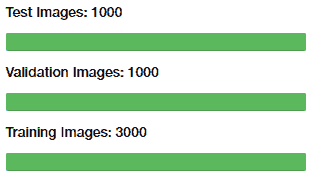

# 制定我们的方法

由于这是图像分类问题，因此我们将利用 CNN 模型或 convNets 尝试解决此问题。 在本章开始时，我们简要讨论了我们的方法。 我们将从头开始构建简单的 CNN 模型，然后尝试使用正则化和图像增强等技术进行改进。 然后，我们将尝试利用预训练的模型来释放转学的真正力量！

# 从头开始构建 CNN 模型

让我们开始构建图像分类分类器。 我们的方法是在训练数据集上建立模型，并在验证数据集上进行验证。 最后，我们将在测试数据集上测试所有模型的性能。 在进入建模之前，让我们加载并准备数据集。 首先，我们加载一些基本的依赖项：

```py
import glob 
import numpy as np 
import matplotlib.pyplot as plt 
from keras.preprocessing.image import ImageDataGenerator, load_img, img_to_array, array_to_img 

%matplotlib inline 
```

现在，使用以下代码片段加载数据集：

```py
IMG_DIM = (150, 150) 

train_files = glob.glob('training_data/*') 
train_imgs = [img_to_array(load_img(img, target_size=IMG_DIM)) for img  
              in train_files] 
train_imgs = np.array(train_imgs) 
train_labels = [fn.split('/')[1].split('.')[0].strip() for fn in 
                train_files] 

validation_files = glob.glob('validation_data/*') 
validation_imgs = [img_to_array(load_img(img, target_size=IMG_DIM)) for 
                   img in validation_files] 
validation_imgs = np.array(validation_imgs) 
validation_labels = [fn.split('/')[1].split('.')[0].strip() for fn in 
                     validation_files] 

print('Train dataset shape:', train_imgs.shape,  
      'tValidation dataset shape:', validation_imgs.shape) 

Train dataset shape: (3000, 150, 150, 3)         
Validation dataset shape: (1000, 150, 150, 3) 
```

我们可以清楚地看到我们有`3000`训练图像和`1000`验证图像。 每个图像的尺寸为`150 x 150`，并具有用于红色，绿色和蓝色（RGB）的三个通道，因此为每个图像提供（`150`，`150`，`3`）尺寸。 现在，我们将像素值在`(0, 255)`之间的每个图像缩放到`(0, 1)`之间的值，因为深度学习模型在较小的输入值下确实可以很好地工作：

```py
train_imgs_scaled = train_imgs.astype('float32') 
validation_imgs_scaled = validation_imgs.astype('float32') 
train_imgs_scaled /= 255 
validation_imgs_scaled /= 255 

# visualize a sample image 
print(train_imgs[0].shape) 
array_to_img(train_imgs[0]) 

(150, 150, 3) 
```

前面的代码生成以下输出：

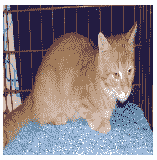

前面的输出显示了我们训练数据集中的示例图像之一。 现在，让我们设置一些基本的配置参数，并将文本类标签编码为数值（否则，Keras 将抛出错误）：

```py
batch_size = 30 
num_classes = 2 
epochs = 30 
input_shape = (150, 150, 3) 

# encode text category labels 
from sklearn.preprocessing import LabelEncoder 

le = LabelEncoder() 
le.fit(train_labels) 
train_labels_enc = le.transform(train_labels) 
validation_labels_enc = le.transform(validation_labels) 

print(train_labels[1495:1505], train_labels_enc[1495:1505]) 

['cat', 'cat', 'cat', 'cat', 'cat', 'dog', 'dog', 'dog', 'dog', 'dog'] 
[0 0 0 0 0 1 1 1 1 1] 
```

我们可以看到，我们的编码方案将`0`分配给`cat`标签，将`1`分配给`dog`标签。 现在，我们准备构建我们的第一个基于 CNN 的深度学习模型。

# 基本的 CNN 模型

我们将从建立具有三个卷积层的基本 CNN 模型开始，再加上用于从图像中自动提取特征的最大池化，以及对输出卷积特征图进行下采样。 要刷新有关卷积和池化层如何工作的记忆，请查看第 3 章“了解深度学习架构”中的 CNN 部分。

提取这些特征图后，我们将使用一个密集层以及一个具有 S 型函数的输出层进行分类。 由于我们正在执行二分类，因此`binary_crossentropy`损失函数就足够了。 我们将使用流行的 RMSprop 优化器，该优化器可帮助我们使用反向传播来优化网络中单元的权重，从而使网络中的损失降到最低，从而得到一个不错的分类器。 请参阅第 2 章，“深度学习要点”中的“随机梯度下降”和“SGD 改进”部分，以获取有关优化器如何工作的深入见解。 简而言之，优化器（如 RMSprop）指定有关损耗梯度如何用于更新传递到我们网络的每批数据中的参数的规则。

让我们利用 Keras 并立即构建我们的 CNN 模型架构：

```py
from keras.layers import Conv2D, MaxPooling2D, Flatten, Dense, Dropout 
from keras.models import Sequential 
from keras import optimizers 

model = Sequential() 

# convolution and pooling layers 
model.add(Conv2D(16, kernel_size=(3, 3), activation='relu',  
                 input_shape=input_shape)) 
model.add(MaxPooling2D(pool_size=(2, 2))) 
model.add(Conv2D(64, kernel_size=(3, 3), activation='relu')) 
model.add(MaxPooling2D(pool_size=(2, 2))) 
model.add(Conv2D(128, kernel_size=(3, 3), activation='relu')) 
model.add(MaxPooling2D(pool_size=(2, 2))) 

model.add(Flatten()) 
model.add(Dense(512, activation='relu')) 
model.add(Dense(1, activation='sigmoid')) 

model.compile(loss='binary_crossentropy', 
              optimizer=optimizers.RMSprop(), 
              metrics=['accuracy']) 

model.summary() 

_________________________________________________________________ 
Layer (type)                 Output Shape              Param #    
================================================================= 
conv2d_1 (Conv2D)            (None, 148, 148, 16)      448        
_________________________________________________________________ 
max_pooling2d_1 (MaxPooling2 (None, 74, 74, 16)        0          
_________________________________________________________________ 
conv2d_2 (Conv2D)            (None, 72, 72, 64)        9280       
_________________________________________________________________ 
max_pooling2d_2 (MaxPooling2 (None, 36, 36, 64)        0          
_________________________________________________________________ 
conv2d_3 (Conv2D)            (None, 34, 34, 128)       73856      
_________________________________________________________________ 
max_pooling2d_3 (MaxPooling2 (None, 17, 17, 128)       0          
_________________________________________________________________ 
flatten_1 (Flatten)          (None, 36992)             0          
_________________________________________________________________ 
dense_1 (Dense)              (None, 512)               18940416   
_________________________________________________________________ 
dense_2 (Dense)              (None, 1)                 513        
================================================================= 

Total params: 19,024,513 
Trainable params: 19,024,513 
Non-trainable params: 0 
```

前面的输出向我们展示了我们的基本 CNN 模型摘要。 就像我们之前提到的，我们使用三个卷积层进行特征提取。 平整层用于平整我们从第三卷积层获得的`17 x 17`特征图中的 128 个。 这被馈送到我们的密集层，以最终确定图像是狗（1）还是猫（0）。 所有这些都是模型训练过程的一部分，因此，让我们使用以下利用`fit(...)`功能的代码片段训练模型。 以下术语对于训练我们的模型非常重要：

*   `batch_size`表示每次迭代传递给模型的图像总数
*   每次迭代后，将更新层中单位的权重
*   迭代总数始终等于训练样本总数除以`batch_size`
*   一个时期是整个数据集一次通过网络，即所有迭代均基于数据批处理而完成

我们使用`30`的`batch_size`，我们的训练数据总共有 3,000 个样本，这表示每个纪元总共有 100 次迭代。 我们对模型进行了总共 30 个时期的训练，并因此在我们的 1,000 张图像的验证集上进行了验证：

```py
history = model.fit(x=train_imgs_scaled, y=train_labels_enc, 
validation_data=(validation_imgs_scaled,    
                 validation_labels_enc), 
                 batch_size=batch_size, 
                 epochs=epochs, 
                 verbose=1) 

Train on 3000 samples, validate on 1000 samples 
Epoch 1/30 
3000/3000 - 10s - loss: 0.7583 - acc: 0.5627 - val_loss: 0.7182 - val_acc: 0.5520 
Epoch 2/30  
3000/3000 - 8s - loss: 0.6343 - acc: 0.6533 - val_loss: 0.5891 - val_acc: 0.7190 
... 
... 
Epoch 29/30 
3000/3000 - 8s - loss: 0.0314 - acc: 0.9950 - val_loss: 2.7014 - val_acc: 0.7140 
Epoch 30/30 
3000/3000 - 8s - loss: 0.0147 - acc: 0.9967 - val_loss: 2.4963 - val_acc: 0.7220 
```

根据训练和验证的准确性值，我们的模型似乎有点过拟合。 我们可以使用以下代码段绘制模型的准确性和误差，以获得更好的视角：

```py
f, (ax1, ax2) = plt.subplots(1, 2, figsize=(12, 4)) 
t = f.suptitle('Basic CNN Performance', fontsize=12) 
f.subplots_adjust(top=0.85, wspace=0.3) 

epoch_list = list(range(1,31)) 
ax1.plot(epoch_list, history.history['acc'], label='Train Accuracy') 
ax1.plot(epoch_list, history.history['val_acc'], label='Validation Accuracy') 
ax1.set_xticks(np.arange(0, 31, 5)) 
ax1.set_ylabel('Accuracy Value') 
ax1.set_xlabel('Epoch') 
ax1.set_title('Accuracy') 
l1 = ax1.legend(loc="best")
```

```py
ax2.plot(epoch_list, history.history['loss'], label='Train Loss') 
ax2.plot(epoch_list, history.history['val_loss'], label='Validation Loss') 
ax2.set_xticks(np.arange(0, 31, 5)) 
ax2.set_ylabel('Loss Value') 
ax2.set_xlabel('Epoch') 
ax2.set_title('Loss') 
l2 = ax2.legend(loc="best") 
```

以下图表利用了历史对象，其中包含每个时期的精度和损耗值：

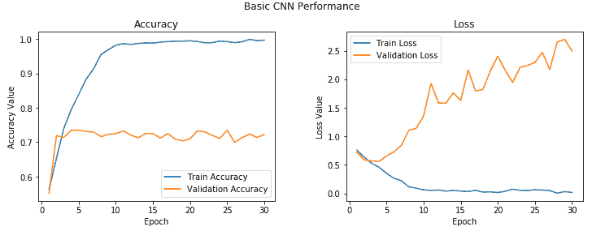

您可以清楚地看到，在 2-3 个时期之后，模型开始对训练数据进行过拟合。 我们在验证集中获得的平均准确度约为 **72%**，这不是一个不好的开始！ 我们可以改进此模型吗？

# 具有正则化的 CNN 模型

让我们通过增加一个卷积层，另一个密集的隐藏层来改进我们的基本 CNN 模型。 除此之外，我们将在每个隐藏的密集层之后添加 0.3 的差值以启用正则化。 我们在第 2 章“深度学习基础知识”中简要介绍了辍学问题，因此随时可以快速浏览一下它，以备不时之需。 基本上，辍学是在深度神经网络中进行正则化的有效方法。 它可以分别应用于输入层和隐藏层。

通过将输出的输出设置为零，丢弃法随机掩盖了一部分设备的输出（在我们的示例中，它是密集层中 30% 的设备的输出）：

```py
model = Sequential() 
# convolutional and pooling layers 
model.add(Conv2D(16, kernel_size=(3, 3), activation='relu',  
                 input_shape=input_shape)) 
model.add(MaxPooling2D(pool_size=(2, 2))) 
model.add(Conv2D(64, kernel_size=(3, 3), activation='relu')) 
model.add(MaxPooling2D(pool_size=(2, 2))) 
model.add(Conv2D(128, kernel_size=(3, 3), activation='relu')) 
model.add(MaxPooling2D(pool_size=(2, 2))) 
model.add(Conv2D(128, kernel_size=(3, 3), activation='relu')) 
model.add(MaxPooling2D(pool_size=(2, 2))) 

model.add(Flatten()) 
model.add(Dense(512, activation='relu')) 
model.add(Dropout(0.3)) 
model.add(Dense(512, activation='relu')) 
model.add(Dropout(0.3)) 
model.add(Dense(1, activation='sigmoid')) 

model.compile(loss='binary_crossentropy', 
              optimizer=optimizers.RMSprop(), 
              metrics=['accuracy']) 
```

现在，让我们在训练数据上训练新模型，并在验证数据集上验证其性能：

```py
history = model.fit(x=train_imgs_scaled, y=train_labels_enc, 
                    validation_data=(validation_imgs_scaled,  
                                     validation_labels_enc), 
                    batch_size=batch_size, 
                    epochs=epochs, 
                    verbose=1) 

Train on 3000 samples, validate on 1000 samples 
Epoch 1/30 
3000/3000 - 7s - loss: 0.6945 - acc: 0.5487 - val_loss: 0.7341 - val_acc: 0.5210 
Epoch 2/30 
3000/3000 - 7s - loss: 0.6601 - acc: 0.6047 - val_loss: 0.6308 - val_acc: 0.6480 
... 
... 
Epoch 29/30 
3000/3000 - 7s - loss: 0.0927 - acc: 0.9797 - val_loss: 1.1696 - val_acc: 0.7380 
Epoch 30/30 
3000/3000 - 7s - loss: 0.0975 - acc: 0.9803 - val_loss: 1.6790 - val_acc: 0.7840 
```

我们还要看看模型训练期间所有时期的准确性和损失值：

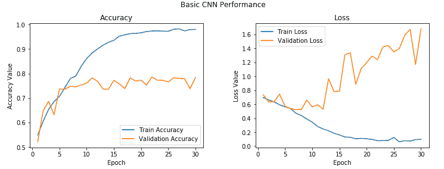

从前面的输出中您可以清楚地看到，尽管模型花费了更长的时间，但仍然最终使模型过拟合，并且我们还获得了约 **78%** 的更好的验证精度，这虽然不错，但并不令人惊讶。

模型过拟合的原因是因为我们的训练数据少得多，并且模型在每个时期随着时间的推移不断看到相同的实例。 解决此问题的一种方法是利用图像增强策略，以与现有图像略有不同的图像来增强我们现有的训练数据。 我们将在下一节中详细介绍。 让我们暂时保存该模型，以便以后可以使用它来评估其在测试数据上的性能：

```py
model.save('cats_dogs_basic_cnn.h5')
```

# 具有图像增强功能的 CNN 模型

让我们通过使用适当的图像增强策略添加更多数据来改进我们的常规 CNN 模型。 由于我们先前的模型每次都在相同的小数据点样本上进行训练，因此无法很好地推广，并在经过几个时期后最终过拟合。

图像增强背后的想法是，我们遵循一个既定过程，从训练数据集中获取现有图像，并对它们应用一些图像变换操作，例如旋转，剪切，平移，缩放等，以生成现有图像的新的，经过修改的版本。 由于这些随机转换，我们每次都不会获得相同的图像，我们将利用 Python 生成器在训练过程中将这些新图像提供给我们的模型。

Keras 框架具有一个称为`ImageDataGenerator`的出色实用程序，可以帮助我们完成所有前面的操作。 让我们为训练和验证数据集初始化两个数据生成器：

```py
train_datagen = ImageDataGenerator(rescale=1./255, zoom_range=0.3,  
                                   rotation_range=50, 
                                   width_shift_range=0.2,  
                                   height_shift_range=0.2,   
                                   shear_range=0.2,  
                                   horizontal_flip=True,   
                                   fill_mode='nearest') 

val_datagen = ImageDataGenerator(rescale=1./255) 
```

`ImageDataGenerator`中有很多可用的选项，我们只是利用了其中一些。 随时查看[这个页面](https://keras.io/preprocessing/image/)上的文档，以获取更详细的信息。 在我们的训练数据生成器中，我们获取原始图像，然后对它们执行几次转换以生成新图像。 其中包括：

*   使用`zoom_range`参数将图像随机放大`0.3`倍。
*   使用`rotation_range`参数将图像随机旋转`50`度。
*   使用`width_shift_range`和`height_shift_range`参数，以图像宽度或高度的`0.2`因子水平或垂直地随机转换图像。
*   使用`shear_range`参数随机应用基于剪切的变换。
*   使用`horizontal_flip`参数在水平方向随机翻转一半图像。
*   在应用任何前述操作（尤其是旋转或平移）之后，利用`fill_mode`参数为图像填充新像素。 在这种情况下，我们只用周围最近的像素值填充新像素。

让我们看看其中一些生成的图像可能看起来如何，以便您可以更好地理解它们。 我们将从训练数据集中获取两个样本图像进行说明。 第一张图片是猫的图片：

```py
img_id = 2595 
cat_generator = train_datagen.flow(train_imgs[img_id:img_id+1],  
                                   train_labels[img_id:img_id+1], 
                                   batch_size=1) 
cat = [next(cat_generator) for i in range(0,5)] 
fig, ax = plt.subplots(1,5, figsize=(16, 6)) 
print('Labels:', [item[1][0] for item in cat]) 
l = [ax[i].imshow(cat[i][0][0]) for i in range(0,5)] 
```

您可以在以下输出中清楚地看到，我们每次都会生成新版本的训练图像（具有平移，旋转和缩放），并且我们为其分配了一个`cat`标签，以便该模型可以从这些图像中提取相关特征，还请记住，这些是猫：


让我们看一下现在是狗的图像：

```py
img_id = 1991 
dog_generator = train_datagen.flow(train_imgs[img_id:img_id+1],  
                                   train_labels[img_id:img_id+1], 
                                   batch_size=1) 
dog = [next(dog_generator) for i in range(0,5)] 
fig, ax = plt.subplots(1,5, figsize=(15, 6)) 
print('Labels:', [item[1][0] for item in dog]) 
l = [ax[i].imshow(dog[i][0][0]) for i in range(0,5)] 
```

这向我们展示了图像增强如何帮助创建新图像，以及在其上训练模型应如何帮助对抗过拟合：


请记住，对于我们的验证生成器，我们只需要将验证图像（原始图像）发送到模型以进行评估； 因此，我们仅缩放图像像素（介于 0-1 之间），并且不应用任何变换。 我们仅将图像增强转换应用于我们的训练图像：

```py
train_generator = train_datagen.flow(train_imgs, train_labels_enc,  
                                     batch_size=30) 
val_generator = val_datagen.flow(validation_imgs,   
                                 validation_labels_enc,   
                                 batch_size=20) 

input_shape = (150, 150, 3)  
```

现在，使用我们创建的图像增强数据生成器来训练带有正则化的 CNN 模型。 我们将使用之前的相同模型架构：

```py
from keras.layers import Conv2D, MaxPooling2D, Flatten, Dense, Dropout 
from keras.models import Sequential 
from keras import optimizers 

model = Sequential() 
# convolution and pooling layers 
model.add(Conv2D(16, kernel_size=(3, 3), activation='relu',  
                 input_shape=input_shape)) 
model.add(MaxPooling2D(pool_size=(2, 2))) 
model.add(Conv2D(64, kernel_size=(3, 3), activation='relu')) 
model.add(MaxPooling2D(pool_size=(2, 2))) 
model.add(Conv2D(128, kernel_size=(3, 3), activation='relu')) 
model.add(MaxPooling2D(pool_size=(2, 2))) 
model.add(Conv2D(128, kernel_size=(3, 3), activation='relu')) 
model.add(MaxPooling2D(pool_size=(2, 2))) 

model.add(Flatten()) 
model.add(Dense(512, activation='relu')) 
model.add(Dropout(0.3)) 
model.add(Dense(512, activation='relu')) 
model.add(Dropout(0.3)) 
model.add(Dense(1, activation='sigmoid')) 

model.compile(loss='binary_crossentropy', 
              optimizer=optimizers.RMSprop(lr=1e-4), 
              metrics=['accuracy']) 
```

我们在这里为优化器将默认学习率降低了 10 倍，以防止模型陷入局部最小值或过拟合，因为我们将发送大量具有随机变换的图像。 为了训练模型，我们现在需要稍微修改我们的方法，因为我们正在使用数据生成器。 我们将利用 Keras 的`fit_generator(...)`功能来训练该模型。 `train_generator`每次生成 30 张图像，因此我们将使用`steps_per_epoch`参数并将其设置为 100，以针对每个时期从训练数据中随机生成的 3,000 张图像上训练模型。 我们的`val_generator`每次生成 20 张图像，因此我们将`validation_steps`参数设置为 50，以在所有 1,000 张验证图像上验证我们的模型准确性（请记住，我们没有增加验证数据集）：

```py
history = model.fit_generator(train_generator,  
                              steps_per_epoch=100, epochs=100, 
                              validation_data=val_generator,  
                              validation_steps=50, verbose=1) 

Epoch 1/100 
100/100 - 12s - loss: 0.6924 - acc: 0.5113 - val_loss: 0.6943 - val_acc: 0.5000 
Epoch 2/100 
100/100 - 11s - loss: 0.6855 - acc: 0.5490 - val_loss: 0.6711 - val_acc: 0.5780 
... 
... 
Epoch 99/100 
100/100 - 11s - loss: 0.3735 - acc: 0.8367 - val_loss: 0.4425 - val_acc: 0.8340 
Epoch 100/100 
100/100 - 11s - loss: 0.3733 - acc: 0.8257 - val_loss: 0.4046 - val_acc: 0.8200 
```

我们的验证准确度跃升至 **82%** 左右，几乎比我们先前的模型好 **4-5%**。 此外，我们的训练准确性与验证准确性非常相似，这表明我们的模型不再适合。 下图描述了模型的准确性和每个时期的损失：

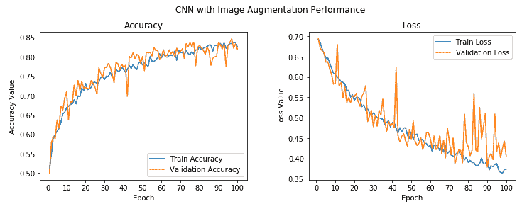

总体上，虽然验证准确性和损失存在一些峰值，但我们发现它与训练准确性非常接近，损失表明我们获得的模型与以前的模型相比，泛化效果更好。 现在保存此模型，以便稍后可以在测试数据集中对其进行评估：

```py
model.save('cats_dogs_cnn_img_aug.h5') 
```

现在，我们将尝试并利用迁移学习的功能，看看是否可以构建更好的模型。

# 利用预训练的 CNN 模型来利用迁移学习

到目前为止，我们已经通过指定自己的架构从头开始构建了 CNN 深度学习模型。 在本节中，我们将利用预训练的模型，该模型基本上是计算机视觉领域的专家，并且在图像分类和归类中享有盛誉。 我们建议您阅读第 4 章“迁移学习基础知识”，以简要地了解预训练模型及其在该领域中的应用。

在构建新模型或重用它们时，可以通过以下两种流行的方式来使用预训练的模型：

*   使用预训练模型作为特征提取器
*   微调预训练模型

我们将在本节中详细介绍这两个方面。 我们将在本章中使用的预训练模型是流行的 VGG-16 模型，该模型由牛津大学的视觉几何小组创建，该模型专门为大型视觉识别构建非常深的卷积网络。 您可以在[这个页面](http://www.robots.ox.ac.uk/~vgg/research/very_deep/)中找到有关它的更多信息。 **ImageNet 大规模视觉识别挑战赛**（**ILSVRC**）评估了用于大规模物体检测和图像分类的算法，其模型通常在这场比赛中获得第一名。

像 VGG-16 这样的预训练模型是已经在具有大量不同图像类别的巨大数据集（ImageNet）上进行训练的模型。 考虑到这一事实，正如我们之前针对 CNN 模型所学习的特征所讨论的那样，该模型应该已经学习了稳健的特征层次结构，即空间，旋转和平移不变性。 因此，该模型已经学会了对属于 1,000 个不同类别的一百万个图像的特征的良好表示，可以充当适合于计算机视觉问题的新图像的良好特征提取器。 这些新图像可能永远不会存在于 ImageNet 数据集中或可能属于完全不同的类别，但考虑到我们在第 4 章“迁移学习基础”中讨论的迁移学习原理，该模型仍应能够从这些图像中提取相关特征。

这为我们提供了一个优势，即可以使用预先训练的模型作为新图像的有效特征提取器，以解决各种复杂的计算机视觉任务，例如用较少的图像解决我们的猫对狗分类器，甚至构建狗的品种分类器，面部表情分类器 ， 以及更多！ 在释放迁移学习的力量解决我们的问题之前，让我们简要讨论一下 VGG-16 模型架构。

# 了解 VGG-16 模型

VGG-16 模型是建立在 ImageNet 数据库上的 16 层（卷积和完全连接）网络，该网络旨在进行图像识别和分类。 该模型是由 Karen Simonyan 和 Andrew Zisserman 建立的，并在他们的论文[《用于大规模图像识别的超深度卷积网络》](https://arxiv.org/pdf/1409.1556.pdf)（arXiv 2014）。

我建议所有感兴趣的读者继续阅读本文中的优秀文献。 在第 3 章“了解深度学习架构”中简要提到了 VGG-16 模型，但我们将对其进行更详细的讨论，并在我们的示例中也使用它。 下图描述了 VGG-16 模型的体系结构：


您可以清楚地看到，我们总共有 13 个卷积层，其中使用了`3 x 3`卷积滤波器，以及用于下采样的最大池化层，每层中总共有两个完全连接的隐藏层，共 4,096 个单元，然后是 1,000 个单元的密集层， 其中每个单位代表 ImageNet 数据库中的图像类别之一。

我们不需要最后三层，因为我们将使用我们自己的完全连接的密集层来预测图像是狗还是猫。 我们更关注前五个块，因此我们可以利用 VGG 模型作为有效的特征提取器。 对于其中一个模型，我们将冻结所有五个卷积块以确保它们的权重在每个时期后都不会更新，从而将其用作简单的特征提取器。 对于最后一个模型，我们将对 VGG 模型进行微调，在该模型中，我们将解冻最后两个块（**块 4** 和**块 5**），以便在我们训练自己的模型时，它们的权重在每个时期（每批数据）得到更新。

在下面的框图中，我们代表了先前的体系结构以及将要使用的两个变体（基本特征提取器和微调），因此您可以获得更好的视觉视角：

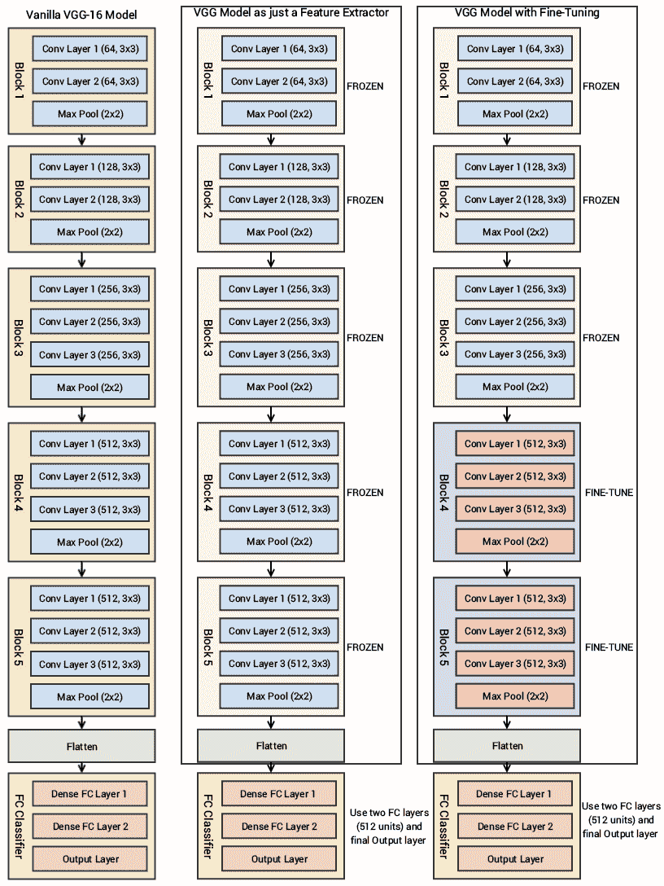

因此，我们最关心的是利用 VGG-16 模型的卷积块，然后展平最终输出（来自特征图），以便我们可以将其输入到我们自己的密集层中进行分类。 本章本节中使用的所有代码都可以通过`Transfer Learning.ipynb` Jupyter 笔记本在 CNN 中找到。

# 预训练的 CNN 模型作为特征提取器

让我们利用 Keras，加载 VGG-16 模型并冻结卷积块，以便将其用作图像特征提取器：

```py
from keras.applications import vgg16 
from keras.models import Model 
import keras 

vgg = vgg16.VGG16(include_top=False, weights='imagenet',  
                                     input_shape=input_shape) 

output = vgg.layers[-1].output 
output = keras.layers.Flatten()(output) 
vgg_model = Model(vgg.input, output) 
vgg_model.trainable = False 

for layer in vgg_model.layers: 
    layer.trainable = False 

vgg_model.summary() 

_________________________________________________________________ 
Layer (type)                 Output Shape              Param #    
================================================================= 
input_1 (InputLayer)         (None, 150, 150, 3)       0          
_________________________________________________________________ 
block1_conv1 (Conv2D)        (None, 150, 150, 64)      1792       
_________________________________________________________________ 
block1_conv2 (Conv2D)        (None, 150, 150, 64)      36928      
_________________________________________________________________ 
block1_pool (MaxPooling2D)   (None, 75, 75, 64)        0          
_________________________________________________________________ 
block2_conv1 (Conv2D)        (None, 75, 75, 128)       73856      
_________________________________________________________________ 
block2_conv2 (Conv2D)        (None, 75, 75, 128)       147584     
_________________________________________________________________ 
block2_pool (MaxPooling2D)   (None, 37, 37, 128)       0          
_________________________________________________________________ 
block3_conv1 (Conv2D)        (None, 37, 37, 256)       295168     
_________________________________________________________________ 
block3_conv2 (Conv2D)        (None, 37, 37, 256)       590080     
_________________________________________________________________ 
block3_conv3 (Conv2D)        (None, 37, 37, 256)       590080     
_________________________________________________________________ 
block3_pool (MaxPooling2D)   (None, 18, 18, 256)       0          
_________________________________________________________________ 
block4_conv1 (Conv2D)        (None, 18, 18, 512)       1180160    
_________________________________________________________________ 
block4_conv2 (Conv2D)        (None, 18, 18, 512)       2359808    
_________________________________________________________________ 
block4_conv3 (Conv2D)        (None, 18, 18, 512)       2359808    
_________________________________________________________________ 
block4_pool (MaxPooling2D)   (None, 9, 9, 512)         0          
_________________________________________________________________ 
block5_conv1 (Conv2D)        (None, 9, 9, 512)         2359808    
_________________________________________________________________ 
block5_conv2 (Conv2D)        (None, 9, 9, 512)         2359808    
_________________________________________________________________ 
block5_conv3 (Conv2D)        (None, 9, 9, 512)         2359808    
_________________________________________________________________ 
block5_pool (MaxPooling2D)   (None, 4, 4, 512)         0          
_________________________________________________________________ 
flatten_1 (Flatten)          (None, 8192)              0          
================================================================= 
Total params: 14,714,688 
Trainable params: 0 
Non-trainable params: 14,714,688 
__________________________________________________________________ 
```

该模型摘要向我们显示了每个块以及每个块中存在的层，这些层与我们之前描述的体系结构图匹配。 您会看到我们删除了与 VGG-16 模型有关的分类器的最后一部分，因为我们将构建自己的分类器并利用 VGG 作为特征提取器。

要验证 VGG-16 模型的各层是否冻结，我们可以使用以下代码：

```py
import pandas as pd 
pd.set_option('max_colwidth', -1) 

layers = [(layer, layer.name, layer.trainable) for layer in 
           vgg_model.layers] 
pd.DataFrame(layers, columns=['Layer Type', 'Layer Name', 'Layer  
                               Trainable']) 
```

前面的代码生成以下输出：

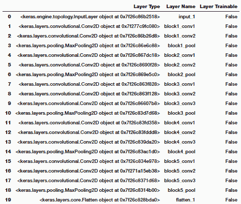

```py
print("Trainable layers:", vgg_model.trainable_weights) 
Trainable layers: []
```

从前面的输出中很明显，VGG-16 模型的所有层都是冻结的，这很好，因为我们不希望在模型训练期间改变它们的权重。 VGG-16 模型中的最后一个激活特征图（`block5_pool`的输出）为我们提供了瓶颈特征，这些特征可以被展平并馈送到完全连接的深度神经网络分类器中。 以下代码片段显示了来自我们的训练数据的样本图像的瓶颈特征：

```py
bottleneck_feature_example = vgg.predict(train_imgs_scaled[0:1]) print(bottleneck_feature_example.shape) 
plt.imshow(bottleneck_feature_example[0][:,:,0]) 

(1, 4, 4, 512)
```

前面的代码生成以下输出：

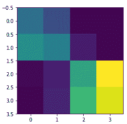

我们将`vgg_model`对象中的瓶颈特征展平，以使其可以被馈送到我们完全连接的分类器中。 节省模型训练时间的一种方法是使用该模型，并从我们的训练和验证数据集中提取所有特征，然后将它们作为输入提供给分类器。 现在，让我们从培训和验证集中提取瓶颈功能：

```py
def get_bottleneck_features(model, input_imgs): 
    features = model.predict(input_imgs, verbose=0) 
    return features 

train_features_vgg = get_bottleneck_features(vgg_model, 
                                             train_imgs_scaled) 
validation_features_vgg = get_bottleneck_features(vgg_model,      
                                                validation_imgs_scaled) 

print('Train Bottleneck Features:', train_features_vgg.shape, 
      '\tValidation Bottleneck Features:',  
       validation_features_vgg.shape) 

Train Bottleneck Features: (3000, 8192) Validation Bottleneck Features: 
     (1000, 8192)
```

前面的输出告诉我们，我们已经成功提取了 3,000 个训练图像和 1,000 个验证图像的尺寸为`1 x 8,192`的扁平瓶颈特征。 现在让我们构建深度神经网络分类器的体系结构，它将这些功能作为输入：

```py
from keras.layers import Conv2D, MaxPooling2D, Flatten, Dense, Dropout, InputLayer 
from keras.models import Sequential 
from keras import optimizers 

input_shape = vgg_model.output_shape[1] 
model = Sequential() 
model.add(InputLayer(input_shape=(input_shape,))) 
model.add(Dense(512, activation='relu', input_dim=input_shape)) model.add(Dropout(0.3)) model.add(Dense(512, activation='relu')) model.add(Dropout(0.3)) model.add(Dense(1, activation='sigmoid')) model.compile(loss='binary_crossentropy', 
              optimizer=optimizers.RMSprop(lr=1e-4), 
              metrics=['accuracy']) 

model.summary() 
_______________________________________________________________
Layer (type) Output Shape Param # ================================================================= 
input_2 (InputLayer) (None, 8192) 0 _________________________________________________________________ 
dense_1 (Dense) (None, 512) 4194816 _________________________________________________________________ 
dropout_1 (Dropout) (None, 512) 0 _________________________________________________________________ 
dense_2 (Dense) (None, 512) 262656 _________________________________________________________________ 
dropout_2 (Dropout) (None, 512) 0 _________________________________________________________________ 
dense_3 (Dense) (None, 1) 513 =================================================================
```

就像我们之前提到的，大小为`8192`的瓶颈特征向量用作我们分类模型的输入。 关于密集层，我们使用与以前的模型相同的体系结构。 让我们现在训练这个模型：

```py
history = model.fit(x=train_features_vgg, y=train_labels_enc, 
                    validation_data=(validation_features_vgg, 
                                     validation_labels_enc),  
                    batch_size=batch_size, epochs=epochs, verbose=1) 

Train on 3000 samples, validate on 1000 samples 
Epoch 1/30 
3000/3000 - 1s 373us/step - loss: 0.4325 - acc: 0.7897 - val_loss: 0.2958 - val_acc: 0.8730 
Epoch 2/30 
3000/3000 - 1s 286us/step - loss: 0.2857 - acc: 0.8783 - val_loss: 0.3294 - val_acc: 0.8530 
... 
... 
Epoch 29/30 
3000/3000 - 1s 287us/step - loss: 0.0121 - acc: 0.9943 - val_loss: 0.7760 - val_acc: 0.8930 
Epoch 30/30 
3000/3000 - 1s 287us/step - loss: 0.0102 - acc: 0.9987 - val_loss: 0.8344 - val_acc: 0.8720
```

我们得到的模型的验证精度接近 **88%**，几乎比具有图像增强功能的基本 CNN 模型提高了 **5-6%**，这非常好。 不过，该模型似乎确实过拟合，我们可以使用下图中所示的精度和损耗图进行检查：

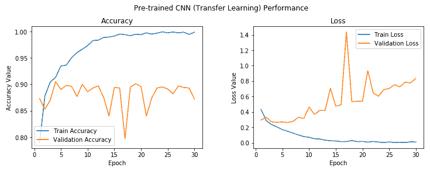

在第五个时期之后，模型训练与验证准确性之间存在相当大的差距，这清楚表明模型在此之后对训练数据过拟合。 但是总的来说，这似乎是迄今为止最好的模型，通过利用 VGG-16 模型作为特征提取器，我们甚至不需要使用图像增强策略就可以接近 **90%** 验证精度。 但是我们还没有充分利用迁移学习的全部潜力。 让我们尝试在此模型上使用我们的图像增强策略。 在此之前，我们使用以下代码将此模型保存到磁盘：

```py
model.save('cats_dogs_tlearn_basic_cnn.h5')
```

# 预训练的 CNN 模型作为具有图像增强的特征提取器

我们将为之前使用的训练和验证数据集使用相同的数据生成器。 为了便于理解，构建它们的代码如下所示：

```py
train_datagen = ImageDataGenerator(rescale=1./255, zoom_range=0.3, 
                                   rotation_range=50,   
                                   width_shift_range=0.2,  
                                   height_shift_range=0.2, 
                                   shear_range=0.2, 
                                   horizontal_flip=True,  
                                   fill_mode='nearest') 

val_datagen = ImageDataGenerator(rescale=1./255) 
train_generator = train_datagen.flow(train_imgs, train_labels_enc, 
                                     batch_size=30) 
val_generator = val_datagen.flow(validation_imgs, 
                                 validation_labels_enc, 
                                 batch_size=20)
```

现在让我们构建深度学习模型架构。 因为我们将在数据生成器上进行培训，所以我们不会像上次那样提取瓶颈功能。 因此，我们将`vgg_model`对象作为输入传递给我们自己的模型：

```py
model = Sequential() 

model.add(vgg_model) 
model.add(Dense(512, activation='relu', input_dim=input_shape)) model.add(Dropout(0.3)) model.add(Dense(512, activation='relu')) model.add(Dropout(0.3)) model.add(Dense(1, activation='sigmoid')) 

model.compile(loss='binary_crossentropy', 
              optimizer=optimizers.RMSprop(lr=2e-5), 
              metrics=['accuracy'])
```

您可以清楚地看到一切都一样。 由于我们将训练 100 个时代，因此我们将学习率稍微降低了，并且不想对我们的模型层进行突然的权重调整。 请记住，VGG-16 模型的图层仍在此处冻结，我们仍将其仅用作基本特征提取器：

```py
history = model.fit_generator(train_generator, steps_per_epoch=100, 
                              epochs=100, 
                              validation_data=val_generator, 
                              validation_steps=50, 
                              verbose=1) 

Epoch 1/100 
100/100 - 45s 449ms/step - loss: 0.6511 - acc: 0.6153 - val_loss: 0.5147 - val_acc: 0.7840 
Epoch 2/100 
100/100 - 41s 414ms/step - loss: 0.5651 - acc: 0.7110 - val_loss: 0.4249 - val_acc: 0.8180 
... 
... 
Epoch 99/100 
100/100 - 42s 417ms/step - loss: 0.2656 - acc: 0.8907 - val_loss: 0.2757 - val_acc: 0.9050 
Epoch 100/100 
100/100 - 42s 418ms/step - loss: 0.2876 - acc: 0.8833 - val_loss: 0.2665 - val_acc: 0.9000
```

我们可以看到我们的模型的整体验证精度为 **90%**，这比我们先前的模型略有改进，并且训练和验证精度彼此非常接近，表明该模型是欠拟合。 可以通过查看以下有关模型准确性和损失的图来加强这一点：

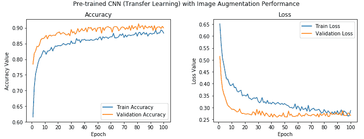

我们可以清楚地看到，训练值和验证准确性的值非常接近，并且模型也不会过拟合。 此外，我们达到 **90%** 的准确性，这很干净！ 让我们现在将此模型保存在磁盘上，以便将来对测试数据进行评估：

```py
model.save('cats_dogs_tlearn_img_aug_cnn.h5')
```

现在，我们将微调 VGG-16 模型以构建我们的最后一个分类器，我们将在此取消冻结第 4 块和第 5 块，如本节开头所述。

# 具有微调和图像增强功能的预训练 CNN 模型

现在，我们将利用存储在`vgg_model`变量中的 VGG-16 模型对象，解冻卷积块 4 和 5，同时保持前三个块处于冻结状态。 以下代码可帮助我们实现这一目标：

```py
vgg_model.trainable = True 
set_trainable = False

for layer in vgg_model.layers: 
    if layer.name in ['block5_conv1', 'block4_conv1']: 
        set_trainable = True 
    if set_trainable: 
        layer.trainable = True 
    else: 
        layer.trainable = False 

print("Trainable layers:", vgg_model.trainable_weights) 

Trainable layers: 
[<tf.Variable 'block4_conv1/kernel:0' shape=(3, 3, 256, 512) dtype=float32_ref>, <tf.Variable 'block4_conv1/bias:0' shape=(512,) dtype=float32_ref>, 
<tf.Variable 'block4_conv2/kernel:0' shape=(3, 3, 512, 512) dtype=float32_ref>, <tf.Variable 'block4_conv2/bias:0' shape=(512,) dtype=float32_ref>, 
<tf.Variable 'block4_conv3/kernel:0' shape=(3, 3, 512, 512) dtype=float32_ref>, <tf.Variable 'block4_conv3/bias:0' shape=(512,) dtype=float32_ref>, 
<tf.Variable 'block5_conv1/kernel:0' shape=(3, 3, 512, 512) dtype=float32_ref>, <tf.Variable 'block5_conv1/bias:0' shape=(512,) dtype=float32_ref>, 
<tf.Variable 'block5_conv2/kernel:0' shape=(3, 3, 512, 512) dtype=float32_ref>, <tf.Variable 'block5_conv2/bias:0' shape=(512,) dtype=float32_ref>, 
<tf.Variable 'block5_conv3/kernel:0' shape=(3, 3, 512, 512) dtype=float32_ref>, <tf.Variable 'block5_conv3/bias:0' shape=(512,) dtype=float32_ref>]
```

您可以从前面的输出中清楚地看到，与块 4 和 5 有关的卷积和池化层现在是可训练的，并且还可以使用以下代码来验证冻结和解冻哪些层：

```py
layers = [(layer, layer.name, layer.trainable) for layer in vgg_model.layers] pd.DataFrame(layers, columns=['Layer Type', 'Layer 
                               Name', 'Layer Trainable'])
```

前面的代码生成以下输出：

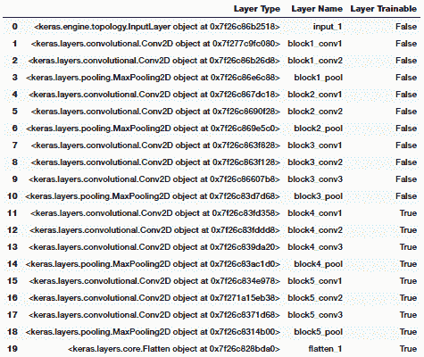

我们可以清楚地看到最后两个块现在是可训练的，这意味着当我们传递每批数据时，这些层的权重也将在每个纪元中通过反向传播进行更新。 我们将使用与之前的模型相同的数据生成器和模型架构，并对模型进行训练。 因为我们不想卡在任何局部最小值上，所以我们会稍微降低学习率，并且我们也不想突然将可训练的 VGG-16 模型层的权重突然增加可能会对模型产生不利影响的大因素：

```py
# data generators 
train_datagen = ImageDataGenerator(rescale=1./255, zoom_range=0.3,                  
                                   rotation_range=50, 
                                   width_shift_range=0.2,  
                                   height_shift_range=0.2,    
                                   shear_range=0.2,  
                                   horizontal_flip=True, 
                                   fill_mode='nearest') 

val_datagen = ImageDataGenerator(rescale=1./255) 

train_generator = train_datagen.flow(train_imgs, train_labels_enc,  
                                     batch_size=30) 
val_generator = val_datagen.flow(validation_imgs, 
                                 validation_labels_enc, 
                                 batch_size=20) 

# build model architecture 
model = Sequential() 

model.add(vgg_model) 
model.add(Dense(512, activation='relu', input_dim=input_shape)) model.add(Dropout(0.3)) model.add(Dense(512, activation='relu')) model.add(Dropout(0.3)) model.add(Dense(1, activation='sigmoid')) 

model.compile(loss='binary_crossentropy', 
              optimizer=optimizers.RMSprop(lr=1e-5), 
              metrics=['accuracy']) 

# model training 
history = model.fit_generator(train_generator, steps_per_epoch=100, 
                              epochs=100,  
                              validation_data=val_generator,   
                              validation_steps=50,  
                              verbose=1) 

Epoch 1/100 
100/100 - 64s 642ms/step - loss: 0.6070 - acc: 0.6547 - val_loss: 0.4029 - val_acc: 0.8250 
Epoch 2/100 
100/100 - 63s 630ms/step - loss: 0.3976 - acc: 0.8103 - val_loss: 0.2273 - val_acc: 0.9030 
... 
... 
Epoch 99/100 
100/100 - 63s 629ms/step - loss: 0.0243 - acc: 0.9913 - val_loss: 0.2861 - val_acc: 0.9620 
Epoch 100/100 
100/100 - 63s 629ms/step - loss: 0.0226 - acc: 0.9930 - val_loss: 0.3002 - val_acc: 0.9610
```

从前面的输出中我们可以看到，我们的模型的验证精度约为 **96%**，这比我们先前的模型提高了 **6%**。 总体而言，与我们的第一个基本 CNN 模型相比，该模型的验证准确性提高了 **24%**。 这确实显示了迁移学习可以多么有用。

让我们观察模型的准确性和损失图：

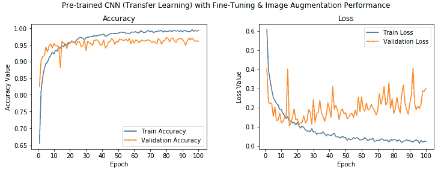

我们可以看到，这里的准确性值确实非常好，尽管模型看起来可能对训练数据有些过拟合，但我们仍然获得了很高的验证准确性。 现在，使用以下代码将此模型保存到磁盘：

```py
model.save('cats_dogs_tlearn_finetune_img_aug_cnn.h5')
```

现在，通过在测试数据集上实际评估模型的性能，将所有模型进行测试。

# 评估我们的深度学习模型

现在，我们将评估到目前为止构建的五个不同模型，方法是首先在样本测试图像上对其进行测试，然后可视化 CNN 模型实际上是如何尝试从图像中分析和提取特征，最后通过在测试数据集上测试每个模型的性能来进行评估 。 如果要执行代码并遵循本章的内容，`Model Performance Evaluations.ipynb` Jupyter 笔记本中提供了此部分的代码。 我们还构建了一个名为`model_evaluation_utils`的实用工具模块，我们将使用该模块来评估深度学习模型的性能。 让我们在开始之前加载以下依赖项：

```py
import glob 
import numpy as np 
import matplotlib.pyplot as plt 
from keras.preprocessing.image import load_img, img_to_array, array_to_img 
from keras.models import load_model 
import model_evaluation_utils as meu 

%matplotlib inline
```

加载这些依赖关系后，让我们加载到目前为止已保存的模型：

```py
basic_cnn = load_model('cats_dogs_basic_cnn.h5') 
img_aug_cnn = load_model('cats_dogs_cnn_img_aug.h5') 
tl_cnn = load_model('cats_dogs_tlearn_basic_cnn.h5') 
tl_img_aug_cnn = load_model('cats_dogs_tlearn_img_aug_cnn.h5') tl_img_aug_finetune_cnn = 
              load_model('cats_dogs_tlearn_finetune_img_aug_cnn.h5')
```

这有助于我们检索使用各种技术和体系结构在本章中创建的所有五个模型。

# 对样本测试图像的模型预测

现在，我们将加载不属于任何数据集的样本图像，并尝试查看不同模型的预测。 我将在此处使用我的宠物猫的图像，因此这将很有趣！ 让我们加载示例图像和一些基本配置：

```py
# basic configurations 
IMG_DIM = (150, 150) 
input_shape = (150, 150, 3) 
num2class_label_transformer = lambda l: ['cat' if x == 0 else 'dog' for 
                                          x in l] 
class2num_label_transformer = lambda l: [0 if x == 'cat' else 1 for x   
                                         in l] 

# load sample image 
sample_img_path = 'my_cat.jpg' 
sample_img = load_img(sample_img_path, target_size=IMG_DIM) 
sample_img_tensor = img_to_array(sample_img) 
sample_img_tensor = np.expand_dims(sample_img_tensor, axis=0) 
sample_img_tensor /= 255\. 
print(sample_img_tensor.shape) 
plt.imshow(sample_img_tensor[0]) (1, 150, 150, 3)
```

前面的代码生成以下输出：

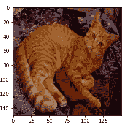

现在，我们已经加载了示例图像，让我们看看我们的模型将其作为该图像类别的预测（我的猫）：

```py
cnn_prediction = num2class_label_transformer(basic_cnn.predict_classes(
                                                  sample_img_tensor, 
                                                  verbose=0)) 
cnn_img_aug_prediction = num2class_label_transformer(img_aug_cnn.predict_classes(
                                                     sample_img_tensor,   
                                                     verbose=0)) 
tlearn_cnn_prediction = num2class_label_transformer(tl_cnn.predict_classes(  
                                    get_bottleneck_features(vgg_model,                                                             
                                    sample_img_tensor),  
                                    verbose=0)) 
tlearn_cnn_img_aug_prediction =
num2class_label_transformer(  
                      tl_img_aug_cnn.predict_classes(sample_img_tensor, 
                                                     verbose=0)) 
tlearn_cnn_finetune_img_aug_prediction =
num2class_label_transformer(  
             tl_img_aug_finetune_cnn.predict_classes(sample_img_tensor,  
                                                     verbose=0)) 

print('Predictions for our sample image:\n', 
      '\nBasic CNN:', cnn_prediction, 
      '\nCNN with Img Augmentation:', cnn_img_aug_prediction, 
      '\nPre-trained CNN (Transfer Learning):', tlearn_cnn_prediction, 
      '\nPre-trained CNN with Img Augmentation (Transfer Learning):',    
      tlearn_cnn_img_aug_prediction, 
      '\nPre-trained CNN with Fine-tuning & Img Augmentation (Transfer  
       Learning):', tlearn_cnn_finetune_img_aug_prediction) 

Predictions for our sample image: Basic CNN: ['cat'] 
CNN with Img Augmentation: ['dog'] 
Pre-trained CNN (Transfer Learning): ['dog'] 
Pre-trained CNN with Img Augmentation (Transfer Learning): ['cat'] 
Pre-trained CNN with Fine-tuning & Img Augmentation (Transfer Learning): ['cat']
```

您可以从前面的输出中看到，我们的三个模型像猫一样正确地预测了图像，其中两个错误了。 有趣的是，基本的 CNN 模型也正确无误，并且预训练的模型具有预期的微调和图像增强功能。

# 可视化 CNN 模型的感知

深度学习模型通常被称为**黑盒模型**，因为与诸如决策树之类的简单 ML 模型相比，很难真正解释该模型在内部的工作方式。 我们知道，基于 CNN 的深度学习模型使用卷积层，该卷积层使用过滤器提取代表特征空间层次的激活特征图。 从概念上讲，顶级卷积层学习小的局部模式，而网络中较低的层则学习更复杂和更大的模式，这些模式是从顶级卷积层获得的。 让我们尝试通过一个示例来形象化。

我们将采用最佳模型（通过微调和图像增强进行迁移学习），并尝试从前八层中提取输出激活特征图。 本质上，这将最终为我们提供 VGG-16 模型前三个模块的卷积和池化层，因为我们在模型中使用了相同的特征提取。

要查看这些层，可以使用以下代码：

```py
tl_img_aug_finetune_cnn.layers[0].layers[1:9] 

[<keras.layers.convolutional.Conv2D at 0x7f514841b0b8>, <keras.layers.convolutional.Conv2D at 0x7f514841b0f0>, <keras.layers.pooling.MaxPooling2D at 0x7f5117d4bb00>, <keras.layers.convolutional.Conv2D at 0x7f5117d4bbe0>, <keras.layers.convolutional.Conv2D at 0x7f5117d4bd30>, <keras.layers.pooling.MaxPooling2D at 0x7f5117d4beb8>, <keras.layers.convolutional.Conv2D at 0x7f5117d4bf98>, <keras.layers.convolutional.Conv2D at 0x7f5117d00128>]
```

现在，基于它试图从我的猫的样本测试图像中提取的内容，从我们的模型中提取特征图。 为了简单说明，我们从块 1 中提取第一个卷积层之后的输出，并在以下代码段中从中查看一些激活特征图：

```py
from keras import models 

# Extracts the outputs of the top 8 layers: 
layer_outputs = [layer.output for layer in  
                     tl_img_aug_finetune_cnn.layers[0].layers[1:9]] 

# Creates a model that will return these outputs, given the model input: activation_model = models.Model(
                       inputs=tl_img_aug_finetune_cnn.layers[0].layers[1].input,  
                       outputs=layer_outputs) 

# This will return a list of 8 Numpy arrays 
# one array per layer activation 
activations = activation_model.predict(sample_img_tensor) 
print('Sample layer shape:', activations[0].shape) 
print('Sample convolution (activation map) shape:', 
                           activations[0][0, :, :, 1].shape) 

fig, ax = plt.subplots(1,5, figsize=(16, 6)) 
ax[0].imshow(activations[0][0, :, :, 10], cmap='bone') ax[1].imshow(activations[0][0, :, :, 25], cmap='bone') ax[2].imshow(activations[0][0, :, :, 40], cmap='bone') ax[3].imshow(activations[0][0, :, :, 55], cmap='bone') ax[4].imshow(activations[0][0, :, :, 63], cmap='bone') 

Sample layer shape: (1, 150, 150, 64) 
Sample convolution (activation map) shape: (150, 150)
```

前面的代码生成以下输出：


从前面的输出中，我们可以清楚地看到，第一卷积层的输出为我们提供了总共 64 个激活特征图，每个特征图的大小为`150 x 150`。 我们在前面的代码段中可视化了其中五个特征图。 您可以看到模型如何尝试提取与图像有关的相关特征，例如色相，强度，边缘，角等。 以下输出描绘了来自块 1 和 2 的 VGG-16 模型的更多激活图：

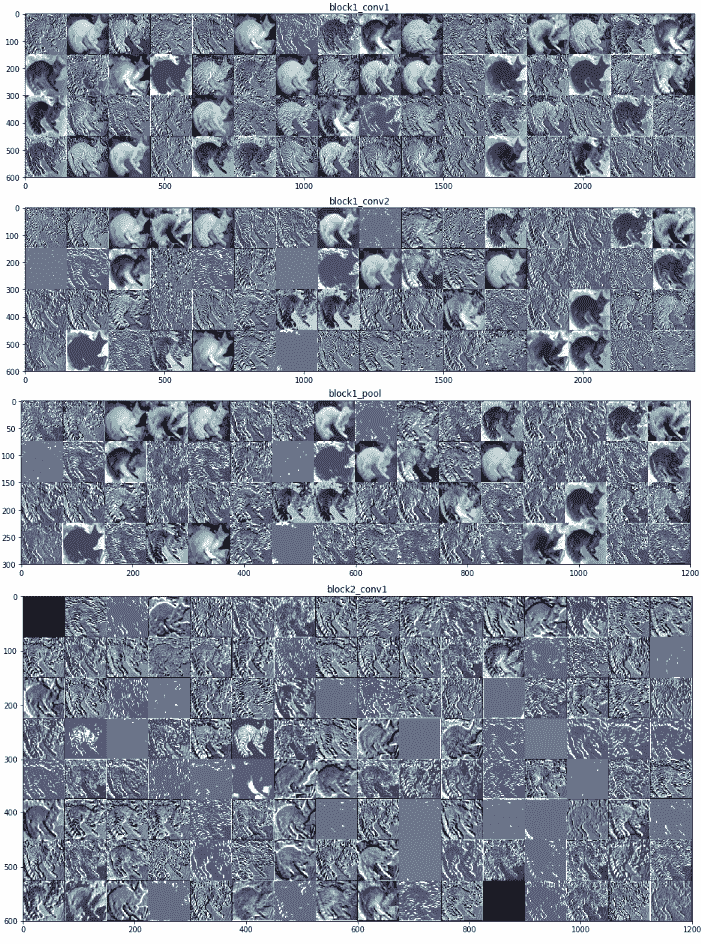

为了获得上述激活功能图，我们利用了`Model Performance Evaluations.ipynb` Jupyter 笔记本中可用的代码段，这要感谢 Francois Chollet 和他的书《Python 深度学习》，它可以帮助可视化我们的 CNN 模型中所有选定的层。我们已经可视化了模型的前八层，这是我们在笔记本中较早选择的，但是在这里显示了前两个块的激活图。 随意检出笔记本并为自己的模型重复使用相同的代码。 从前面的屏幕截图中，您可能会看到顶层要素图通常保留了很多原始图像，但是当您深入模型时，要素图变得更加抽象，复杂且难以解释。

# 测试数据的评估模型性能

现在是时候进行最终测试了，在该测试中，我们通过对测试数据集进行预测来从字面上测试模型的性能。 在进行预测之前，让我们先加载并准备测试数据集：

```py
IMG_DIM = (150, 150) 
test_files = glob.glob('test_data/*') 
test_imgs = [img_to_array(load_img(img, target_size=IMG_DIM)) 
                         for img in test_files] 
test_imgs = np.array(test_imgs) 

test_labels = [fn.split('/')[1].split('.')[0].strip() for fn in test_files] test_labels_enc = class2num_label_transformer(test_labels) 
test_imgs_scaled = test_imgs.astype('float32') 
test_imgs_scaled /= 255 

print('Test dataset shape:', test_imgs.shape) 

Test dataset shape: (1000, 150, 150, 3)
```

现在我们已经准备好按比例缩放的数据集，让我们通过对所有测试图像进​​行预测来评估每个模型，然后通过检查预测的准确性来评估模型的性能：

```py
# Model 1 - Basic CNN 
predictions = basic_cnn.predict_classes(test_imgs_scaled, verbose=0) 
predictions = num2class_label_transformer(predictions) meu.display_model_performance_metrics(true_labels=test_labels,  
                                      predicted_labels=predictions,  
                                      classes=list(set(test_labels)))
```

前面的代码生成以下输出：


```py
# Model 2 - Basic CNN with Image Augmentation 
predictions = img_aug_cnn.predict_classes(test_imgs_scaled, verbose=0) predictions = num2class_label_transformer(predictions) meu.display_model_performance_metrics(true_labels=test_labels, 
                                      predicted_labels=predictions,  
                                      classes=list(set(test_labels)))
```

前面的代码生成以下输出：


```py
# Model 3 - Transfer Learning (basic feature extraction) 
test_bottleneck_features = get_bottleneck_features(vgg_model, test_imgs_scaled) predictions = tl_cnn.predict_classes(test_bottleneck_features, verbose=0) predictions = num2class_label_transformer(predictions) 

meu.display_model_performance_metrics(true_labels=test_labels, 
                                      predicted_labels=predictions,  
                                      classes=list(set(test_labels)))
```

前面的代码生成以下输出：


```py
# Model 4 - Transfer Learning with Image Augmentation 
predictions = tl_img_aug_cnn.predict_classes(test_imgs_scaled, verbose=0) predictions = num2class_label_transformer(predictions) meu.display_model_performance_metrics(true_labels=test_labels, 
                                      predicted_labels=predictions,  
                                      classes=list(set(test_labels)))
```

前面的代码生成以下输出：


```py
# Model 5 - Transfer Learning with Fine-tuning & Image Augmentation 
predictions = tl_img_aug_finetune_cnn.predict_classes(test_imgs_scaled, 
                                                      verbose=0) 
predictions = num2class_label_transformer(predictions) meu.display_model_performance_metrics(true_labels=test_labels, 
                                      predicted_labels=predictions,  
                                      classes=list(set(test_labels)))
```


我们可以看到我们肯定有一些有趣的结果。 每个后续模型的性能均优于先前模型，这是预期的，因为我们对每个新模型都尝试了更高级的技术。 我们最差的模型是基本的 CNN 模型，其模型准确度和 F1 分数约为 **78%**，而我们最好的模型是经过微调的模型，其中包含迁移学习和图像增强功能，从而为我们提供了一个模型准确度和 **96%** 的 F1 得分，考虑到我们从 3,000 个图像训练数据集中训练了模型，这真是太了不起了。 现在，让我们绘制最差模型和最佳模型的 ROC 曲线：

```py
# worst model - basic CNN 
meu.plot_model_roc_curve(basic_cnn, test_imgs_scaled, 
                         true_labels=test_labels_enc, class_names=[0, 
                                                                    1]) 

# best model - transfer learning with fine-tuning & image augmentation meu.plot_model_roc_curve(tl_img_aug_finetune_cnn, test_imgs_scaled, 
                         true_labels=test_labels_enc, class_names=[0, 
                                                                    1])
```

我们得到的图如下：

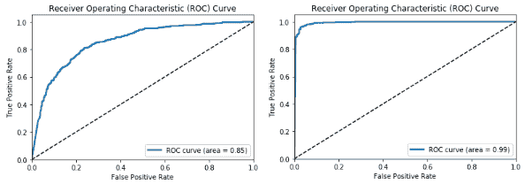

这应该给您一个很好的主意，即预训练模型和迁移学习可以带来多大的差异，尤其是当我们面临诸如数据较少等约束时，在解决复杂问题上。 我们鼓励您使用自己的数据尝试类似的策略。

# 摘要

本章的目的是让您更深入地了解构建深度学习模型以解决实际问题，并了解迁移学习的有效性。 我们涵盖了迁移学习需求的各个方面，尤其是在解决数据受限的问题时。 我们从头开始构建了多个 CNN 模型，还看到了适当的图像增强策略的好处。 我们还研究了如何利用预训练的模型进行迁移学习，并介绍了使用它们的各种方法，包括用作特征提取器和微调。 我们看到了 VGG-16 模型的详细架构，以及如何利用该模型作为有效的图像特征提取器。 与迁移学习有关的策略（包括特征提取和微调以及图像增强）被用来构建有效的深度学习图像分类器。

最后但并非最不重要的一点是，我们在测试数据集上评估了所有模型，并获得了一些卷积神经网络在构建特征图时如何在内部可视化图像的观点。 在随后的章节中，我们将研究需要迁移学习的更复杂的实际案例研究。 敬请关注！