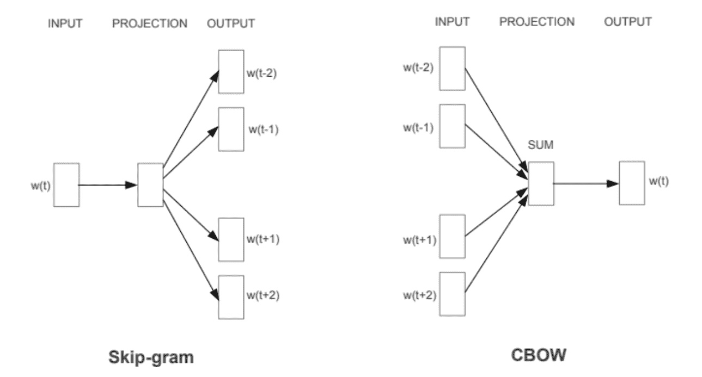
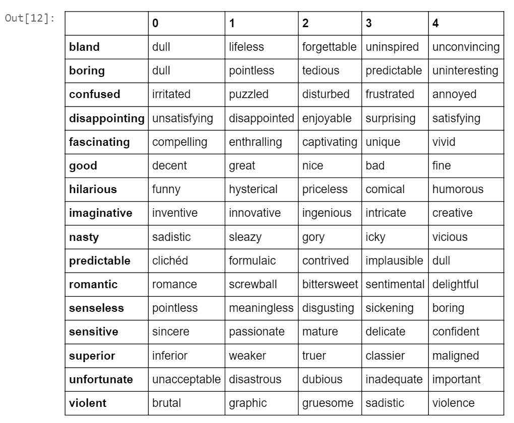
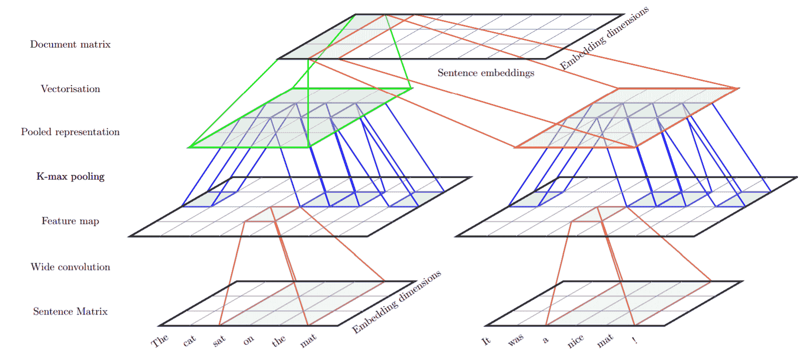
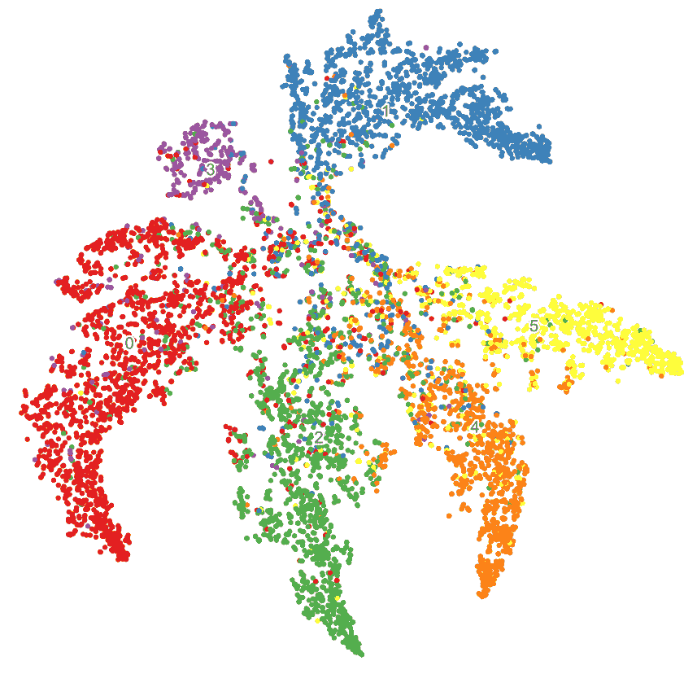

# 文字文件分类

在本章中，我们讨论了迁移学习在文本文档分类中的应用。 文本分类是一种非常流行的自然语言处理任务。 关键目标是根据文档的文本内容将文档分配到一个或多个类别或类别。 这在行业中得到了广泛的应用，包括将电子邮件分类为垃圾邮件/非垃圾邮件，审阅和评级分类，情感分析，电子邮件或事件路由，在此我们将电子邮件\事件分类，以便可以将其自动分配给相应的人员。 以下是本章将涉及的主要主题：

*   文本分类概述，行业应用和挑战
*   基准文本分类数据集和传统模型的性能
*   密集向量的单词表示—深度学习模型
*   CNN 文档模型-单词到句子的嵌入，然后进行文档嵌入
*   源和目标域分布不同的迁移学习的应用； 也就是说，源域由重叠较少的类组成，目标域具有许多混合类
*   源和目标域本身不同的迁移学习的应用（例如，源是新闻，目标是电影评论，依此类推）
*   训练有素的模型在完成其他文本分析任务（例如文档摘要）中的应用-解释为什么将评论归类为负面/正面

我们将通过动手示例来关注概念和实际实现。 您可以在 [GitHub 存储库](https://github.com/dipanjanS/hands-on-transfer-learning-with-python)中的`Chapter 7`文件夹中快速阅读本章的代码。 可以根据需要参考本章。

# 文字分类

给定一组文本文档和一组预定义类别，文本分类的目的是将每个文档分配给一个类别。 根据问题，输出可以是软分配或硬分配。 软分配意味着将类别分配定义为所有类别上的概率分布。

文本分类在工业中有广泛的应用。 以下是一些示例：

*   **垃圾邮件过滤**：给定电子邮件，将其分类为垃圾邮件或合法电子邮件。
*   **情感分类**：给定评论文字（电影评论，产品评论），请确定用户的极性-无论是正面评论，负面评论还是神经评论。
*   **问题单分配**：通常，在任何行业中，每当用户遇到有关任何 IT 应用程序或软件/硬件产品的问题时，第一步就是创建问题单。 这些票证是描述用户所面临问题的文本文档。 下一个合乎逻辑的步骤是，某人必须阅读说明并将其分配给具有适当专业知识的团队才能解决问题。 现在，给定一些历史故障单和解决方案团队类别，可以构建文本分类器以自动对问题故障单进行分类。
*   **问题单的自动解决方案**：在某些情况下，问题的解决方案也是预先定义的； 也就是说，专家团队知道解决该问题应遵循的步骤。 因此，在这种情况下，如果可以高精度地构建文本分类器来对票证进行分类，则一旦预测了票证类别，便可以运行自动脚本来直接解决问题。 这是未来 **IT 运营人工智能**（**AIOps**）的目标之一。
*   **有针对性的营销**：营销人员可以监视社交媒体中的用户，并将其分类为促进者或破坏者，并基于此，对在线产品发表评论。
*   **体裁分类**：自动文本体裁分类对于分类和检索非常重要。 即使一组文档属于同一类别，因为它们共享一个共同的主题，但它们通常具有不同的用途，属于不同的流派类别。 如果可以检测到搜索数据库中每个文档的类型，则可以根据用户的喜好更好地向用户呈现信息检索结果。
*   **索赔中的欺诈检测**：分析保险索赔文本文档并检测索赔是否为欺诈。

# 传统文字分类

构建文本分类算法/模型涉及一组预处理步骤以及将文本数据正确表示为数值向量。 以下是一般的预处理步骤：

1.  **句子拆分**：将文档拆分为一组句子。
2.  **标记化**：将句子拆分为组成词。
3.  **词干或词根去除**：单词标记被简化为它们的基本形式。 例如，诸如演奏，演奏和演奏之类的单词具有一个基数：*演奏*。 词干的基本单词输出不必是词典中的单词。 而来自残词化的根词，也称为**引理**，将始终存在于字典中。

4.  **文本清除**：大小写转换，更正拼写并删除停用词和其他不必要的术语。

给定文本文档的语料库，我们可以应用前面的步骤，然后获得构成语料库的单词的纯净词汇。 下一步是文本表示。 **b** **单词**（**BoW**）模型是从文本文档中提取特征并创建文本向量表示的最简单但功能最强大的技术之一。 如果我们在提取的词汇表中有 *N* 个单词，则任何文档都可以表示为 *D = {w <sub>1</sub> ，w <sub>2</sub> ，...。 。 ，其中 *w <sub>i</sub>* 代表文档中单词出现的频率。 这种文本作为稀疏向量的表示称为 BoW 模型。 在这里，我们不考虑文本数据的顺序性质。 一种部分捕获顺序信息的方法是在构建词汇表时考虑单词短语或 n-gram 和单个单词特征。 但是，挑战之一是我们的代表人数。 也就是说，我们的词汇量爆炸了。*

文档向量也可以表示为二进制向量，其中每个 *w <sub>i</sub> ∈{0，1}* 表示文档中单词的存在或不存在。 最受欢迎的表示形式是单词频率的归一化表示形式，称为**词频-文档频率**（**TF-IDF**）表示形式。 通过将我们语料库中的文档总数除以每个术语的文档频率，然后对结果应用对数缩放，可以计算出 IDF 表示的文档逆频率。 TF-IDF 值是*词频*与*倒排文档频率*的乘积。 它与单词在文档中出现的次数成正比地增加，并根据语料库中单词的频率按比例缩小，这有助于调整某些单词通常更频繁出现的事实。

现在，我们都准备建立一个分类模型。 我们需要一套带有标签的文件或培训数据。 以下是一些流行的文本分类算法：

*   多项式朴素贝叶斯
*   支持向量机
*   k 最近邻

具有线性核的**支持向量机**（**SVM**）与用于文本分类的基准数据集相比，通常显示出更高的准确性。

# BoW 模型的缺点

使用基于单词计数的 BoW 模型，我们将丢失其他信息，例如每个文本文档中附近单词周围的语义，结构，序列和上下文。 在 BoW 中，具有相似含义的单词将得到不同的对待。 其他文本模型是**潜在语义索引**（**LSI**），其中文档以低维度（k < <词汇量）-隐藏的主题空间表示。 在 LSI 中，文档中的组成词也可以表示为 *k* 维密集向量。 据观察，在 LSI 模型中，具有相似语义的单词具有紧密的表示形式。 而且，单词的这种密集表示是将深度学习模型应用于文本的第一步，被称为**单词嵌入**。 基于神经网络的语言模型试图通过查看语料库中的单词序列来预测其相邻单词的单词，并在此过程中学习分布式表示，从而使我们能够密集地嵌入单词。

# 基准数据集

以下是大多数文本分类研究中使用的基准数据集的列表：

*   **IMDB 电影评论数据集**：这是用于二进制情感分类的数据集。 它包含一组用于培训的 25,000 条电影评论和用于测试的 25,000 条电影。 也有其他未标记的数据可供使用。 该数据集可从[这个链接](http://ai.stanford.edu/~amaas/data/sentiment/)下载。
*   **路透数据集**：此数据集包含 90 个类别，9,584 个培训文档和 3,744 个测试文档。 它是软件包`nltk.corpus`的一部分。 该数据集中文档的类分布非常不正确，其中两个最常见的类包含大约所有文档的 70％。 即使仅考虑 10 个最频繁的类，该数据集中的两个最频繁的类也拥有大约 80％的文档。 因此，大多数分类结果都是在这些最常见的班级的子集上进行评估的，它们在火车集中的最常见的 8、10 和 52 班级分别命名为 R8，R10 和 R52。
*   **20 个新闻组数据集**：此数据被组织成 20 个不同的新闻组，每个新闻组对应一个不同的主题。 一些新闻组彼此之间有着非常密切的关联（例如：`comp.sys.ibm.pc.hardware` / `comp.sys.mac.hardware`），而其他新闻组则是高度不相关的（例如：`misc.forsale` / `soc.religion.christian`）。 这是 20 个新闻组的列表，根据主题分为六个主要类别。 该数据集在`sklearn.datasets`中可用：

| `comp.graphics``comp.os.ms-windows.misc``comp.sys.ibm.pc.hardware``comp.sys.mac.hardware``comp.windows.x` | `rec.autos``rec.motorcycles``rec.sport.baseball``rec.sport.hockey` | `sci.crypt``sci.electronics``sci.med``sci.space` |
| `misc.forsale` | `talk.politics.misc``talk.politics.guns``talk.politics.mideast` | `talk.religion.misc``alt.atheism``soc.religion.christian` |

稍后我们将讨论如何加载此数据集以进行进一步分析。

# 单词表示

让我们看一下这些用于处理文本数据并从中提取有意义的特征或单词嵌入的高级策略，这些策略可用于其他**机器学习**（**ML**）系统中，以执行更高级的任务 例如分类，摘要和翻译。 我们可以将学习到的单词表示形式转移到另一个模型中。 如果我们拥有大量的培训数据，则可以与最终任务一起共同学习单词嵌入。

# Word2vec 模型

该模型由 Google 于 2013 年创建，是一种基于深度学习的预测模型，该模型可计算并生成高质量，分布式和连续密集的单词向量表示，从而捕获上下文和语义相似性。 从本质上讲，这些是无监督模型，可以吸收大量文本语料库，创建可能单词的词汇表，并为代表该词汇表的向量空间中的每个单词生成密集的单词嵌入。 通常，您可以指定单词嵌入向量的大小，向量的总数本质上是词汇表的大小。 这使得该密集矢量空间的维数大大低于使用传统 BoW 模型构建的高维稀疏矢量空间。

Word2vec 可以利用两种不同的模型架构来创建这些词嵌入表示。 这些是：

*   **连续单词袋**（**CBOW**）模型
*   **跳过图**模型

CBOW 模型体系结构尝试根据源上下文单词（环绕单词）来预测当前的目标单词（中心单词）。 考虑一个简单的句子*，棕色狐狸跳过了懒狗*，这可以是一对[`context_window`和`target_word`），如果我们考虑一个大小为 2 的上下文窗口，我们有一些例子 像*（[快速，狐狸]，棕色）*，*（[the，棕色]，快速）*，*（[the，狗]，懒惰）*，，依此类推。 因此，该模型尝试根据上下文窗口词来预测目标词。 Word2vec 系列模型是不受监管的； 这意味着您可以给它一个语料库，而无需附加标签或信息，并且它可以从语料库构建密集的单词嵌入。 但是，一旦有了这个语料库，您仍然需要利用监督分类方法。 但是我们将在没有任何辅助信息的情况下从语料库内部进行操作。 我们可以将此 CBOW 体系结构建模为深度学习分类模型，以便将上下文词作为输入 *X* ，并尝试预测目标词 *Y* 。 实际上，构建这种体系结构比跳过语法模型更简单，在该模型中，我们尝试从源目标词预测一大堆上下文词。

跳过语法模型体系结构通常尝试实现与 CBOW 模型相反的功能。 它尝试在给定目标词（中心词）的情况下预测源上下文词（环绕词）。 考虑一下前面的简单句子*，快速的棕色狐狸跳过了懒狗*。 如果我们使用 CBOW 模型，则会得到（`context_window`和`target_word`）对，其中，如果考虑大小为 2 的上下文窗口，则有类似*（[quick，fox]，brown）*的示例 ]，*（[the，棕色]，快速）*，*（[the，狗]，懒惰）*等。 现在，考虑到跳过语法模型的目的是根据目标单词预测上下文，该模型通常会反转上下文和目标，并尝试根据其目标单词预测每个上下文单词。

Hence, the task becomes to predict the context [*quick*, *fox*] given the target word *brown* or [*the*, *brown*] given the target word *quick*, and so on. Thus, the model tries to predict the `context_window` words based on the `target_word`.

以下是前两个模型的体系结构图：



[我们可以在以下博客文章中找到这些模型在 Keras 中的实现](https://towardsdatascience.com/understanding-feature-engineering-part-4-deep-learning-methods-for-text-data-96c44370bbfa)。

# 使用 Gensim 的 Word2vec

Radim Rehurek 创建的 gensim 框架由 [Word2vec 模型](https://radimrehurek.com/gensim/models/word2vec.html)的可靠，高效且可扩展的实现组成。 它使我们可以选择跳跃语法模型或 CBOW 模型之一。 让我们尝试学习和可视化 IMDB 语料库的词嵌入。 如前所述，它有 50,000 个带标签的文档和 50,000 个无标签的文档。 对于学习单词表示，我们不需要任何标签，因此可以使用所有可用的 100,000 个文档。

首先加载完整的语料库。 下载的文档分为`train`，`test`和`unsup`文件夹：

```py
def load_imdb_data(directory = 'train', datafile = None):
        '''
        Parse IMDB review data sets from Dataset from  
        http://ai.stanford.edu/~amaas/data/sentiment/
        and save to csv.
        ''' 
        labels = {'pos': 1, 'neg': 0}
        df = pd.DataFrame()

        for sentiment in ('pos', 'neg'):
            path =r'{}/{}/{}'.format(config.IMDB_DATA, directory,  
                                     sentiment)
            for review_file in os.listdir(path):
                with open(os.path.join(path, review_file), 'r', 
                          encoding= 'utf-8') as input_file:
                    review = input_file.read()
                df = df.append([[utils.strip_html_tags(review), 
                                 labels[sentiment]]], 
                                 ignore_index=True)

        df.columns = ['review', 'sentiment']
        indices = df.index.tolist()
        np.random.shuffle(indices)
        indices = np.array(indices)
        df = df.reindex(index=indices)
        if datafile is not None:
            df.to_csv(os.path.join(config.IMDB_DATA_CSV, datafile),  
                      index=False)
        return df

```

我们可以将所有三个数据源结合起来，得到 100,000 个文档的列表，如下所示：

```py
corpus = unsupervised['review'].tolist() + train_df['review'].tolist()   
         + test_df['review'].tolist()
```

我们可以对该语料进行预处理，并将每个文档转换为单词标记序列。 为此，我们使用`nltk`。 然后，我们可以开始进行如下训练。 我们使用了大量的迭代，因此需要 6-8 个小时的时间来训练 CPU：

```py
# tokenize sentences in corpus
wpt = nltk.WordPunctTokenizer()
tokenized_corpus = [wpt.tokenize(document.lower()) for document in corpus]

w2v_model = word2vec.Word2Vec(tokenized_corpus, size=50, 
                              window=10, min_count=5,
                              sample=1e-3, iter=1000)
```

现在让我们看看该模型学到了什么。 让我们从这个语料库中选择一些见解的词。 [可以在以下位置找到电影评论中通常使用的大量意见词](http://member.tokoha-u.ac.jp/~dixonfdm/Writing%20Topics%20htm/Movie%20Review%20Folder/movie_descrip_vocab.htm)。 我们首先将找到与这些给定单词具有相似嵌入的前五个单词。 以下是此代码：

```py
similar_words = {search_term: [item[0] for item in w2v_model.wv.most_similar([search_term], topn=5)]
                for search_term in ['good','superior','violent',  
                                    'romantic','nasty','unfortunate',   
                                    'predictable', 'hilarious', 
                                    'fascinating', 'boring','confused', 
                                    'sensitive',   
                                    'imaginative','senseless',   
                                    'bland','disappointing']}

pd.DataFrame(similar_words).transpose()
```

前面的代码的输出如下：



我们可以看到，学习到的嵌入表示具有相似嵌入向量的相似上下文中使用的单词。 这些词不必一直都是同义词，它们也可以相反。 但是，它们在类似的上下文中使用。

# GloVe 模型

GloVe 模型代表全局向量，它是一种无监督的学习模型，可用于获取类似于 Word2Vec 的密集词向量。 但是，该技术不同，并且对聚合的全局单词-单词共现矩阵执行训练，从而为我们提供了具有有意义子结构的向量空间。 该方法发表在 Pennington 及其合作者的论文[《GloVe：用于词表示的全局向量》](https://www.aclweb.org/anthology/D14-1162)。 我们已经讨论了基于计数的矩阵分解方法，例如**潜在语义分析**（**LSA**）和预测方法，例如 Word2vec。 本文声称，目前这两个家庭都遭受重大弊端。 像 LSA 之类的方法可以有效地利用统计信息，但是它们在词类比任务上的表现相对较差-我们是如何找到语义相似的词的。 像 skip-gram 这样的方法在类比任务上可能会做得更好，但它们在全局级别上却很少利用语料库的统计信息。

GloVe 模型的基本方法是首先创建一个庞大的单词-上下文共现矩阵，该矩阵由（单词，上下文）对组成，这样该矩阵中的每个元素都代表一个单词在上下文中出现的频率（可以是一个单词 单词顺序）。 这个词-语境矩阵 *WC* 与在各种任务的文本分析中普遍使用的术语-文档矩阵非常相似。 矩阵分解用于将矩阵 *WC* 表示为两个矩阵的乘积。 **字特征**（**WF**）矩阵和**特征上下文**（**FC**）矩阵。 *WC ＝ WF x FC* 。 用一些随机权重初始化 *WF* 和 *FC* ，然后将它们相乘得到 *WC'*（近似于 *WC*）并进行测量 与 *WC* 有多近。 我们使用**随机梯度下降**（**SGD**）进行多次操作，以最大程度地减少误差。 最后， *WF* 矩阵为我们提供了每个单词的单词嵌入，其中 *F* 可以预设为特定数量的维。 要记住的非常重要的一点是，Word2vec 和 GloVe 模型在工作方式上非常相似。 他们两个的目的都是建立一个向量空间，每个词的位置根据其上下文和语义而受到其相邻词的影响。 Word2vec 从单词共现对的本地单个示例开始，而 GloVe 从整个语料库中所有单词的全局汇总共现统计开始。

在以下各节中，我们将同时使用 Word2vec 和 GloVe 来解决各种分类问题。 我们已经开发了一些实用程序代码，可从文件读取和加载 GloVe 和 Word2vec 向量，并返回嵌入矩阵。 预期的文件格式是标准 GloVe 文件格式。 以下是几个单词的五维嵌入格式示例：单词后跟矢量，所有空格分开：

*   甩动 7.068106 -5.410074 1.430083 -4.482612 -1.079401
*   心-1.584336 4.421625 -12.552878 4.940779 -5.281123
*   侧面 0.461367 4.773087 -0.176744 8.251079 -11.168787
*   恐怖 7.324110 -9.026680 -0.616853 -4.993752 -4.057131

以下是读取 GloVe 向量的主要功能，给定一个词汇表作为 Python 字典，字典键作为词汇表中的单词。 仅需要为我们的训练词汇中出现的单词加载所需的嵌入。 同样，用所有嵌入的均值矢量和一些白噪声来初始化 GloVe 嵌入中不存在的词汇。 `0`和`1`行专用于空格和**语音外**（**OOV**）字。 这些单词不在词汇表中，而是在语料库中，例如非常少见的单词或一些过滤掉的杂音。 空间的嵌入是零向量。 OOV 的嵌入是所有其余嵌入的均值向量：

```py
def _init_embedding_matrix(self, word_index_dict, 
                           oov_words_file='OOV-Words.txt'):
        # reserve 0, 1 index for empty and OOV
        self.embedding_matrix = np.zeros((len(word_index_dict)+2 ,            
                                         self.EMBEDDING_DIM)) 
        not_found_words=0
        missing_word_index = []

        with open(oov_words_file, 'w') as f: 
            for word, i in word_index_dict.items():
                embedding_vector = self.embeddings_index.get(word)
                if embedding_vector is not None:
                    # words not found in embedding index will be all-
                      zeros.
                    self.embedding_matrix[i] = embedding_vector
                else:
                    not_found_words+=1
                    f.write(word + ','+str(i)+'\n')
                    missing_word_index.append(i)

            #oov by average vector:
            self.embedding_matrix[1] = np.mean(self.embedding_matrix, 
                                                axis=0)
```

```py
            for indx in missing_word_index:
                self.embedding_matrix[indx] =   
                                    np.random.rand(self.EMBEDDING_DIM)+  
                                               self.embedding_matrix[1]
        print("words not found in embeddings:   
              {}".format(not_found_words))

```

另一个实用程序功能是`update_embeddings`。 这是转学的必要条件。 我们可能希望将一个模型学习的嵌入更新为另一模型学习的嵌入：

```py
def update_embeddings(self, word_index_dict, other_embedding, other_word_index):
        num_updated = 0
        for word, i in other_word_index.items():
            if word_index_dict.get(word) is not None:
                embedding_vector = other_embedding[i]
                this_vocab_word_indx = word_index_dict.get(word)
                self.embedding_matrix[this_vocab_word_indx] =  
                                                       embedding_vector 
                num_updated+=1

        print('{} words are updated out of {}'.format(num_updated,  
               len(word_index_dict)))
```

# CNN 文件模型

先前我们看到了词嵌入如何能够捕获它们表示的概念之间的许多语义关系。 现在，我们将介绍一个 ConvNet 文档模型，该模型可构建文档的分层分布式表示形式。 这发表在 [Misha Denil 等人的论文](https://arxiv.org/pdf/1406.3830.pdf)中。 该模型分为两个级别，一个句子级别和一个文档级别，这两个级别都使用 ConvNets 实现。 在句子级别，使用 ConvNet 将每个句子中单词的嵌入转换为整个句子的嵌入。 在文档级别，另一个 ConvNet 用于将句子嵌入转换为文档嵌入。

在任何 ConvNet 体系结构中，卷积层之后都是子采样/池化层。 在这里，我们使用 k-max 池。 k-max 合并操作与正常 max 合并略有不同，后者从神经元的滑动窗口获取最大值。 在 k-max 合并操作中，最大的 *k* 神经元取自下一层中的所有神经元。 例如，对[3，1，5，2]应用 2-max 合并将产生[3，5]。 在这里，内核大小为 3 且步幅为 1 的常规最大池将得到相同的结果。 让我们来考虑另一种情况。 如果我们对[1、2、3、4、5]应用最大池，则将得到[3、5]，但是 2-max 池将给出[4、5]。 K-max 池可以应用于可变大小的输入，并且我们仍然可以获得相同数量的输出单位。

下图描述了**卷积神经网络**（**CNN**）架构。 我们已针对各种用例对该结构进行了一些微调，将在此处进行讨论：



此网络的输入层未在此处显示。 输入层按顺序是文档中的句子序列，其中每个句子由单词索引序列表示。 以下代码段描述了在给定训练语料库的情况下如何定义单词索引。 索引 0 和 1 保留用于空字和 OOV 字。 首先，将语料库中的文档标记为单词。 非英语单词被过滤掉。 同样，计算整个语料库中每个单词的频率。 对于大型语料库，我们可以从词汇表中过滤掉不常用的词。 然后，为词汇表中的每个单词分配一个整数索引：

```py
from nltk.tokenize import sent_tokenize, wordpunct_tokenize
import re

corpus = ['The cat sat on the mat . It was a nice mat !',
         'The rat sat on the mat . The mat was damaged found at 2 places.']

vocab ={}
word_index = {}
for doc in corpus:
    for sentence in sent_tokenize(doc):
        tokens = wordpunct_tokenize(sentence)
        tokens = [token.lower().strip() for token in tokens]
        tokens = [token for token in tokens 
                      if re.match('^[a-z,.;!?]+$',token) is not None ]
        for token in tokens:
            vocab[token] = vocab.get(token, 0)+1
# i= 0 for empty, 1 for OOV
i = 2
for word, count in vocab.items():
    word_index[word] = i
    i +=1
print(word_index.items())

#Here is the output:
dict_items([('the', 2), ('cat', 3), ('sat', 4), ('on', 5), ('mat', 6), ('.', 7), ('it', 8), ('was', #9), ('a', 10), ('nice', 11), ('!', 12), ('rat', 13), ('damaged', 14), ('found', 15), ('at', 16), ('places', 17)])
```

现在，可以将语料库转换为单词索引数组。 在语料库中，不同的句子和文档的长度不同。 尽管卷积可以处理任意宽度的输入，但是为了简化实现，我们可以为网络定义一个固定大小的输入。 我们可以将短句子置零，并截断较长的句子以适应固定的句子长度，并在文档级别执行相同的操作。 在下面的代码片段中，我们显示了如何使用`keras.preprocessing`模块对句子和文档进行零填充并准备数据：

```py
from keras.preprocessing.sequence import pad_sequences

SENTENCE_LEN = 10; NUM_SENTENCES=3;
for doc in corpus:
    doc2wordseq = []
    sent_num =0
    for sentence in sent_tokenize(doc):
        words = wordpunct_tokenize(sentence)
        words = [token.lower().strip() for token in words]
        word_id_seq = [word_index[word] if word_index.get(word) is not    
         None \
                                        else 1 for word in words]
        padded_word_id_seq = pad_sequences([word_id_seq], 
                                            maxlen=SENTENCE_LEN,
                                            padding='post',
                                            truncating='post')

        if sent_num < NUM_SENTENCES:
            doc2wordseq = doc2wordseq + list(padded_word_id_seq[0]) 
    doc2wordseq = pad_sequences([doc2wordseq],  
                                 maxlen=SENTENCE_LEN*NUM_SENTENCES,
                                 padding='post',
                                 truncating='post')
    print(doc2wordseq)

# sample output
[ 2 3 4 5 2 6 7 0 0 0 8 9 10 11 6 12 0 0 0 0 0 0 0 0 0 0 0 0 0 0]
[ 2 13 4 5 2 6 7 0 0 0 2 6 9 14 15 16 1 17 7 0 0 0 0 0 0 0 0 0 0 0]
```

因此，您可以看到每个文档输入都是一个尺寸为 *doc_length =* `SENTENCE_LEN` * `NUM_SENTENCES`的一维张量。 这些张量通过网络的第一层，即嵌入层，以将单词索引转换为密集的单词表示形式，然后得到形状为 *doc_length×embedding_dimension* 的二维张量。 所有先前的预处理代码都捆绑在`Preprocess`类中，并具有`fit`和`transform`方法，例如`scikit`模块。 `fit`方法将训练语料库作为输入，构建词汇表，并为词汇表中的每个单词分配单词索引。 然后，可以使用`transform`方法将测试或保留集转换为填充的单词索引序列，如先前所示。 `transform`方法将使用由`fit`计算的单词索引。

可以使用 GloVe 或 Word2vec 初始化嵌入矩阵。 在这里，我们使用了 50 维 GloVe 嵌入来初始化嵌入矩阵。 在 GloVe 和 OOV 单词中找不到的单词初始化如下：

*   OOV 单词-训练数据词汇（索引 1）中排除的单词由所有 GloVe 向量的均值初始化
*   在 GloVe 中找不到的单词由所有 Glove 向量和相同维数的随机向量的均值初始化

以下代码段在之前讨论的 GloVe `class`的`_init_embedding_matrix`方法中具有相同的功能：

```py
#oov by average vector:
self.embedding_matrix[1] = np.mean(self.embedding_matrix, axis=0)
for indx in missing_word_index:
    self.embedding_matrix[indx] = np.random.rand(self.EMBEDDING_DIM)+  
                                  self.embedding_matrix[1]
```

初始化嵌入矩阵之后，我们现在可以构建第一层，即嵌入层，如下所示：

```py
from keras.layers import Embedding
embedding_layer = Embedding(vocab_size,
                            embedding_dim,
                            weights=[embedding_weights],
                            input_length=max_seq_length,
                            trainable=True,
                            name='embedding')
```

接下来，我们必须构建单词卷积层。 我们希望在所有句子上应用相同的一维卷积滤波器，也就是说，在所有句子之间共享相同的卷积滤波器权重。 首先，我们使用`Lambda`层将输入分成句子。 然后，如果我们使用 *C* 卷积滤波器，则每个句子的二维张量形状（*SENTENCE_LEN×EMBEDDING _DIM*）将转换为（（[ *SENTENCE_LEN-filter + 1）×C）*张量。 以下代码执行相同的操作：

```py
#Let's take sentence_len=30, embedding_dim=50, num_sentences = 10
#following convolution filters to be used for all sentences.
word_conv_model = Conv1D(filters= 6,
                         kernel_size= 5,
                         padding="valid",
                         activation="relu", 
                         trainable = True,
                         name = "word_conv",
                         strides=1)

for sent in range(num_sentences):
    ##get one sentence from the input document
    sentence = Lambda(lambda x : x[:, sent*sentence_len: 
                                         (sent+1)*sentence_len, :])(z)
    ##sentence shape : (None, 30, 50) 
    conv = word_conv_model(sentence) 
    ## convolution shape : (None, 26, 6)

```

k-max 合并层在`keras`中不可用。 我们可以将 k-max 池实现为自定义层。 要实现自定义层，我们需要实现三种方法：

*   `call(x)`：这是实现层逻辑的地方
*   `compute_output_shape(input_shape)`：如果自定义层修改了其输入的形状
*   `build(input_shape)`：定义图层权重（我们不需要此，因为我们的图层没有权重）

这是 k-max 合并层的完整代码：

```py
import tensorflow as tf
from keras.layers import Layer, InputSpec

class KMaxPooling(Layer):
     def __init__(self, k=1, **kwargs):
        super().__init__(**kwargs)
        self.input_spec = InputSpec(ndim=3)
        self.k = k

    def compute_output_shape(self, input_shape):
        return (input_shape[0], (input_shape[2] * self.k))

    def call(self, inputs):

        # swap last two dimensions since top_k will be 
        # applied along the last dimension
        shifted_input = tf.transpose(inputs, [0, 2, 1])

        # extract top_k, returns two tensors [values, indices]
        top_k = tf.nn.top_k(shifted_input, k=self.k, sorted=True, 
                             name=None)[0]

        # return flattened output
        return top_k

```

将前面的 k-max 池化层应用于单词卷积，我们得到句子嵌入层：

```py
for sent in range(num_sentences):
    ##get one sentence from the input document
    sentence = Lambda(lambda x : x[:,sent*sentence_len: 
                                         (sent+1)*sentence_len, :])(z)
    ##sentence shape : (None, 30, 50) 
    conv = word_conv_model(sentence) 
    ## convolution shape : (None, 26, 6)
    conv = KMaxPooling(k=3)(conv)
    #transpose pooled values per sentence
    conv = Reshape([word_filters*sent_k_maxpool,1])(conv)
    ## shape post k-max pooling and reshape (None, 18=6*3, 1)
```

因此，我们将形状为 30×50 的每个句子转换为 18×1，然后将这些张量连接起来以获得句子嵌入。 我们使用 Keras 中的`Concatenate`层来实现相同的功能：

```py
z = Concatenate()(conv_blocks) if len(conv_blocks) > 1 else conv_blocks[0]
z = Permute([2,1], name='sentence_embeddings')(z)
## output shape of sentence embedding is : (None, 10, 18)
```

如前所述，对前一句子嵌入应用一维卷积，然后进行 k-max 合并，以获得*文档*嵌入。 这样就完成了文本的文档模型。 根据手头的学习任务，可以定义下一层。 对于分类任务，可以将文档嵌入连接到密集层，然后连接到具有 *K* 单位的最终 softmax 层，以解决 k 类分类问题。 在最后一层之前，我们可以有多个致密层。 以下代码段实现了相同的功能：

```py
sent_conv = Conv1D(filters=16,
                   kernel_size=3,
                   padding="valid",
                   activation="relu",
                   trainable = True,
                   name = 'sentence_conv',
                   strides=1)(z)

z = KMaxPooling(k=5)(sent_conv)
z = Flatten(name='document_embedding')(z)

for i in range(num_hidden_layers):
    layer_name = 'hidden_{}'.format(i)
    z = Dense(hidden_dims, activation=hidden_activation, 
               name=layer_name)(z)

model_output = Dense(K, activation='sigmoid',name='final')(z)
```

整个代码包含在`cnn_document_model`模块中。

# 建立评论情绪分类器

现在，通过训练前面的 CNN 文档模型来构建情感分类器。 我们将使用[“亚马逊情感分析评论”](https://www.kaggle.com/bittlingmayer/amazonreviews)数据集来训练该模型。 该数据集由数百万个 Amazon 客户评论（输入文本）和星级（输出标签）组成。 数据格式如下：标签，后跟空格，审阅标题，后跟`:`和空格，位于审阅文本之前。 该数据集比流行的 IMDB 电影评论数据集大得多。 此外，此数据集包含各种产品和电影的相当多的评论集：

```py
__label__<X> <summary/title>: <Review Text>

Example:
__label__2 Good Movie: Awesome.... simply awesome. I couldn't put this down and laughed, smiled, and even got tears! A brand new favorite author.
```

在此，`__label__1`对应于 1 星和 2 星评论，`__label__2`对应于 4 星和 5 星评论。 但是，此数据集中未包含三星级评论，即具有中性情绪的评论。 在此数据集中，我们总共有 360 万个培训示例和 40 万个测试示例。 我们将从训练示例中随机抽取一个大小为 200,000 的样本，以便我们可以猜测一个很好的超参数来进行训练：

```py
train_df = Loader.load_amazon_reviews('train')
print(train_df.shape)

test_df = Loader.load_amazon_reviews('test')
print(test_df.shape)

dataset = train_df.sample(n=200000, random_state=42)
dataset.sentiment.value_counts()
```

接下来，我们使用`Preprocess`类将语料库转换为填充的单词索引序列，如下所示：

```py
preprocessor = Preprocess()
corpus_to_seq = preprocessor.fit(corpus=corpus)

holdout_corpus = test_df['review'].values
holdout_target = test_df['sentiment'].values
holdout_corpus_to_seq = preprocessor.transform(holdout_corpus)
```

让我们使用`GloVe`类用 GloVe 初始化嵌入，并构建文档模型。 我们还需要定义文档模型参数，例如卷积过滤器的数量，激活函数，隐藏单元等。 为了避免网络的过拟合，我们可以在输入层，卷积层甚至最终层或密集层之间插入丢失层。 同样，正如我们在密集层所观察到的，放置高斯噪声层可作为更好的正则化器。 可以使用以下定义的所有这些参数初始化`DocumentModel`类。 为了对模型参数进行良好的初始化，我们从少量的时期和少量的采样训练示例开始。 最初，我们开始使用六个词卷积过滤器（如针对 IMDB 数据的论文所述），然后发现该模型不适合-训练的精度未超过 80％，然后我们继续缓慢地增加词过滤器的数量 。 同样，我们发现了大量的句子卷积过滤器。 我们尝试了卷积层的 ReLU 和 tanh 激活。 如[论文](https://arxiv.org/pdf/1406.3830.pdf)所述，他们将 tanh 激活用于其模型：

```py
glove=GloVe(50)
initial_embeddings = glove.get_embedding(preprocessor.word_index)

amazon_review_model =  
  DocumentModel(vocab_size=preprocessor.get_vocab_size(),
                             word_index = preprocessor.word_index,
                             num_sentences = Preprocess.NUM_SENTENCES, 
                             embedding_weights = initial_embeddings,
                             conv_activation = 'tanh',
                             hidden_dims=64, 
                             input_dropout=0.40, 
                             hidden_gaussian_noise_sd=0.5)
```

以下是此模型的参数的完整列表，我们已将其用于训练了 360 万个完整的训练示例：

```py
{  
    "embedding_dim":50,
    "train_embedding":true,
    "sentence_len":30,
    "num_sentences":10,
    "word_kernel_size":5,
    "word_filters":30,
    "sent_kernel_size":5,
    "sent_filters":16,
    "sent_k_maxpool":3,
    "input_dropout":0.4,
    "doc_k_maxpool":4,
    "sent_dropout":0,
    "hidden_dims":64,
    "conv_activation":"relu",
    "hidden_activation":"relu",
    "hidden_dropout":0,
    "num_hidden_layers":1,
    "hidden_gaussian_noise_sd":0.5,
    "final_layer_kernel_regularizer":0.0,
    "learn_word_conv":true,
    "learn_sent_conv":true
 }
```

最后，在开始全面培训之前，我们需要确定一个好的批次大小。 对于大批量（如 256），训练非常慢，因此我们使用了`64`的批量。 我们使用`rmsprop`优化器来训练我们的模型，并从`keras`使用的默认学习率开始。 以下是训练参数的完整列表，它们存储在`TrainingParameters`类中：

```py
   {"seed":55,
      "batch_size":64,
      "num_epochs":35,
      "validation_split":0.05,
      "optimizer":"rmsprop",
      "learning_rate":0.001}
```

以下是开始训练的代码：

```py
train_params = TrainingParameters('model_with_tanh_activation')

amazon_review_model.get_classification_model().compile(
                                                loss="binary_crossentropy", 
                                                optimizer=
                                                  train_params.optimizer,
                                                metrics=["accuracy"])
checkpointer = ModelCheckpoint(filepath=train_params.model_file_path,
                               verbose=1,
                               save_best_only=True,
                               save_weights_only=True)

x_train = np.array(corpus_to_seq)
y_train = np.array(target)

x_test = np.array(holdout_corpus_to_seq)
y_test = np.array(holdout_target)

amazon_review_model.get_classification_model().fit(x_train, y_train, 
                      batch_size=train_params.batch_size, 
                      epochs=train_params.num_epochs,
                      verbose=2,
                      validation_split=train_params.validation_split,
                      callbacks=[checkpointer])
```

我们已经在 CPU 上训练了该模型，下面是五个时期后的结果。 对于 190k 样本，只有一个时期非常慢，大约需要 10 分钟才能运行。 但是，您可以在下面看到，在五个时期之后的训练和验证准确性达到 **92%**  ，这是相当不错的：

```py
Train on 190000 samples, validate on 10000 samples
 Epoch 1/35
 - 577s - loss: 0.3891 - acc: 0.8171 - val_loss: 0.2533 - val_acc: 0.8369
 Epoch 2/35
 - 614s - loss: 0.2618 - acc: 0.8928 - val_loss: 0.2198 - val_acc: 0.9137
 Epoch 3/35
 - 581s - loss: 0.2332 - acc: 0.9067 - val_loss: 0.2105 - val_acc: 0.9191
 Epoch 4/35
 - 640s - loss: 0.2197 - acc: 0.9128 - val_loss: 0.1998 - val_acc: 0.9206
 Epoch 5/35
 ...
 ...
```

我们对 40 万条评论进行了评估，对模型进行了评估，结果**的准确度也达到 92%**  。 这清楚地表明该模型非常适合此审阅数据，并且随着数据的增加，还有更多的改进空间。 到目前为止，在整个培训过程中，迁移学习的主要用途是用于初始化单词嵌入的 GloVe 嵌入向量。 在这里，由于我们拥有大量数据，因此我们可以从头开始学习权重。 但是，让我们看看在整个训练过程中，哪些词嵌入更新最多。

# 嵌入变化最大的是什么？

我们可以采用初始 GloVe 嵌入和最终学习的嵌入，并通过对每个单词的差异进行归一化来比较它们。 然后，我们可以对标准值进行排序，以查看哪些词变化最大。 这是执行此操作的代码：

```py
learned_embeddings = amazon_review_model.get_classification_model()
                           .get_layer('embedding').get_weights()[0]

embd_change = {}
for word, i in preprocessor.word_index.items(): 
    embd_change[word] = np.linalg.norm(initial_embeddings[i]- 
                                              learned_embeddings[i])
embd_change = sorted(embd_change.items(), key=lambda x: x[1],  
                     reverse=True)
embd_change[0:20]
```

您可以检查是否最新的嵌入是针对意见词的。

# 迁移学习–应用到 IMDB 数据集

我们应该使用迁移学习的一种情况是，手头任务的标签数据少得多，而相似但不同的领域的培训数据很多。 [IMDB 数据集](http://ai.stanford.edu/~amaas/data/sentiment/)是二进制情​​感分类数据集。 它拥有 25,000 条用于培训的电影评论和 25,000 条用于测试的电影评论。 关于此数据集，有很多已发表的论文，并且可能通过 Le 和 Mikolov 的[段落向量](https://arxiv.org/pdf/1405.4053.pdf)在此数据集上获得最佳结果 来自 Google。 他们在此数据集上实现了 **92.58%**  的准确性。 SVM 达到了 89％。 这个数据集的大小不错，我们可以从头开始训练 CNN 模型。 这为我们提供了与 SVM 相当的结果。 下一节将对此进行讨论。

现在，让我们尝试使用少量的 IMDB 数据样本（例如 **5%**  ）构建模型。 在许多实际情况下，我们面临训练数据不足的问题。 我们无法使用此小型数据集训练 CNN。 因此，我们将使用迁移学习为该数据集构建模型。

我们首先按照与其他数据集相同的步骤预处理和准备数据：

```py
train_df = Loader.load_imdb_data(directory = 'train')
train_df = train_df.sample(frac=0.05, random_state = train_params.seed) 
#take only 5%
print(train_df.shape)

test_df = Loader.load_imdb_data(directory = 'test')
print(test_df.shape)

corpus = train_df['review'].tolist()
target = train_df['sentiment'].tolist()
corpus, target = remove_empty_docs(corpus, target)
print(len(corpus))

preprocessor = Preprocess(corpus=corpus)
corpus_to_seq = preprocessor.fit()

test_corpus = test_df['review'].tolist()
test_target = test_df['sentiment'].tolist()
test_corpus, test_target = remove_empty_docs(test_corpus, test_target)
print(len(test_corpus))

test_corpus_to_seq = preprocessor.transform(test_corpus)

x_train = np.array(corpus_to_seq)
x_test = np.array(test_corpus_to_seq)

y_train = np.array(target)
y_test = np.array(test_target)

print(x_train.shape, y_train.shape)

glove=GloVe(50)
initial_embeddings = glove.get_embedding(preprocessor.word_index)

#IMDB MODEL
```

现在，让我们先加载训练后的模型。 我们有两种加载方法：模型的超参数和`DocumentModel`类中学习的模型权重：

```py
def load_model(file_name): 
        with open(file_name, "r", encoding= "utf-8") as hp_file:
            model_params = json.load(hp_file)
            doc_model = DocumentModel( **model_params) 
            print(model_params)
        return doc_model 

def load_model_weights(self, model_weights_filename):
     self._model.load_weights(model_weights_filename, by_name=True)
```

然后，我们使用前述方法加载预训练的模型，然后按如下方法将学习到的权重转移到新模型中。 预训练模型的嵌入矩阵比语料库更大，单词更多。 因此，我们不能直接使用预训练模型中的嵌入矩阵。 我们将使用`GloVe`类中的`update_embedding`方法，使用经过训练的模型中的嵌入来更新 IMDB 模型的 GloVe 初始化的嵌入：

```py
amazon_review_model = DocumentModel.load_model("model_file.json")
amazon_review_model.load_model_weights("model_weights.hdf5")
learned_embeddings = amazon_review_model.get_classification_model()\
                     .get_layer('embedding').get_weights()[0]

#update the GloVe embeddings.
glove.update_embeddings(preprocessor.word_index,  
                        np.array(learned_embeddings),    
                        amazon_review_model.word_index)
```

现在，我们都准备建立迁移学习模型。 让我们首先构建 IMDB 模型，然后从其他预训练模型初始化权重。 我们不会使用少量数据来训练该网络的较低层。 因此，我们将为其设置`trainable=False`。 我们将仅训练具有较大辍学率的最后一层：

```py
initial_embeddings = glove.get_embedding(preprocessor.word_index)#get  
                                                   updated embeddings

imdb_model = DocumentModel(vocab_size=preprocessor.get_vocab_size(),
                           word_index = preprocessor.word_index,
                           num_sentences=Preprocess.NUM_SENTENCES, 
                           embedding_weights=initial_embeddings,
                           conv_activation = 'tanh',
                           train_embedding = False,
                           learn_word_conv = False,
                           learn_sent_conv = False,
                           hidden_dims=64, 
                           input_dropout=0.0, 
                                    hidden_layer_kernel_regularizer=0.001,
                                    final_layer_kernel_regularizer=0.01)

#transfer word & sentence conv filters
for l_name in ['word_conv','sentence_conv','hidden_0', 'final']:
    imdb_model.get_classification_model()\
              .get_layer(l_name).set_weights(weights=amazon_review_model
                                .get_classification_model()
                                .get_layer(l_name).get_weights())
```

在经过几个时期的训练之后，仅对隐藏层和最终的 S 型层进行了微调，我们在 25k 测试集上获得了 **86%**  测试精度。 如果我们尝试在这个小的数据集上训练 SVM 模型并预测整个 25k 测试集，则只能获得 82％的准确性。 因此，即使我们的数据较少，迁移学习显然也有助于建立更好的模型。

# 使用 Word2vec 嵌入对完整 IMDB 数据集进行培训

现在，让我们尝试通过迁移学习到的 Word2vec 嵌入，在完整的 IMDB 数据集上训练文档 CNN 模型。

请注意，我们没有使用从 Amazon Review 模型中学到的权重。 我们将从头开始训练模型。 实际上，这就是本文所做的。

此代码与前面的 IMDB 培训代码非常相似。 您只需要从 Amazon 模型中排除重量加载部分。 该代码位于存储库中名为`imdb_model.py`的模块中。 另外，这是模型参数：

```py
{  
    "embedding_dim":50,
    "train_embedding":true,
    "embedding_regularizer_l2":0.0,
    "sentence_len":30,
    "num_sentences":20,
    "word_kernel_size":5,
    "word_filters":30,
    "sent_kernel_size":5,
    "sent_filters":16,
    "sent_k_maxpool":3,
    "input_dropout":0.4,
    "doc_k_maxpool":5,
    "sent_dropout":0.2,
    "hidden_dims":64,
    "conv_activation":"relu",
    "hidden_activation":"relu",
    "hidden_dropout":0,
    "num_hidden_layers":1,
    "hidden_gaussian_noise_sd":0.3,
    "final_layer_kernel_regularizer":0.04,
    "hidden_layer_kernel_regularizer":0.0,
    "learn_word_conv":true,
    "learn_sent_conv":true,
    "num_units_final_layer":1
 }
```

训练时，我们使用了另一种技巧来避免过拟合。 我们在前 10 个时间段后冻结嵌入层（即`train_embedding=False`），仅训练其余层。 经过 50 个纪元后，我们在 IMDB 数据集上实现了 **89%**  的准确度，这是本文提出的结果。 我们观察到，如果我们在训练之前不初始化嵌入权重，则模型将开始过拟合，并且无法实现 **80%**  以上的准确性验证。

# 使用 CNN 模型创建文档摘要

评论有很多句子。 这些句子中的一些是中性的，而某些则是多余的，无法确定整个文档的极性。 总结评论或在评论中突出显示用户实际表达意见的句子非常有用。 实际上，它也为我们所做的预测提供了解释，从而使模型可以解释。

如本文所述，文本摘要的第一步是通过为每个句子分配重要性分数来为文档创建显着性图。 为了生成给定文档的显着性图，我们可以应用以下技术：

1.  我们首先通过网络执行前向传递，以生成文档的类别预测。
2.  然后，我们通过反转网络预测来构造伪标签。
3.  将伪标签作为真实标签输入到训练损失函数中。 伪标签的这种选择使我们能够造成最大的损失。 反过来，这将使反向传播修改对决定类标签贡献最大的句子嵌入的权重。 因此，在实际上是肯定标签的情况下，如果我们将 0 作为伪标签传递，则强阳性语句嵌入应该会看到最大的变化，即高梯度范数。
4.  计算损失函数相对于句子嵌入层的导数。
5.  按梯度范数按降序对句子进行排序，以使最重要的句子排在顶部。

让我们在 Keras 中实现它。 我们必须像以前一样进行预处理，并获得`x_train`和`y_train` NumPy 数组。 我们将首先加载训练有素的 IMDB 模型和学习的权重。 然后，我们还需要使用用于从该模型中获取导数和损失函数的优化器来编译模型：

```py
imdb_model = DocumentModel.load_model(config.MODEL_DIR+ 
                                      '/imdb/model_02.json')
imdb_model.load_model_weights(config.MODEL_DIR+ '/imdb/model_02.hdf5')

model = imdb_model.get_classification_model()
model.compile(loss="binary_crossentropy", optimizer='rmsprop', 
              metrics=["accuracy"])
```

现在，让我们进行前面提到的*步骤 1* ，即前向传递，然后生成伪标签：

```py
preds = model.predict(x_train)
#invert predicted label
pseudo_label = np.subtract(1,preds)
```

为了计算梯度，我们将使用 Keras 函数`model.optimizer.get_gradients()`：

```py
#Get the learned sentence embeddings
sentence_ebd = imdb_model.get_sentence_model().predict(x_train)

input_tensors = [model.inputs[0], # input data
# how much to weight each sample by
                 model.sample_weights[0],
                 model.targets[0], # labels
                ]
#variable tensor at the sentence embedding layer
weights = imdb_model.get_sentence_model().outputs

#calculate gradient of the total model loss w.r.t 
#the variables at sentence embd layer 
gradients = model.optimizer.get_gradients(model.total_loss, weights) 
get_gradients = K.function(inputs=input_tensors, outputs=gradients)
```

现在，我们可以计算出一个文档（例如，文档编号`10`）的梯度，如下所示：

```py
document_number = 10
K.set_learning_phase(0)
inputs = [[x_train[document_number]], # X
          [1], # sample weights
          [[pseudo_label[document_number][0]]], # y
]
grad = get_gradients(inputs)    
```

现在，我们可以按梯度范数对句子进行排序。 我们将使用与预处理中使用的相同的`nltk sent_tokenize`函数来获取文本句子：

```py
sent_score = []
for i in range(Preprocess.NUM_SENTENCES):
   sent_score.append((i, -np.linalg.norm(grad[0][0][i])))

sent_score.sort(key=lambda tup: tup[1])
summary_sentences = [ i for i, s in sent_score[:4]]

doc = corpus[document_number]
label = y_train[document_number]
prediction = preds[document_number]
print(doc, label , prediction)

sentences = sent_tokenize(doc)
for i in summary_sentences:
    print(i, sentences[i])
```

以下是**否定的**评论：

```py
Wow, what a great cast! Julia Roberts, John Cusack, Christopher Walken, Catherine Zeta-Jones, Hank Azaria...what's that? A script, you say? Now you're just being greedy! Surely such a charismatic bunch of thespians will weave such fetching tapestries of cinematic wonder that a script will be unnecessary? You'd think so, but no. America's Sweethearts is one missed opportunity after another. It's like everyone involved woke up before each day's writing/shooting/editing and though "You know what? I've been working pretty hard lately, and this is guaranteed to be a hit with all these big names, right? I'm just gonna cruise along and let somebody else carry the can." So much potential, yet so painful to sit through. There isn't a single aspect of this thing that doesn't suck. Even Julia's fat suit is lame.
```

从前两个句子看来，这是非常积极的。 我们对该文件的预测得分是 0.15，这是正确的。 让我们看看我们得到了什么总结：

```py
 4 Surely such a charismatic bunch of thespians will weave such     
   fetching tapestries of cinematic wonder that a script will be    
   unnecessary?
 2 A script, you say?
 6 America's Sweethearts is one missed opportunity after another.
```

让我们再举一个积极的例子，这里我们的模型预测为 0.98：

```py
This is what I was expecting when star trek DS9 premiered. Not to slight DS9\. That was a wonderful show in it's own right, however it never really gave the fans more of what they wanted. Enterprise is that show. While having a similarity to the original trek it differs enough to be original in it's own ways. It makes the ideas of exploration exciting to us again. And that was one of the primary ingredients that made the original so loved. Another ingredient to success was the relationships that evolved between the crew members. Viewers really cared deeply for the crew. Enterprise has much promise in this area as well. The chemistry between Bakula and Blalock seems very promising. While sexual tension in a show can often become a crutch, I feel the tensions on enterprise can lead to much more and say alot more than is typical. I think when we deal with such grand scale characters of different races or species even, we get some very interesting ideas and television. Also, we should note the performances, Blalock is very convincing as Vulcan T'pol and Bacula really has a whimsy and strength of character that delivers a great performance. The rest of the cast delivered good performances also. My only gripes are as follows. The theme. It's good it's different, but a little to light hearted for my liking. We need something a little more grand. Doesn't have to be orchestral. Maybe something with a little more electronic sound would suffice. And my one other complaint. They sell too many adds. They could fix this by selling less ads, or making all shows two parters. Otherwise we'll end up seeing the shows final act getting wrapped up way too quickly as was one of my complaints of Voyager.
```

这是摘要：

```py
 2 That was a wonderful show in it's own right, however it never really 
   gave the fans more of what they wanted.
 5 It makes the ideas of exploration exciting to us again.
 6 And that was one of the primary ingredients that made the original 
   so loved.
 8 Viewers really cared deeply for the crew.
```

您会看到它很好地掌握了摘要句子。 您真的不需要通过整个审查来理解它。 因此，此文本 CNN 模型可与 IMDB 数据集的最新模型相媲美，而且一旦学习，它就可以执行其他高级文本分析任务，例如文本摘要。

# 使用 CNN 模型进行多类分类

现在，我们将相同的模型应用于多类分类。 我们将为此使用 20 个新闻组数据集。 为了训练 CNN 模型，此数据集很小。 我们仍然会尝试解决一个更简单的问题。 如前所述，该数据集中的 20 个类有很多混合，使用 SVM，我们可以获得最高 70％的准确性。 在这里，我们将采用该数据集的六大类，并尝试构建 CNN 分类器。 因此，首先我们将 20 个类别映射到 6 个大类别。 以下是首先从 scikit Learn 加载数据集的代码：

```py
def load_20newsgroup_data(categories = None, subset='all'):
        data = fetch_20newsgroups(subset=subset,
                              shuffle=True,
                              remove=('headers', 'footers', 'quotes'),
                              categories = categories)
        return data

dataset = Loader.load_20newsgroup_data(subset='train')
corpus, labels = dataset.data, dataset.target

test_dataset = Loader.load_20newsgroup_data(subset='test')
test_corpus, test_labels = test_dataset.data, test_dataset.target
```

接下来，我们将 20 个类映射到六个类别，如下所示：

```py
six_groups = {
    'comp.graphics':0,'comp.os.ms-  
       windows.misc':0,'comp.sys.ibm.pc.hardware':0,
    'comp.sys.mac.hardware':0, 'comp.windows.x':0,

    'rec.autos':1, 'rec.motorcycles':1, 'rec.sport.baseball':1,   
    'rec.sport.hockey':1,
    'sci.crypt':2, 'sci.electronics':2,'sci.med':2, 'sci.space':2,
    'misc.forsale':3,
    'talk.politics.misc':4, 'talk.politics.guns':4,    
    'talk.politics.mideast':4,
    'talk.religion.misc':5, 'alt.atheism':5, 'soc.religion.christian':5
    }

map_20_2_6 = [six_groups[dataset.target_names[i]] for i in range(20)]
labels = [six_groups[dataset.target_names[i]] for i in labels] 
test_labels = [six_groups[dataset.target_names[i]] for i in  
               test_labels] 
```

我们将执行相同的预处理步骤，然后进行模型初始化。 同样，在这里，我们使用了 GloVe 嵌入来初始化单词嵌入向量。 详细代码在`20newsgrp_model`模块的存储库中。 这是模型的超参数：

```py
{  
    "embedding_dim":50,
    "train_embedding":false,
    "embedding_regularizer_l2":0.0,
    "sentence_len":30,
    "num_sentences":10,
    "word_kernel_size":5,
    "word_filters":30,
    "sent_kernel_size":5,
    "sent_filters":20,
    "sent_k_maxpool":3,
    "input_dropout":0.2,
    "doc_k_maxpool":4,
    "sent_dropout":0.3,
    "hidden_dims":64,
    "conv_activation":"relu",
    "hidden_activation":"relu",
    "hidden_dropout":0,
    "num_hidden_layers":2,
    "hidden_gaussian_noise_sd":0.3,
    "final_layer_kernel_regularizer":0.01,
    "hidden_layer_kernel_regularizer":0.0,
    "learn_word_conv":true,
    "learn_sent_conv":true,
    "num_units_final_layer":6
 }
```

这是测试集上模型的详细结果：

```py
               precision recall f1-score support
 0                  0.80   0.91     0.85    1912
 1                  0.86   0.85     0.86    1534
 2                  0.75   0.79     0.77    1523
 3                  0.88   0.34     0.49     382
 4                  0.78   0.76     0.77    1027
 5                  0.84   0.79     0.82     940

 avg / total        0.81   0.80     0.80    7318

 [[1733    41   114    1   14    9]
  [  49  1302   110   11   47   15]
  [ 159    63  1196    5   75   25]
  [ 198    21    23  130    9    1]
  [  10    53    94    0  782   88]
  [  22    30    61    0   81  746]]
 0.8047280677780815
```

让我们在此数据集上尝试 SVM，看看我们获得的最佳精度是多少：

```py
from sklearn.feature_extraction.text import TfidfVectorizer
from sklearn.svm import SVC
tv = TfidfVectorizer(use_idf=True, min_df=0.00005, max_df=1.0, 
                     ngram_range=(1, 1), stop_words = 'english', 
                     sublinear_tf=True)
tv_train_features = tv.fit_transform(corpus)
tv_test_features = tv.transform(test_corpus)

clf = SVC(C=1,kernel='linear', random_state=1, gamma=0.01)
svm=clf.fit(tv_train_features, labels)
preds_test = svm.predict(tv_test_features)

from sklearn.metrics import 
       classification_report,accuracy_score,confusion_matrix

print(classification_report(test_labels, preds_test))
print(confusion_matrix(test_labels, preds_test))
print(accuracy_score(test_labels, preds_test))
```

以下是 SVM 模型的结果。 我们已经对参数 *C* 进行了调整，以便获得最佳的交叉验证精度：

```py
                precision recall f1-score support

   0                 0.86   0.89     0.87    1912
   1                 0.83   0.89     0.86    1534
   2                 0.75   0.78     0.76    1523
   3                 0.87   0.73     0.80     382
   4                 0.82   0.75     0.79    1027
   5                 0.85   0.76     0.80     940

   avg / total       0.82   0.82     0.82    7318

 0.82344902978956
```

因此，我们看到，在多类分类结果的情况下，本文的 CNN 模型也可以给出可比较的结果。 再次，和以前一样，现在也可以使用经过训练的模型来执行文本摘要。

# 可视化文档嵌入

在我们的文档 CNN 模型中，我们具有文档嵌入层。 让我们尝试可视化模型在这一层中学到的功能。 我们将首先获取测试集，并按如下方式计算文档嵌入：

```py
doc_embeddings = newsgrp_model.get_document_model().predict(x_test)
print(doc_embeddings.shape)

(7318, 80)
```

我们为所有测试文档获得了 80 维嵌入向量。 为了可视化这些向量，我们将使用流行的 t-SNE 二维还原技术将向量投影到二维空间中，并绘制散点图，如下所示：

```py
from utils import scatter_plot

doc_proj = TSNE(n_components=2, random_state=42, 
                   ).fit_transform(doc_embeddings)
f, ax, sc, txts = scatter_plot(doc_proj, np.array(test_labels))
```

前面代码的输出如下：



散点图上的标签（0-5）代表六个类别。 如您所见，该模型学习了不错的嵌入，并且能够在 80 维空间中很好地分离出六个类。 我们可以将这些嵌入用于其他文本分析任务，例如*信息检索*或*文本搜索*。 给定一个查询文档，我们可以计算其密集嵌入，然后将其与整个语料库中的相似嵌入进行比较。 这可以帮助我们提高基于关键字的查询结果并提高检索性能。

# 摘要

我们已经从自然语言处理，文本分类，文本摘要以及深度学习 CNN 模型在文本域中的应用中学习了一些概念。 我们已经看到，在大多数用例中，尤其是如果我们的训练数据较少时，默认的第一步就是以词嵌入为基础的迁移学习。 我们已经看到了如何将迁移学习应用于在巨大的 Amazon 产品评论数据集上学习的文本 CNN 模型，以对小型电影评论数据集（相关但不相同的领域）进行预测。

此外，我们在这里还学习了如何将学习到的 CNN 模型用于其他文本处理任务，例如将文档汇总和表示为密集矢量，这些信息可以在信息检索系统中使用，以提高检索性能。