# 深梦

本章重点介绍了生成型深度学习的领域，这已成为真正的**人工智能**（**AI**）最前沿的核心思想之一。 我们将关注**卷积神经网络**（**CNN**）如何利用迁移学习来思考或可视化图像中的图案。 它们可以生成描述这些卷积网络思维甚至梦想方式之前从未见过的图像模式！ DeepDream 于 2015 年由 Google 首次发布，由于深层网络开始从图像生成有趣的图案，因此引起了轰动。 本章将涵盖以下主要主题：

*   动机—心理轻瘫
*   计算机视觉中的算法异同
*   通过可视化 CNN 的内部层来了解 CNN 所学的知识
*   DeepDream 算法以及如何创建自己的梦想

就像前面的章节一样，我们将结合使用概念知识和直观的实际操作示例。 您可以在 [GitHub 存储库](https://github.com/dipanjanS/hands-on-transfer-learning-with-python)中的`Chapter 9`文件夹中快速阅读本章的代码。 可以根据需要参考本章。

# 介绍

在详细介绍神经 DeepDream 之前，让我们看一下人类所经历的类似行为。 您是否曾经尝试过寻找云中的形状，电视机中的抖动和嘈杂信号，甚至看过一张被烤面包烤成的面孔？

Pareidolia 是一种心理现象，使我们看到随机刺激中的模式。 人类倾向于感知实际上不存在的面孔或风格的趋势。 这通常导致将人的特征分配给对象。 请注意，看到不存在的模式（假阳性）相对于看不到存在的模式（假阴性）对进化结果的重要性。 例如，看到没有狮子的狮子很少会致命。 但是，没有看到有一只的掠食性狮子，那当然是致命的。

pareidolia 的神经学基础主要位于大脑深处的大脑颞叶区域，称为**梭状回**，在此区域，人类和其他动物的神经元专用于识别面部和其他物体。

# 计算机视觉中的算法异同

计算机视觉的主要任务之一是特别是对象检测和面部检测。 有许多具有面部检测功能的电子设备在后台运行此类算法并检测面部。 那么，当我们在这些软件的前面放置诱发 Pareidolia 的物体时会发生什么呢？ 有时，这些软件解释面孔的方式与我们完全相同。 有时它可能与我们一致，有时它会引起我们全新的面貌。

在使用人工神经网络构建的对象识别系统的情况下，更高级别的特征/层对应于更易识别的特征，例如面部或物体。 增强这些功能可以带出计算机的视觉效果。 这些反映了网络以前看到的训练图像集。 让我们以 Inception 网络为例，让它预测一些诱发 Pareidolia 的图像中看到的物体。 让我们在下面的照片中拍摄这些三色堇花。 对我而言，这些花有时看起来像蝴蝶，有时又像愤怒的人，留着浓密的胡须的脸：

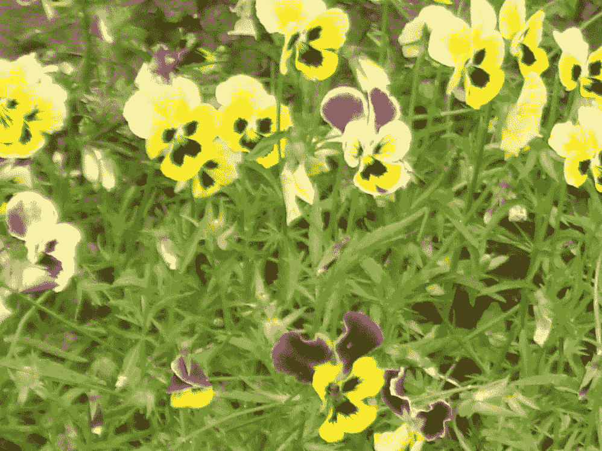

让我们看看 Inception 模型在其中的表现。 我们将使用在 ImageNet 数据上训练的预训练的 Inception 网络模型。 要加载模型，请使用以下代码：

```py
from keras.applications import inception_v3
from keras import backend as K
from keras.applications.imagenet_utils import decode_predictions
from keras.preprocessing import image
K.set_learning_phase(0)

model = inception_v3.InceptionV3(weights='imagenet',include_top=True)
```

要读取图像文件并将其转换为一个图像的数据批，这是 Inception 网络模型的`predict`功能的预期输入，我们使用以下功能：

```py
def preprocess_image(image_path):
    img = image.load_img(image_path)
    img = image.img_to_array(img)
    #convert single image to a batch with 1 image
    img = np.expand_dims(img, axis=0) 
    img = inception_v3.preprocess_input(img)
    return img
```

现在，让我们使用前面的方法预处理输入图像并预测模型看到的对象。 我们将使用`modeld.predict`方法来获取 ImageNet 中所有 1,000 个类的预测类概率。 要将此概率数组转换为按概率得分的降序排列的实类标签，我们使用`keras`中的`decode_predictions`方法。 可在此处找到所有 1,000 个 ImageNet 类或[同义词集的列表](http://image-net.org/challenges/LSVRC/2014/browse-synsets)。 请注意，三色堇花不在训练模型的已知类集中：

```py
img = preprocess_image(base_image_path)
preds = model.predict(img)
for n, label, prob in decode_predictions(preds)[0]:
    print (label, prob)
```

的预测。 最高预测的类别都不具有很大的概率，这是可以预期的，因为模型之前没有看到过这种特殊的花朵：

```py
bee 0.022255851
earthstar 0.018780833
sulphur_butterfly 0.015787734
daisy 0.013633176
cabbage_butterfly 0.012270376
```

在上一张照片中，模型找到**蜜蜂**。 好吧，这不是一个不好的猜测。 如您所见，在黄色的花朵中，中间的黑色/棕色阴影的下半部分确实像蜜蜂。 此外，它还会看到一些黄色和白色的蝴蝶，如**硫**和**卷心菜**蝴蝶，就像我们人类一眼就能看到的。 下图显示了这些已识别对象/类的实际图像。 显然，此输入激活了该网络中的某些特征检测器隐藏层。 也许检测昆虫/鸟类翅膀的过滤器与一些与颜色相关的过滤器一起被激活，以得出上述结论：


ImageNet 体系结构及其中的功能图数量很多。 让我们假设一下，我们知道可以检测这些机翼的要素地图层。 现在，给定输入图像，我们可以从这一层提取要素。 我们可以更改输入图像，以使来自该层的激活增加吗？ 这意味着我们必须修改输入图像，以便在输入图像中看到更多类似机翼的物体，即使它们不在那里。 最终的图像将像梦一样，到处都是蝴蝶。 这正是 DeepDream 中完成的工作。

现在，让我们看一下 Inception 网络中的​​一些功能图。 要了解卷积模型学到的知识，我们可以尝试可视化卷积过滤器。

# 可视化特征图

可视化 CNN 模型涉及在给定一定输入的情况下，查看网络中各种卷积和池化层输出的中间层特征图。 这样就可以了解网络如何处理输入以及如何分层提取各种图像特征。 所有要素图都具有三个维度：宽度，高度和深度（通道）。 我们将尝试将它们可视化为 InceptionV3 模型。

让我们为拉布拉多犬拍摄以下照片，并尝试形象化各种特征图。 由于 InceptionV3 模型具有很深的深度，因此我们将仅可视化一些层：

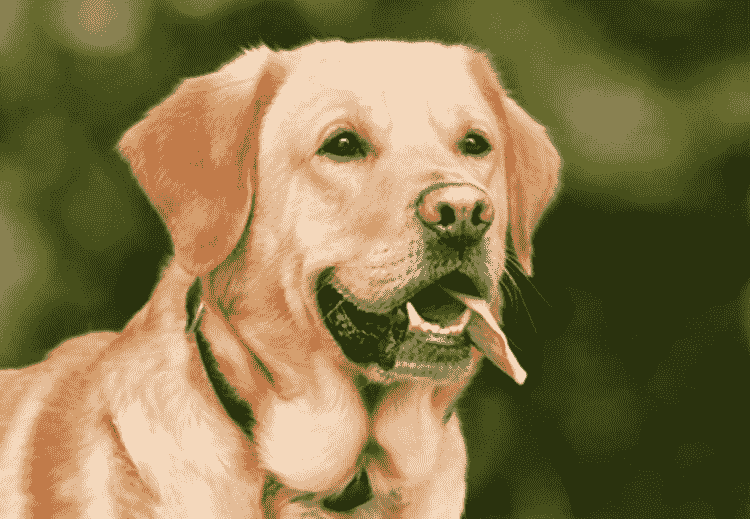

首先，让我们创建一个模型以获取输入图像并输出所有内部激活层。 InceptionV3 中的激活层称为`activation_i`。 因此，我们可以从加载的 Inception 模型中过滤掉激活层，如以下代码所示：

```py
activation_layers = [ layer.output for layer in model.layers if 
                      layer.name.startswith("activation_")]

layer_names = [ layer.name for layer in model.layers if 
                layer.name.startswith("activation_")]
```

现在，让我们创建一个模型，该模型获取输入图像并将所有上述激活层特征作为列表输出，如以下代码所示：

```py
from keras.models import Model
activation_model = Model(inputs=model.input, outputs=activation_layers)
```

现在，要获得输出激活，我们可以使用`predict`功能。 我们必须使用与先前定义的相同的预处理功能对图像进行预处理，然后再将其提供给 Inception 网络：

```py
img = preprocess_image(base_image_path)
activations = activation_model.predict(img)
```

我们可以绘制这些先前的激活。 一个激活层中的所有过滤器/功能图都可以绘制在网格中。 因此，根据图层中滤镜的数量，我们将图像网格定义为 NumPy 数组，如以下代码所示（以下代码的某些部分来自[这里](https://blog.keras.io/how-convolutional-neural-networks-see-the-world.html)）：

```py
import matplotlib.pyplot as plt

images_per_row = 8
idx = 1 #activation layer index

layer_activation=activations[idx]
# This is the number of features in the feature map
n_features = layer_activation.shape[-1]
# The feature map has shape (1, size1, size2, n_features)
r = layer_activation.shape[1]
c = layer_activation.shape[2]

# We will tile the activation channels in this matrix
n_cols = n_features // images_per_row
display_grid = np.zeros((r * n_cols, images_per_row * c))
print(display_grid.shape)
```

现在，我们将遍历激活层中的所有要素地图，并将缩放后的输出放到网格中，如以下代码所示：

```py
# We'll tile each filter into this big horizontal grid
    for col in range(n_cols):
        for row in range(images_per_row):
            channel_image = layer_activation[0,:, :, col *   
                                             images_per_row + row]
            # Post-process the feature to make it visually palatable
            channel_image -= channel_image.mean()
            channel_image /= channel_image.std()
            channel_image *= 64
            channel_image += 128
            channel_image = np.clip(channel_image, 0, 
                                    255).astype('uint8')
            display_grid[col * r : (col + 1) * r,
            row * c : (row + 1) * c] = channel_image
    # Display the grid
    scale = 1\. / r
    plt.figure(figsize=(scale * display_grid.shape[1],
               scale * display_grid.shape[0]))
    plt.title(layer_names[idx]+" #filters="+str(n_features))
    plt.grid(False)
    plt.imshow(display_grid, aspect='auto', cmap='viridis')        
```

以下是各层的输出：

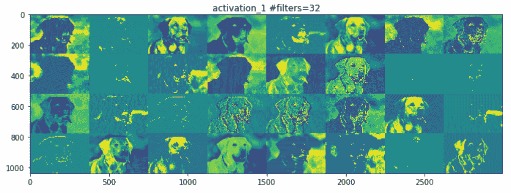

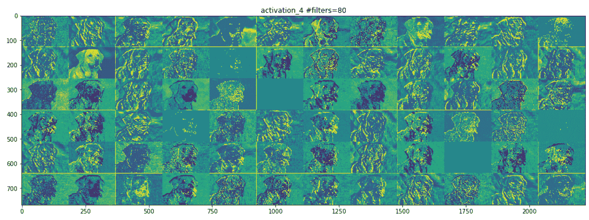

前面的前两个激活层充当各种边缘检测器的集合。 这些激活保留了初始图片中几乎所有的信息。

让我们看下面的屏幕快照，它显示了网络中间的一层。 在这里，它开始识别更高级别的功能，例如鼻子，眼睛，舌头，嘴巴等：

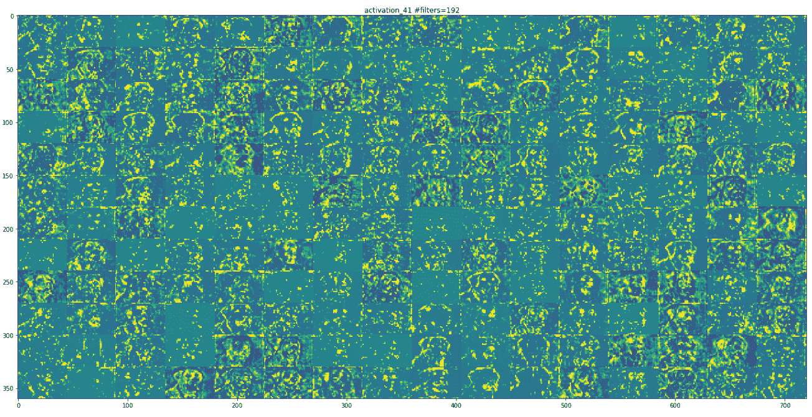

随着我们的上移，地物图在视觉上的解释也越来越少。 较高层的激活会携带有关所看到的特定输入的最少信息，以及有关图像目标类别（在此情况下为狗）的更多信息。

可视化 InceptionV3 学习的过滤器的另一种方法是显示每个过滤器输出最大激活值的可视模式。 这可以通过输入空间中的梯度上升来完成。 基本上，通过使用图像空间中的梯度上升进行优化，找到使感兴趣的活动（层中神经元的激活）最大化的输入图像。 最终的输入图像将是所选过滤器最大程度地响应的输入图像。

每个激活层都有许多功能图。 以下代码演示了如何从最后一个激活层提取单个功能图。 这个激活值实际上是我们要最大化的损失：

```py
layer_name = 'activation_94'
filter_index = 0
layer_output = model.get_layer(layer_name).output
loss = K.mean(layer_output[:, :, :, filter_index])
```

要相对于此`loss`函数计算输入图像的梯度，我们可以如下使用`keras`后端梯度函数：

```py
grads = K.gradients(loss, model.input)[0]
# We add 1e-5 before dividing so as to avoid accidentally dividing by 
# 0.
grads /= (K.sqrt(K.mean(K.square(grads))) + 1e-5)
```

因此，给定一个激活层和一个可能是随机噪声的起始输入图像，我们可以使用上面的梯度计算应用梯度上升来获得特征图所表示的图案。 跟随`generate_pattern`功能执行相同的操作。 归一化输出模式，以便我们在图像矩阵中具有可行的 RGB 值，这是通过使用`deprocess_image`方法完成的。 以下代码是不言自明的，并具有内联注释来解释每一行：

```py
def generate_pattern(layer_name, filter_index, size=150):
    # Build a loss function that maximizes the activation
    # of the nth filter of the layer considered.
    layer_output = model.get_layer(layer_name).output
    loss = K.mean(layer_output[:, :, :, filter_index])
    # Compute the gradient of the input picture wrt this loss
    grads = K.gradients(loss, model.input)[0]
    # Normalization trick: we normalize the gradient
    grads /= (K.sqrt(K.mean(K.square(grads))) + 1e-5)
    # This function returns the loss and grads given the input picture
    iterate = K.function([model.input], [loss, grads])
    # We start from a gray image with some noise
    input_img_data = np.random.random((1, size, size, 3)) * 20 + 128.
    # Run gradient ascent for 40 steps
    step = 1.
    for i in range(40):
        loss_value, grads_value = iterate([input_img_data])
        input_img_data += grads_value * step
        img = input_img_data[0]
    return deprocess_image(img)

def deprocess_image(x):
    # normalize tensor: center on 0., ensure std is 0.1
    x -= x.mean()
    x /= (x.std() + 1e-5)
    x *= 0.1
    # clip to [0, 1]
    x += 0.5
    x = np.clip(x, 0, 1)
```

```py
    # convert to RGB array
    x *= 255
    x = np.clip(x, 0, 255).astype('uint8')
    return x
```

以下屏幕截图是某些过滤器层的可视化。 第一层具有各种类型的点图案：

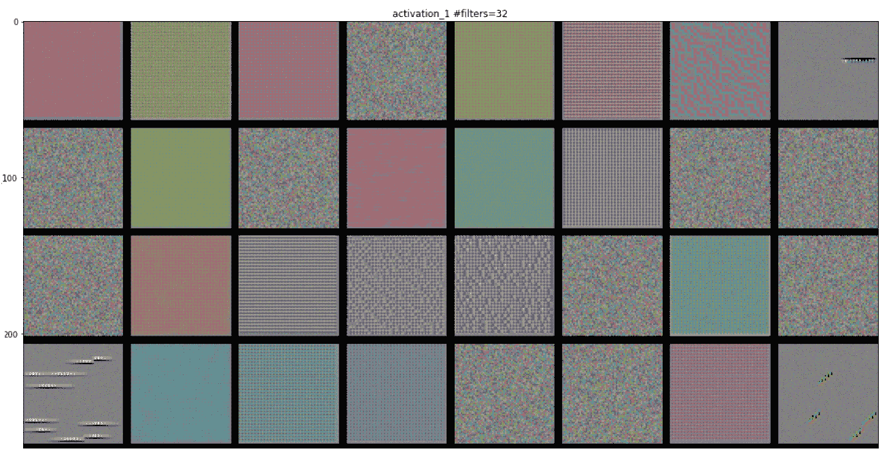

# 深梦

**DeepDream** 是一种艺术性的图像修改技术，它利用了以同名电影命名的深层 CNN 代码 *Inception* 所学习的表示形式。 我们可以拍摄任何输入图像并对其进行处理，以生成令人毛骨悚然的图片，其中充满了算法上的拟南芥伪像，鸟羽毛，狗似的面孔，狗眼-这是 DeepDream 修道院在 ImageNet 上接受过训练的事实，狗在这里繁殖，鸟类种类过多。

DeepDream 算法与使用梯度上升的 ConvNet 过滤器可视化技术几乎相同，不同之处在于：

*   在 DeepDream 中，最大程度地激活了整个图层，而在可视化中，只最大化了一个特定的过滤器，因此将大量特征图的可视化混合在一起
*   我们不是从随机噪声输入开始，而是从现有图像开始； 因此，最终的可视化效果将修改先前存在的视觉模式，从而以某种艺术性的方式扭曲图像的元素
*   输入图像以不同的比例（称为**八度**）进行处理，从而提高了可视化效果的质量

现在，让我们修改上一部分中的可视化代码。 首先，我们必须更改`loss`功能和梯度计算。 以下是执行相同操作的代码：

```py
layer_name = 'activation_41'
activation = model.get_layer(layer_name).output

# We avoid border artifacts by only involving non-border pixels in the #loss.
scaling = K.prod(K.cast(K.shape(activation), 'float32'))
loss = K.sum(K.square(activation[:, 2: -2, 2: -2, :])) / scaling

# This tensor holds our generated image
dream = model.input

# Compute the gradients of the dream with regard to the loss.
grads = K.gradients(loss, dream)[0]

# Normalize gradients.
grads /= K.maximum(K.mean(K.abs(grads)), 1e-7)

iterate_grad_ac_step = K.function([dream], [loss, grads])
```

第二个变化是输入图像，因此我们必须提供要在其上运行 DeepDream 算法的输入图像。 第三个变化是，我们没有在单个图像上应用梯度强调，而是创建了各种比例的输入图像并应用了梯度强调，如以下代码所示：

```py
num_octave = 4 # Number of scales at which to run gradient ascent
octave_scale = 1.4 # Size ratio between scales
iterations = 20 # Number of ascent steps per scale

# If our loss gets larger than 10, 
# we will interrupt the gradient ascent process, to avoid ugly  
# artifacts
max_loss = 20.

base_image_path = 'Path to Image You Want to Use'
# Load the image into a Numpy array
img = preprocess_image(base_image_path)
print(img.shape)
# We prepare a list of shape tuples
# defining the different scales at which we will run gradient ascent
original_shape = img.shape[1:3]
successive_shapes = [original_shape]
for i in range(1, num_octave):
    shape = tuple([int(dim / (octave_scale ** i)) for dim in  
                   original_shape])
    successive_shapes.append(shape)

# Reverse list of shapes, so that they are in increasing order
successive_shapes = successive_shapes[::-1]

# Resize the Numpy array of the image to our smallest scale
original_img = np.copy(img)
shrunk_original_img = resize_img(img, successive_shapes[0])
print(successive_shapes)

#Example Octaves for image of shape (1318, 1977)
[(480, 720), (672, 1008), (941, 1412), (1318, 1977)]
```

以下代码显示了 DeepDream 算法的一些实用程序功能。 函数`deprocess_image`基本上是 InceptionV3 模型的预处理输入的逆运算符：

```py
import scipy

def deprocess_image(x):
    # Util function to convert a tensor into a valid image.
    if K.image_data_format() == 'channels_first':
        x = x.reshape((3, x.shape[2], x.shape[3]))
        x = x.transpose((1, 2, 0))
    else:
        x = x.reshape((x.shape[1], x.shape[2], 3))
    x /= 2.
    x += 0.5
    x *= 255.
    x = np.clip(x, 0, 255).astype('uint8')
    return x

def resize_img(img, size):
    img = np.copy(img)
    factors = (1,
               float(size[0]) / img.shape[1],
               float(size[1]) / img.shape[2],
               1)
    return scipy.ndimage.zoom(img, factors, order=1)

def save_img(img, fname):
    pil_img = deprocess_image(np.copy(img))
    scipy.misc. (fname, pil_img)
```

在每个连续的音阶上，从最小到最大的八度音程，我们都执行梯度上升以使该音阶上的先前定义的损耗最大化。 每次梯度爬升后，生成的图像将放大 40%。 在每个升级步骤中，一些图像细节都会丢失； 但是我们可以通过添加丢失的信息来恢复它，因为我们知道该比例的原始图像：

```py
MAX_ITRN = 20
MAX_LOSS = 20
learning_rate = 0.01

for shape in successive_shapes:
    print('Processing image shape', shape)
    img = resize_img(img, shape)
    img = gradient_ascent(img,
                          iterations=MAX_ITRN,
                          step=learning_rate,
                          max_loss=MAX_LOSS)
    upscaled_shrunk_original_img = resize_img(shrunk_original_img, 
                                              shape)
    same_size_original = resize_img(original_img, shape)
    lost_detail = same_size_original - upscaled_shrunk_original_img
    print('adding lost details', lost_detail.shape)
    img += lost_detail
    shrunk_original_img = resize_img(original_img, shape)
    save_img(img, fname='dream_at_scale_' + str(shape) + '.png')

save_img(img, fname='final_dream.png')
```

# 例子

以下是 DeepDream 输出的一些示例：

*   在激活层 41 上运行梯度重音。这是我们之前看到的同一层，带有狗图像输入。 在下面的照片中，您可以看到一些动物从云层和蓝天中冒出来：

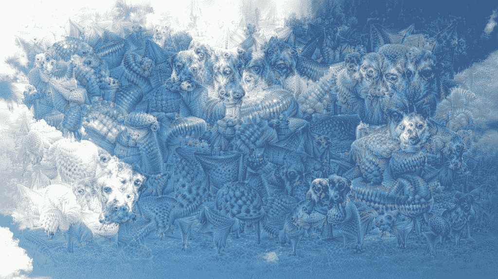

*   在激活层 45 上运行梯度重音。在下图中，您可以看到山上出现了一些类似狗的动物面孔：

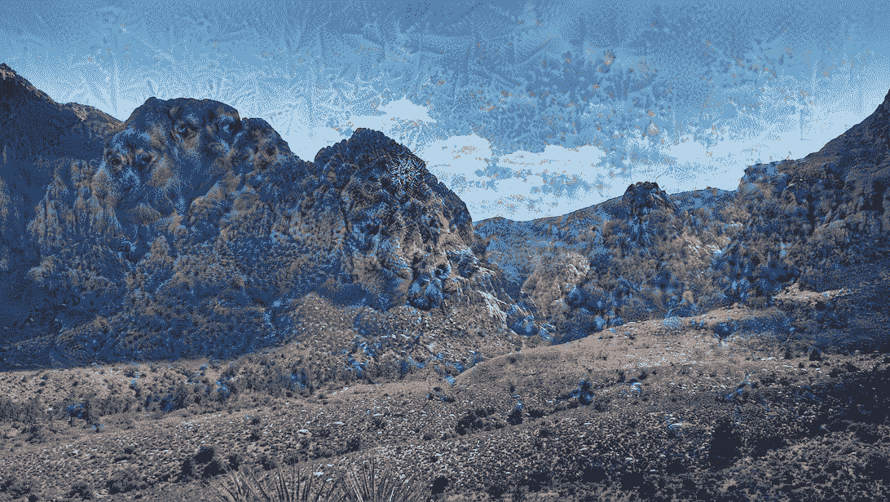

*   在激活层 50 上运行梯度。在下面的照片中，您可以看到在蓝天白云下某些特殊的类似叶的图案梦：


生成这些梦想的原始图像在代码存储库中共享。

# 总结

在本章中，我们学习了计算机视觉中的算法稀疏。 我们已经解释了如何通过各种可视化技术来解释 CNN 模型，例如基于前向通过的激活可视化，基于梯度上升的过滤器可视化。 最后，我们介绍了 DeepDream 算法，该算法再次是对基于梯度上升的可视化技术的略微修改。 DeepDream 算法是将迁移学习应用于计算机视觉或图像处理任务的示例。

在下一章中，我们将看到更多类似的应用程序，它们将重点放在风格转换上。

# 风格迁移

绘画需要特殊技能，只有少数人已经掌握。 绘画呈现出内容和风格的复杂相互作用。 另一方面，照片是视角和光线的结合。 当两者结合时，结果是惊人的和令人惊讶的。 该过程称为**艺术风格转移**。 以下是一个示例，其中输入图像是德国图宾根的 Neckarfront，风格图像是梵高着名的画作《星空》。 有趣，不是吗？ 看一下以下图像：

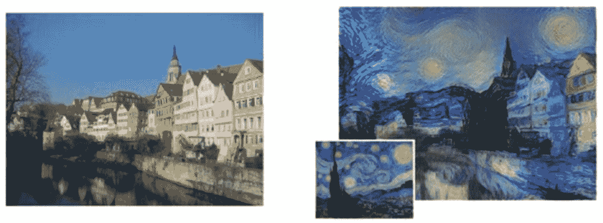

左图：描绘德国蒂宾根 Neckarfront 的原始照片。 梵高的《星空》）。 来源：《一种艺术风格的神经算法》（Gatys 等人，arXiv：1508.06576v2）

如果您仔细查看前面的图像，则右侧的绘画风格图像似乎已经从左侧的照片中拾取了内容。 绘画的风格，颜色和笔触风格产生了最终结果。 令人着迷的结果是 Gatys 等人在论文[《一种用于艺术风格的神经算法》](https://arxiv.org/abs/1508.06576)中提出的一种迁移学习算法的结果。 我们将从实现的角度讨论本文的复杂性，并了解如何自己执行此技术。

在本章中，我们将专注于利用深度学习和传递学习来构建神经风格传递系统。 本章重点关注的领域包括：

*   了解神经风格转换
*   图像预处理方法
*   建筑损失功能
*   构造自定义优化器
*   风格迁移实战

我们将涵盖有关神经风格迁移，损失函数和优化的理论概念。 除此之外，我们将使用动手方法来实现我们自己的神经风格转换模型。 本章的代码可在 [GitHub 存储库](https://github.com/dipanjanS/hands-on-transfer-learning-with-python)的第 10 章文件夹中快速参考。 请根据需要参考本章。

# 了解神经风格转换

**神经风格迁移**是将参考图像的**风格**应用于特定目标图像的过程，以使目标图像的原始**内容**保持不变。 在这里，风格定义为参考图像中存在的颜色，图案和纹理，而内容定义为图像的整体结构和更高层次的组件。

在此，主要目的是保留原始目标图像的内容，同时在目标图像上叠加或采用参考图像的风格。 为了从数学上定义这个概念，请考虑三个图像：原始内容（表示为`c`），参考风格（表示为`s`）和生成的图像（表示为`g`）。 我们需要一种方法来衡量在内容方面， `c`和`g`不同的图像的程度。 同样，就输出的风格特征而言，与风格图像相比，输出图像应具有较小的差异。 形式上，神经风格转换的目标函数可以表述为：


此处，`α`和`β`是用于控制内容和风格成分对整体损失的影响的权重。 此描述可以进一步简化，并表示如下：


在这里，我们可以根据前面的公式定义以下组件：

*   `dist`是规范函数； 例如，L2 规范距离
*   `style(...)`是用于为参考风格和生成的图像计算风格表示的函数
*   `content(...)`是一种功能，可为原始内容和生成的图像计算内容的表示形式
*   `I[c]`，`I[s]`和`I[g]`，并分别生成图像

因此，最小化此损失会导致风格（`I[g]`）接近风格（`I[s]`），以及内容（`I[g]`）接近内容（`I[c]`）。 这有助于我们达成有效的风格转换所需的规定。 我们将尝试最小化的损失函数包括三个部分： 即将讨论的**内容损失**，**风格损失**和**总变化损失**。 关键思想或目标是保留原始目标图像的*内容*，同时在目标图像上叠加或采用参考图像的*风格*。 此外，在神经风格转换的背景下，您应该记住以下几点：

*   **风格**可以定义为参考图像中存在的调色板，特定图案和纹理
*   **内容**可以定义为原始目标图像的整体结构和更高级别的组件

到目前为止，我们知道深度学习对于计算机视觉的真正威力在于利用诸如深层**卷积神经网络**（**CNN**）模型之类的模型，这些模型可用于在构建这些损失函数时提取正确的图像表示。 在本章中，我们将使用迁移学习的原理来构建用于神经风格迁移的系统，以提取最佳特征。 在前面的章节中，我们已经讨论了与计算机视觉相关的任务的预训练模型。 在本章中，我们将再次使用流行的 VGG-16 模型作为特征提取器。 执行神经风格转换的主要步骤如下所示：

*   利用 VGG-16 帮助计算风格，内容和生成图像的图层激活
*   使用这些激活来定义前面提到的特定损失函数
*   最后，使用梯度下降来最大程度地减少总损耗

如果您想更深入地研究神经风格转换背后的核心原理和理论概念，建议您阅读以下文章：

*   `A Neural Algorithm of Artistic Style, by Leon A. Gatys, Alexander S. Ecker, and Matthias Bethge (https://arxiv.org/abs/1508.06576)`
*   `Perceptual Losses for Real-Time Style Transfer and Super-Resolution, by Justin Johnson, Alexandre Alahi, and Li Fei-Fei (https://arxiv.org/abs/1603.08155)`

# 图像预处理方法

在这种情况下，实现此类网络的第一步也是最重要的一步是对数据或图像进行预处理。 以下代码段显示了一些用于对图像进行大小和通道调整的快速实用程序：

```py
import numpy as np
from keras.applications import vgg16
from keras.preprocessing.image import load_img, img_to_array

def preprocess_image(image_path, height=None, width=None):
    height = 400 if not height else height
    width = width if width else int(width * height / height)
    img = load_img(image_path, target_size=(height, width))
    img = img_to_array(img)
    img = np.expand_dims(img, axis=0)
    img = vgg16.preprocess_input(img)
    return img

def deprocess_image(x):
    # Remove zero-center by mean pixel
    x[:, :, 0] += 103.939
    x[:, :, 1] += 116.779
    x[:, :, 2] += 123.68
    # 'BGR'->'RGB'
    x = x[:, :, ::-1]
    x = np.clip(x, 0, 255).astype('uint8')
    return x
```

当我们要编写自定义损失函数和操作例程时，我们将需要定义某些占位符。 请记住，`keras`是一个利用张量操作后端（例如`tensorflow`，`theano`和`CNTK`）执行繁重工作的高级库。 因此，这些占位符提供了高级抽象来与基础张量对象一起使用。 以下代码段为风格，内容和生成的图像以及神经网络的输入张量准备了占位符：

```py
from keras import backend as K

# This is the path to the image you want to transform.
TARGET_IMG = 'lotr.jpg'
# This is the path to the style image.
REFERENCE_STYLE_IMG = 'pattern1.jpg'

width, height = load_img(TARGET_IMG).size
img_height = 480
img_width = int(width * img_height / height)

target_image = K.constant(preprocess_image(TARGET_IMG, 
                          height=img_height,  
                          width=img_width))
style_image = K.constant(preprocess_image(REFERENCE_STYLE_IMG, 
                         height=img_height,  
                         width=img_width))

# Placeholder for our generated image
generated_image = K.placeholder((1, img_height, img_width, 3))

# Combine the 3 images into a single batch
input_tensor = K.concatenate([target_image,
                              style_image,
                              generated_image], axis=0)
```

我们将像前几章一样加载预训练的 VGG-16 模型。 也就是说，没有顶部的全连接层。 唯一的区别是我们将为模型输入提供输入张量的大小尺寸。 以下代码段有助于我们构建预训练模型：

```py
model = vgg16.VGG16(input_tensor=input_tensor,
                    weights='imagenet',
                    include_top=False)
```

# 建筑损失功能

如背景小节所述，神经风格迁移的问题围绕内容和风格的损失函数。 在本小节中，我们将讨论和定义所需的损失函数。

# 内容丢失

在任何基于 CNN 的模型中，来自顶层的激活都包含更多的全局和抽象信息（例如，诸如人脸之类的高级结构），而底层将包含局部信息（例如，诸如眼睛，鼻子， 边缘和角落）。 我们希望利用 CNN 的顶层来捕获图像内容的正确表示。 因此，对于内容损失，考虑到我们将使用预训练的 VGG-16 模型，我们可以将损失函数定义为通过计算得出的顶层激活（给出特征表示）之间的 L2 范数（缩放和平方的欧几里得距离）。 目标图像，以及在生成的图像上计算的同一层的激活。 假设我们通常从 CNN 的顶层获得与图像内容相关的特征表示，则预期生成的图像看起来与基本目标图像相似。 以下代码段显示了计算内容丢失的函数：

```py
def content_loss(base, combination):
    return K.sum(K.square(combination - base))
```

# 风格损失

关于神经风格转移的原始论文，[《一种由神经科学风格的神经算法》](https://arxiv.org/abs/1508.06576)，由 Gatys 等人撰写。利用 CNN 中的多个卷积层（而不是一个）来从参考风格图像中提取有意义的风格和表示，捕获与外观或风格有关的信息。 不论图像内容如何，​​在所有空间尺度上都可以工作。风格表示可计算 CNN 不同层中不同要素之间的相关性。

忠于原始论文，我们将利用 **Gram 矩阵**并在由卷积层生成的特征表示上进行计算。 Gram 矩阵计算在任何给定的卷积层中生成的特征图之间的内积。 内积项与相应特征集的协方差成正比，因此可以捕获趋于一起激活的图层的特征之间的相关性。 这些特征相关性有助于捕获特定空间比例的图案的相关汇总统计信息，这些统计信息与风格，纹理和外观相对应，而不与图像中存在的组件和对象相对应。

因此，风格损失定义为参考风格的 Gram 矩阵与生成的图像之间的差异的按比例缩放的 Frobenius 范数（矩阵上的欧几里得范数）。 最小化此损失有助于确保参考风格图像中不同空间比例下找到的纹理在生成的图像中相似。 因此，以下代码段基于 Gram 矩阵计算定义了风格损失函数：

```py
def style_loss(style, combination, height, width):

    def build_gram_matrix(x):
        features = K.batch_flatten(K.permute_dimensions(x, (2, 0, 1)))
        gram_matrix = K.dot(features, K.transpose(features))
        return gram_matrix

    S = build_gram_matrix(style)
    C = build_gram_matrix(combination)
    channels = 3
    size = height * width
    return K.sum(K.square(S - C))/(4\. * (channels ** 2) * (size ** 2))
```

# 总变化损失

据观察，仅减少风格和内容损失的优化会导致高度像素化和嘈杂的输出。 为了解决这个问题，引入了总变化损失。 **总变化损失**与*正则化*损失相似。 引入此方法是为了确保生成的图像中的空间连续性和平滑性，以避免产生嘈杂的像素化结果。 在函数中的定义如下：

```py
def total_variation_loss(x):
    a = K.square(
        x[:, :img_height - 1, :img_width - 1, :] - x[:, 1:, :img_width 
          - 1, :])
    b = K.square(
        x[:, :img_height - 1, :img_width - 1, :] - x[:, :img_height - 
          1, 1:, :])
    return K.sum(K.pow(a + b, 1.25))
```

# 总损失函数

在定义了用于神经风格传递的整体损失函数的组成部分之后，下一步就是将这些构造块缝合在一起。 由于内容和风格信息是由 CNN 在网络中的不同深度捕获的，因此我们需要针对每种损失类型在适当的层上应用和计算损失。 我们将对卷积层进行 1 到 5 层的风格损失，并为每一层设置适当的权重。

这是构建整体损失函数的代码片段：

```py
# weights for the weighted average loss function
content_weight = 0.05
total_variation_weight = 1e-4

content_layer = 'block4_conv2'
style_layers =  ['block1_conv2', 'block2_conv2',   
                 'block3_conv3','block4_conv3', 'block5_conv3'] 
style_weights = [0.1, 0.15, 0.2, 0.25, 0.3]

# initialize total loss
loss = K.variable(0.)

# add content loss
layer_features = layers[content_layer]
target_image_features = layer_features[0, :, :, :]
combination_features = layer_features[2, :, :, :]
loss += content_weight * content_loss(target_image_features,
                                      combination_features)

# add style loss
for layer_name, sw in zip(style_layers, style_weights):
    layer_features = layers[layer_name]
    style_reference_features = layer_features[1, :, :, :]
    combination_features = layer_features[2, :, :, :]
    sl = style_loss(style_reference_features, combination_features, 
                    height=img_height, width=img_width)
    loss += (sl*sw)

# add total variation loss
loss += total_variation_weight * total_variation_loss(generated_image)
```

# 构造自定义优化器

目的是在优化算法的帮助下迭代地使总损失最小化。 Gatys 等人的论文中，使用 L-BFGS 算法进行了优化，该算法是基于准牛顿法的一种优化算法，通常用于解决非线性优化问题和参数估计。 该方法通常比标准梯度下降收敛更快。

SciPy 在`scipy.optimize.fmin_l_bfgs_b()`中提供了一个实现。 但是，局限性包括该函数仅适用于平面一维向量，这与我们正在处理的三维图像矩阵不同，并且损失函数和梯度的值需要作为两个单独的函数传递。 我们基于模式构建一个`Evaluator`类，然后由`keras`创建者 FrançoisChollet 创建，以一次计算损失和梯度值，而不是独立和单独的计算。 这将在首次调用时返回损耗值，并将缓存下一次调用的梯度。 因此，这将比独立计算两者更为有效。 以下代码段定义了`Evaluator`类：

```py
class Evaluator(object):

    def __init__(self, height=None, width=None):
        self.loss_value = None
        self.grads_values = None
        self.height = height
        self.width = width

    def loss(self, x):
        assert self.loss_value is None
        x = x.reshape((1, self.height, self.width, 3))
        outs = fetch_loss_and_grads([x])
        loss_value = outs[0]
        grad_values = outs[1].flatten().astype('float64')
        self.loss_value = loss_value
        self.grad_values = grad_values
        return self.loss_value

    def grads(self, x):
        assert self.loss_value is not None
        grad_values = np.copy(self.grad_values)
        self.loss_value = None
        self.grad_values = None
        return grad_values

evaluator = Evaluator(height=img_height, width=img_width)
```

# 风格迁移实战

难题的最后一步是使用所有构建块并在操作中执行风格转换！ 可以从数据目录中获取艺术/风格和内容图像，以供参考。 以下代码片段概述了如何评估损耗和梯度。 我们还按规律的间隔/迭代（`5`，`10`等）写回输出，以了解神经风格迁移的过程如何在经过一定的迭代次数后考虑的图像转换图像，如以下代码段所示：

```py
from scipy.optimize import fmin_l_bfgs_b
from scipy.misc import imsave
from imageio import imwrite
import time

result_prefix = 'st_res_'+TARGET_IMG.split('.')[0]
iterations = 20

# Run scipy-based optimization (L-BFGS) over the pixels of the 
# generated image
# so as to minimize the neural style loss.
# This is our initial state: the target image.
# Note that `scipy.optimize.fmin_l_bfgs_b` can only process flat 
# vectors.
x = preprocess_image(TARGET_IMG, height=img_height, width=img_width)
x = x.flatten()

for i in range(iterations):
    print('Start of iteration', (i+1))
    start_time = time.time()
    x, min_val, info = fmin_l_bfgs_b(evaluator.loss, x,
                                     fprime=evaluator.grads, maxfun=20)
    print('Current loss value:', min_val)
    if (i+1) % 5 == 0 or i == 0:
        # Save current generated image only every 5 iterations
        img = x.copy().reshape((img_height, img_width, 3))
        img = deprocess_image(img)
        fname = result_prefix + '_iter%d.png' %(i+1)
        imwrite(fname, img)
        print('Image saved as', fname)
    end_time = time.time()
    print('Iteration %d completed in %ds' % (i+1, end_time - start_time))
```

到现在为止，必须非常明显的是，神经风格转换是一项计算量巨大的任务。 对于所考虑的图像集，在具有 8GB RAM 的 Intel i5 CPU 上，每次迭代花费了 500-1,000 秒（尽管在 i7 或 Xeon 处理器上要快得多！）。 以下代码段显示了我们在 AWS 的 p2.x 实例上使用 GPU 所获得的加速，每次迭代仅需 25 秒！ 以下代码片段还显示了一些迭代的输出。 我们打印每次迭代的损失和时间，并在每五次迭代后保存生成的图像：

```py
Start of iteration 1
Current loss value: 10028529000.0
Image saved as st_res_lotr_iter1.png
Iteration 1 completed in 28s
Start of iteration 2
Current loss value: 5671338500.0
Iteration 2 completed in 24s
Start of iteration 3
Current loss value: 4681865700.0
Iteration 3 completed in 25s
Start of iteration 4
Current loss value: 4249350400.0
.
.
.
Start of iteration 20
Current loss value: 3458219000.0
Image saved as st_res_lotr_iter20.png
Iteration 20 completed in 25s
```

现在，您将学习神经风格迁移模型如何考虑内容图像的风格迁移。 请记住，我们在某些迭代之后为每对风格和内容图像执行了检查点输出。 我们利用`matplotlib`和`skimage`加载并了解我们系统执行的风格转换魔术！

我们将非常受欢迎的《指环王》电影中的以下图像用作我们的内容图像，并将基于花卉图案的精美艺术品用作我们的风格图像：

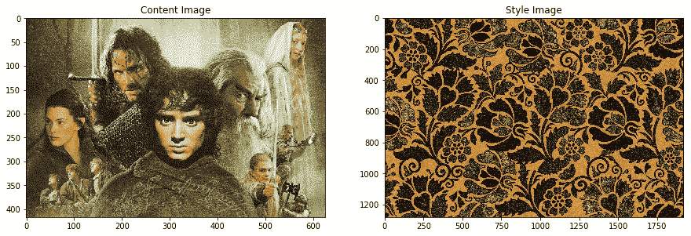

在以下代码段中，我们将在各种迭代之后加载生成的风格化图像：

```py
from skimage import io
from glob import glob
from matplotlib import pyplot as plt

%matplotlib inline
content_image = io.imread('lotr.jpg')
style_image = io.imread('pattern1.jpg')

iter1 = io.imread('st_res_lotr_iter1.png')
iter5 = io.imread('st_res_lotr_iter5.png')
iter10 = io.imread('st_res_lotr_iter10.png')
iter15 = io.imread('st_res_lotr_iter15.png')
iter20 = io.imread('st_res_lotr_iter20.png')
fig = plt.figure(figsize = (15, 15))
ax1 = fig.add_subplot(6,3, 1)
ax1.imshow(content_image)
t1 = ax1.set_title('Original')

gen_images = [iter1,iter5, iter10, iter15, iter20]

for i, img in enumerate(gen_images):
    ax1 = fig.add_subplot(6,3,i+1)
    ax1.imshow(content_image)
    t1 = ax1.set_title('Iteration {}'.format(i+5))
plt.tight_layout()
fig.subplots_adjust(top=0.95)
t = fig.suptitle('LOTR Scene after Style Transfer')
```

以下是显示原始图像和每五次迭代后生成的风格图像的输出：

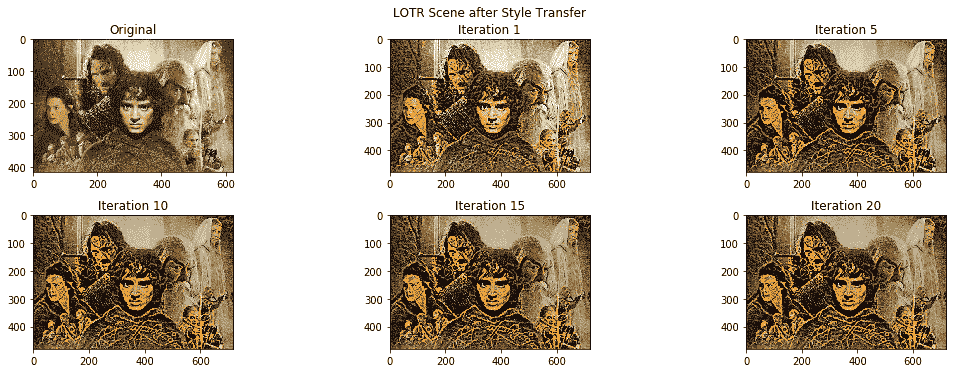

以下是高分辨率的最终风格图像。 您可以清楚地看到花卉图案的纹理和风格是如何在原始《指环王》电影图像中慢慢传播的，并赋予了其良好的复古外观：

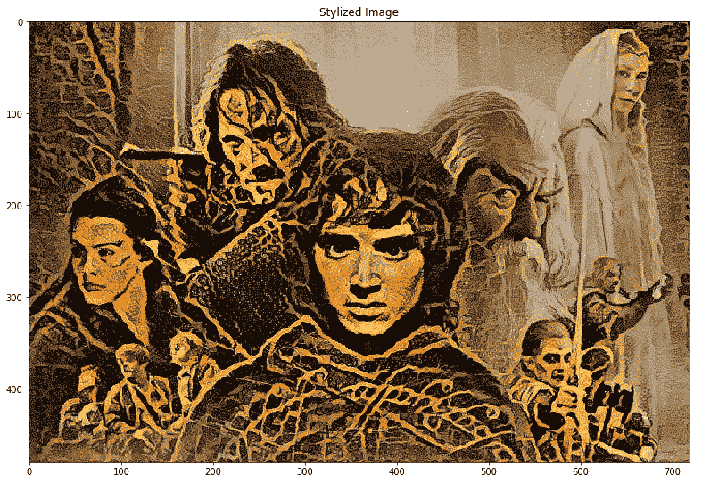

让我们再举一个风格迁移示例。 下图包含我们的内容图像，即来自黑豹的著名虚构的城市瓦卡达。 风格图片是梵高非常受欢迎的画作《星空》！ 我们将在风格传递系统中将它们用作输入图像：

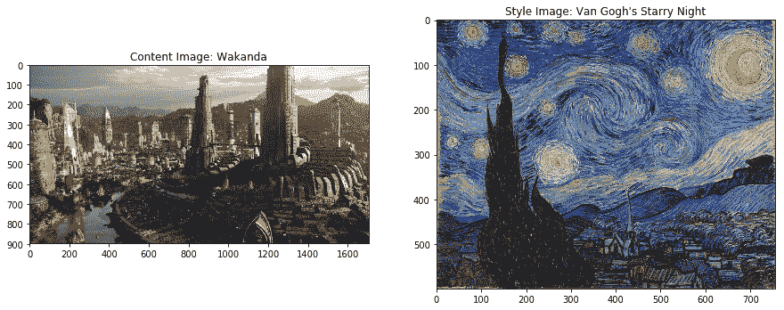

以下是高分辨率的最终风格图像，显示在下面的图像中。 您可以清楚地看到风格绘画中的纹理，边缘，颜色和图案如何传播到城市内容图像中：

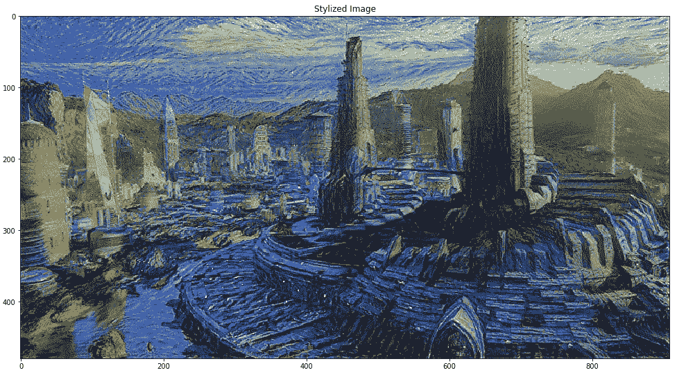

天空和建筑物采用了与您在绘画中可以观察到的非常相似的形式，但是内容图像的整体结构得以保留。 令人着迷，不是吗？ 现在用您自己感兴趣的图像尝试一下！

# 总结

本章介绍了深度学习领域中一种非常新颖的技术，它利用了深度学习的力量来创造艺术！ 确实，数据科学既是一门艺术，也是正确使用数据的科学，而创新则是推动这一发展的事物。 我们介绍了神经风格迁移的核心概念，如何使用有效的损失函数来表示和表达问题，以及如何利用迁移学习的力量和像 VGG-16 这样的预训练模型来提取正确的特征表示。

计算机视觉领域不断发展，深度学习与迁移学习相结合为创新和构建新颖的应用打开了大门。 本章中的示例应帮助您了解该领域的广泛新颖性，并使您能够走出去并尝试新技术，模型和方法来构建诸如神经风格转换的系统！ 随之而来的是有关图像标题和着色的更有趣，更复杂的案例研究。 敬请关注！