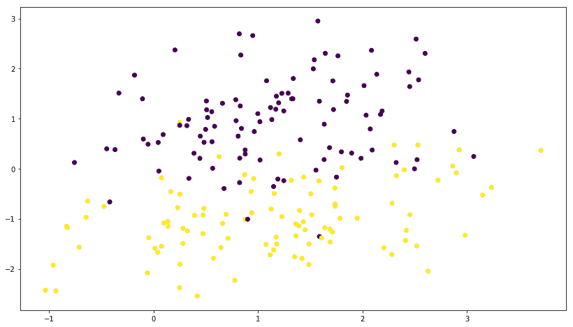
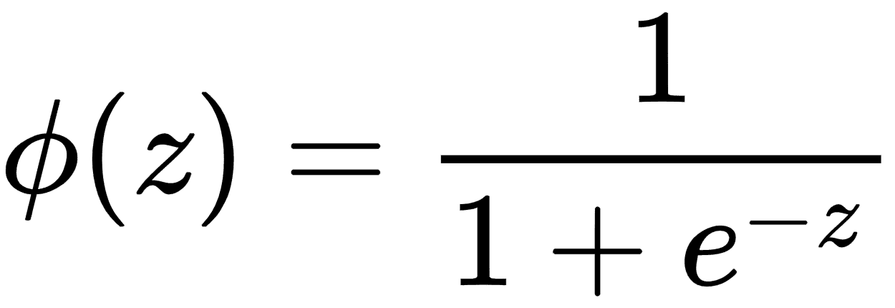

# 二分类

二分类是指仅有两个不同类的问题。正如我们在上一章中所做的那样，我们将使用 SciKit Learn 库中的便捷函数`make_classification()`生成数据集：

```py
X, y = skds.make_classification(n_samples=200,
   n_features=2,
   n_informative=2, 
   n_redundant=0, 
   n_repeated=0,
   n_classes=2,
   n_clusters_per_class=1)
if (y.ndim == 1):
    y = y.reshape(-1,1)
```

`make_classification()`的论据是不言自明的; `n_samples`是要生成的数据点数，`n_features`是要生成的特征数，`n_classes`是类的数量，即 2：

*   `n_samples`是要生成的数据点数。我们将其保持在 200 以保持数据集较小。
*   `n_features`是要生成的特征数量;我们只使用两个特征，因此我们可以将它作为一个简单的问题来理解 TensorFlow 命令。
*   `n_classes`是类的数量，它是 2，因为它是二分类问题。

让我们使用以下代码绘制数据：

```py
plt.scatter(X[:,0],X[:,1],marker='o',c=y)
plt.show()
```

我们得到以下绘图;您可能会得到一个不同的图，因为每次运行数据生成函数时都会随机生成数据：



然后我们使用 NumPy `eye`函数将`y`转换为单热编码目标：

```py
print(y[0:5])
y=np.eye(num_outputs)[y]
print(y[0:5])
```

单热编码目标如下所示：

```py

[1 0 0 1 0]
[[ 0\.  1.]
 [ 1\.  0.]
 [ 1\.  0.]
 [ 0\.  1.]
 [ 1\.  0.]]
```

将数据划分为训练和测试类别：

```py
X_train, X_test, y_train, y_test = skms.train_test_split(
    X, y, test_size=.4, random_state=42)
```

在分类中，我们使用 sigmoid 函数来量化模型的值，使得输出值位于范围[0,1]之间。以下等式表示由`φ(z)`表示的 S 形函数，其中`z`是等式`w × x + b`。损失函数现在变为由`J(θ)`表示的值，其中`θ`表示参数。





我们使用以下代码实现新模型和损失函数：

```py
num_outputs = y_train.shape[1] 
num_inputs = X_train.shape[1]

learning_rate = 0.001

# input images
x = tf.placeholder(dtype=tf.float32, shape=[None, num_inputs], name="x") 
# output labels
y = tf.placeholder(dtype=tf.float32, shape=[None, num_outputs], name="y")

# model paramteres 
w = tf.Variable(tf.zeros([num_inputs,num_outputs]), name="w") 
b = tf.Variable(tf.zeros([num_outputs]), name="b") 
model = tf.nn.sigmoid(tf.matmul(x, w) + b)

loss = tf.reduce_mean(-tf.reduce_sum(
    (y * tf.log(model)) + ((1 - y) * tf.log(1 - model)), axis=1))
optimizer = tf.train.GradientDescentOptimizer(
    learning_rate=learning_rate).minimize(loss)
```

最后，我们运行我们的分类模型：

```py
num_epochs = 1
with tf.Session() as tfs:
    tf.global_variables_initializer().run()
    for epoch in range(num_epochs):
        tfs.run(optimizer, feed_dict={x: X_train, y: y_train})
        y_pred = tfs.run(tf.argmax(model, 1), feed_dict={x: X_test})
        y_orig = tfs.run(tf.argmax(y, 1), feed_dict={y: y_test})

        preds_check = tf.equal(y_pred, y_orig)
        accuracy_op = tf.reduce_mean(tf.cast(preds_check, tf.float32))
        accuracy_score = tfs.run(accuracy_op)
        print("epoch {0:04d} accuracy={1:.8f}".format(
            epoch, accuracy_score))

        plt.figure(figsize=(14, 4))
        plt.subplot(1, 2, 1)
        plt.scatter(X_test[:, 0], X_test[:, 1], marker='o', c=y_orig)
        plt.title('Original')
        plt.subplot(1, 2, 2)
        plt.scatter(X_test[:, 0], X_test[:, 1], marker='o', c=y_pred)
        plt.title('Predicted')
        plt.show()
```

我们获得了大约 96%的相当好的准确率，原始和预测的数据图如下所示：


很简约！！现在让我们让我们的问题变得复杂，并尝试预测两个以上的类。