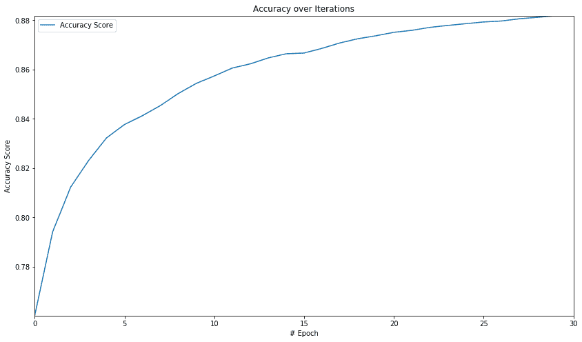

# 多类分类

多类分类的一个流行示例是标记手写数字的图像。此示例中的类或标签为{0,1,2,3,4,5,6,7,8,9}。在以下示例中，我们将使用 MNIST。让我们像前面章节中所做的那样加载 MNIST 图像，代码如下：

```py
from tensorflow.examples.tutorials.mnist import input_data
mnist = input_data.read_data_sets(os.path.join(
    datasetslib.datasets_root, 'mnist'), one_hot=True)
```

如果已按照前一章的说明下载了 MNIST 数据集，那么我们将获得以下输出：

```py
Extracting /Users/armando/datasets/mnist/train-images-idx3-ubyte.gz
Extracting /Users/armando/datasets/mnist/train-labels-idx1-ubyte.gz
Extracting /Users/armando/datasets/mnist/t10k-images-idx3-ubyte.gz
Extracting /Users/armando/datasets/mnist/t10k-labels-idx1-ubyte.gz
```

现在让我们设置一些参数，如下面的代码所示：

```py
num_outputs = 10 # 0-9 digits
num_inputs = 784 # total pixels

learning_rate = 0.001
num_epochs = 1
batch_size = 100
num_batches = int(mnist.train.num_examples/batch_size)
```

上面代码中的参数如下：

*   `num_outputs`：由于我们必须预测图像代表十位数中的哪一位，因此我们将输出数设置为 10.数字由打开或设置为 1 的输出表示。
*   `num_inputs`：我们知道我们的输入数字是 28 x 28 像素，因此每个像素都是模型的输入。因此，我们总共有 784 个输入。
*   `learning_rate`：此参数表示梯度下降优化器算法的学习率。我们将学习率任意设定为 0.001。
*   `num_epochs`：我们将仅针对一次迭代运行我们的第一个示例，因此我们将周期数设置为 1。
*   `batch_size`：在现实世界中，我们可能拥有庞大的数据集并加载整个数据集以便训练模型可能是不可能的。因此，我们将输入数据分成随机选择的批次。我们将`batch_size`设置为 100 个图像，可以使用 TensorFlow 的内置算法一次选择。
*   `num_batches`：此参数设置应从总数据集中选择批次的次数;我们将其设置为等于数据集中的项目数除以批量中的项目数。

我们鼓励您尝试使用这些参数的不同值。

现在让我们使用以下代码定义输入，输出，参数，模型和损失函数：

```py
# input images
x = tf.placeholder(dtype=tf.float32, shape=[None, num_inputs], name="x")
# output labels
y = tf.placeholder(dtype=tf.float32, shape=[None, num_outputs], name="y")

# model paramteres
w = tf.Variable(tf.zeros([784, 10]), name="w")
b = tf.Variable(tf.zeros([10]), name="b")
model = tf.nn.softmax(tf.matmul(x, w) + b)

loss = tf.reduce_mean(-tf.reduce_sum(y * tf.log(model), axis=1))
optimizer = tf.train.GradientDescentOptimizer(
    learning_rate=learning_rate).minimize(loss)
```

代码类似于二分类示例，但有一个显着差异：我们使用`softmax`而不是`sigmoid`函数。 Softmax 用于多类分类，而 sigmoid 用于二元类分类。 Softmax 函数是 sigmoid 函数的推广，它将任意实数值的 n 维向量 z 转换为实数值的 n 维向量 _σ(z)_，范围`(0, 1]`和为 1。

现在让我们运行模型并打印精度：

```py
with tf.Session() as tfs:
    tf.global_variables_initializer().run()
    for epoch in range(num_epochs):
        for batch in range(num_batches):
            batch_x, batch_y = mnist.train.next_batch(batch_size)
            tfs.run(optimizer, feed_dict={x: batch_x, y: batch_y})
        predictions_check = tf.equal(tf.argmax(model, 1), tf.argmax(y, 1))
        accuracy_function = tf.reduce_mean(
            tf.cast(predictions_check, tf.float32))
        feed_dict = {x: mnist.test.images, y: mnist.test.labels}
        accuracy_score = tfs.run(accuracy_function, feed_dict)
        print("epoch {0:04d} accuracy={1:.8f}".format(
            epoch, accuracy_score))
```

我们得到以下准确率：

```py
epoch 0000  accuracy=0.76109999
```

让我们尝试在多次迭代中训练我们的模型，以便在每次迭代中学习不同的批次。我们建立了两个支持函数来帮助我们：

```py
def mnist_batch_func(batch_size=100):
    batch_x, batch_y = mnist.train.next_batch(batch_size)
    return [batch_x, batch_y]
```

上述函数将批量中的示例数作为输入，并使用`mnist.train.next_batch()`函数返回一批特征（`batch_x`）和目标（`batch_y`）：

```py
def tensorflow_classification(num_epochs, num_batches, batch_size,
                              batch_func, optimizer, test_x, test_y):
    accuracy_epochs = np.empty(shape=[num_epochs], dtype=np.float32)
    with tf.Session() as tfs:
        tf.global_variables_initializer().run()
        for epoch in range(num_epochs):
            for batch in range(num_batches):
                batch_x, batch_y = batch_func(batch_size)
                feed_dict = {x: batch_x, y: batch_y}
                tfs.run(optimizer, feed_dict)
            predictions_check = tf.equal(
                tf.argmax(model, 1), tf.argmax(y, 1))
            accuracy_function = tf.reduce_mean(
                tf.cast(predictions_check, tf.float32))
            feed_dict = {x: test_x, y: test_y}
            accuracy_score = tfs.run(accuracy_function, feed_dict)
            accuracy_epochs[epoch] = accuracy_score
            print("epoch {0:04d} accuracy={1:.8f}".format(
                epoch, accuracy_score))

    plt.figure(figsize=(14, 8))
    plt.axis([0, num_epochs, np.min(
        accuracy_epochs), np.max(accuracy_epochs)])
    plt.plot(accuracy_epochs, label='Accuracy Score')
    plt.title('Accuracy over Iterations')
    plt.xlabel('# Epoch')
    plt.ylabel('Accuracy Score')
    plt.legend()
    plt.show()
```

上述函数获取参数并执行训练迭代，打印每次迭代的准确率分数并打印准确率分数。它还可以保存`accuracy_epochs`数组中每个周期的准确率分数。之后，它绘制了每个周期的准确性。让我们使用我们之前设置的参数运行此函数 30 个周期，使用以下代码：

```py
num_epochs=30
tensorflow_classification(num_epochs=num_epochs, 
    num_batches=num_batches, 
    batch_size=batch_size, 
    batch_func=mnist_batch_func, 
    optimizer=optimizer,
    test_x=mnist.test.images,test_y=mnist.test.labels)
```

我们得到以下准确率和图表：

```py
epoch 0000  accuracy=0.76020002
epoch 0001  accuracy=0.79420000
epoch 0002  accuracy=0.81230003
epoch 0003  accuracy=0.82309997
epoch 0004  accuracy=0.83230001
epoch 0005  accuracy=0.83770001

--- epoch 6 to 24 removed for brevity ---

epoch 0025  accuracy=0.87930000
epoch 0026  accuracy=0.87970001
epoch 0027  accuracy=0.88059998
epoch 0028  accuracy=0.88120002
epoch 0029  accuracy=0.88180000
```



从图中我们可以看出，初始迭代中的准确率会急剧提高，然后准确率的提高速度会降低。稍后，我们将看到如何在 TensorFlow 中使用神经网络的全部功能，并将此分类精度提高到更大的值。