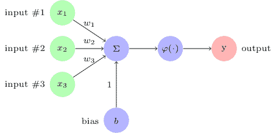

# 感知机

让我们了解神经网络的最基本构建块，**感知机，**也称为**人工神经元**。感知机的概念起源于 Frank Rosenblatt 于 1962 年的作品。

您可能希望阅读以下工作来探索神经网络的起源：

Frank Rosenblatt，神经动力学原理：感知器和脑机制理论，斯巴达书籍，1962 年

在最简化的视图中，感知机被建模在生物神经元之后，使得它接收一个或多个输入并将它们组合以产生输出。

如下图所示，感知机采用三个输入并将它们相加以生成输出`y`：

这种感知机太简单了，不具备任何实际用途。因此，通过添加权重，偏差和激活函数的概念来增强它。将权重添加到每个输入以获得加权和。如果加权和`Σw[i]x[i]`小于阈值，则输出为 0，否则输出为 1：

阈值称为**偏差**。让我们将偏差移到等式的左边，用`b`表示它，`Σw·x`代表`w`和`x`的向量点积。感知机的等式现在变为如下：

感知机现在看起来像下图：

 Simple perceptron with weights and bias

到目前为止，神经元是一个线性函数。为了使这个神经元产生非线性决策边界，通过称为 **a** **ctiva** 或传递函数的非线性函数运行求和输出。有许多流行的激活函数可用：

*   `ReLU`：**整流线性单元**，将值平滑到范围`(0, x)`，

    

*   `sigmoid`： **Sigmoid** 将值平滑到`(0, 1)`，

    

*   `tanh`：**双曲正切**将值平滑到`(-1, 1)`，

    

使用激活函数，感知机的等式变为：

其中`φ(·)`是激活函数。

神经元看起来像下图：

