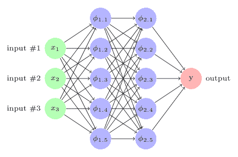

# 多层感知机

当我们将人工神经元连接在一起时，基于明确定义的结构，我们将其称为神经网络。这是一个神经元最简单的神经网络：

Neural network with one neuron

我们连接神经元，使得一层的输出成为下一层的输入，直到最后一层的输出成为最终输出。这种神经网络被称为**前馈神经网络（FFNN）**。由于这些 FFNN 由连接在一起的神经元层组成，因此它们被称为 **MultiLayer** **感知机（MLP）**或**深度神经网络（DNN）**。

作为示例，下图中描绘的 MLP 具有三个特征作为输入：两个隐藏层，每个神经元包含五个神经元，一个输出 y。神经元完全连接到下一层的神经元。这些层也称为致密层或仿射层，并且这种模型也称为顺序模型。

让我们重温一下我们之前探索过的一些示例数据集，并在 TensorFlow 中构建简单的神经网络（MLP 或 DNN）。

您可以按照 Jupyter 笔记本`ch-05_MLP`中的代码进行操作。