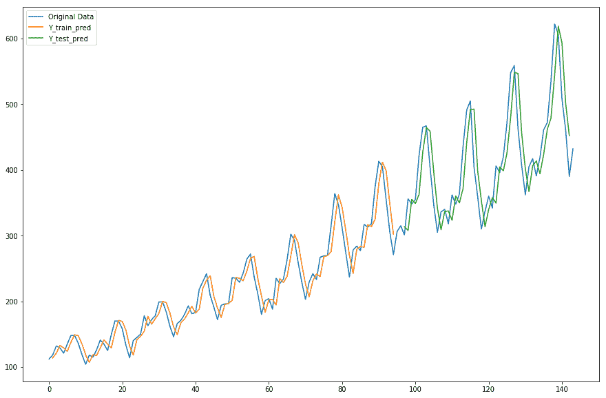

# 用于时间序列回归的 MLP

我们已经看到了图像数据分类的例子;现在让我们看一下时间序列数据的回归。我们将建立并使用 MLP 作为一个较小的单变量时间序列数据集，称为国际航空公司乘客数据集。该数据集包含多年来的乘客总数。该数据集可从此链接获得：

*   <https://www.kaggle.com/andreazzini/international-airline-passengers/data>
*   <https://datamarket.com/data/set/22u3/international-airline-passengers-monthly-totals-in-thousands-jan-49-dec-60>

让我们从准备数据集开始。

1.  首先，使用以下代码加载数据集：

```py
filename = os.path.join(datasetslib.datasets_root, 
                        'ts-data', 
                        'international-airline-passengers-cleaned.csv')
dataframe = pd.read_csv(filename,usecols=[1],header=0)
dataset = dataframe.values
dataset = dataset.astype('float32')
```

1.  利用`datasetslib`的效用函数，我们将数据集分成测试和训练集。对于时间序列数据集，我们有一个单独的函数，不会改变观察结果，因为对于时间序列回归，我们需要维持观察的顺序。我们使用 67%的数据进行训练，33%的数据用于测试。您可能希望尝试使用不同比例的示例。

```py
train,test=dsu.train_test_split(dataset,train_size=0.67)
```

1.  对于时间序列回归，我们转换数据集以构建监督数据集。在此示例中，我们使用两个时间步长的滞后。我们将`n_x`设置为 2，`mvts_to_xy()`函数返回输入和输出（`X`和`Y`）训练和测试集，使得 X 在两列和 Y 中具有时间{t-1，t}的值在一列中具有时间{t + 1}的值。我们的学习算法假设通过找到时间{t-1，t，t + 1}的值之间的关系，可以学习时间 t + 1 的值。

```py
# reshape into X=t-1,t and Y=t+1
n_x=2
n_y=1
X_train, Y_train, X_test, Y_test = tsd.mvts_to_xy(train,
                                    test,n_x=n_x,n_y=n_y)
```

有关将时间序列数据集转换为监督学习问题的更多信息，[请访问此链接](http://machinelearningmastery.com/convert-time-series-supervised-learning-problem-python/)。

现在我们在我们的训练数据集上构建和训练模型：

1.  我导入所需的 Keras 模块：

```py
from keras.models import Sequential
from keras.layers import Dense
from keras.optimizers import SGD
```

1.  设置构建模型所需的超参数：

```py
num_layers = 2
num_neurons = [8,8]
n_epochs = 50
batch_size = 2
```

请注意，我们使用批量大小为 2，因为数据集非常小。我们使用两层 MLP，每层只有八个神经元，因为我们的示例问题的规模很小。

1.  构建，编译和训练模型：

```py
model = Sequential()
model.add(Dense(num_neurons[0], activation='relu', 
    input_shape=(n_x,)))
model.add(Dense(num_neurons[1], activation='relu'))
model.add(Dense(units=1))
model.summary()

model.compile(loss='mse', optimizer='adam')

model.fit(X_train, Y_train,
   batch_size=batch_size,
   epochs=n_epochs)
```

请注意，我们使用 Adam 优化器而不是 SGD。 您可能想要尝试 TensorFlow 和 Keras 中可用的不同优化器。

1.  评估模型并打印均方误差（MSE）和均方根误差（RMSE）：

```py
score = model.evaluate(X_test, Y_test)
print('\nTest mse:', score)
print('Test rmse:', math.sqrt(score))
```

我们得到以下输出：

```py
Test mse: 5619.24934188
Test rmse: 74.96165247566114
```

1.  使用我们的模型预测值并绘制它们，用于测试和训练数据集：

```py
# make predictions
Y_train_pred = model.predict(X_train)
Y_test_pred = model.predict(X_test)

# shift train predictions for plotting
Y_train_pred_plot = np.empty_like(dataset)
Y_train_pred_plot[:, :] = np.nan
Y_train_pred_plot[n_x-1:len(Y_train_pred)+n_x-1, :] = Y_train_pred

# shift test predictions for plotting
Y_test_pred_plot = np.empty_like(dataset)
Y_test_pred_plot[:, :] = np.nan
Y_test_pred_plot[len(Y_train_pred)+(n_x*2)-1:len(dataset)-1, :] = \
    Y_test_pred

# plot baseline and predictions
plt.plot(dataset,label='Original Data')
plt.plot(Y_train_pred_plot,label='Y_train_pred')
plt.plot(Y_test_pred_plot,label='Y_test_pred')
plt.legend()
plt.show()
```

我们得到以下关于原始和预测时间序列值的图：



如你所见，这是一个非常好的估计。然而，在现实生活中，数据本质上是多变量和复杂的。因此，我们将在后面的章节中看到时间序列数据的循环神经网络架构。