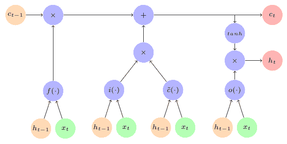

# LSTM 网络

当 RNN 在很长的数据序列上进行训练时，梯度往往变得非常大或非常小，它们会消失到几乎为零。 **长短期记忆**（ **LSTM** ）网络通过添加用于控制对过去信息的访问的门，来解决消失/爆炸梯度问题。 LSTM 概念最初由 Hochreiter 和 Schmidhuber 在 1997 年引入。

阅读以下关于LSTM的研究论文，以获得有关LSTM起源的更多信息：

```
S. Hochreiter and J. Schmidhuber, Long Short-Term Memory, Neural Comput., vol. 9, no. 8, pp. 1735–1780, 1997. http://www.bioinf.jku.at/publications/older/2604.pdf
```

在 RNN 中，使用重复使用的学习函数`φ`的单个神经网络层，而在 LSTM 中，使用由四个主要函数组成的重复模块。构建 LSTM 网络的模块称为**单元**。 LSTM 单元通过选择性地学习或擦除信息，有助于在长序列通过时更有效地训练模型。组成单元的功能也称为门，因为它们充当传入和传出单元的信息的网守。

LSTM 模型有两种内存：

*   用 _**h**_（隐藏状态）表示的工作记忆
*   用 _**c**_（单元状态）表示的长期记忆。

单元状态或长期记忆仅在两个线性相互作用下从一个单元流向另一个单元。 LSTM 将信息添加到长期记忆中，或通过门从长期记忆中删除信息。

下图描绘了 LSTM 单元：

The LSTM Cell

通过 LSTM 单元中的门的内部流动如下：

1.  **遗忘门（或记忆门）`f()`**：`h[t-1]`和`x[t]`按照以下等式作为输入流向`f()`门：

    
    
    遗忘门的功能是决定忘记哪些信息以及要记住哪些信息。这里使用`sigmoid`激活函数，因此输出 1 表示信息被转移到单元内的下一步骤，输出 0 表示信息被选择性地丢弃。

2.  **输入门（或保存门）`i()`**：`h[t-1]`和`x[t]`按照以下等式作为输入流向`i()`门：
    
    
    
    输入门的功能是决定是保存还是丢弃输入。输入功能还允许单元了解要保留或丢弃的候选存储器的哪个部分。

3.  **候选长期记忆**：候选长期记忆由`h[t-1]`和`x[t]`使用激活函数计算，主要是`tanh`，按照下式：
    
    

4.  接下来，组合前面的三个计算以得到更新长期记忆，由`c[t]`表示，如下式所示：
    
    

5.  **输出门（或聚焦/关注门）`o()`**：`h[t-1]`和`x[t]`按照以下等式作为输入流向`o()`门：
    
    
    
    输出门的功能是决定多少信息可用于更新工作内存。

6.  接下来，工作记忆`h[t]`从长期记忆`c[t]`和焦点/注意力向量更新，如下式所示：
    
    
    
    其中`φ(·)`是激活函数，通常是`tanh`。