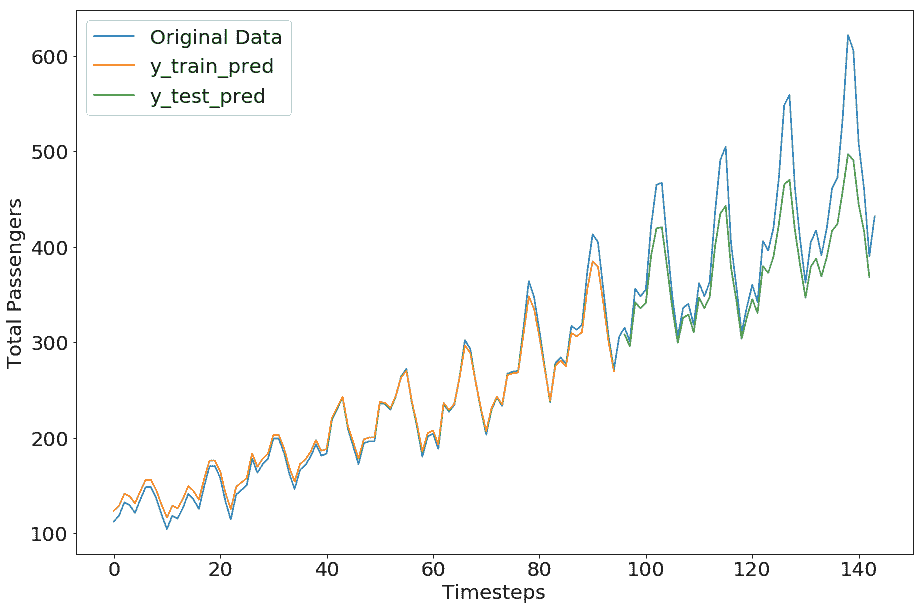

# TensorFlow 中的 LSTM

由于爆炸和消失梯度的问题，简单的 RNN 架构并不总是有效，因此使用了改进的 RNN 架构，例如 LSTM 网络。 TensorFlow 提供 API 来创建 LSTM RNN 架构。

在上一节中展示的示例中，要将 Simple RNN 更改为 LSTM 网络，我们所要做的就是更改单元类型，如下所示：

```py
cell = tf.nn.rnn_cell.LSTMCell(state_size)
```

其余代码保持不变，因为 TensorFlow 会为您在 LSTM 单元内创建门。

笔记本 `ch-07a_RNN_TimeSeries_TensorFlow` 中提供了 LSTM 模型的完整代码。

然而，对于 LSTM，我们必须运行 600 个周期的代码才能使结果更接近基本 RNN。原因是 LSTM 需要学习更多参数，因此需要更多的训练迭代。对于我们的简单示例，它似乎有点过分，但对于较大的数据集，与简单的 RNN 相比，LSTM 显示出更好的结果。

具有 LSTM 架构的模型的输出如下：

```py
train mse = 0.0020806745160371065
test mse = 0.01499235536903143
test rmse = 0.12244327408653947
```

