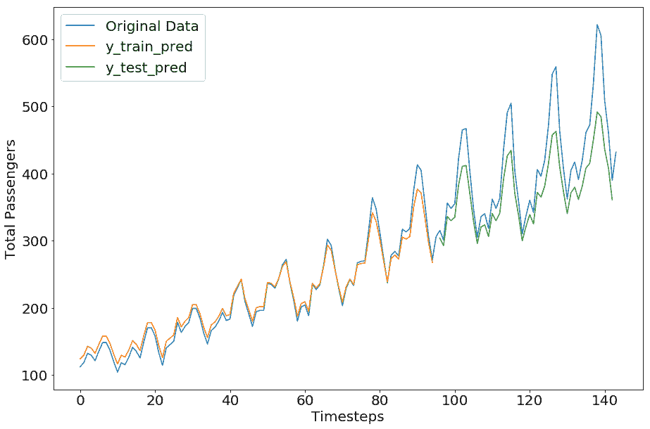

# TensorFlow 中的 GRU

要将最后一节中的 LSTM 示例更改为 GRU 网络， 按如下方式更改单元类型，TensorFlow 将为您处理其余部分：

```py
cell = tf.nn.rnn_cell.GRUCell(state_size)
```

笔记本 `ch-07a_RNN_TimeSeries_TensorFlow`中提供了 GRU 模型的完整代码。

对于小`airpass`数据集，GRU 在相同数量的周期中表现出更好的表现。在实践中，GRU 和 LSTM 表现出相当的表现。就执行速度而言，与 LSTM 相比，GRU 模型训练和预测更快。

GRU 模型的完整代码在 Jupyter 笔记本中提供。GRU 模型的结果如下：

```py
train mse = 0.0019633215852081776
test mse = 0.014307591132819653
test rmse = 0.11961434334066987
```



我们鼓励您探索 TensorFlow 中可用的其他选项来创建循环神经网络。现在让我们在 TensorFlow 的一个高级库中尝试相同的示例。

对于下一节，您可以按照 Jupyter 笔记本中的代码`ch-07b_RNN_TimeSeries_Keras`。