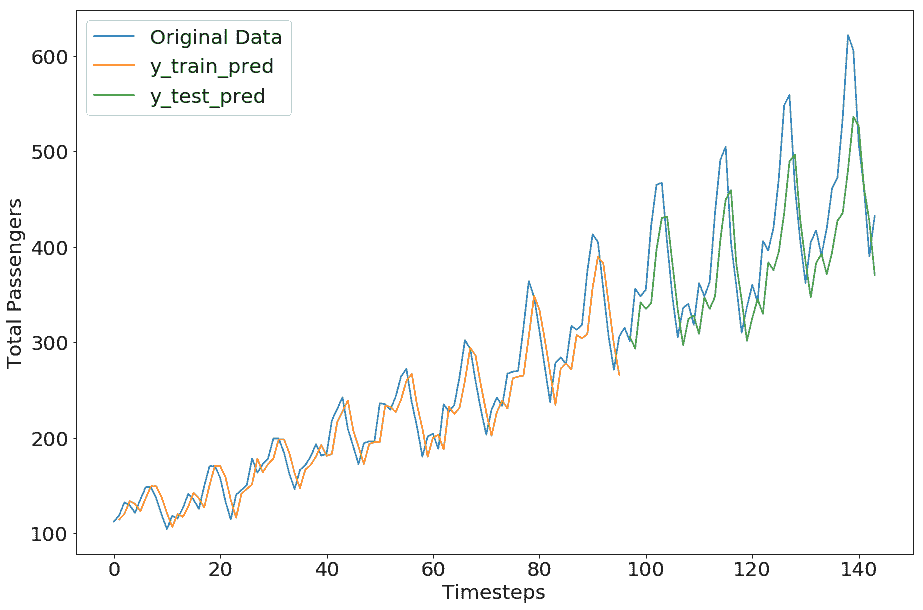

# 使用 Keras 的简单 RNN

通过添加具有内部神经元数量和输入张量形状的 SimpleRNN 层，可以在 Keras 中轻松构建 RNN 模型，不包括样本维数。以下代码创建，编译和拟合 SimpleRNN：

```py
# create and fit the SimpleRNN model
model = Sequential()
model.add(SimpleRNN(units=4, input_shape=(X_train.shape[1], 
    X_train.shape[2])))
model.add(Dense(1))
model.compile(loss='mean_squared_error', optimizer='adam')
model.fit(X_train, Y_train, epochs=20, batch_size=1)
```

由于我们的数据集很小，我们使用`batch_size`为 1 并训练 20 次迭代，但对于较大的数据集，您需要调整这些和其他超参数的值。

该模型的结构如下：

```py
_________________________________________________________________
Layer (type)                 Output Shape              Param #   
=================================================================
simple_rnn_1 (SimpleRNN)     (None, 4)                 24        
_________________________________________________________________
dense_1 (Dense)              (None, 1)                 5         
=================================================================
Total params: 29
Trainable params: 29
Non-trainable params: 0
```

训练的结果如下：

```py
Epoch 1/20
95/95 [==============================] - 0s - loss: 0.0161     
Epoch 2/20
95/95 [==============================] - 0s - loss: 0.0074     
Epoch 3/20
95/95 [==============================] - 0s - loss: 0.0063     
Epoch 4/20
95/95 [==============================] - 0s - loss: 0.0051     

-- epoch 5 to 14 removed for the sake of brevity --

Epoch 14/20
95/95 [==============================] - 0s - loss: 0.0021     
Epoch 15/20
95/95 [==============================] - 0s - loss: 0.0020     
Epoch 16/20
95/95 [==============================] - 0s - loss: 0.0020     
Epoch 17/20
95/95 [==============================] - 0s - loss: 0.0020     
Epoch 18/20
95/95 [==============================] - 0s - loss: 0.0020         
Epoch 19/20
95/95 [==============================] - 0s - loss: 0.0020     
Epoch 20/20
95/95 [==============================] - 0s - loss: 0.0020     
```

损失从 0.0161 开始，平稳在 0.0020。让我们做出预测并重新调整预测和原件。我们使用 Keras 提供的函数来计算均方根误差：

```py
from keras.losses import mean_squared_error as k_mse
from keras.backend import sqrt as k_sqrt
import keras.backend as K

# make predictions
y_train_pred = model.predict(X_train)
y_test_pred = model.predict(X_test)

# invert predictions
y_train_pred = scaler.inverse_transform(y_train_pred)
y_test_pred = scaler.inverse_transform(y_test_pred)

#invert originals
y_train_orig = scaler.inverse_transform(Y_train)
y_test_orig = scaler.inverse_transform(Y_test)

# calculate root mean squared error
trainScore = k_sqrt(k_mse(y_train_orig[:,0],
                          y_train_pred[:,0])
                   ).eval(session=K.get_session())
print('Train Score: {0:.2f} RMSE'.format(trainScore))

testScore = k_sqrt(k_mse(y_test_orig[:,0],
                         y_test_pred[:,0])
                  ).eval(session=K.get_session())
print('Test Score: {0:.2f} RMSE'.format(testScore))
```

我们得到以下结果：

```py
Train Score: 23.27 RMSE
Test Score: 54.13 RMSE
```



我们可以看到，这不像我们在 TensorFlow 部分得到的那样完美;但是，这种差异是因为超参数值。我们留给您尝试不同的超参数值来调整此 Keras 模型以获得更好的结果。