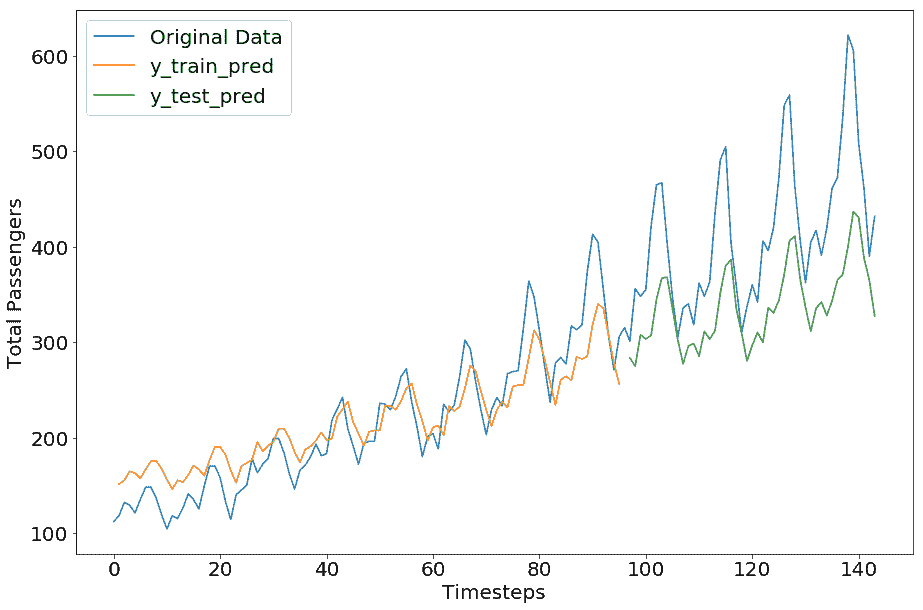

# 使用 Keras 的 GRU

使用 TensorFlow 和 Keras 的一个优点是它们可以轻松创建模型。与 LSTM 一样，创建 GRU 模型只需添加 GRU 层而不是 LSTM 或 SimpleRNN 层，如下所示：

```py
model.add(GRU(units=4, input_shape=(X_train.shape[1], X_train.shape[2])))
```

模型结构如下：

```py
Layer (type)                 Output Shape              Param #   
=================================================================
gru_1 (GRU)                  (None, 4)                 72        
_________________________________________________________________
dense_1 (Dense)              (None, 1)                 5         
=================================================================
Total params: 77
Trainable params: 77
Non-trainable params: 0
```

笔记本 `ch-07b_RNN_TimeSeries_Keras`中提供了 GRU 模型的完整代码。

正如预期的那样，GRU 模型显示出与 LSTM 几乎相同的表现，我们让您尝试使用不同的超参数值来优化此模型：

```py
Train Score: 31.49 RMSE
Test Score: 92.75 RMSE
```

