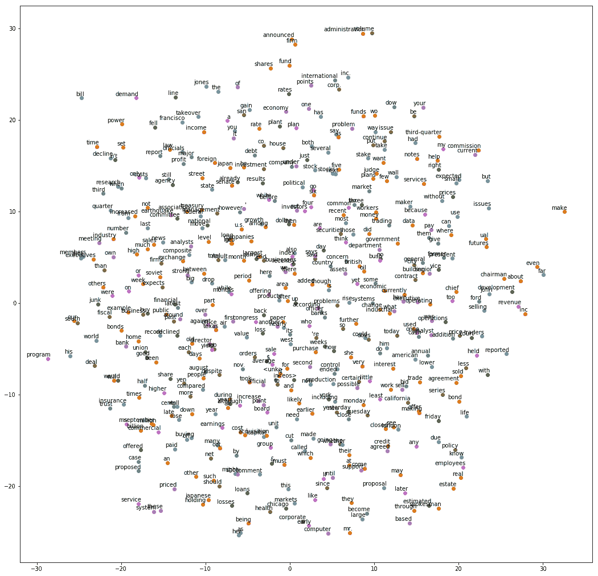

# 使用 t-SNE 可视化单词嵌入

让我们可视化我们在上一节中生成的单词嵌入。 t-SNE 是在二维空间中显示高维数据的最流行的方法。我们将使用 scikit-learn 库中的方法，并重用 TensorFlow 文档中给出的代码，来绘制我们刚学过的词嵌入的图形。

[TensorFlow 文档中的原始代码可从此链接获得](https://github.com/tensorflow/tensorflow/blob/r1.3/tensorflow/examples/tutorials/word2vec/word2vec_basic.py)。

以下是我们如何实现该程序：

1.  创建`tsne`模型：

```py
tsne = TSNE(perplexity=30, n_components=2,
            init='pca', n_iter=5000, method='exact')
```

1.  将要显示的嵌入数限制为 500，否则，图形变得非常难以理解：

```py
n_embeddings = 500
```

1.  通过调用`tsne`模型上的`fit_transform()`方法并将`final_embeddings`的第一个`n_embeddings`作为输入来创建低维表示。

```py
low_dim_embeddings = tsne.fit_transform(
    final_embeddings[:n_embeddings, :])
```

1.  找到我们为图表选择的单词向量的文本表示：

```py
labels = [ptb.id2word[i] for i in range(n_embeddings)]
```

1.  最后，绘制嵌入图：

```py
plot_with_labels(low_dim_embeddings, labels)
```

我们得到以下绘图：

t-SNE visualization of embeddings for PTB data set

同样，从 text8 模型中，我们得到以下图：

t-SNE visualization of embeddings for text8 data set