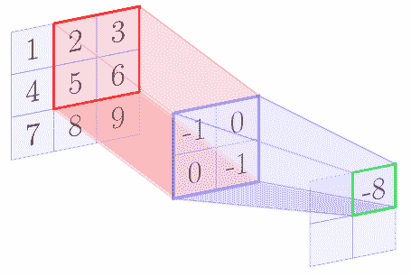

# 理解卷积

**卷积**是 CNN 架构背后的核心概念。简单来说，卷积是一种数学运算，它结合了两个来源的信息来产生一组新的信息。具体来说，它将一个称为内核的特殊矩阵应用于输入张量，以产生一组称为特征图的矩阵。可以使用任何流行的算法将内核应用于输入张量。

生成卷积矩阵的最常用算法如下：

```py
N_STRIDES = [1,1]
1\. Overlap the kernel with the top-left cells of the image matrix.
2\. Repeat while the kernel overlaps the image matrix:
    2.1 c_col = 0
    2.2 Repeat while the kernel overlaps the image matrix:
        2.1.1 set c_row = 0        2.1.2 convolved_scalar = scalar_prod(kernel, overlapped cells)
        2.1.3 convolved_matrix(c_row,c_col) = convolved_scalar
        2.1.4 Slide the kernel down by N_STRIDES[0] rows.
        2.1.5 c_row = c_row  + 1
    2.3 Slide the kernel to (topmost row, N_STRIDES[1] columns right)
    2.4 c_col = c_col + 1
```

例如，我们假设核矩阵是 2 x 2 矩阵，输入图像是 3 x 3 矩阵。下图逐步显示了上述算法：

| | |
| --- | --- |
|  |  |
|  |  |

在 con 卷积操作结束时，我们得到以下特征图：

| | |
| --- | --- |
| -6 | -8 |
| -12 | -14 |

在上面的示例中，与卷积的原始输入相比，生成的特征映射的大小更小。通常，特征图的大小减小（内核大小-1）。因此，特征图的大小为：


**三维张量**

对于具有额外深度尺寸的三维张量，您可以将前面的算法视为应用于深度维度中的每个层。将卷积应用于 3D 张量的输出也是 2D 张量，因为卷积运算添加了三个通道。

**大步**

数组 N_STRIDES 中的 **步长** 是您想要将内核滑过的行或列的数字。在我们的例子中，我们使用了 1 的步幅。如果我们使用更多的步幅，那么特征图的大小将根据以下等式进一步减小：


**填充**

如果我们不希望减小特征映射的大小，那么我们可以在输入的所有边上使用填充，使得特征的大小增加填充大小的两倍。使用填充，可以按如下方式计算特征图的大小：


TensorFlow 允许两种填充：SAME 或 VALID。 SAME 填充意味着添加填充，使输出特征图与输入特征具有相同的大小。 VALID 填充意味着没有填充。

应用前面提到的卷积算法的结果是特征图，是原始张量的滤波版本。例如，特征图可能只有从原始图像中过滤出的轮廓。因此，内核也称为过滤器。对于每个内核，您将获得单独的 2D 特征图。

根据您希望网络学习的特征，您必须应用适当的过滤器来强调所需的特征。 但是，使用 CNN，模型可以自动了解哪些内核在卷积层中最有效。

**TensorFlow** 中的卷积运算

TensorFlow 提供实现卷积算法的卷积层。例如，具有以下签名的`tf.nn.conv2d()`操作：

```py
tf.nn.conv2d(
  input,
  filter,
  strides,
  padding,
  use_cudnn_on_gpu=None,
  data_format=None,
  name=None
)
```

`input`和`filter`表示形状`[batch_size, input_height, input_width, input_depth]`的数据张量和形状`[filter_height, filter_width, input_depth, output_depth]`的核张量。内核张量中的  `output_depth`表示应该应用于输入的内核数量。 `strides`张量表示每个维度中要滑动的单元数。如上所述，`padding`是有效的或相同的。

[您可以在此链接中找到有关TensorFlow中可用卷积操作的更多信息](https://www.tensorflow.org/api_guides/python/nn#Convolution)

[您可以在此链接中找到有关 Keras 中可用卷积层的更多信息](https://keras.io/layers/convolutional/)

此链接提供了卷积的详细数学解释：

<http://colah.github.io/posts/2014-07-Understanding-Convolutions/>

<http://ufldl.stanford.edu/tutorial/supervised/FeatureExtractionUsingConvolution/>

<http://colah.github.io/posts/2014-07-Understanding-Convolutions/>

卷积层或操作将输入值或神经元连接到下一个隐藏层神经元。每个隐藏层神经元连接到与内核中元素数量相同数量的输入神经元。所以在前面的例子中，内核有 4 个元素，因此隐藏层神经元连接到输入层的 4 个神经元（3×3 个神经元中）。在我们的例子中，输入层的 4 个神经元的这个区域被称为 CNN 理论中的**感受域**。

卷积层具有每个内核的单独权重和偏差参数。权重参数的数量等于内核中元素的数量，并且只有一个偏差参数。内核的所有连接共享相同的权重和偏差参数。因此在我们的例子中，将有 4 个权重参数和 1 个偏差参数，但如果我们在卷积层中使用 5 个内核，则总共将有 5 x 4 个权重参数和 5 个 1 个偏差参数，一组（4）每个特征图的权重，1 个偏差）参数。