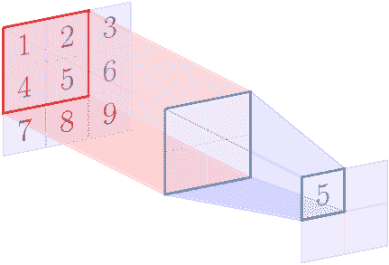

# 了解池化

通常，在卷积操作中，应用几个不同的内核，这导致生成若干特征映射。因此，卷积运算导致生成大尺寸数据集。

例如，将形状为 3 x 3 x 1 的内核应用于具有 28 x 28 x 1 像素形状的图像的 MNIST 数据集，可生成形状为 26 x 26 x 1 的特征映射。如果我们在 a 中应用 32 个这样的滤波器卷积层，则输出的形状为 32 x 26 x 26 x 1，即形状为 26 x 26 x 1 的 32 个特征图。

与形状为 28 x 28 x 1 的原始数据集相比，这是一个庞大的数据集。因此，为了简化下一层的学习，我们应用池化的概念。

**合并**是指计算卷积特征空间区域的聚合统计量。两个最受欢迎的汇总统计数据是最大值和平均值。应用 max-pooling 的输出是所选区域的最大值，而应用平均池的输出是区域中数字的平均值。

例如，假设特征图的形状为 3 x 3，形状的池区域为 2 x 2.以下图像显示了使用[1,1]的步幅应用的最大池操作：

| | |
| --- | --- |
|  |  |
|  |  |

在最大池操作结束时，我们得到以下矩阵：

| | |
| --- | --- |
| 5 | 6 |
| 8 | 9 |

通常，池化操作应用非重叠区域，因此步幅张量和区域张量被设置为相同的值。

例如，TensorFlow 具有以下签名的`max_pooling`操作：

```py
max_pool(
  value,
  ksize,
  strides,
  padding,
  data_format='NHWC',
  name=None
)
```

`value` 表示形状 `[batch_size, input_height, input_width, input_depth]` 的输入张量。对矩形形状区域`ksize`执行合并操作。这些区域被形状`strides` 抵消。

[您可以在此链接中找到有关 TensorFlow 中可用的池化操作的更多信息](https://www.tensorflow.org/api_guides/python/nn#Pooling)

[有关 Keras 中可用池化的更多信息，请访问此链接](https://keras.io/layers/pooling/)

[此链接提供了池化的详细数学说明](http://ufldl.stanford.edu/tutorial/supervised/Pooling/)