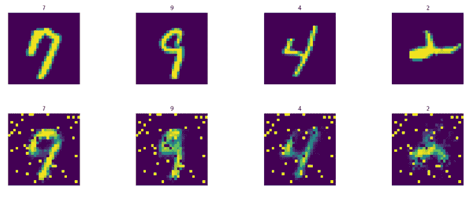
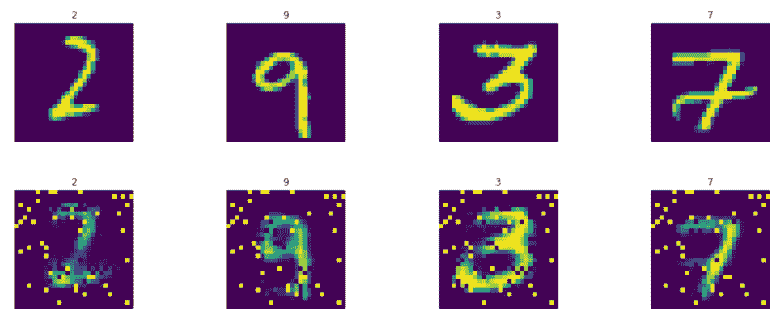

# TensorFlow 中的栈式自编码器

在 TensorFlow 中构建栈式自编码器模型的步骤如下：

1.  首先，定义超参数如下：

```py
learning_rate = 0.001
n_epochs = 20
batch_size = 100
n_batches = int(mnist.train.num_examples/batch_size)
```

1.  定义输入（即特征）和输出（即目标）的数量。输出数量与输入数量相同：

```py
# number of pixels in the MNIST image as number of inputs
n_inputs = 784
n_outputs = n_inputs
```

1.  定义输入和输出图像的占位符：

```py
x = tf.placeholder(dtype=tf.float32, name="x", shape=[None, n_inputs])
y = tf.placeholder(dtype=tf.float32, name="y", shape=[None, n_outputs])
```

1.  添加编码器和解码器层的神经元数量为`[512,256,256,512]`：

```py
# number of hidden layers
n_layers = 2
# neurons in each hidden layer
n_neurons = [512,256]
# add number of decoder layers:
n_neurons.extend(list(reversed(n_neurons)))
n_layers = n_layers * 2
```

1.  定义`w`和`b`参数：

```py
w=[]
b=[]

for i in range(n_layers):
    w.append(tf.Variable(tf.random_normal([n_inputs \
                  if i==0 else n_neurons[i-1],n_neurons[i]]),
                         name="w_{0:04d}".format(i) 
                        )
            ) 
    b.append(tf.Variable(tf.zeros([n_neurons[i]]),
                         name="b_{0:04d}".format(i) 
                        )
            ) 
w.append(tf.Variable(tf.random_normal([n_neurons[n_layers-1] \
                    if n_layers > 0 else n_inputs,n_outputs]),
                     name="w_out"
                    )
        )
b.append(tf.Variable(tf.zeros([n_outputs]),name="b_out"))
```

1.  构建网络并为每个层使用 sigmoid 激活函数：

```py
# x is input layer
layer = x
# add hidden layers
for i in range(n_layers):
layer = tf.nn.sigmoid(tf.matmul(layer, w[i]) + b[i])
# add output layer
layer = tf.nn.sigmoid(tf.matmul(layer, w[n_layers]) + b[n_layers]) 
model = layer
```

1.  使用`mean_squared_error`定义`loss`函数，使用`AdamOptimizer`定义`optimizer`函数：

```py
mse = tf.losses.mean_squared_error
loss = mse(predictions=model, labels=y)
optimizer = tf.train.AdamOptimizer(learning_rate=learning_rate)
optimizer = optimizer.minimize(loss)
```

1.  训练模型并预测`train`和`test`集的图像：

```py
with tf.Session() as tfs:
    tf.global_variables_initializer().run()
    for epoch in range(n_epochs):
        epoch_loss = 0.0
        for batch in range(n_batches):
            X_batch, _ = mnist.train.next_batch(batch_size)
            feed_dict={x: X_batch,y: X_batch}
            _,batch_loss = tfs.run([optimizer,loss], feed_dict)
            epoch_loss += batch_loss 
        if (epoch%10==9) or (epoch==0):
            average_loss = epoch_loss / n_batches
            print('epoch: {0:04d} loss = {1:0.6f}'
                  .format(epoch,average_loss))
    # predict images using trained autoencoder model 
    Y_train_pred = tfs.run(model, feed_dict={x: train_images})
    Y_test_pred = tfs.run(model, feed_dict={x: test_images})
```

1.  我们看到以下输出，因为损失在 20 个周期后显着减少：

```py
epoch: 0000   loss = 0.156696
epoch: 0009   loss = 0.091367
epoch: 0019   loss = 0.078550
```

1.  现在模型已经过训练，让我们显示训练模型中的预测图像。我们写了一个辅助函数`display_images`来帮助我们显示图像：

```py
import random

# Function to display the images and labels
# images should be in NHW or NHWC format
def display_images(images, labels, count=0, one_hot=False):
    # if number of images to display is not provided, then display all the images
    if (count==0):
        count = images.shape[0]

    idx_list = random.sample(range(len(labels)),count)
    for i in range(count):
        plt.subplot(4, 4, i+1)
        plt.title(labels[i])
        plt.imshow(images[i])
        plt.axis('off')
    plt.tight_layout()
    plt.show()
```

使用此函数，我们首先显示训练集中的四个图像和自编码器预测的图像。

第一行表示实际图像，第二行表示生成的图像：



生成的图像有一点点噪音，可以通过更多训练和超参数调整来消除。现在预测训练集图像并不神奇，因为我们在这些图像上训练了自编码器，因此它知道它们。让我们看一下预测测试集图像的结果。 第一行表示实际图像，第二行表示生成的图像：



哇！经过训练的自编码器能够生成相同的数字，只有从 768 中学到的 256 个特征。生成的图像中的噪声可以通过超参数调整和更多训练来改善。