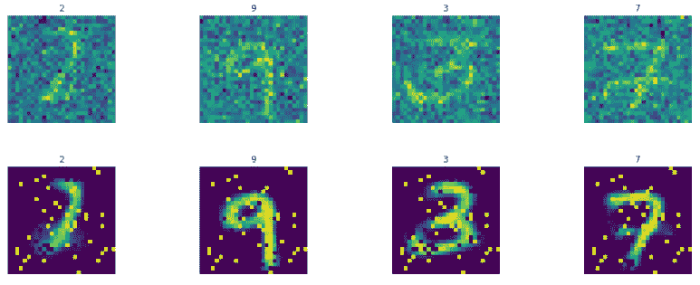

# TensorFlow 中的去噪自编码器

正如您在本章的第一部分中所了解的那样，可以使用去噪自编码器来训练模型，以便它们能够从输入到训练模型的图像中去除噪声：

1.  出于本示例的目的，我们编写以下辅助函数来帮助我们为图像添加噪声：

```py
def add_noise(X):
    return X + 0.5 * np.random.randn(X.shape[0],X.shape[1])
```

1.  然后我们为测试图像添加噪声并将其存储在单独的列表中：

```py
test_images_noisy = add_noise(test_images)
```

我们将使用这些测试图像来测试我们的去噪模型示例的输出。

1.  我们按照前面的例子构建和训练去噪自编码器，但有一点不同：在训练时，我们将噪声图像输入到输入层，我们用非噪声图像检查重建和去噪误差，如下面的代码所示：

```py
X_batch, _ = mnist.train.next_batch(batch_size)
X_batch_noisy = add_noise(X_batch)
feed_dict={x: X_batch_noisy, y: X_batch}
_,batch_loss = tfs.run([optimizer,loss], feed_dict=feed_dict)
```

笔记本 `ch-10_AutoEncoders_TF_and_Keras`中提供了去噪自编码器的完整代码。

现在让我们首先显示从 DAE 模型生成的测试图像;第一行表示原始的非噪声测试图像，第二行表示生成的测试图像：

```py
display_images(test_images.reshape(-1,pixel_size,pixel_size),test_labels)
display_images(Y_test_pred1.reshape(-1,pixel_size,pixel_size),test_labels)
```

上述代码的结果如下：


接下来，当我们输入噪声测试图像时，我们显示生成的图像：

```py
display_images(test_images_noisy.reshape(-1,pixel_size,pixel_size),
    test_labels)
display_images(Y_test_pred2.reshape(-1,pixel_size,pixel_size),test_labels)
```

上述代码的结果如下：



那太酷了!!该模型学习了图像并生成了几乎正确的图像，即使是非常嘈杂的图像。通过适当的超参数调整可以进一步提高再生质量。