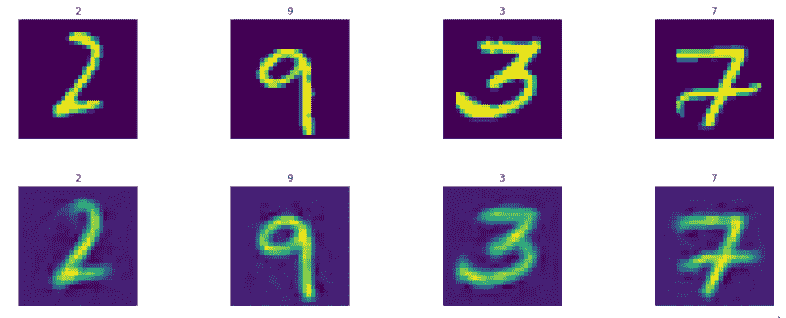
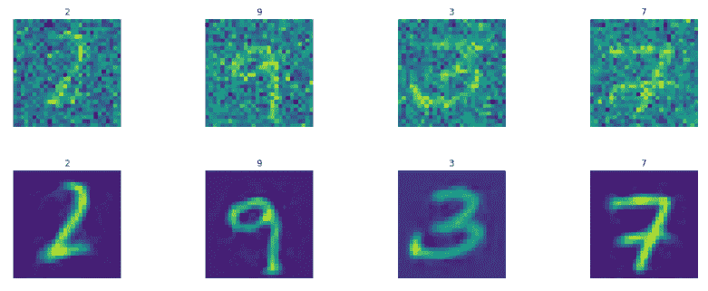

# Keras 中的去噪自编码器

现在让我们在 Keras 中构建相同的去噪自编码器。

由于 Keras 负责按批量大小喂养训练集，我们创建了一个嘈杂的训练集作为我们模型的输入：

```py
X_train_noisy = add_noise(X_train)
```

Keras 中 DAE 的完整代码在笔记本 `ch-10_AutoEncoders_TF_and_Keras` 中提供。

DAE Keras 模型如下所示：

```py
Layer (type)                 Output Shape              Param #   
=================================================================
dense_1 (Dense)              (None, 512)               401920    
_________________________________________________________________
dense_2 (Dense)              (None, 256)               131328    
_________________________________________________________________
dense_3 (Dense)              (None, 256)               65792     
_________________________________________________________________
dense_4 (Dense)              (None, 512)               131584    
_________________________________________________________________
dense_5 (Dense)              (None, 784)               402192    
=================================================================
Total params: 1,132,816
Trainable params: 1,132,816
Non-trainable params: 0
```

由于 DAE 模型很复杂，为了演示，我们不得不将周期数增加到 100 来训练模型：

```py
n_epochs=100

model.fit(x=X_train_noisy, y=X_train,
     batch_size=batch_size,
     epochs=n_epochs,
     verbose=0)

Y_test_pred1 = model.predict(test_images)
Y_test_pred2 = model.predict(test_images_noisy)
```

打印生成的图像：

```py
display_images(test_images.reshape(-1,pixel_size,pixel_size),test_labels)
display_images(Y_test_pred1.reshape(-1,pixel_size,pixel_size),test_labels)
```

第一行是原始测试图像，第二行是生成的测试图像：



```py
display_images(test_images_noisy.reshape(-1,pixel_size,pixel_size),
    test_labels)
display_images(Y_test_pred2.reshape(-1,pixel_size,pixel_size),test_labels)
```

第一行是噪声测试图像，第二行是生成的测试图像：



正如我们所看到的，去噪自编码器可以很好地从噪声版本的图像中生成图像。